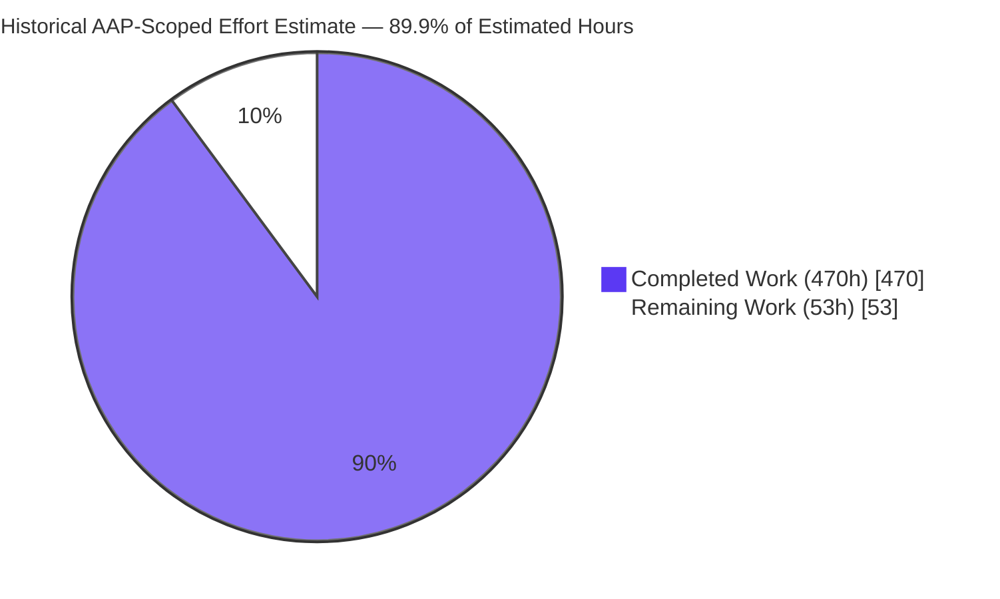
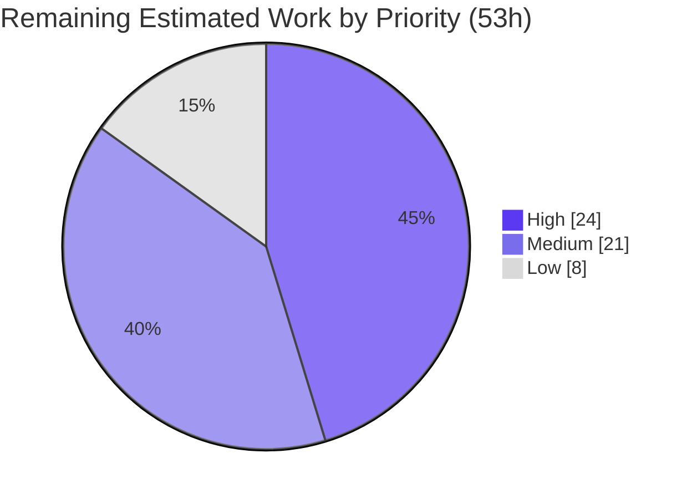

# Blitzy Project Guide — `zlib-rs`

> **Project:** Tech-stack migration of zlib `1.3.2.1-motley` from ANSI C to a memory-safe Rust crate
> **Toolchain measured for this snapshot:** rustc/cargo `1.97.1` (`8bab26f4f`, released 14 July 2026, LLVM 22.1.6) · Clippy `0.1.97` · rustfmt `1.9.0-stable` · MSRV `1.85.0` · edition `2024`
> **Branch and commit:** deliberately not quoted here — a branch name and a HEAD hash go stale the moment the next commit lands. Verify the working tree yourself with `git rev-parse --abbrev-ref HEAD` and `git rev-parse --short HEAD`.
> **Brand legend:** ■ Completed / AI Work = Dark Blue `#5B39F3` · □ Remaining = White `#FFFFFF`
>
> **How to read the numbers in this guide.** Every figure is labelled as one of two kinds, and the two are never blended. *Measured this session* means a command was run in this working tree and its output observed. *AAP baseline* means the figure was recorded by the Agent Action Plan's own measurement pass and is reproduced here with attribution; those figures are dated observations, not budgets, and they drift as the tree grows. Where a fresh run disagreed with an AAP baseline, the fresh observation is the one reported.

---

## 1. Executive Summary

### 1.1 Project Overview

This project migrates the zlib compression library (`1.3.2.1-motley`, `ZLIB_VERNUM 0x1321`) from 23,107 lines of ANSI C — 26 translation units and headers exposing 119 `ZEXTERN` public entry points — into `zlib-rs`, an idiomatic, memory-safe Rust crate (Rust edition 2024, MSRV 1.85.0). It targets systems developers and any downstream C consumer of zlib.

The crate preserves byte-identical DEFLATE (RFC 1951), zlib (RFC 1950), and gzip (RFC 1952) wire formats and re-exposes the exact zlib C ABI through an `#[unsafe(no_mangle)] extern "C"` boundary — the edition-2024 spelling of the attribute — emitting `cdylib` and `staticlib` artifacts alongside the Rust `lib`. That enables drop-in substitution without recompiling consumers, while replacing all manual memory management with Rust ownership and borrowing.

**Two version numbers, deliberately.** The Cargo package version is `1.3.2` because SemVer admits only three numeric components; the C API continues to report the full upstream identity `1.3.2.1-motley` from `zlibVersion()`, because a C consumer comparing version strings must see exactly what reference zlib would emit. The split is intentional and neither number may be "harmonised" into the other.

**Architecture.** Fifteen flat C translation units became a seven-layer, forty-module Rust tree with a strictly acyclic dependency ordering that mirrors the C `#include` layering:

`error` / `constants` → `util` → `checksum` → `stream` / `gz_header` → `{deflate, inflate}` → `gz` → `ffi`

`ffi` is the only layer permitted to contain `unsafe`, and nothing below it may require `unsafe` to function. The decompressor's `switch`-with-fall-through mode field became `InflateMode`, an enum of exactly **32 variants** beginning at the C sentinel `Head = 16180`, so every state discriminant observable through the ABI is preserved value-for-value.

Business impact: eliminates a class of memory-safety defects in a ubiquitous dependency without sacrificing wire-format compatibility or API/ABI equivalence.

### 1.2 Completion Status

The chart and table below are a **historical, AAP-scoped effort-estimate snapshot**. They record how the planned engineering effort was apportioned when the plan was written. They are *not* a live measurement of production readiness, and the percentage must not be read as one — current status is reported separately, from observed gates, in §3 through §6.



*Legend: ■ Completed = `#5B39F3` (dark blue) · □ Remaining = `#FFFFFF` (white).*

| Metric (historical effort estimate) | Hours |
|---|---:|
| **Total Estimated Hours** | **523** |
| Estimated Hours Completed | 470 |
| Estimated Hours Remaining | 53 |
| **Percent of Estimated Effort** | **89.9%** |

> Arithmetic: `470 / (470 + 53) × 100 = 89.9%`, computed on AAP-scoped work only. This is an **effort-estimate** ratio. It does not measure test coverage, code quality, or release readiness, and it is not a production-readiness score. The remaining 53h is path-to-production hardening that requires human judgement.
>
> This 470 / 53 / 523 snapshot is **this document's own** effort baseline. `doc/project-guide.md` carries a *separate* historical snapshot on a different scope basis; the two are independent records and must never be averaged, blended, or substituted for one another.

### 1.3 Key Accomplishments

- [x] **Full C→Rust source rewrite** — 40 modules under `src/` (AAP baseline: 32,354 LOC) covering deflate, inflate, checksum, gz file I/O, one-call wrappers, the public API surface, and the FFI boundary, plus 7 integration suites (six default, plus the opt-in C-oracle harness), 3 Criterion benches, and 5 fuzz targets. No `todo!()`, `unimplemented!()`, `TODO`, `FIXME`, or `XXX` anywhere in `src/`.
- [x] **C-ABI drop-in verified by linking and running** — `#[repr(C)]` `z_stream` (14 fields) and `gz_header` (13 fields) mirrors plus `extern "C"` shims. A C program compiled against the retained `zlib.h` and linked **statically** against `libzlib_rs.a` prints `ver=1.3.2.1-motley crc=cbf43926 adler=091e01de compress=0 uncompress=0 bound=22`; the same program linked **dynamically** against `libzlib_rs.so` prints the same line and additionally round-trips 50,000 bytes byte-exactly with correct `1f 8b` gzip framing at `windowBits=31`.
- [x] **Verified numeric values (AAP §0.6.6)** — `crc32("123456789") = 0xcbf43926`, `adler32("123456789") = 0x091e01de`, the exact `compressBound` term-for-term formula with `compressBound(9) = 22`, and `ENOUGH = 1444` (`ENOUGH_LENS 852` + `ENOUGH_DISTS 592`).
- [x] **Full feature parity** — 10 compression levels, 5 strategies, 7 flush modes, preset dictionaries, `inflateBack`, and the overloaded `windowBits` contract (raw `-8..-15`, zlib `8..15`, gzip `+16`, auto-detect `+32`) resolved in a single `constants::parse_window_bits`.
- [x] **Test suite green with nothing ignored** — measured this session: **860 tests pass** by default (705 unit + 128 integration + 27 doctests), **634** under `--no-default-features`, **873** under `--all-features`; **0 failed and 0 ignored in every configuration**. The suites are ports of the official C drivers.
- [x] **Core-compression safety constraint honoured** — `src/deflate/**`, `src/inflate/**`, `src/checksum/**`, `src/gz/**`, `src/util/**`, `src/error.rs`, `src/constants.rs`, and `src/gz_header.rs` each contain **zero** `unsafe`, verified by a comment-excluded token scan. `src/lib.rs` carries a crate-wide `#![deny(unsafe_code)]` with exactly **two** narrowly scoped `#[allow(unsafe_code)]` carve-outs — `pub mod ffi` and the private no-`std` runtime block — so a stray `unsafe` in a core module is a compile error, not a review finding.
- [x] **Exported symbol surface reconciles exactly** — 96 declared public FFI functions, 95 `T` symbols emitted on Linux, delta of exactly one: the `#[cfg(windows)]`-gated `gzopen_w`, correctly absent on Linux. All 54 `zlib.map` `global:` names are present, none of the 10 `local:` names leaked, and nothing is emitted that was not declared.
- [x] **Byte-identity proven against a live C oracle** — the in-repository harness built reference C zlib from the retained in-tree sources and reported **50/50** on the smoke sweep and **3,750/3,750** byte-identical on the full grid, observed passing this session.
- [x] **Quality gates clean** — all nine gates enumerated in §9.4 exited 0: `cargo fmt --all -- --check`, `cargo clippy --locked --all-targets --all-features -- -D warnings`, `cargo build`, `cargo test`, `cargo test --no-default-features`, `cargo test --all-features`, `cargo doc --no-deps`, `cargo build --release`, and the MSRV pair (`+1.85.0 build` plus `+1.85.0 check --all-targets`). Benchmark compilation (`cargo bench --no-run`) also exited 0, though it is a build check rather than one of the nine. All three crate types emit.

### 1.4 Critical Unresolved Issues

No defect blocks the build, and no test fails or is ignored. The items below are nonetheless genuinely open, and none of them can be closed by a passing compiler.

| Issue | Impact | Owner | ETA |
|---|---|---|---|
| Formal human code review & sign-off pending | Governance gate before any release. Not a build or functional blocker, and not automatable — the reviewed surface is a safety-critical migration | Rust maintainer / reviewer | ~16h (see §2.2 / task list) |
| No observed security or supply-chain **audit result** | `deny.toml` and the `audit.yml` workflow (`cargo-audit`, `cargo-deny`) have landed, but a landed policy is not an audit finding. No audit outcome is claimed here | Security reviewer | ~8h |
| Cross-platform CI has landed but no run is observed here | Windows, macOS, aarch64, i686, and s390x rows now exist. Big-endian is covered by **type-check only**, never executed, so the big-endian CRC braid path still has no runtime evidence | CI owner | ~6h |
| Real-hardware `no_std` validation outstanding | A bare-metal `thumbv7em-none-eabihf` **compile** row has landed. Compilation is not execution on no-OS hardware | Embedded reviewer | ~5h |
| No release/publish pipeline | `cargo package --list` is now gated against the `exclude` contract, but there is no publish workflow, no token, and no released version | Release owner | ~3h |

### 1.5 Access Issues

| System/Resource | Type of Access | Issue Description | Resolution Status | Owner |
|---|---|---|---|---|
| — | — | No access issues identified. Every build, test, lint, documentation, packaging, C drop-in link/run, and live C-oracle step reported in this guide was reproduced in this working tree from the warmed dependency cache with `--locked`. | N/A | — |

### 1.6 Recommended Next Steps

1. **[High]** Conduct formal human code review & sign-off of the migration (AAP baseline 32,354 LOC), focusing on the `unsafe` FFI boundary and its `// SAFETY:` justifications (~16h). This is the one item that cannot be automated away.
2. **[High]** Obtain an actual security & supply-chain **audit result** over the 102-package governed closure, and reconcile it with the landed `deny.toml` policy and `audit.yml` workflow (~8h).
3. **[Medium]** Observe the expanded CI matrix through real runs, and close the gap that big-endian (`s390x-unknown-linux-gnu`) is currently type-checked rather than executed (~6h).
4. **[Medium]** Validate the `no_std` build on real embedded hardware, not only as a bare-metal compile (~5h).
5. **[Medium]** Establish an actual release/publish pipeline on top of the landed packaging check (~3h).

---

## 2. Project Hours Breakdown

> **Historical effort estimate.** Both tables in this section are the AAP-scoped **effort-estimate** snapshot introduced in §1.2. The hours are planning figures, not timesheet measurements and not a readiness score. They are retained because the arithmetic across §1.2, §2.1, §2.2, and §7 is internally consistent and the cross-references depend on it.

### 2.1 Completed Work Detail

| Component | Hours | Description |
|---|---:|---|
| Cargo manifest + `build.rs` | 16 | `Cargo.toml` (edition 2024, crate-type `lib`/`cdylib`/`staticlib`, feature matrix, `exclude` contract) ← `CMakeLists.txt`; `build.rs` generates the CRC-32 tables at build time ← `crc32.h`, in pure `std` Rust with no build-dependencies |
| CI/CD migration + README + docs | 12 | `ci.yml` + `fuzz.yml`; `README.md`; `docs/index.md` and `mkdocs.yml` authored in the same batch, which is why `docs_dir: doc` and the `docs/` redirect stub are consistent with each other |
| Public API & types layer | 42 | `lib.rs`, `error.rs` (`ZlibError`/`ReturnCode`), `constants.rs` (levels/strategies/flush/`windowBits`), `stream.rs` (`ZStream<A>`), `gz_header.rs` |
| DEFLATE compression engine | 92 | 9 modules (mod/state/trees/strategy/fast/slow/stored/huff/rle); all 5 strategies + 10 levels; **zero-unsafe core**; `compress_func` pointer table replaced by a tag enum resolved through an exhaustive `match` |
| INFLATE decompression engine | 74 | 6 modules (mod/state/fast/tables/fixed/back); the 32-variant `InflateMode` state machine from `Head = 16180`, including the `inflateBack` raw-callback path |
| Checksum layer | 19 | Adler-32 (`do16` unrolling + combine) and CRC-32 (SIMD via `crc32fast` under the `simd` feature, plus the scalar reflected-table fallback and combine/combine_op) |
| Gzip file-I/O layer | 50 | 6 modules (mod/state/open/read/write/close) over `std::fs`/`std::io`, feature-gated on `gz-io` |
| One-call wrappers & version | 14 | `util`: `compress`/`compress2`/`compressBound`, `uncompress`/`uncompress2`, `zlibVersion`/`zlibCompileFlags`/`zError` |
| C-ABI FFI drop-in boundary | 62 | 7 modules; `#[repr(C)]` `z_stream`/`gz_header` mirrors; `extern "C"` shims; the full public symbol surface exported; compile-time fn-pointer coercion guard against signature drift |
| Test suite (ported C drivers) | 44 | 7 files: `regression.rs` (example.c), `inflate_coverage.rs` (infcover.c), `gzip_compat.rs` (minigzip.c), `round_trip.rs`, `interop.rs` (two-tier byte-identity gate), `checksum.rs`, and `c_oracle.rs` (opt-in live C sweep, `--features c-oracle`) |
| Criterion benchmarks | 8 | deflate/inflate/checksum throughput harnesses |
| cargo-fuzz targets | 9 | 5 targets (checksum, deflate_roundtrip, ffi_roundtrip, gzip, inflate) + detached workspace harness and lockfile |
| Executive summary presentation | 6 | A self-contained HTML executive summary lives under `blitzy-deck/`. It is a presentation asset, out of scope for this migration, and is neither modified nor validated here |
| Autonomous validation, QA & review cycles | 22 | Iterative build/test/lint/fuzz-build cycles, QA finding resolution, doctest promotion, and FFI soundness fixes. No commit counts, checkpoint labels, hashes, or contributor attributions are asserted — none of that is verifiable from this document |
| **Total Completed** | **470** | Matches §1.2 Completed Hours |

### 2.2 Remaining Work Detail

| Category | Hours | Priority | Gap ID | Current state |
|---|---:|---|---|---|
| Human code review & sign-off of the safety-critical migration (AAP baseline 32,354 LOC) | 16 | High | — | Outstanding; cannot be automated away |
| Security & supply-chain **audit result** (`cargo audit` / `cargo deny` + manual `unsafe`/FFI review) | 8 | High | D1, D2 | Policy and workflow landed; no audit result observed |
| Cross-platform CI matrix (Windows / macOS / aarch64 / 32-bit / big-endian) | 6 | Medium | D3 | Landed; big-endian is type-checked, not executed; no run observed here |
| crates.io packaging & release governance | 3 | Medium | D12 | Package-content check landed; publish pipeline still absent |
| Broader byte-identity conformance matrix (all levels × strategies vs C) | 4 | Medium | D9 | Empirically satisfied and reproducible in-repository; harness observed passing |
| Real-hardware `no_std` embedded-target validation | 5 | Medium | D10 | Bare-metal compile row landed; hardware execution outstanding |
| Sustained / scheduled fuzzing campaign (CI-integrated) | 3 | Medium | — | Weekly schedule already existed; budget and corpus-persistence hardening landed |
| Worst-case incompressible-input deflate perf tuning | 6 | Low | — | Outstanding, and strictly gated on byte-identity (§6) |
| Optional `cdylib` symbol-versioning parity from `zlib.map` | 2 | Low | D8 | Opt-in wiring landed but off by default, so `@ZLIB_1.x` tags remain absent |
| **Total Remaining** | **53** | High 24h · Medium 21h · Low 8h | — | — |

### 2.3 Reconciliation

`Completed (470h) + Remaining (53h) = Total (523h)` → **89.9% of the estimated effort**, which is a historical planning ratio and not a readiness measurement. The remaining 53h is exclusively path-to-production hardening; no AAP feature work remains outstanding.

---

## 3. Test Results

*Every figure in this section was measured in this working tree this session with `RUSTUP_TOOLCHAIN=stable` and `--locked`. Where a fresh count exceeded the AAP baseline, the fresh count is reported.*

### 3.1 Measured results

**Default configuration (`cargo test --locked`):**

| Test Category | Framework | Total Tests | Passed | Failed | Coverage % | Notes |
|---|---|---:|---:|---:|---|---|
| Unit (library) | Rust `#[test]` | 705 | 705 | 0 | Parity-based* | Per-module tests across deflate/inflate/checksum/gz/util/ffi |
| Integration | Rust (`tests/`) | 128 | 128 | 0 | Parity-based* | checksum 23 · gzip_compat 15 · inflate_coverage 29 · interop 30 · regression 12 · round_trip 19 |
| Doctests | rustdoc | 27 | 27 | 0 | — | 26 executed API examples plus 1 `compile_fail` example |
| **Total (default)** | — | **860** | **860** | **0** | — | **0 ignored** |

**Additional configurations & harnesses:**

| Test Category | Framework | Total | Passed | Failed | Notes |
|---|---|---:|---:|---:|---|
| `--no-default-features` (no_std / `Z_SOLO`) | Rust | 634 | 634 | 0 | 512 unit + 97 integration + 25 doctests; gz-io/gzip/simd tests correctly compiled out |
| `--all-features` | Rust | 873 | 873 | 0 | Full feature surface — adds the 13 `c_oracle` tests, which are gated behind `c-oracle` |
| Live C-oracle sweep | `--features c-oracle` | 13 | 13 | 0 | Builds reference C zlib from the retained in-tree sources, then diffs live output |
| Fuzzing (smoke) | cargo-fuzz / libFuzzer | 5 targets | 5 | 0 | AAP-recorded campaign: **~1.13M executions, 0 crashes**. `fuzz.yml` runs weekly on `cron: '0 3 * * 1'` |
| Benchmarks | criterion | 3 | 3 | 0 | Compile and execute; `cargo bench --no-run` exits 0 |

\* Coverage is validated by **behavioural parity** — byte-identical output against reference C zlib, bidirectional decode interoperability against an independent Rust decoder, and the ported official C test drivers — rather than by a line-coverage percentage. No coverage percentage is claimed, because none was measured.

### 3.2 Conformance evidence, by tier

The interop suite is deliberately bifurcated, and the two tiers prove different things. Blurring them would overstate the weaker one.

- **Tier 1 — strict byte-identity, always-on gate.** Compares emitted bytes against roughly 300 deterministic oracle vectors baked from the genuine C encoder, spanning every compression level `-1..=9`, all five strategies, and the zlib/raw/gzip/small-window framings. Because the reference bytes are precomputed constants, **this gate runs by default with no C toolchain present**.
- **Tier 2 — bidirectional decode interoperability.** Cross-checks against `flate2`'s default pure-Rust `miniz_oxide` backend in both directions, across every framing, level, and strategy. `miniz_oxide` is a *different* encoder with different match-finding heuristics, so tier 2 proves RFC wire-format conformance — it is **not** evidence of byte-identity. That property is proven exclusively by tier 1 and by the live C oracle.
- **Live C-oracle sweep (observed this session).** The opt-in `tests/c_oracle.rs` harness compiled reference C zlib from the 15 retained in-tree translation units and 11 headers, then reported **smoke sweep 50/50 byte-identical** on a 200,000-byte corpus and **full grid 3,750/3,750 byte-identical**, with an empty diff. The grid is 5 corpora × 5 `windowBits` × 3 `memLevel`s × 10 levels × 5 strategies. This harness is **additive to tier 1, never a replacement**: tier 1 exists precisely so the default suite needs no C toolchain, and the opt-in harness is the single exception to that rule.

### 3.3 Official test-vector provenance

The official zlib vectors are not shipped as data files; they are embedded in the C driver programs. Each driver has a named Rust port:

| C driver | Rust port | What carries over |
|---|---|---|
| `test/example.c` | `tests/regression.rs` | The fixed-vector reference exerciser |
| `test/example.c` | `tests/round_trip.rs` | The randomised half of the same story, via `quickcheck` |
| `test/infcover.c` | `tests/inflate_coverage.rs` | Exhaustive malformed-stream decoder coverage |
| `test/minigzip.c` | `tests/gzip_compat.rs` | The library-exercising behaviour of the reference gzip client |
| `adler32.c` + `crc32.c` | `tests/checksum.rs` | Known-answer vectors and `*_combine` parity |

---

## 4. Runtime Validation & UI Verification

*zlib-rs is a headless systems library — there is no product UI. "UI verification" is interpreted as runtime/ABI verification.*

There is consequently no screen inventory, no component tree, no design-token set, and no design-system alignment work in scope: the crate's only two interfaces are the idiomatic Rust API re-exported from the crate root and the C ABI exposed by `src/ffi/**`. What follows is the runtime evidence that stands in for UI verification, all of it observed this session.

- ✅ **Operational — C drop-in (static).** A C program compiled against the retained root `zlib.h` and linked against `target/release/libzlib_rs.a` printed exactly:
  `ver=1.3.2.1-motley crc=cbf43926 adler=091e01de compress=0 uncompress=0 bound=22`
  and exited 0. That single line simultaneously confirms the version string, both checksum known-answer vectors, `Z_OK` from both one-call wrappers, exact payload recovery, and `compressBound(9) = 22`.
- ✅ **Operational — C drop-in (dynamic).** The same program linked against `libzlib_rs.so` and run with `LD_LIBRARY_PATH` printed the identical line, proving the `#[repr(C)] z_stream` layout matches what the C compiler expects. A second dynamic program streamed 50,000 bytes through `deflateInit2(…, windowBits = 31)` and back through `inflateInit2(…, 47)` auto-detect, reporting `magic=1f 8b … in=50000 comp=31280 out=50000 identical=yes` — a byte-exact round trip with correct gzip framing.
- ✅ **Operational — checksums.** `crc32("123456789") = 0xcbf43926` and `adler32("123456789") = 0x091e01de`, through the C ABI.
- ✅ **Operational — gzip framing.** `deflateInit2` at `windowBits = 31` emits the `1f 8b` magic; `inflateInit2` auto-detect consumes it.
- ✅ **Operational — FFI symbol surface.** `nm -D --defined-only target/release/libzlib_rs.so` reports **95** symbols, all of type `T`. Against **96** declared public FFI functions the delta is exactly one — the `#[cfg(windows)]`-gated `gzopen_w`, correctly absent on Linux and gated in C by `#if defined(_WIN32) && !defined(Z_SOLO)`. All **54** `zlib.map` `global:` names are present; **0 of 10** `local:` names leaked (`deflate_copyright`, `inflate_copyright`, `inflate_fast`, `inflate_fixed`, `inflate_table`, `zcalloc`, `zcfree`, `z_errmsg`, `gz_error`, `gz_intmax` are all correctly hidden); and no symbol is emitted that was not declared.
- ✅ **Operational — live byte-identity oracle.** The opt-in C-oracle harness built reference C zlib in-repository and reported **50/50** and **3,750/3,750** byte-identical, empty diff.
- ✅ **Operational — artifacts.** All three crate types emit under `--release`. AAP §0.3.1 release-artifact geometry, default features: `libzlib_rs.rlib` 2.3 MB · `libzlib_rs.so` 592 KB · `libzlib_rs.a` 22 MB. These are a dated observation rather than a budget — exact bytes move with the feature row and the toolchain.
- ✅ **Operational — packaging.** `cargo package --locked --list` resolves to 75 files and packages **zero** `.c` or `.h` sources, so the retained C baseline stays in-repository and out of the published crate.
- ✅ **Operational — fuzz stability.** 5 targets, AAP-recorded campaign of ~1.13M executions with 0 crashes; `fuzz.yml` is scheduled weekly.

**What runtime validation does *not* cover.** Big-endian is type-checked (`s390x-unknown-linux-gnu`) but never executed, so the big-endian CRC braid tables have no runtime evidence. The bare-metal `thumbv7em-none-eabihf` row compiles but does not run. The one platform-conditional mechanism with genuine execution coverage is the Windows-gated `gzopen_w`, which the Windows CI row exercises directly.

---

## 5. Compliance & Quality Review

### 5.1 AAP deliverable review

| AAP Deliverable / Benchmark | Status | Evidence |
|---|---|---|
| Full C→Rust source rewrite (all layers) | ✅ Pass | 40 modules under `src/`; every C translation unit has a named Rust owner; zero placeholders, `todo!()`, or `unimplemented!()` |
| DEFLATE compress + decompress + `inflateBack` | ✅ Pass | All 5 strategies; the raw-callback `inflateBack` decoder ported from `infback.c` |
| zlib / gzip / raw / auto-detect framing | ✅ Pass | `windowBits` overloading preserved — raw `-8..-15`, zlib `8..15`, gzip `+16`, auto-detect `+32` — centralised in `constants::parse_window_bits` so the four framings cannot drift apart |
| C-ABI FFI drop-in (`extern "C"`, `#[repr(C)]`) | ✅ Pass | `cdylib` + `staticlib`; static **and** dynamic linking observed working against a real C consumer (§4) |
| 10 levels + 5 strategies + 7 flush modes + preset dict | ✅ Pass | Ten-row per-level tuning table ported verbatim; config table resolved by exhaustive `match` rather than a function-pointer table |
| Adler-32 / CRC-32 (+combine), SIMD CRC | ✅ Pass | `BASE 65521`, `NMAX 5552`, reflected polynomial `0xEDB88320`; known-answer vectors verified through the C ABI |
| Byte-identical wire format | ✅ Pass | Tier 1 baked-oracle gate plus the live C-oracle sweep at 50/50 and 3,750/3,750 (§3) |
| Zero `unsafe` in the compression/decompression core | ✅ Pass | Comment-excluded token scan returns zero across all eight core module groups; enforced by `#![deny(unsafe_code)]` (§5.2) |
| `unsafe` isolated and `// SAFETY:`-documented | ✅ Pass | Confined to `src/ffi/**` plus the private no-`std` runtime block; see §5.2 for the distribution |
| Test suite ported from official C drivers | ✅ Pass | `example.c`, `infcover.c`, `minigzip.c` — provenance table in §3 |
| Rust edition 2024 / MSRV 1.85.0 | ✅ Pass | `cargo +1.85.0 build --locked` and `cargo +1.85.0 check --locked --all-targets` both exit 0; 1.85.0 is precisely the release in which edition 2024 became available, making the pairing the tightest self-consistent one |
| `no_std` via feature flag | ✅ Pass | Builds and links; 634 tests pass under `--no-default-features` |
| Zero C dependency in the shipped artifact | ✅ Pass | Runtime closure is `cfg-if` plus optional `crc32fast`, both pure Rust; `flate2`/`miniz_oxide` are dev-only oracles |
| clippy clean / `fmt` clean | ✅ Pass | `cargo clippy --locked --all-targets --all-features -- -D warnings` and `cargo fmt --all -- --check` both exit 0 |
| cargo-fuzz targets | ✅ Pass | 5 targets in a detached workspace; weekly schedule in `fuzz.yml` |
| Performance within the AAP's recorded envelope | ✅ Recorded | ≈85% of C compression throughput; 107–127% of C decompression. See §5.6 — performance is a constraint here, not an objective, and no throughput target was ever specified |
| Formal human review / security audit result / observed cross-platform runs | ⚠ Pending | Path-to-production items (§2.2), tracked as risks in §6 |

### 5.2 The `unsafe` boundary

`unsafe` is permitted in exactly two places: `src/ffi/**`, the C ABI boundary, and a private runtime-support block in `src/lib.rs` that supplies a libc-backed global allocator and an abort panic handler for true non-test no-`std` panic-abort builds. It is forbidden everywhere else.

**AAP-authoritative distribution.** 568 unsafe constructs in `src/ffi/**`; 20 in the private no-`std` runtime support in `src/lib.rs`; **2 in `src/stream.rs`, and those are type aliases only** — `ZallocFn` and `ZfreeFn` merely *name* the C hook signatures the crate must interoperate with, and the file contains no executable `unsafe` block at all; and **zero** across all eight core module groups. The AAP also records 284 `// SAFETY:` comments.

**Freshly verified invariants.** These are the properties that actually matter, and each was re-checked this session rather than taken on trust:

- A comment-excluded `\bunsafe\b` scan across `src/deflate`, `src/inflate`, `src/checksum`, `src/gz`, `src/util`, `src/error.rs`, `src/constants.rs`, and `src/gz_header.rs` returns **zero** in every one.
- `grep -c 'unsafe {' src/stream.rs` returns **0** — no executable unsafe block exists there.
- `src/lib.rs` carries a crate-wide `#![deny(unsafe_code)]`, with exactly **two** narrowly scoped `#[allow(unsafe_code)]` carve-outs (`pub mod ffi` and the no-`std` runtime block) and an in-crate self-test asserting that nothing re-enables `unsafe_code` module- or crate-wide. This is containment **by construction**: a stray `unsafe` in a core module is now a compile error.
- Enforcement layers on top of that: `#![warn(missing_docs)]` and `#![warn(clippy::undocumented_unsafe_blocks)]`, both promoted to hard errors by the blocking `-D warnings` clippy gate.

**Compile-time ABI-drift guard.** `src/ffi/mod.rs` coerces exported function *items* to exact `unsafe extern "C"` fn-pointer *types*, so a signature change becomes a compile error rather than a link-time or runtime surprise. That guard now spans **96** coercions — covering all 54 `zlib.map` `global:` names, including `gzopen_w`, `gzprintf`, and `gzvprintf` — rather than the representative subset it began as. The coercions do not change symbol emission.

### 5.3 Binding user constraints

Four constraints govern this work. All four are preservation directives; none asks for new behaviour. They are reproduced exactly as given.

1. `Output must be binary-compatible with zlib-produced streams.`
2. `FFI layer must match the zlib C API signature exactly.`
3. `Zero unsafe blocks in core compression logic.`
4. `Must pass the official zlib test vectors.`

Explicitly out of scope, also exactly as given: `bzip2, lzma, or other compression formats`; `New compression algorithms`; `GUI or tooling beyond the library itself`.

Constraint 1 is read in its **strong** form: binary compatibility means not merely that reference zlib can decode the output, but that the output *is* the same bytes. That is the reading the in-tree tests implement and the only reading under which a drop-in replacement is transparent to a caller that hashes or diffs compressed artifacts.

### 5.4 Preservation directives observed

The directives below are the preservation obligations recorded in **AAP §0.8.1**. Note the namespace: these hyphenated `D-n` identifiers are preservation *directives* and have nothing to do with the unhyphenated `D1`–`D12` gap artifacts in §6.2 (see §6.1).

| Directive | Requirement | How this project honours it |
|---|---|---|
| **D-1** | Strong byte identity with reference zlib | Tier-1 baked-oracle gate plus the live sweep at 50/50 and 3,750/3,750. The eight decision points that determine identity — hash function, `hash_shift` derivation, chain-insertion order, the four `longest_match` thresholds and two early exits, the lazy-match `TOO_FAR` filter, block-type selection, the Huffman `<=` tie-break, and the per-level tuning table — are ported to the exact operator and must not be "improved" |
| **D-2** | Numeric constants must never be altered | Flush codes `0..6`; the nine return codes `Z_OK 0` through `Z_VERSION_ERROR -6`; levels `-1`/`0..9`; strategies `0..4`; data types `0..2`; `Z_DEFLATED 8`; `MIN_MATCH 3`; `MAX_MATCH 258`; `PRESET_DICT 0x20`; `TOO_FAR 4096`; `ENOUGH 1444`; Adler `BASE 65521` / `NMAX 5552`; CRC polynomial `0xEDB88320`; and the state discriminants (`DeflateStatus` 42/57/69/73/91/103/113/666, `InflateMode` from `Head = 16180`) are all fixed by the ABI and the wire format |
| **D-5** | Tests are never removed, weakened, or ignored, and counts stay accurate | 860 default / 634 no-default / 873 all-features, **0 failed and 0 ignored** in every configuration, measured this session. The four official-driver ports are load-bearing and carry the operationalisation of user constraint 4 |
| **D-7** | The C oracle sources are retained unmodified | `*.c`, `*.h`, `test/*.c`, and `zlib.map` are read, cited, and compiled for cross-validation — never edited. They are the specification and the tie-breaker for every ambiguity the RFCs leave open |
| **D-8** | Same-repository migration; C sources excluded only from the published crate | No new repository. The Rust crate shares the root `Cargo.toml`, and the C baseline is kept out of the published artifact by the manifest's `exclude` contract — verified by `cargo package --list` packaging zero `.c`/`.h` files |

### 5.5 Deliberate divergences — features, not defects

Five divergences from a literal C port exist. Each is intentional, each is documented in the code that implements it, and each must be **kept**. Closing any of them would require a nightly compiler, break byte-identity, or bloat the published crate.

1. **`gzprintf` / `gzvprintf` are ABI-compatible error-returning shims.** Consuming a C `va_list` from Rust requires the nightly-only `c_variadic` feature, so both symbols are exported with the correct signatures and return `Z_STREAM_ERROR`. This is not silent: `zlibCompileFlags` sets **bit 27**, the bit C reserves for exactly this signal, so a caller can detect the limitation programmatically — which is precisely how a C zlib built without a secure `vsnprintf` behaves. The idiomatic Rust entry points take `core::fmt::Arguments` and format normally, so Rust callers lose nothing. The symbols must not be removed (that breaks linkage) and must not be made to appear functional. There is no `c-variadic` Cargo feature.
2. **`inflate_strict` defaults OFF.** The strict length-check behaviour is available as an opt-in feature but is off by default, because enabling it changes which streams are accepted and would diverge from a default-built reference zlib. Acceptance parity takes precedence over stricter validation.
3. **The C oracle stays in-repository but out of the published crate.** The C sources are indispensable in-tree — oracle, specification, official vectors — and would be dead weight on a registry. The manifest's `exclude` list resolves this, and verifying it is gap **D12**.
4. **`@ZLIB_1.x` symbol-version tags are absent by default.** `zlib.map` is semantically authoritative (16 version nodes, 54 globals, 10 locals), and `build.rs` now carries opt-in, environment-gated GNU-ld version-script wiring — but it is **off by default** and platform-limited to GNU ld, so exported symbols carry no version tags in a normal build. The symbol *set* is exactly right; only the tags are missing. Tracked as gap **D8** under AAP §0.8.2 Divergence 4, and a drop-in replacement links successfully without them.
5. **`GzState::Drop` deliberately does not finish output.** Its body is empty of finishing logic because a destructor cannot surface a deferred compression or I/O error. `gzclose` / `gzclose_w` therefore remain mandatory to emit the final block and the gzip trailer — mirroring reference zlib, whose `gzclose_w` performs the `Z_FINISH` flush and reports its error to the caller. Silently swallowing a write failure during unwinding would be strictly worse than matching C. This must not be "improved" into an auto-finishing destructor.

### 5.6 Performance posture

Performance is a **constraint** on this work, not its objective. No throughput target was ever specified by the user, and none is claimed to have been met. The AAP-recorded position relative to the C baseline is ≈**85%** of C compression throughput and **107–127%** of C decompression throughput: decompression is at or above parity, and compression sits modestly below, concentrated in the incompressible-input path where the match finder does the most fruitless work. That tuning remains outstanding and is ranked Low.

The hard rule on any future optimisation: **A faster match finder that emits different tokens is a regression, not an improvement, no matter what the benchmark says.** The heuristics that cost throughput are the same heuristics that determine the output bytes, so permissible optimisation is limited to work that provably cannot change the token stream — bounds-check elision, memory-access patterns, inlining, and buffer-copy strategy. Changing the per-level tuning values is not on the table.

### 5.7 Governing rules, and the standards adopted in their absence

The complete user-rules document for this engagement reads, in its entirety: `No user rules provided.` There are therefore **zero user-specified rules governing this project**, and no file is in scope because a rule put it there. Enterprise-standard best practice applies instead, and the ten standards below are the concrete form it takes.

**These standards are plan-adopted engineering commitments. They are not user-specified rules, and they must never be cited as such.**

| ID | Standard | How it is honoured here |
|---|---|---|
| **S1** | Evidence over assertion | Every figure in this guide is labelled measured-this-session or AAP-baseline, and unlabelled assertions were deleted rather than kept. Landing is not success: *a change is not 'done' because it compiles, it is done when the relevant gate has been observed to pass.* |
| **S2** | Unsafe containment by construction, not convention | The two-location boundary, the crate-wide `#![deny(unsafe_code)]` with exactly two scoped carve-outs, the `missing_docs` and `undocumented_unsafe_blocks` lints promoted by `-D warnings`, and mandatory `// SAFETY:` justifications (§5.2) |
| **S3** | Bit-exactness is a release gate, not an aspiration | Tier 1 and tier 2 are never blurred (§3); the C-oracle harness is additive to tier 1 and never replaces it; any change to the deflate match finder or tree construction is a byte-identity risk and must be gated accordingly |
| **S4** | The ABI is a compile-time-guarded contract | The 96-coercion fn-pointer guard in `src/ffi/mod.rs`, plus `#[repr(C)]` field order matching `zlib.h` exactly — including the `gzFile_s` `{ have, next, pos }` prefix that C's `gzgetc` *macro* dereferences directly |
| **S5** | No silent behaviour change | Allocation count and failure timing, error-code numeric values, state discriminants observable through state-dependent entry points, and the empty `GzState::Drop` are all preserved; every unavoidable divergence is documented in §5.5 and, for `gzprintf`, advertised through `zlibCompileFlags` bit 27 |
| **S6** | Supply-chain hygiene with concrete pinned versions | 102 governed packages across two committed lockfiles, no `latest` or placeholder version anywhere, and the duplicate-major finding recorded honestly (§10 Appendix D). One advisory is named — `RUSTSEC-2026-0097` — and no audit result is claimed |
| **S7** | Reproducible toolchain | Edition 2024 and MSRV `1.85.0` both verified by running the MSRV build and check, not assumed. The toolchain pin is `rust-toolchain.toml`, gap **D4** |
| **S8** | Platform claims require platform coverage | The expanded matrix is described exactly as it is: Windows and macOS run natively, aarch64/i686/s390x are type-checked only, bare-metal compiles only. No portability claim exceeds its evidence |
| **S9** | Documentation must be internally consistent | Every `AAP §` citation in this file was checked for its *semantic subject*, not merely for the existence of the number; identifier namespaces are kept distinct (§6.1); the 470/53/523 arithmetic agrees across §1.2, §2.1, §2.2, and §7; and the per-file symbol-attribute breakdown is omitted because summing it contradicts the 96-function total |
| **S10** | Quality gates stay green and blocking | All nine gates in §9.4 exit 0. No warning is downgraded, no lint is `allow`-ed to make a change land, and no test is `#[ignore]`d — the ignored-test count is **zero** and stays zero |

---

## 6. Risk Assessment

### 6.1 Identifier namespaces used below

Nine distinct identifier families appear in this engagement, and conflating any two of them produces a citation that points at the wrong thing. They are kept separate deliberately:

| Namespace | Meaning | Note |
|---|---|---|
| `D1`–`D12` | Verified-absent artifacts to create — the gap register | Severities in §6.2 |
| `D-1`–`D-8` | Preservation directives (§5.4) | The **hyphen is the disambiguator**; `D-2` is a directive, `D2` is a gap, and they are unrelated |
| `E1` / `E2` | Documentation-drift findings | The orphaned landing page and the competing section-numbering baselines |
| `TO-1`–`TO-10` | Technical objectives traced from the prompt | — |
| `T1`–`T5` | Transformation rules | — |
| `C1`–`C11` | Design patterns applied | — |
| `B1`–`B6` | Cross-file dependency groups | — |
| `S1`–`S10` | Plan-adopted engineering standards (§5.7) | Never user-specified rules |
| `A1`–`A4` | Resolved ambiguities | — |

### 6.2 Gap register and severities

Severities are fixed by the AAP's authoritative register. Three identifier corrections are applied here relative to earlier drafts of this document: the toolchain pin is **D4** (not D11), embedded/bare-metal validation is **D10** (not D6), and `exclude`-contract verification belongs to **D12** (not D5).

| ID | Artifact | Severity | Current state |
|---|---|---|---|
| D1 | `deny.toml` — licence / advisory / ban / source policy over the governed closure | High | Landed |
| D2 | `audit.yml` — `cargo-audit` plus `cargo-deny` workflow | High | Landed; no audit **result** observed |
| D3 | Cross-platform CI matrix rows | Medium | Landed; big-endian type-checked only; no run observed here |
| D4 | `rust-toolchain.toml` — pin the toolchain so contributors and CI resolve identically | Medium | Landed |
| D5 | `CHANGELOG.md` — the Rust crate's own release history | Medium | Landed |
| D6 | `SECURITY.md` and `CONTRIBUTING.md` | Medium | Landed |
| D7 | `.cargo/config.toml` — a home for target-specific rustflags and link args | Low | Landed, and **intentionally inert**: it declares target tables with no flags, so it changes no build today |
| D8 | `cdylib` symbol-version wiring from `zlib.map` | Low | **Partial** — opt-in and off by default, so tags remain absent |
| D9 | Automated C-oracle conformance harness | Medium | Landed **and observed passing** (50/50 · 3,750/3,750) |
| D10 | `no_std` embedded-target validation | Medium | Bare-metal **compile** row landed; hardware execution outstanding |
| D11 | `clippy.toml` / `rustfmt.toml` — pin lint and format configuration | Low | Landed |
| D12 | Release / publish governance and `exclude` verification | Medium | Package-content check landed; publish pipeline outstanding |

### 6.3 Risk table

| Risk | Category | Severity | Probability | Mitigation | Status |
|---|---|---|---|---|---|
| No formal human code review or sign-off across the migration surface (AAP baseline 32,354 LOC) | Governance | High | High | Human review of the `unsafe` FFI boundary and its `// SAFETY:` justifications; cannot be automated away | Open |
| No observed security / supply-chain **audit result** | Security | High | Medium | `deny.toml` (D1) and the `audit.yml` workflow (D2) have landed and govern the 102-package closure; a landed policy is **not** an audit finding, so this stays open until an actual result exists | Open — policy landing only |
| `unsafe` at the FFI boundary — UB if a C caller passes invalid pointers | Security | Medium | Low | Confinement to `src/ffi/**` enforced by `#![deny(unsafe_code)]` with two scoped carve-outs; mandatory `// SAFETY:` justifications; null and wrong-engine guards tested; a dedicated FFI round-trip fuzz target covering the `deflateCopy`/`Reset`/`ResetKeep` and `inflateCopy`/`Reset`/`Reset2`/`ResetKeep` lifecycle and its misuse paths | Mitigated (audit pending) |
| Worst-case incompressible-input compression below C throughput | Technical | Low | Medium | Tuning is outstanding and strictly gated on byte-identity: any candidate speed-up must pass the identity gate before it is viable, and the tuning values themselves are off limits | Open (tracked) |
| Byte-identity not exhaustively swept across the configuration grid | Technical | Medium | Low | **Empirically satisfied** — 50/50 and 3,750/3,750 byte-identical with an empty diff, across 5 corpora × 5 `windowBits` × 3 `memLevel`s × 10 levels × 5 strategies. D9 makes the sweep reproducible in-repository and it was observed passing | Mitigated |
| `no_std` validated only by compilation, never on real embedded hardware | Technical | Medium | Low | A bare-metal `thumbv7em-none-eabihf` compile row has landed (D10). Compilation is **not** execution: the private libc-backed allocator and abort panic handler are still unexercised on no-OS hardware | Open — compile coverage only |
| Big-endian CRC braid selection never executed | Technical | Medium | Low | `s390x-unknown-linux-gnu` is now type-checked in CI (D3), which compiles the big-endian branch but runs none of it. Runtime evidence still absent | Open — type-check only |
| Allocator-hook path (caller `zalloc`/`zfree`) misuse | Security | Low | Low | Caller buffers are used only when **both** hooks are active; a null `zalloc` propagates as an allocation failure rather than silently falling back, matching C's `ZALLOC` contract; the OOM path is tested | Mitigated |
| CI platform coverage previously Linux/x86_64 only | Operational | Medium | Low | Matrix expanded (D3) to native Windows and macOS rows, three cross type-check targets, and a bare-metal row. Coverage is **landing, not proven** — no workflow run is observed in this document | Partially addressed |
| No crates.io release / publish pipeline | Operational | Medium | Medium | `cargo package --list` is now gated against the `exclude` contract and `CHANGELOG.md` exists (D12, D5). There is still no publish workflow, no token, and no released version | Open — packaging check only |
| Sustained fuzzing coverage | Operational | Low | Low | A weekly `cron: '0 3 * * 1'` schedule already existed; the landing hardening adds event-dependent time budgets and corpus caching. No campaign run is observed here | Partially addressed |
| `cdylib` carries no `@ZLIB_1.x` symbol-version tags | Integration | Low | Low | Opt-in, environment-gated GNU-ld version-script wiring exists in `build.rs` but is off by default and platform-limited, so tags remain absent. The symbol *set* is exactly right. See AAP §0.8.2 Divergence 4 / gap D8 — and note that AAP §0.6.2 is the correct citation for symbol-surface *counts*, never for linker scripts | Open (optional) |
| `#[repr(C)]` `z_stream` layout parity evidenced on x86_64 Linux | Integration | Medium | Low | Static and dynamic C linkage both observed working against a real C consumer, with the exact drop-in vector line and a 50,000-byte byte-exact gzip round trip (§4). Other ABIs are type-checked, not run | Mitigated |
| gz file I/O depends on `std::fs`; `Z_SOLO`/`no_std` consumers must avoid `gz-io` | Integration | Low | Low | Feature-gated on `gz-io`; compiles out cleanly, and 634 tests still pass without it | Mitigated |

---

## 7. Visual Project Status

> Both charts below render the **historical AAP-scoped effort estimate** from §1.2. They are planning figures, not a live readiness measurement. Current status is in §3–§6.


*Legend: ■ Completed = `#5B39F3` (dark blue) · □ Remaining = `#FFFFFF` (white).*

**Remaining hours by priority (from §2.2):**



> **Integrity:** "Remaining Work" = **53h**, identical to §1.2 (Estimated Hours Remaining) and to the §2.2 Hours-column total, which decomposes as High 24h + Medium 21h + Low 8h. "Completed Work" = **470h** = §1.2 Estimated Hours Completed = the §2.1 table total. All three figures are the historical effort estimate and none of them is a completion measurement.

---

## 8. Summary & Recommendations

**Achievements.** The zlib→Rust migration is functionally complete and, on every gate that can be run here, green. The full source rewrite, the DEFLATE and inflate engines including `inflateBack`, all framing modes, the C-ABI drop-in, all levels/strategies/flush modes, checksums, the ported official test suites, benches, and fuzz targets are implemented and compile without warnings. Measured this session: **860 default / 634 no-default / 873 all-features tests pass, 0 failed and 0 ignored**; all nine quality gates exit 0; MSRV 1.85.0 builds and checks clean. The C drop-in was linked both statically and dynamically against a real C consumer and produced the exact expected vector line plus a 50,000-byte byte-exact gzip round trip. The live C-oracle harness reported **50/50** and **3,750/3,750** byte-identical output against reference C zlib built from the retained in-tree sources.

**What is genuinely outstanding.** Five things, and none of them is closed by a compiler:

1. **Human code review and sign-off** across the migration surface. High severity, not automatable.
2. **An actual security / supply-chain audit result.** `deny.toml` and `audit.yml` have landed; a landed policy is not a finding.
3. **Observed cross-platform CI runs.** The matrix now spans native Windows and macOS plus aarch64, i686, and s390x type-checks — but no run is observed in this document, and big-endian is compiled rather than executed.
4. **Real-hardware `no_std` validation.** A bare-metal compile row exists; hardware execution does not.
5. **A release / publish pipeline.** The packaging content check has landed; publishing has not.

Additionally, incompressible-input compression tuning remains open at Low severity and is strictly byte-identity-gated, and the optional `@ZLIB_1.x` symbol-version tags remain absent by default (D8, AAP §0.8.2 Divergence 4).

**Critical path.** (1) Human code review plus an audit result → (2) observe the CI matrix through real runs and close the big-endian execution gap → (3) real-hardware `no_std` validation → (4) release governance → (5) optional hardening.

**Readiness statement.** The crate is **engineering-complete against the AAP scope and clean on every gate observable here**, and it is *not* declared production-ready: that determination requires the human review and audit result above, and `catalog-info.yaml` correctly declares the component's lifecycle as **experimental**. Nothing in this document should be read as a production blessing. Recommendation: proceed to human review and the security audit as the immediate next actions, and treat every newly landed workflow as unproven until a run of it has been observed.

---

## 9. Development Guide

*Every command in this section was executed and observed in this working tree this session, on rustc/cargo `1.97.1`. Run them from the repository root.*

> **Read this before running anything.** `rust-toolchain.toml` pins the channel to **`1.85.0`**, the declared MSRV. A bare `cargo <cmd>` inside the repository therefore uses the **MSRV** compiler, not stable. Prefix stable invocations with `RUSTUP_TOOLCHAIN=stable` — which is exactly what every CI job does — and use `RUSTUP_TOOLCHAIN=1.85.0` only for the MSRV gate. The commands below show the bare form for brevity; add the prefix when you want stable.

### 9.1 System Prerequisites

- **Rust toolchain** — MSRV `1.85.0`, edition 2024. Measured on stable `1.97.1` this session. Install via [rustup](https://rustup.rs). `rust-toolchain.toml` pins the MSRV channel with `rustfmt` and `clippy` components, so a fresh clone resolves the same toolchain CI does.
- **No C toolchain is required** to build or test the Rust crate. The runtime closure is pure Rust (`cfg-if` plus optional `crc32fast`), and the dev-dependency `flate2` uses its default pure-Rust `miniz_oxide` backend. The single exception is the opt-in C-oracle harness in 9.4.
- **Optional (C drop-in and the C oracle only):** a C compiler. The AAP's reference-oracle build used `gcc 13.3.0` (`Ubuntu 13.3.0-6ubuntu2~24.04.1`); any C99 compiler that can consume the retained root `zlib.h` will do.
- **Optional (fuzzing):** a nightly toolchain plus `cargo-fuzz`.

### 9.2 Environment Setup

No environment variables are required to build or test. Dependencies resolve from crates.io, or from a warmed cache with `--offline`. Both lockfiles are committed, so always pass `--locked`.

```bash
# Install the pinned MSRV toolchain (rust-toolchain.toml will select it automatically)
rustup toolchain install 1.85.0

# Run any gate on stable instead of the pinned MSRV
export RUSTUP_TOOLCHAIN=stable
```

### 9.3 Dependency Installation & Build

```bash
# Debug build (default features: std, gzip, gz-io, simd)
cargo build --locked

# Optimized release build — emits libzlib_rs.{rlib,so,a}
cargo build --locked --release
ls -lh target/release/libzlib_rs.rlib target/release/libzlib_rs.so target/release/libzlib_rs.a
```

Expected: `Finished ... release [optimized]` and three artifacts. The AAP §0.3.1 geometry for a default-feature release build is roughly 2.3 MB `.rlib`, 592 KB `.so`, and 22 MB `.a` — a dated observation, not a budget.

> **Artifact aliasing.** `target/release/libzlib_rs.{a,so,rlib}` is a single shared location across feature rows: the last `cargo build --release <features>` wins. Rebuild with the intended features immediately before linking a C consumer, or give each feature row its own `CARGO_TARGET_DIR`.

### 9.4 Test & Quality Gates

**Local gates — all nine observed exiting 0 this session:**

```bash
cargo fmt --all -- --check                                            # format gate
cargo clippy --locked --all-targets --all-features -- -D warnings     # lint gate
cargo build --locked                                                  # debug build
cargo test --locked                                # 860 pass (705 unit + 128 integration + 27 doctests), 0 ignored
cargo test --locked --no-default-features          # 634 pass (no_std / Z_SOLO)
cargo test --locked --all-features                 # 873 pass (adds the 13 c_oracle tests)
cargo doc --locked --no-deps                                          # documentation gate
cargo build --locked --release                                        # release build, all 3 crate types
RUSTUP_TOOLCHAIN=1.85.0 cargo build --locked && \
RUSTUP_TOOLCHAIN=1.85.0 cargo check --locked --all-targets            # MSRV gate
```

**Benchmark compilation** (a build check, not one of the nine gates):

```bash
cargo bench --locked --no-run                      # compiles the 3 criterion benches
```

**Opt-in live C-oracle sweep** — the one command in this guide that needs a C compiler:

```bash
cargo test --locked --features c-oracle --test c_oracle -- --nocapture
# observed: smoke sweep 50/50 byte-identical; full grid 3750/3750 byte-identical
```

**CI differences worth knowing.** The workflow definitions are the source of truth — re-read `.github/workflows/` rather than trusting any summary, including this one. As they stand, `.github/workflows/ci.yml` runs twelve jobs: `build-test` (a seven-row matrix covering default features, all features, `std,gzip,gz-io`, `simd`, a `no_std` build-only row, plus native Windows and macOS rows), `no-std-tests`, `lint`, `docs`, `msrv`, `benches`, `build-script-tests`, `unsafe-boundary`, `c-abi-linkage`, `cross-targets` (`cargo check` against `aarch64-`, `i686-`, and `s390x-unknown-linux-gnu`), `bare-metal-no-std` (`thumbv7em-none-eabihf`, compile only), and `package-verify` (checks `cargo package --list` against the manifest's `exclude` contract). `.github/workflows/audit.yml` adds `policy-integrity`, `cargo-audit`, `cargo-deny`, and `cargo-deny-fuzz` on a daily schedule. `.github/workflows/fuzz.yml` runs the five fuzz targets weekly on `cron: '0 3 * * 1'` with event-dependent time budgets and a cached corpus. **None of these runs is observed in this document** — treat their results as unknown until you have looked at an actual run.

### 9.5 Feature Flags

| Feature | Default | Maps to C | Effect |
|---|---|---|---|
| `std` | ✅ | Presence of the C stdio/OS layer | Standard-library build; also enables `crc32fast`'s own `std` feature when `simd` is on |
| `gzip` | ✅ | `#ifdef GZIP` | gzip framing inside deflate/inflate |
| `gz-io` | ✅ | `#ifndef NO_GZCOMPRESS` | The `gz*` file-I/O layer; implies `std` + `gzip` because it needs `std::fs`/`std::io` |
| `simd` | ✅ | no C analogue | Pulls in `crc32fast` for SIMD-accelerated CRC-32 |
| `no-std` | ❌ | `Z_SOLO` | A **marker** feature. It expands to nothing on its own: the actual `no_std` switch is the crate attribute plus the `panic = "abort"` build, reached by disabling `std`/`gz-io`. Use it to express intent, not to flip a mode |
| `inflate_strict` | ❌ | `INFLATE_STRICT` | Stricter length checking. **Off by default on purpose** — enabling it changes which streams are accepted and diverges from a default-built reference zlib (§5.5) |
| `c-oracle` | ❌ | no C analogue | Gates the opt-in live C-oracle test target. Requires a C compiler; nothing else in the suite does |

There is no `c-variadic` Cargo feature — `c_variadic` is a nightly *compiler* feature, which is why `gzprintf`/`gzvprintf` ship as error-returning shims (§5.5).

```bash
# no_std / Z_SOLO core-only build (do NOT enable gz-io)
cargo build --locked --no-default-features --features no-std
```

Both `[profile.release]` and `[profile.dev]` set `panic = "abort"`. That is required, not stylistic: a stable-toolchain `no_std` `cdylib`/`staticlib` cannot link an unwinding runtime, and it is what makes the abort-style boundary guards in `src/ffi/**` correct.

### 9.6 Verification — C Drop-In Example

Create `dropin_check.c`:

```c
#include <string.h>
#include <stdio.h>
#include "zlib.h"
int main(void) {
    const char *msg = "The quick brown fox jumps over the lazy dog.";
    uLong slen = (uLong)strlen(msg) + 1;
    Bytef comp[512]; uLongf clen = sizeof(comp);
    int rc1 = compress(comp, &clen, (const Bytef*)msg, slen);
    Bytef out[512]; uLongf olen = sizeof(out);
    int rc2 = uncompress(out, &olen, comp, clen);
    uLong c = crc32(0L, Z_NULL, 0); c = crc32(c, (const Bytef*)"123456789", 9);
    uLong a = adler32(1L, Z_NULL, 0); a = adler32(a, (const Bytef*)"123456789", 9);
    printf("ver=%s crc=%08lx adler=%08lx compress=%d uncompress=%d bound=%lu\n",
           zlibVersion(), c, a, rc1, rc2, (unsigned long)compressBound(9));
    return strcmp(msg, (char*)out) == 0 ? 0 : 1;
}
```

```bash
# Static link
cc dropin_check.c -I. -Ltarget/release -l:libzlib_rs.a -lpthread -ldl -lm -o dropin_static
./dropin_static

# Dynamic link
cc dropin_check.c -I. -Ltarget/release -lzlib_rs -o dropin_dyn
LD_LIBRARY_PATH=target/release ./dropin_dyn
```

Expected output from both, observed this session:

```text
ver=1.3.2.1-motley crc=cbf43926 adler=091e01de compress=0 uncompress=0 bound=22
```

To reproduce the gzip-framing evidence, drive `deflateInit2(&s, 6, Z_DEFLATED, 31, 8, Z_DEFAULT_STRATEGY)` over 50,000 bytes and decode with `inflateInit2(&s, 47)`; the compressed stream begins `1f 8b` and the round trip is byte-exact.

### 9.7 Fuzzing (nightly)

```bash
cargo +nightly fuzz build                          # builds all 5 targets
cargo +nightly fuzz run fuzz_inflate -- -runs=100000
```

`fuzz/` is a **detached workspace** with its own `[workspace]` table and lockfile, so root-level `build`, `test`, `clippy`, and `fmt` never touch it. It is also the only place a C-compiler driver chain enters any dependency graph; the crate proper needs none and must continue to need none.

### 9.8 Troubleshooting

- **A gate behaves unexpectedly, or a lint you did not expect fires** — check which compiler you got. `rust-toolchain.toml` pins `1.85.0`, so a bare `cargo` is the MSRV build. Prefix with `RUSTUP_TOOLCHAIN=stable`.
- **Cold dependency cache** — drop `--offline`, keep `--locked`.
- **`no_std` build errors** — ensure you did **not** enable `gz-io`; it requires `std::fs`. Use `--no-default-features --features no-std`.
- **Dynamic-link "cannot open shared object"** — set `LD_LIBRARY_PATH=target/release` at run time.
- **A C consumer links the wrong feature set** — see the artifact-aliasing note in 9.3; rebuild `--release` with the intended features first.
- **`cargo test --features c-oracle` skips the sweep** — no usable C compiler was found. A compiler that exists but cannot be executed is reported as an error rather than a skip, on purpose.
- **Fuzz build fails on stable** — `cargo-fuzz` requires nightly.
- **`externally-managed-environment`** — a system-Python/pip message, unrelated to Cargo; it can be ignored for this project.

---

## 10. Appendices

### A. Command Reference

All commands take `--locked`; both lockfiles are committed. Prefix with `RUSTUP_TOOLCHAIN=stable` to escape the MSRV pin (see §9).

| Command | Purpose |
|---|---|
| `cargo build --locked --release` | Optimized build; emits `lib` + `cdylib` + `staticlib` |
| `cargo test --locked` | Full default test suite (860 pass, 0 ignored) |
| `cargo test --locked --no-default-features` | no_std / `Z_SOLO` suite (634 pass) |
| `cargo test --locked --all-features` | Full feature surface (873 pass) |
| `cargo test --locked --features c-oracle --test c_oracle` | Opt-in live C-oracle sweep; needs a C compiler |
| `cargo clippy --locked --all-targets --all-features -- -D warnings` | Lint gate |
| `cargo fmt --all -- --check` | Format gate |
| `cargo doc --locked --no-deps` | Documentation gate |
| `cargo bench --locked --no-run` | Compile the 3 criterion benches |
| `cargo package --locked --list` | Packaged file list; must contain no `.c`/`.h` sources |
| `cargo +nightly fuzz build` | Build the 5 fuzz targets |
| `cargo metadata --locked --offline` | Resolve the 102-package governed closure |
| `nm -D --defined-only target/release/libzlib_rs.so` | Inspect the 95 exported `T` symbols |

### B. Port Reference

Not applicable — `zlib-rs` is a headless library with no network services and no listening ports.

### C. Key File Locations

| Path | Description |
|---|---|
| `Cargo.toml` | Manifest: edition 2024, MSRV 1.85.0, crate types, feature matrix, `exclude` contract, `panic = "abort"` profiles |
| `Cargo.lock` / `fuzz/Cargo.lock` | Committed lockfiles — 89 + 13 = 102 governed packages |
| `rust-toolchain.toml` | Pins the MSRV channel `1.85.0` with `rustfmt` + `clippy` (D4) |
| `clippy.toml` / `rustfmt.toml` | Pinned lint and format configuration (D11) |
| `deny.toml` | `cargo-deny` licence / advisory / ban / source policy (D1) |
| `.cargo/config.toml` | Intentionally inert home for future target rustflags and link args (D7) |
| `build.rs` | Generates the CRC-32 tables at build time in pure `std` Rust; also carries the opt-in `ZLIB_RS_VERSION_SCRIPT` wiring (D8) |
| `src/lib.rs` | Crate root: module declarations, curated re-exports, crate-wide `#![deny(unsafe_code)]` with two scoped carve-outs |
| `src/deflate/**` | Compression engine (zero-unsafe core, 9 modules) |
| `src/inflate/**` | Decompression engine (6 modules including `back.rs`) |
| `src/checksum/**` | Adler-32 / CRC-32 |
| `src/gz/**` | gzip file I/O (6 modules, feature-gated on `gz-io`) |
| `src/util/**` | One-call wrappers, shared internals, version and compile flags |
| `src/ffi/**` | The C-ABI boundary and the sole `unsafe` module (7 modules; `types.rs` holds the `#[repr(C)]` mirrors) |
| `tests/**` | 7 integration suites — six that run by default plus the opt-in `c_oracle.rs` live sweep; C-driver provenance is tabulated in §3.3 |
| `benches/**` | 3 criterion benches |
| `fuzz/fuzz_targets/**` | 5 cargo-fuzz targets in a detached workspace |
| `zlib.h` / `zlib.map` | C header retained for drop-in linking; symbol map retained as the authoritative export contract |
| `*.c`, `*.h`, `test/*.c` | The retained C baseline — cross-validation oracle and official test vectors; read, never edited, and excluded from the published crate |
| `CHANGELOG.md` | The Rust crate's release history (D5), distinct from the upstream C `ChangeLog` |
| `SECURITY.md` / `CONTRIBUTING.md` | Disclosure policy and contribution workflow (D6) |
| `.github/workflows/{ci,audit,fuzz}.yml` | CI (12 jobs), supply-chain audit (D2), and weekly fuzzing pipelines |
| `mkdocs.yml` | Docs config; `docs_dir: doc` is canonical, and `docs/index.md` is a redirect stub rather than a second landing page |
| `catalog-info.yaml` | Backstage descriptor; `type: library`, `lifecycle: experimental` |

### D. Technology Versions

| Component | Version |
|---|---|
| Rust / Cargo (measured this session) | `1.97.1` (`8bab26f4f`, 14 July 2026, LLVM 22.1.6) |
| Clippy / rustfmt (measured this session) | `0.1.97` / `1.9.0-stable` |
| MSRV (verified, not assumed) | `1.85.0`, edition 2024 |
| Cargo package version | `1.3.2` (SemVer three-component) |
| C API version reported by `zlibVersion()` | `1.3.2.1-motley`, `ZLIB_VERNUM 0x1321` |
| `cfg-if` (runtime) | 1.0.4 |
| `crc32fast` (runtime, optional — `simd`) | 1.5.0 |
| `criterion` (dev) | 0.5.1 |
| `flate2` (dev, default pure-Rust `miniz_oxide` backend) | 1.1.9 |
| `quickcheck` (dev) | 1.1.0 |
| `rand` (dev, direct) | 0.9.4 |
| Governed closure | **102 packages** — 89 pinned by the root `Cargo.lock` + 13 by `fuzz/Cargo.lock` |
| C compiler used for the AAP reference-oracle build (optional) | `gcc 13.3.0` (`Ubuntu 13.3.0-6ubuntu2~24.04.1`) |

**Supply-chain notes.** The runtime closure is just `cfg-if` plus optional `crc32fast`; `crc32fast` itself pulls only `cfg-if`, so nothing further enters a shipped artifact. `criterion`, `flate2`, `quickcheck`, and `rand` are dev-only by contract and must never appear under `src/**`.

Four packages legitimately appear at two majors in the root lockfile, and a policy written against a single assumed version would be wrong on contact: `getrandom` 0.3.4 / 0.4.3, `r-efi` 5.3.0 / 6.0.0, `rand` 0.9.4 / 0.10.2, and `rand_core` 0.9.5 / 0.10.1. The `rand` split matters specifically: **0.9.4 is the direct dev-dependency, while 0.10.2 arrives transitively through `quickcheck 1.1.0`**. Advisory **RUSTSEC-2026-0097** attaches to the `0.9.x` line and is dev-dependency-only; the direct requirement is pinned at or above 0.9.4 to stay above the patched range. No other advisory is named here and **no audit result is claimed** — see the D1/D2 risk rows in §6.3.

`.gitignore` is already Rust-aware (it ignores `/target` and the `fuzz/` working directories) and is therefore not a gap.

### E. Environment Variable Reference

| Variable | When | Purpose |
|---|---|---|
| `RUSTUP_TOOLCHAIN=stable` | Any local gate | Escape the MSRV pin in `rust-toolchain.toml`; every CI job sets this |
| `RUSTUP_TOOLCHAIN=1.85.0` | MSRV gate | Force the pinned MSRV compiler explicitly |
| `LD_LIBRARY_PATH=target/release` | Run time (dynamic link) | Locate `libzlib_rs.so` |
| `CARGO_TARGET_DIR` | Build (optional) | Give each feature row its own output directory so a C consumer cannot link a stale artifact (§9.3) |
| `ZLIB_RS_VERSION_SCRIPT` | Build (opt-in, D8) | When set to a truthy value, `build.rs` applies the retained `zlib.map` GNU-ld version script to the `cdylib`. **Off by default**, platform-limited to GNU ld, and unset in every CI row — so `@ZLIB_1.x` tags are normally absent (§5.5, divergence 4) |
| `CARGO_NET_OFFLINE=true` (or `--offline`) | Build/test | Use the warmed cache without network access |

### F. Developer Tools Guide

- **clippy** — `cargo clippy --locked --all-targets --all-features -- -D warnings`. Observed exit 0. `-D warnings` promotes `missing_docs` and `clippy::undocumented_unsafe_blocks` to hard errors, so both are effectively blocking; do not downgrade either to land a change.
- **rustfmt** — `cargo fmt --all -- --check`. Observed exit 0. Configuration is pinned in `rustfmt.toml` (edition and `style_edition` 2024, `max_width = 100`).
- **criterion** — statistical benchmarks under `benches/`; compile with `cargo bench --locked --no-run`, execute with `cargo bench`. Remember that performance is a constraint, not a goal, and that any candidate speed-up must clear the byte-identity gate first (§5.6).
- **cargo-fuzz** (nightly) — coverage-guided fuzzing over the detached `fuzz/` workspace. Installed in CI, never a manifest dependency.
- **cargo-deny / cargo-audit** — supply-chain policy over the 102-package closure; policy in `deny.toml`, wired through `.github/workflows/audit.yml`. Landed, but see §6.3: a landed policy is not an audit result.
- **nm / objdump** — inspect the exported FFI surface: `nm -D --defined-only target/release/libzlib_rs.so` yields 95 `T` symbols and nothing else.
- **`cargo package --locked --list`** — the packaging contract check (D12): the list must contain no `.c` or `.h` sources, because the retained C baseline stays in-repository and out of the published crate.
- **Still to be brought to bear (see §2.2):** a human reviewer, and an actual audit result from the tooling above.

### G. Glossary

| Term | Definition |
|---|---|
| DEFLATE | Lossless compression format (RFC 1951) underlying zlib and gzip |
| zlib wrapper | RFC 1950 framing around DEFLATE (2-byte header + Adler-32 trailer) |
| gzip wrapper | RFC 1952 framing around DEFLATE (magic `1f 8b` + CRC-32 and ISIZE trailer) |
| `windowBits` | Parameter overloaded to select framing: raw `-8..-15`, zlib `8..15`, gzip `+16`, auto-detect `+32` |
| Byte-identity | The strong reading of binary compatibility: output *is* the same bytes reference zlib would emit, not merely decodable by it |
| Tier 1 / Tier 2 | The two interop tiers — baked genuine-C oracle vectors proving byte-identity, versus bidirectional decode interoperability proving RFC conformance |
| FFI | Foreign Function Interface — the `extern "C"` boundary exposing the zlib C ABI |
| `#[repr(C)]` | Attribute forcing C-compatible struct layout and field order (e.g. `z_stream`) |
| `#[unsafe(no_mangle)]` | The edition-2024 spelling of the attribute that gives a definition an unmangled exported name |
| cdylib / staticlib | Dynamic (`.so`) / static (`.a`) C-linkable artifacts |
| `inflateBack` | Raw-callback decompression entry point driven by `in_func`/`out_func` |
| MSRV | Minimum Supported Rust Version — `1.85.0`, verified by running the MSRV build and check |
| `no_std` / `Z_SOLO` | Core-only build without the standard library and without gz file I/O |
| `ENOUGH` | Bound on the decoder's Huffman table arena: `852 + 592 = 1444` |
| `TOO_FAR` | `4096` — the lazy-match distance filter that helps determine emitted bytes |
| AAP | Agent Action Plan — the authoritative project scope specification. Section citations in this guide, such as AAP §0.6.6 for numeric-constant correctness and AAP §0.8.2 for the documented divergences, refer to it |
| D1–D12 vs D-1–D-8 | Gap artifacts versus preservation directives; the hyphen distinguishes two unrelated namespaces (§6.1) |
| S1–S10 | Plan-adopted engineering standards (§5.7). **Not** user-specified rules — this engagement has none |
