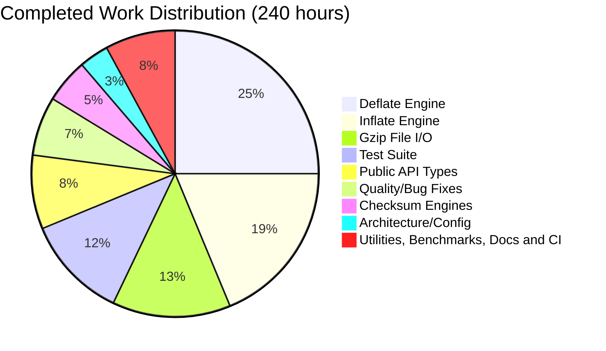

# Project Guide: zlib-rs — C-to-Rust Migration of zlib Compression Library

## 1. Executive Summary

**Project:** Complete technology stack migration of the zlib compression library from ANSI C to Rust  
**Branch:** the engagement branch this snapshot was taken on — confirm yours with `git rev-parse --abbrev-ref HEAD`  
**Effort snapshot:** 240 of 282 estimated hours = **85.1%** — a *planning estimate*, never a measurement (Sections 4.1, 4.2)

The zlib-rs crate implements the complete zlib public API surface as an independent, zero-C-dependency Rust library conforming to RFC 1950 (zlib format), RFC 1951 (DEFLATE), and RFC 1952 (gzip format). Its `src/` tree is **40** modules in a strictly acyclic seven-layer arrangement mirroring the C `#include` layering, and every translation unit and header of the retained C baseline has a named Rust owner. The crate compiles cleanly (debug + release), reports **0 failures and 0 ignored tests in every feature row**, has zero clippy warnings under `-D warnings`, and is fully formatted.

**Key Achievements** (measured; Section 8.4 records how each figure is derived):
- **56,876** lines of Rust across **40** `src/` modules, replacing the **23,107** lines of C in the retained baseline
- Complete DEFLATE engine both ways: all 5 compression strategies (stored, fast, slow, huff, rle) and a 30+ mode decompression state machine
- Adler-32 and CRC-32 checksum engines with combine operations, plus gzip file I/O behind a stdio-like interface
- **842** tests pass on the default row (**688** unit + **127** integration + **27** doc), 0 failed, 0 ignored
- Compressed output **byte-identical** to reference C zlib at **50/50** and **3,750/3,750** swept configurations
- Pure Rust — a two-crate runtime closure, and no C toolchain required to build or test the crate

**Previously-Tracked Open Items (now resolved):**
- `--no-default-features` test compilation is RESOLVED. The test suite now compiles and passes under both `--no-default-features` and `--no-default-features --features no-std` (626 passed, 0 failed, 0 ignored in each); the library itself compiles fine under all feature configurations.
- cargo-fuzz targets are RESOLVED. Five targets exist under `fuzz/fuzz_targets/` (`fuzz_deflate_roundtrip`, `fuzz_inflate`, `fuzz_checksum`, `fuzz_gzip`, `fuzz_ffi_roundtrip`) with a `fuzz/Cargo.toml`, driven by the `fuzz.yml` workflow on a weekly schedule with a cached per-target corpus.
- Performance vs C zlib has been benchmarked (AAP [§0.8.3](technical-specifications.md)): compression measures ≈ **85%** of C throughput across the level sweep and decompression **107–127%**. Performance is a *constraint on this work, not its objective* — no throughput target was ever set, and optimisation is strictly subordinate to byte-identity, because the heuristics that cost throughput are exactly the ones that decide which bytes get emitted. Those two aggregates are recorded context rather than something this repository can re-derive on demand — the benches link no C library and there is no in-tree performance oracle — so treat every C-relative percentage as provisional. A per-profile measurement *did* localise the compression shortfall, and it inverted the intuitive answer (Section 6.7).

**Recommended Next Steps:**
1. Human code review and sign-off across the Rust surface — the one item no gate can automate.
2. Profile the *compressible*-input deflate path — the measured worst case, not the intuitive one (Section 6.7) — gating every candidate change on the byte-identity sweep of Section 7.1; a faster match finder that emits different tokens is a regression, not an improvement.
3. Execute a `no_std` build on real embedded hardware: CI builds `thumbv7em-none-eabihf` but cannot run it (gap D10).
4. Complete release governance — an actual `crates.io` publish flow on top of the existing packaging verification (gaps D5, D12).

---

## 2. Validation Results Summary

### 2.1 Final Validator Accomplishments

A validation pass closed the last `ignore`d doc tests and added targeted unit coverage; re-verify any of it with `git log`. It converted four `ignore` doc tests into runnable ones — three in `src/inflate/back.rs` (`InflateBackInput`, `InflateBackOutput`, `inflate_back_init`) and one in `src/inflate/mod.rs` (`inflate_init`) — added 14 unit tests in `src/inflate/state.rs` covering `parse_window_bits` and `InflateState` construction, and applied a `cargo fmt` line-wrapping fix in `src/deflate/mod.rs`. That is what took the ignored-test count to zero, where it now stays.

### 2.2 Gate Results

| Gate | Status | Details |
|------|--------|---------|
| **Dependencies** | ✅ PASS | 89 packages in the root lock plus 13 in `fuzz/Cargo.lock` = a **102**-package governed closure; the *runtime* closure is just `cfg-if 1.0.4` and optional `crc32fast 1.5.0` (Section 6.3) |
| **Compilation** | ✅ PASS | `cargo build` (debug) — 0 errors, 0 warnings; `cargo build --release` — success; `cargo bench --no-run` — 3 benchmark binaries compile |
| **Linting** | ✅ PASS | `cargo clippy --locked --all-targets --all-features -- -D warnings` — 0 lints |
| **Formatting** | ✅ PASS | `cargo fmt --all -- --check` — all code formatted |
| **Tests** | ✅ PASS | 842 passed, 0 failed, 0 ignored (default row); 855 with `--all-features`; 626 with `--no-default-features` |
| **Documentation** | ✅ PASS | `cargo doc --locked` — 0 errors; `mkdocs build --strict` — 0 broken links |
| **Byte-identity** | ✅ PASS | `cargo test --features c-oracle --test c_oracle` — **50/50** and **3,750/3,750** byte-identical against a reference C zlib built from this repository's own C sources |
| **Runtime** | ✅ PASS | Benchmarks compile and execute; the integration suites exercise real round-trips, and a C program links the emitted `staticlib` and `cdylib` (Section 6.8) |

### 2.3 Test Results Breakdown

Counts are a **measured snapshot**; re-derive them any time with `cargo test --locked`. What does *not* move is the invariant beneath them: **no test is `#[ignore]`d — the current count of ignored tests is zero and stays zero**, in every feature row.

| Test Suite | Tests Passed | Description |
|-----------|-------------|-------------|
| Unit tests (lib) | 688 | Inline module tests across all source files |
| tests/checksum.rs | 23 | Adler-32 and CRC-32 known-answer and combine tests |
| tests/round_trip.rs | 19 | Property-based compression/decompression round-trip tests |
| tests/interop.rs | 30 | Two-tier byte-identity gate: baked C-encoder vectors + flate2 cross-decode |
| tests/gzip_compat.rs | 15 | Gzip file I/O validation (port of C test/minigzip.c) |
| tests/regression.rs | 12 | Port of C test/example.c regression driver |
| tests/inflate_coverage.rs | 28 | Port of C test/infcover.c inflate coverage |
| tests/c_oracle.rs | 13 (`--features c-oracle` only) | Opt-in live C-oracle conformance sweep; excluded from the default row |
| Doc tests | 27 | 26 runnable public-API examples plus 1 `compile_fail` case |
| **Total (default row)** | **842 passed, 0 failed, 0 ignored** | 688 unit + 127 integration + 27 doc |
| **Total (`--all-features`)** | **855 passed, 0 failed, 0 ignored** | Adds the 13 `c_oracle` tests |
| **Total (`--no-default-features`)** | **626 passed, 0 failed, 0 ignored** | 505 unit + 96 integration + 25 doc; `gzip_compat` correctly reports 0 because the whole `gz*` file API is gated off |

### 2.4 Build Status (no_std) — Resolved

**`cargo test --no-default-features` now compiles and passes.** The earlier failure (129 compilation errors from test modules using `Vec`, `format!`, and `String` without `alloc` imports when the `std` feature was disabled) has been resolved: the affected test modules now import from `alloc` (or are gated appropriately). Both `cargo test --no-default-features` and `cargo test --no-default-features --features no-std` compile and pass (626 passed, 0 failed, 0 ignored in each), and `ci.yml`'s dedicated `no-std-tests` job runs all four invocations, debug and release. Compiling and passing on a *hosted* target is not the same as working on no-OS hardware, though: that remains gap **D10** (Section 6.1).

---

## 3. Visual Representation

### 3.1 Hours Breakdown


**Calculation:** 240 hours completed / (240 + 42) total hours = **85.1% complete**

> Both charts in this section plot **this document's own historical effort estimate**, on its own basis. They are planning figures, not measurements, and they must never be averaged with or silently replaced by the differently-scoped snapshot carried in the engagement material under `blitzy/documentation/`. Every *measured* claim in this guide lives in Sections 2, 6.8, 8.4, and 9.

### 3.2 Completed Hours by Component



---

## 4. Detailed Completion Analysis

### 4.1 Completed Hours Calculation

> Note: The **Hours** column is the original effort-estimate snapshot (sums to 240h and is retained for planning history). The **Lines** column has been refreshed to current measured values, so the two columns reflect different points in the project timeline and must not be read as one dataset. The `src/` component rows sum exactly to 40 files / 56,876 lines; Test, Benchmark, Documentation and CI rows are separate (non-`src/`). See Section 8.4 for the authoritative code-metrics summary.

| Component | Files | Lines | Hours | Rationale |
|-----------|-------|-------|-------|-----------|
| Deflate Engine | 9 files (src/deflate/) | 10,084 | 60h | 5 compression strategies, state machine, hash tables, Huffman trees — most complex module |
| Inflate Engine | 6 files (src/inflate/) | 8,950 | 45h | 30+ mode state machine, fast-path decode loop, callback API, Huffman table builder |
| Gzip File I/O | 6 files (src/gz/) | 8,094 | 32h | stdio-like interface: open/read/write/close/seek with LOOK/COPY/GZIP pipeline |
| Test Suite | 7 files (tests/) | 17,141 | 28h | 7 integration test files porting C test/example.c, infcover.c, minigzip.c + property tests, the two-tier interop byte-identity gate, and the opt-in `c_oracle` sweep |
| FFI Boundary | 7 files (src/ffi/) | 19,213 | — | `#[unsafe(no_mangle)] extern "C"` drop-in shims + `#[repr(C)]` mirrors (effort folded into Public API Types and Quality rows) |
| Public API Types | 5 files (lib.rs, error.rs, constants.rs, stream.rs, gz_header.rs) | 6,198 | 20h | Foundational types, error handling, streaming interface, version constants |
| Quality & Debugging | — | — | 16h | Blitzy Agent commits: formatting fixes, clippy compliance, safety comments, bug fixes |
| Checksum Engines | 3 files (src/checksum/) | 2,350 | 12h | Adler-32 with combine, CRC-32 with combine/gen/op, build.rs table generation |
| Architecture/Config | Cargo.toml, build.rs, and the pinned tool configs | 2,425 (build.rs) | 8h | Package manifest, CRC table generation, feature flags, profile config, `rust-toolchain.toml` / `clippy.toml` / `rustfmt.toml` / `deny.toml` |
| Benchmarks | 3 files (benches/) | 993 | 6h | Criterion-based deflate/inflate/checksum throughput benchmarks |
| Utilities | 4 files (src/util/) | 1,987 | 6h | compress/uncompress wrappers, version/compile_flags |
| Documentation | README.md, `doc/**`, CHANGELOG/CONTRIBUTING/SECURITY | — | 6h | Crate docs with usage examples, feature flags, API overview; the three MkDocs pages |
| CI/CD | ci.yml, audit.yml, fuzz.yml | — | 1h | Rust CI pipeline (11 jobs), supply-chain audit gate, cargo-fuzz workflow |
| **Total (src/ only)** | **40 .rs** | **56,876** | **240h** | Hours total spans all components; line total is `src/` only |

### 4.2 Remaining Hours Calculation

> Note: This is a historical effort-estimate snapshot, retained for planning provenance and superseded on substance by Section 5. Most rows below are now RESOLVED — no_std test compilation, the CI no_std steps, fuzz-target creation, performance benchmarking, and byte-identical verification all landed (see Sections 1, 2.3, 2.4, 5, and 7.1). The hour figures are the original estimate and are not re-derived.

The original estimate distributed the **42 remaining hours** as: no_std test compilation 3h and the matching CI steps 1h (High priority, High confidence); performance benchmarking against C zlib 8h and byte-identical compression verification 6h (High, Medium); fuzz-target creation 3h (Medium, High); unsafe-code security audit 3h, no_std integration testing 3h and production edge-case hardening 4h (Medium, Medium); documentation refinement 2h and `crates.io` publication preparation 2h (Low, High); plus a 7h enterprise buffer applying a 1.10 × 1.10 compliance-and-uncertainty factor.

Everything on that list except the human half of the security audit, real-hardware no_std validation, edge-case hardening and the publish flow itself has since landed — which is exactly why Section 5, not this table, is the list to work from.

---

## 5. Detailed Task Table for Human Developers

This table is the **forward-looking** view and supersedes Section 4.2 on substance. It mirrors the hardening inventory of AAP [§0.8.3](technical-specifications.md), whose *Weight* column is a relative effort ranking for prioritisation only — deliberately not an hour estimate, so nothing here can be confused with the historical hours above. Gap identifiers `D1`–`D12` are the verified-absent-artifact register of AAP §0.10.1; the unrelated hyphenated `D-1`–`D-8` namespace of §0.8.1 is the preservation directives, and the hyphen is the disambiguator.

| # | Task | Description | Action Steps | Weight | Priority | Status |
|---|------|-------------|-------------|-------|----------|----------|
| 1 | Human code review and sign-off | The whole Rust surface — 40 `src/` modules — still needs human review. No gate substitutes for it, and this is the single largest remaining item. | 1. Review the `src/ffi/**` boundary first: it holds every `unsafe` block 2. Check each `// SAFETY:` comment states the invariant it actually relies on 3. Review the seven byte-identity-risk files listed in `CONTRIBUTING.md` 4. Sign off per module | 16 | High | Open |
| 2 | Security and supply-chain audit | Policy and tooling are in place — `deny.toml` plus an `audit.yml` workflow running `cargo-audit` and `cargo-deny` on push, pull request, and a daily schedule (gaps **D1**, **D2** closed). What remains is human interpretation of their output. | 1. Review the `cargo-deny` `bans` decisions, especially the three acknowledged duplicate majors 2. Re-check that the `rand` floor still covers RUSTSEC-2026-0097 on both the direct and the transitive path (Section 6.3) 3. Treat any new advisory as release-blocking | 8 | High | Tooling in place; review open |
| 3 | Cross-platform CI matrix | Gap **D3** is closed with a residual. `build-test` now executes natively on `ubuntu-latest`, `windows-latest` (x86_64) and `macos-latest` (aarch64), and `cross-targets` type-checks `aarch64`, 32-bit `i686` and big-endian `s390x`. Those three are compile-verified, not runtime-verified. | 1. Obtain runtime execution on a big-endian host to exercise `CRC_BIG_TABLE` / `CRC_BRAID_BIG_TABLE` for real 2. Add a 32-bit runtime row 3. Keep every row's `name:` unique — the failure-upload step keys its artifact on it | 6 | Medium | Closed with residual |
| 4 | Byte-identity conformance matrix | **Empirically satisfied.** The obligation is AAP [§0.8.1](technical-specifications.md) directive **D-1** — byte-*identical* output, not merely mutually decodable streams. `tests/c_oracle.rs` builds a reference C zlib from this repository's own C sources and sweeps **50/50** and **3,750/3,750** configurations byte-identically (gap **D9** closed). | 1. Run `cargo test --features c-oracle --test c_oracle` before any change to the seven deflate files 2. Extend the grid only additively 3. Never weaken tier 1 of `tests/interop.rs`, which must stay C-toolchain-free | 4 | Medium | Satisfied |
| 5 | Real-hardware `no_std` validation | Gap **D10** is partial. The `bare-metal-no-std` job builds `thumbv7em-none-eabihf` in both `no_std` configurations and asserts the freestanding runtime block is present in the archive, but nothing executes on no-OS hardware. 626 passing hosted tests do not prove an embedded target. | 1. Flash a `#![no_std]` consumer onto a Cortex-M target 2. Exercise compression, decompression and checksums 3. Confirm the private libc-backed allocator and the abort panic handler behave 4. Record the result | 5 | Medium | Partial |
| 6 | Scheduled / CI-integrated fuzzing | Partially satisfied. `fuzz.yml` runs all five targets on a weekly `cron`, on pull requests and on demand, with `-max_len=65536 -rss_limit_mb=2048` and a cached per-target corpus. The residual is budget, not the absence of a schedule. | 1. Raise the per-target `-max_total_time` beyond the pull-request budget for scheduled runs 2. Grow and curate the cached corpus 3. Triage any artifact immediately — a crash is release-blocking | 3 | Medium | Partial |
| 7 | `crates.io` release governance | Gap **D12** is closed for *verification*: a `package-verify` job lists the packaged files against a forbidden-pattern contract, packages the crate, runs the packaged crate's own suite, and asserts both lockfiles are unchanged. `CHANGELOG.md` exists (gap **D5**). An actual publish flow does not. | 1. Run `cargo package --list` and `cargo publish --dry-run` against a release candidate 2. Confirm metadata (description, license, categories, keywords) 3. Define the release and tagging procedure | 3 | Medium | Verification closed; publish open |
| 8 | Deflate throughput tuning | Compression measures ≈ 85% of C in aggregate. The AAP hardening inventory names this row *incompressible-input* tuning, but a per-profile measurement inverted that: incompressible input is the **closest** to C (≈ 82–86%) and the **compressible** profiles are the **furthest** (≈ 58–64%). On random bytes `longest_match`'s two-byte prefilter rejects almost every candidate and `_tr_flush_block` falls back to stored blocks, so both implementations do little work per byte. `deflate_bench` keeps an incompressible profile as a falsifiable guard. | 1. Profile with `perf`/`flamegraph` on the *compressible* profiles, where hash chains are genuinely walked, lazy matching is evaluated and Huffman trees are built and emitted 2. Restrict changes to work that provably cannot alter the token stream — bounds-check elision, access patterns, inlining, buffer-copy strategy 3. Re-run the byte-identity sweep before accepting anything | 6 | Low | Open |
| 9 | Optional cdylib symbol versioning | Gap **D8** is closed as an **opt-in**: `build.rs` applies the retained `zlib.map` version script only when `ZLIB_RS_VERSION_SCRIPT` is truthy, yielding 54 tagged symbols and 16 version definitions when enabled and none when not — 95 exported `T` symbols either way. A drop-in links successfully without it. | 1. Decide whether tagged symbols should become the default 2. If so, gate that decision behind runtime coverage on the non-Linux rows, because the linker argument is the portability risk 3. Leave it opt-in otherwise | 2 | Low | Closed as opt-in |

---

## 6. Development Guide

### 6.1 System Prerequisites

| Requirement | Version | Purpose |
|------------|---------|---------|
| Rust toolchain | 1.85.0+ | MSRV for edition = "2024"; 1.85.0 is the release that stabilised that edition, making it the tightest self-consistent floor. Verified on both 1.85.0 and current stable. |
| Cargo | 1.85.0+ | Build system (bundled with Rust). `rust-toolchain.toml` pins the repository to 1.85.0 (gap **D4**, so contributors and CI resolve identically), which means a bare `cargo` here reaches the **MSRV** compiler — prefix the stable gates with `cargo +stable`, exactly as CI does. |
| Git | 2.x+ | Version control |
| C compiler | any | **Optional.** Needed only for the opt-in `c-oracle` byte-identity sweep; the default suite deliberately requires none. |
| OS | Linux x86_64, Windows x86_64, macOS aarch64 | These three **execute** the suite natively in CI. `aarch64`, 32-bit `i686` and big-endian `s390x` Linux are **type-checked** only, and bare-metal `thumbv7em-none-eabihf` is **built** only — so a big-endian, 32-bit or embedded build is compile-verified, not runtime-verified. This guide does not claim more (gaps **D3**, **D10**). |

Why that last row is worded so carefully: braid-table selection is a `cfg!(target_endian)` decision, `OS_CODE` is a compile-time platform choice (**10** on Windows, **19** on non-Windows Apple, **3** otherwise), and `gzopen_w` is `#[cfg(windows)]`-gated. The Windows and macOS rows now exercise `OS_CODE` 10 and 19 and compile `gzopen_w`; the big-endian CRC tables are still only type-checked. A platform claim beyond that would outrun its coverage.

### 6.2 Environment Setup

```bash
# 1. Install the Rust toolchain, then clone. Nothing here assumes a branch name.
curl --proto '=https' --tlsv1.2 -sSf https://sh.rustup.rs | sh -s -- -y && source "$HOME/.cargo/env"
git clone https://github.com/Blitzy-Sandbox/blitzy-zlib && cd blitzy-zlib
git rev-parse --abbrev-ref HEAD   # whatever this prints is your branch

# 2. Verify the toolchain against the DECLARED MSRV, not a fixed patch release
grep '^rust-version' Cargo.toml   # the authoritative floor
rustc --version                   # in-repo this resolves via rust-toolchain.toml
cargo +stable --version           # the toolchain 10 of the 11 CI jobs use
```

### 6.3 Dependency Installation

```bash
# Cargo installs dependencies on first build; pre-fetch them with:
cargo fetch --locked   # 89 packages in the root lock: 6 direct deps + 83 transitive
# Direct dev deps: criterion 0.5.1, flate2 1.1.9, quickcheck 1.1.0, rand 0.9.4
grep -c '^\[\[package\]\]' Cargo.lock fuzz/Cargo.lock   # 89 and 13 -> a 102-package closure
```

The shape of that closure matters more than its size:

- **The runtime closure is two crates.** `cfg-if` replaces the C `#if`/`#ifdef` preprocessor nests, and `crc32fast` is `optional`, reached only through the `simd` feature and declared `default-features = false` so it stays `no_std`-compatible. `crc32fast` itself pulls only `cfg-if`. Keeping this minimal is the *zero-C-dependency rule*: a memory-safety replacement for `libz` that dragged in a large transitive graph would trade one class of risk for another.
- **No C toolchain is required to test.** `flate2`'s **default** features select the pure-Rust `miniz_oxide` backend; its `zlib` and `zlib-ng` C backends are intentionally left disabled. Any claim that the dev-dependencies use a C backend is false.
- **Four duplicate majors coexist, and they are not defects:** `getrandom` 0.3.4/0.4.3, `r-efi` 5.3.0/6.0.0, `rand` 0.9.4/0.10.2, `rand_core` 0.9.5/0.10.1. `deny.toml` acknowledges three of them by exact version — naming the *transitive* copy, so a future bump surfaces as `warning[unmatched-skip]` rather than a silently widened exemption — and prunes `r-efi` through its explicit target list instead.
- **The `rand` split is the one worth internalising.** `rand 0.9.4` is the **direct** dev-dependency, pinned at or above 0.9.4 to stay clear of the patched range for **RUSTSEC-2026-0097** (a dev-dependency-only advisory). `rand 0.10.2` arrives **transitively via `quickcheck 1.1.0`**, so `cargo tree -i rand` fails with *"specification 'rand' is ambiguous"* and lists both. The declared floor therefore governs only the direct path — precisely the drift the `cargo-audit` / `cargo-deny` gate exists to catch.
- **The fuzz workspace is detached.** `fuzz/` carries its own `[workspace]` table, so root `cargo build`/`test`/`clippy`/`fmt` never touch it. It declares just `libfuzzer-sys` and `zlib-rs { path = ".." }` — the only path dependency in the project — and is the **only** place a C toolchain enters any dependency graph (`cc`, `jobserver`, `shlex`, `find-msvc-tools`). The crate proper needs none and must continue to need none.
- **Both lockfiles are committed deliberately**, because the crate ships `cdylib`/`staticlib` distributables. `cargo build --offline` succeeds on a warm index and `git status --porcelain Cargo.lock` stays empty afterwards, confirming nothing is silently rewritten. Use `--locked` and the lock cannot drift under you.

### 6.4 Build Commands

```bash
cargo build            # Expected: Finished `dev` profile [unoptimized + debuginfo]
cargo build --release  # Expected: Finished `release` profile [optimized]
cargo bench --no-run   # Expected: 3 bench binaries — deflate_bench, inflate_bench, checksum_bench
```

`[profile.release]` sets `opt-level = 3` and `codegen-units = 1`, and both profiles set `panic = "abort"`. Three properties of that configuration are easy to get wrong:

- **There is deliberately no `lto` key, and adding one would be worse than useless.** `[lib] crate-type` emits `lib` (rlib) alongside `cdylib` and `staticlib` from a single `rustc` invocation, and `rustc` cannot run LTO for a unit that also emits an rlib — so Cargo silently *drops* any LTO-enabling value instead of reporting it. Measured on this tree, `lto = true`/`"fat"`/`"thin"`/`false` produce no `-C lto` flag at all, while only `lto = "off"` is forwarded. A declared optimisation that silently does nothing invites performance reasoning from a flag that is not there, and a unit test fails the build if the key reappears while `lib` is still in the crate-type list.
- **`panic = "abort"` is required, not stylistic.** A `--no-default-features` (`no_std`) build emits the `cdylib`/`staticlib` without an unwinding runtime, and stable `rustc` then rejects unwinding panics with *"unwinding panics are not supported without std"*. There is no `#![panic_abort]` attribute, `eh_personality` is nightly-only, and Cargo cannot scope the panic strategy per feature or per crate-type — so it must be global, in both profiles. It does **not** weaken the FFI contract: the invariant is *a Rust panic must never unwind across the C ABI*, and aborting upholds that directly. The `catch_unwind` guards in `src/ffi/` remain (gated on `feature = "std"`) as defence in depth, and because Cargo forces `unwind` for the test and bench harness, those guard tests still run and pass.
- **Artifact geometry, measured** from `cargo build --release`: `libzlib_rs.rlib` ≈ 2.4 MB, `libzlib_rs.so` ≈ 620 KB, `libzlib_rs.a` ≈ 22 MB. All three land in one shared `target/release/` path, so the *last* feature row you build wins — rebuild with the features you intend immediately before linking a C consumer, or give each row its own `CARGO_TARGET_DIR`.

### 6.5 Running Tests

Absolute counts move whenever a test is added, so treat the trailing counts below as the measured snapshot of Section 2.3. **Every one of these invocations must report 0 failed and 0 ignored** — that part is the invariant, and it holds no matter what the counts become.

```bash
cargo test --locked                          # 842 passed at this snapshot
cargo test --locked --lib                    # 688 unit tests
cargo test --locked --tests                  # 688 lib + 127 integration = 815
cargo test --locked --doc                    # 26 runnable examples + 1 compile_fail case
cargo test --locked --no-default-features    # 626; gzip_compat correctly reports 0 tests

# Opt-in live byte-identity sweep against a C zlib built from the in-tree C sources.
# Needs a C compiler; with none present it prints a capability notice and PASSES.
cargo test --locked --features c-oracle --test c_oracle   # 50/50 and 3750/3750 identical

# One suite at a time: regression (C example.c), checksum, round_trip, interop,
# gzip_compat (C minigzip.c), inflate_coverage (C infcover.c)
cargo test --test regression
```

### 6.6 Linting and Formatting

The first two lines below are the **exact** invocations the `lint` job runs, so a green run locally means a green run in CI. Both are blocking, and `-D warnings` promotes `missing_docs` and `undocumented_unsafe_blocks` to hard errors — no lint may be downgraded or `allow`-ed to make a change land. Adding `--locked` locally is a good habit; CI does not pass it here because a separate job already asserts both lockfiles are unchanged.

```bash
cargo +stable clippy --all-targets --all-features -- -D warnings   # 0 lints
cargo +stable fmt --all -- --check    # no output = everything formatted
cargo +stable fmt --all               # auto-format, if needed
```

`clippy.toml` and `rustfmt.toml` pin the tool configuration so behaviour does not depend on unpinned defaults (gap **D11**), and `rustfmt.toml` sets `style_edition = 2024` to match the crate's edition. Both the `lint` and `msrv` jobs additionally assert that `rustup show active-toolchain` resolved to the channel they asked for, because `rust-toolchain.toml` otherwise wins; `msrv` pins `dtolnay/rust-toolchain@1.85.0` and runs `cargo +1.85.0 build --verbose` plus `cargo +1.85.0 check --verbose --all-targets`.

### 6.7 Running Benchmarks

```bash
cargo bench                          # all three groups: deflate, inflate, checksum
cargo bench --bench deflate_bench    # or --bench inflate_bench / --bench checksum_bench
```

All three targets are `criterion`-driven with `harness = false`, every case validates its own output before it is timed (one untimed compress-then-decompress equality check, which Criterion never folds into a sample), and the harness links **no** C library — so every number it prints is a Rust-only, level-and-profile figure. `deflate_bench` keeps an explicit **incompressible-input** profile, but not for the reason an earlier revision of this guide gave: a per-profile measurement against a reference C build inverted the intuition, putting incompressible input **closest** to C at ≈ 82–86% and the compressible profiles **furthest** at ≈ 58–64%. On random bytes `longest_match`'s two-byte prefilter rejects almost every candidate before the comparison loop and `_tr_flush_block` selects stored blocks because a dynamic tree cannot pay for itself, so both implementations do similar and rather little work per byte; the gap opens where hash chains are genuinely walked, lazy matching is evaluated, and Huffman trees are built and emitted. Because no in-tree performance oracle exists, every C-relative percentage here is provisional. CI's `benches` job runs `cargo +stable bench --no-run` only — a compile gate, never a measurement, since a shared runner cannot produce trustworthy timings.

### 6.8 Verification Steps

After building and testing, verify the following. Every line was observed to pass on this snapshot; a change is not done because it compiles, it is done when the relevant gate has been *seen* to pass.

1. **Compilation:** `cargo build` and `cargo build --release` both succeed with 0 errors, 0 warnings
2. **Tests:** `cargo test --locked` reports 0 failed and 0 ignored (842 passed here); `--no-default-features` likewise (626), `--all-features` likewise (855)
3. **Lint and format:** `cargo +stable clippy --locked --all-targets --all-features -- -D warnings` reports 0 lints, and `cargo +stable fmt --all -- --check` produces no output
4. **Documentation:** `cargo doc --locked` exits 0, and `mkdocs build --strict` reports no broken links
5. **Benchmarks and MSRV:** `cargo bench --no-run` compiles all 3 benchmark binaries; `cargo +1.85.0 build --locked` and `cargo +1.85.0 check --locked --all-targets` both exit 0
6. **Exported C ABI:** `nm -D --defined-only target/release/libzlib_rs.so | awk '$2=="T"' | wc -l` reports **95** — the 96 declared `#[unsafe(no_mangle)]` entry points minus `gzopen_w`, which is `#[cfg(windows)]`-gated exactly as C gates it
7. **Byte-identity:** `cargo test --locked --features c-oracle --test c_oracle` reports **50/50** and **3,750/3,750** byte-identical
8. **Packaging:** `cargo package --locked --list` contains no `*.c`, `*.h`, `*.map`, `contrib/`, `examples/`, `test/` or legacy platform paths

Linked through the C ABI, a drop-in consumer should observe exactly these canonical values: `zlibVersion()` = `"1.3.2.1-motley"`, `ZLIB_VERNUM` = `0x1321`, `crc32("123456789")` = `0xcbf43926`, `adler32("123456789")` = `0x091e01de`, and `compressBound(9)` = `22`.

### 6.9 Example Usage

```rust
use zlib_rs::{compress, uncompress};

fn main() {
    let data = b"Hello, zlib-rs! This is a compression test.";
    let compressed = compress(data, 6).expect("compression failed");                  // one-call compress
    let decompressed = uncompress(&compressed, data.len()).expect("decompress failed"); // one-call inflate
    assert_eq!(data.as_slice(), decompressed.as_slice());
    println!("{} -> {} -> {} bytes", data.len(), compressed.len(), decompressed.len());
}
```

Every zlib-style camelCase entry point also has an idiomatic snake_case twin (`compressBound` / `compress_bound`, `zlibVersion` / `zlib_version`), and the streaming engines are reached through `zlib_rs::deflate::*` and `zlib_rs::inflate::*`. FFI names are deliberately *not* re-exported at the crate root, so anything needing the raw C entry points imports from `zlib_rs::ffi`. **If you use the `gz*` file API, close the handle explicitly** — see Section 6.10.

### 6.10 Troubleshooting

| Issue | Cause | Resolution |
|-------|-------|------------|
| `cargo test --no-default-features` fails | (RESOLVED) previously missing `alloc` imports in test code | Fixed — test modules import from `alloc`; the suite compiles and passes under `--no-default-features` and `--no-default-features --features no-std` |
| `cargo fuzz build` fails | (RESOLVED) previously no fuzz targets existed | Fixed — five targets exist under `fuzz/fuzz_targets/` with a `fuzz/Cargo.toml`; `cargo-fuzz` needs a nightly toolchain and is CI-installed, never a manifest dependency |
| `cargo <cmd>` picks the MSRV compiler unexpectedly | `rust-toolchain.toml` pins the repository to 1.85.0, and a repository pin outranks `rustup default` | Intended. Prefix stable gates with `cargo +stable` (or set `RUSTUP_TOOLCHAIN=stable`), which is exactly what the CI jobs do |
| Truncated or empty gzip output | A gzip handle's `Drop` is intentionally empty of finishing logic, so nothing flushes the final block and trailer implicitly | Call `gzclose` / `gzclose_w`. This is deliberate: a destructor cannot surface a deferred compression or I/O error, and silently swallowing a write failure during unwinding would be strictly worse than matching C's explicit-close contract |
| `gzprintf` / `gzvprintf` return `Z_STREAM_ERROR` | Rendering a C `va_list` needs the nightly-only `c_variadic` feature, so both symbols ship as ABI-compatible stubs | Expected, and detectable programmatically: `zlibCompileFlags` **bit 27** is set, exactly as it is for a C zlib built without a secure `vsnprintf`. Format the string on the caller's side, or use the idiomatic Rust `gzprintf`, which does format fully |
| A panic aborts instead of being caught | `panic = "abort"` is set in both profiles because a `no_std` `cdylib`/`staticlib` cannot link an unwinding runtime on stable | Expected for the shipped artifact (Section 6.4). The `catch_unwind` guards remain under `feature = "std"`, and the test/bench harness forces `unwind`, so guard tests still exercise them |
| A stream that reference zlib accepts is rejected | The `inflate_strict` feature is enabled | It defaults **off** on purpose, to preserve acceptance parity with a default-built reference zlib. Turn it on only to reject out-of-window distances early |
| Compression slower than reference C zlib | Expected: ≈ 85% of C in aggregate, and *compressible* input — not incompressible — is the measured worst case | Tracked and non-failing (Sections 1, 6.7); decompression is at or above parity. Profile if you wish, but gate any change on the byte-identity sweep first, and remember the bench harness links no C library, so its own numbers are Rust-only |

---

## 7. Risk Assessment

### 7.1 Technical Risks

| Risk | Severity | Likelihood | Impact | Mitigation |
|------|----------|------------|--------|------------|
| Compression output not byte-identical to C zlib | **Satisfied** | — | Interoperability failures with existing zlib-compressed data | **Empirically closed.** `tests/c_oracle.rs` compiles a reference C zlib from this repository's own 15 translation units and 11 headers using the host `cc` — on this snapshot `cc (Ubuntu 15.2.0-4ubuntu4) 15.2.0`, yielding a 135,206-byte `libz_ref.a` — then diffs live output: sweep 1 is one 200,000-byte mixed-entropy corpus × 10 levels × 5 strategies = **50/50 byte-identical**; sweep 2 is 5 corpus shapes × 5 `windowBits` (15, −15, 31, 9, −9) × 3 `memLevel`s (1, 8, 9) × 10 levels × 5 strategies = **3,750/3,750 byte-identical**. The residual is reproducibility discipline, not correctness: run the sweep before touching any of the seven deflate files |
| Compression throughput below C zlib | Low | High | Slower compression on hot paths, most visibly on *compressible* input — a per-profile measurement inverted the intuitive answer (Section 6.7) | Accepted by design. Performance is a **constraint, not a target** (AAP [§0.8.3](technical-specifications.md)); the recorded position is ≈ 85% compression and 107–127% decompression, and a local per-profile run of the decompression cases measured 104–125%, which brackets the recorded band — so the decompression figure survives contact with measurement. Permissible optimisation is limited to work that provably cannot change the token stream, because the heuristics that cost throughput — the chain-length halving at `good_match`, the `nice_match` early break, the `TOO_FAR` lazy-match filter — are the ones that decide the output bytes |
| Unsafe code contains unsound invariants | High | Low | Memory safety violations defeating purpose of Rust rewrite | Contained by construction, not by convention: `#![deny(unsafe_code)]` at the crate root with exactly **two** narrowly scoped `#[allow(unsafe_code)]` carve-outs — the `ffi` module and a private `no_std` runtime block — so a violation in the core is a compile error. All eight core module groups measure **zero** executable `unsafe`, every site carries a `// SAFETY:` comment (**383** of them), and `undocumented_unsafe_blocks` is a `-D warnings` error. Task #1 remains: human review of those invariants |
| no_std test failures block CI | Resolved | — | Previously failed 2 of 7 test configurations | RESOLVED — alloc imports fixed; `--no-default-features` and `--no-default-features --features no-std` compile and pass, in both debug and release, in a dedicated blocking job |

### 7.2 Security Risks

| Risk | Severity | Likelihood | Impact | Mitigation |
|------|----------|------------|--------|------------|
| No fuzz testing coverage | Resolved | — | Undiscovered crashes or panics on malformed input | RESOLVED — five cargo-fuzz targets exist (inflate, deflate round-trip, checksum, gzip, FFI round-trip), run weekly and on pull requests with a cached per-target corpus; the residual is budget, not coverage |
| `inflate_fast` inner loop is unsound | Low | Low | Potential buffer overread on crafted input | `src/inflate/fast.rs` contains **no** `unsafe` at all — the C hot loop's pointer arithmetic became index arithmetic, so the overread class is excluded by the borrow checker rather than argued about. Malformed-input behaviour is covered by the `inflate_coverage` port of C `infcover.c` and by the `fuzz_inflate` target |
| Unpatched advisory in the dependency closure | Medium | Low | A known vulnerability shipping transitively | `deny.toml` plus the `audit.yml` workflow run `cargo-audit` and `cargo-deny` over both lockfiles on push, pull request and a daily schedule (gaps **D1**, **D2**). The live example is RUSTSEC-2026-0097: `rand` is pinned at or above 0.9.4 on the direct dev path, while 0.10.2 arrives transitively via `quickcheck` — which is exactly why the gate exists (Section 6.3) |
| Integer overflow in checksum combine | Low | Low | Incorrect checksum values | Covered by the 23 tests of `tests/checksum.rs` — known-answer vectors plus `adler32_combine` / `crc32_combine` parity — on top of the inline unit tests in `src/checksum/`, and by the `fuzz_checksum` target |

### 7.3 Operational Risks

| Risk | Severity | Likelihood | Impact | Mitigation |
|------|----------|------------|--------|------------|
| Legacy C files leaking into the crate package | Low | Low | Bloat, and a published crate that misrepresents its contents | Governed, not assumed. The manifest's `exclude` list keeps the retained C baseline out of the `.crate`, and the `package-verify` job lists the packaged files against a forbidden-pattern contract, packages the crate, runs the packaged crate's own suite, and asserts both lockfiles are unchanged (gap **D12**). Measured: `cargo package --list` reports 75 files with no `*.c`, `*.h`, `*.map`, `contrib/`, `examples/`, `test/` or platform-directory entries. The three `doc/*.md` MkDocs pages are packaged *deliberately* |
| No published crate on crates.io | Low | Medium | Users cannot `cargo add zlib-rs` | Task #7: packaging is verified; the publish flow itself is the open half |
| Missing changelog/release notes | Resolved | — | Users unaware of capabilities and limitations | RESOLVED — `CHANGELOG.md` records the crate's release history (gap **D5**), and `CONTRIBUTING.md` and `SECURITY.md` cover the contribution workflow and the disclosure policy (gap **D6**) |

### 7.4 Integration Risks

| Risk | Severity | Likelihood | Impact | Mitigation |
|------|----------|------------|--------|------------|
| Misidentifying the drop-in target | Low | Low | Effort spent on the wrong integration surface | The drop-in target is **`libz` itself**, verified live: a C program linked both statically and dynamically against the emitted artifacts yields `ver=1.3.2.1-motley crc=cbf43926 adler=091e01de compress=0 uncompress=0 bound=22`, and dynamic linking additionally round-trips 50,000 bytes byte-exactly with correct `1f 8b` gzip framing at `windowBits = 31`. `flate2` and `miniz_oxide` are **dev-only decode oracles** and never runtime dependencies. Drop-in status also covers the C-side integration surface — pkg-config, CMake and Bazel — which is why those descriptors are retained (Section 8.3) |
| windowBits edge cases not fully tested | Low | Low | Format auto-detection failures | The overloaded contract — raw `-8..-15`, zlib `8..15`, gzip `+16`, auto-detect `+32` — is resolved in a single `parse_window_bits`, so the framings cannot drift apart, and the byte-identity grid sweeps 15, −15, 31, 9 and −9 against C at every level, strategy and `memLevel` |
| Preset dictionary interop with C zlib | Low | Low | Dictionary-compressed streams may not interoperate | Covered by the `regression` port of C `example.c`, which exercises `deflateSetDictionary` / `inflateSetDictionary`, plus the preset-dictionary Adler-32 path in the zlib header |

---

## 8. Git Repository Analysis

### 8.1 Commit Summary

- **Migration commits:** authored by Blitzy Agent atop the inherited upstream zlib history — re-derive the current count with `git log --author="agent@blitzy.com" --oneline | wc -l`
- **Branch:** whatever `git rev-parse --abbrev-ref HEAD` reports; this guide deliberately hard-codes no branch name
- **Repository:** the **same** repository as the C baseline (preservation directive **D-8**). No new repository was created, and the C sources were not moved out
- **Shape of the change:** overwhelmingly *additive* — a Rust crate placed alongside a retained C tree. Aggregate insertion and deletion arithmetic is deliberately **not** quoted here, because an earlier revision of this section reported a large net deletion that never happened (see Section 8.3). Derive it yourself with `git diff --stat <base>..HEAD` if you need it

### 8.2 Files Created

| Category | Count | Key Files |
|----------|-------|-----------|
| Rust source (src/) | 40 | lib.rs, error.rs, constants.rs, stream.rs, gz_header.rs + deflate/inflate/checksum/gz/util/ffi modules |
| Integration tests | 7 | regression.rs, inflate_coverage.rs, round_trip.rs, interop.rs, gzip_compat.rs, checksum.rs, and the opt-in c_oracle.rs |
| Benchmarks | 3 | deflate_bench.rs, inflate_bench.rs, checksum_bench.rs |
| Fuzz targets | 5 | fuzz_deflate_roundtrip.rs, fuzz_inflate.rs, fuzz_checksum.rs, fuzz_gzip.rs, fuzz_ffi_roundtrip.rs (detached `fuzz/` workspace) |
| Build, packaging and pinned tool policy | 8 | Cargo.toml, Cargo.lock, build.rs (generates the CRC-32 tables that replace `crc32.h`), rust-toolchain.toml, .cargo/config.toml, deny.toml, clippy.toml, rustfmt.toml |
| CI workflows | 3 | .github/workflows/ci.yml, audit.yml, fuzz.yml |
| Documentation | 6 | README.md, CHANGELOG.md, CONTRIBUTING.md, SECURITY.md, and the MkDocs pages `doc/index.md` + this guide |

### 8.3 Files Deleted

**None — and that is deliberate.** An earlier revision of this section claimed the C sources, `zlib.map`, the C build system and the legacy platform directories had been deleted. Measurement contradicts it: all **15** `.c` files, all **11** `.h` files, `zlib.map`, `zlib.3`, `CMakeLists.txt`, `Makefile`, `Makefile.in`, `configure`, `treebuild.xml`, `.cmake-format.yaml`, `make_vms.com`, `BUILD.bazel`, `MODULE.bazel`, `zconf.h.in`, `README-cmake.md` and the directories `contrib/`, `examples/`, `test/`, `amiga/`, `msdos/`, `os400/`, `qnx/`, `watcom/` and `win32/` are all still present. Confirm with `ls -1 *.c | wc -l` (15), `ls -1 *.h | wc -l` (11) and `ls -d contrib examples test amiga msdos os400 qnx watcom win32`.

- **The C baseline is retained verbatim as the cross-validation oracle** and as the source of the official test vectors (`test/example.c`, `test/infcover.c`, `test/minigzip.c`). Deleting it would destroy the only mechanism by which byte-identity can be independently proven — which is precisely what Section 7.1's `50/50` and `3,750/3,750` results depend on. The C sources are read and compiled for cross-validation; they are never edited (preservation directive **D-7**).
- **It is kept out of the *published crate* instead**, through the `exclude` list in `Cargo.toml` — 39 entries covering `*.c`, `*.h`, `*.in`, `*.map`, `*.cmakein`, `contrib/**`, `examples/**`, `test/**`, the six legacy platform directories, the C build descriptors, the upstream C documentation, the normative RFC texts, and the engagement material. Note the deliberate glob subtlety: `*.in` does not match a `.cmakein` suffix, which is why `*.cmakein` is listed separately.
- **`exclude` affects only `cargo package`/`publish`; it never affects `cargo build`/`test`/`bench` in the workspace** — so the retained C tree stays fully available in-repository while being absent from the `.crate`. Verification of that list is gap **D12**, enforced by the `package-verify` job.
- **The C build descriptors are retained on purpose** — `CMakeLists.txt`, `Makefile.in`, `configure`, `zlib.pc.in`, `zlib.pc.cmakein`, `zconf.h.in`, `zlibConfig.cmake.in`, `BUILD.bazel`, `MODULE.bazel` — because a consumer replaces `libz` through pkg-config, CMake or Bazel and header compatibility, not through symbols alone.

### 8.4 Rust Code Metrics

Every row is measured; the commands are given so any reader can re-derive them rather than trust the table.

| Metric | Value |
|--------|-------|
| Total Rust files | 51 (40 src + 7 tests + 3 benches + 1 build.rs) |
| Total Rust lines | 77,435 (56,876 + 17,141 + 993 + 2,425) |
| Source lines (src/) | 56,876 across 40 modules — `find src -name '*.rs' -exec cat {} + \| wc -l` |
| Test lines (tests/) | 17,141 (7 files) |
| Benchmark lines (benches/) | 993 (3 files) |
| Build script lines (build.rs) | 2,425 — generates the CRC-32 tables that replace the 9,446 checked-in lines of `crc32.h`, in pure `std` Rust with no build-dependencies and no `unsafe` |
| Fuzz target lines (fuzz/fuzz_targets/) | 8,512 (5 targets, detached workspace) |
| `unsafe` distribution | Confined to `src/ffi/**` — **736** `unsafe { … }` blocks (alloc 42, deflate 189, gz 75, inflate 253, types 72, util 105, mod 0) and **267** `unsafe`-qualified `fn` signatures, of which **235** are `unsafe extern` — plus a private `no_std` runtime block in `src/lib.rs` (14 blocks). `src/ffi/mod.rs` has **zero** executable blocks: its 94 `unsafe extern "C" fn` occurrences are fn-pointer *types* in the exhaustive ABI-drift guard. `src/stream.rs` has 2, both `unsafe extern "C" fn` **type aliases** (`grep -c "unsafe {"` returns 0) |
| `unsafe` in the core | **Zero** in all eight core module groups — `src/deflate/**`, `src/inflate/**`, `src/checksum/**`, `src/gz/**`, `src/util/**`, `src/error.rs`, `src/constants.rs`, `src/gz_header.rs`. A comment-excluded `\bunsafe\b` token scan across them returns empty, and `#![deny(unsafe_code)]` with exactly two scoped carve-outs makes a regression a compile error |
| SAFETY comments | 383 (0 undocumented unsafe — clippy `undocumented_unsafe_blocks` is a `-D warnings` error) |
| Exported C symbols | **98** `#[unsafe(no_mangle)]` attribute sites (deflate 17, gz 34, inflate 22, util 25) − 2 mutually exclusive `cfg` twins (`gzdopen` on `unix`/`not(unix)`, `inflateGetHeader` on `gzip`/`not(gzip)`) = **96** distinct entry points − the `#[cfg(windows)]`-gated `gzopen_w` = **95** emitted `T` symbols on Linux; `zlib.map` **54/54** `global:` symbols present, **0/10** `local:` symbols leaked, across 16 version nodes |
| Test counts (default row) | 688 unit + 127 integration + 27 doc (26 runnable + 1 `compile_fail`) = 842, 0 ignored; `--features c-oracle` adds 13 |

---

## 9. Module Architecture

### 9.1 Source Module Breakdown

The layer ordering below is strictly acyclic and mirrors the C `#include` layering: `error` / `constants` → `util` → `checksum` → `stream` / `gz_header` → `{deflate, inflate}` → `gz` → `ffi`. `ffi` is the only module permitted `unsafe`, and it depends on the safe core rather than the reverse.

```
src/                                  (40 files, 56,876 lines)
├── lib.rs            (1,822 lines) — Crate root, public re-exports, version constants
├── error.rs            (448 lines) — ZlibError enum, ReturnCode enum, Result type alias
├── constants.rs        (759 lines) — Flush modes, compression levels, strategies, limits
├── stream.rs         (2,362 lines) — ZStream struct, Allocator/AllocHook/AllocBuffer
├── gz_header.rs        (807 lines) — GzHeader struct for gzip metadata
├── deflate/                         (9 files, 10,084 lines)
│   ├── mod.rs        (2,517 lines) — Public deflate API, main deflate state machine
│   ├── state.rs      (3,680 lines) — DeflateState struct (~80 fields)
│   ├── trees.rs      (1,745 lines) — Huffman tree construction
│   ├── strategy.rs     (475 lines) — CONFIGURATION_TABLE, CompressFunc tag enum
│   ├── fast.rs         (265 lines) — Greedy matching (levels 1-3)
│   ├── slow.rs         (315 lines) — Lazy matching (levels 4-9)
│   ├── stored.rs       (313 lines) — Level 0 pass-through
│   ├── huff.rs         (196 lines) — Huffman-only (no LZ77)
│   └── rle.rs          (578 lines) — Run-length encoding
├── inflate/                          (6 files, 8,950 lines)
│   ├── mod.rs        (3,558 lines) — Public inflate API, 32-mode state machine
│   ├── state.rs      (1,364 lines) — InflateState, InflateMode enum, TableSource
│   ├── fast.rs       (1,064 lines) — Fast-path bulk decode loop
│   ├── tables.rs     (1,229 lines) — Huffman table builder
│   ├── fixed.rs        (334 lines) — Pre-built fixed Huffman tables
│   └── back.rs       (1,401 lines) — Callback-based decompression
├── checksum/                         (3 files, 2,350 lines)
│   ├── mod.rs           (14 lines) — Public checksum re-exports
│   ├── adler32.rs      (658 lines) — Adler-32 with combine
│   └── crc32.rs      (1,678 lines) — CRC-32 with combine/gen/op
├── gz/                               (6 files, 8,094 lines)
│   ├── mod.rs          (223 lines) — Public gzip I/O re-exports
│   ├── state.rs      (1,411 lines) — GzState struct
│   ├── open.rs       (1,611 lines) — gz_open, gz_seek, gz_tell, etc.
│   ├── read.rs       (1,385 lines) — gz_read, gz_fread, gz_getc, etc.
│   ├── write.rs      (2,793 lines) — gz_write, gz_fwrite, gz_putc, etc.
│   └── close.rs        (671 lines) — gz_close dispatcher
├── util/                             (4 files, 1,987 lines)
│   ├── mod.rs          (411 lines) — Public utility re-exports, OS_CODE selection
│   ├── compress.rs     (500 lines) — compress, compress2, compress_bound
│   ├── uncompress.rs   (479 lines) — uncompress, uncompress2
│   └── version.rs      (597 lines) — ZLIB_VERSION, compile_flags, error_message
└── ffi/                             (7 files, 19,213 lines)
    ├── mod.rs        (1,773 lines) — FFI module root, symbol re-exports, ABI-drift guard
    ├── types.rs      (3,538 lines) — #[repr(C)] z_stream + gz_header mirrors, HandleKind
    ├── deflate.rs    (2,697 lines) — extern "C" deflate* shims
    ├── inflate.rs    (4,661 lines) — extern "C" inflate* / inflateBack* shims
    ├── gz.rs         (2,822 lines) — extern "C" gz* shims
    ├── util.rs       (1,439 lines) — extern "C" one-call, checksum, version shims
    └── alloc.rs      (2,283 lines) — Caller zalloc/zfree allocator-hook bridge
```

### 9.2 Feature Flags

Seven named features, each replacing a C preprocessor switch so a consumer who knows how their C zlib was configured can reproduce it. The declared default set is `["std", "gzip", "gz-io", "simd"]`.

| Feature | Default | Expansion | C provenance | Purpose |
|---------|---------|-----------|--------------|---------|
| `std` | yes | `["crc32fast?/std"]` | presence of the C stdio and OS layer | Enables `std::io`/`std::fs` for the gz layer and the `catch_unwind` guards. The **weak** `?` forward is load-bearing: it never pulls `crc32fast` into the graph itself, but when `simd` has, it turns on that crate's run-time CPU probe instead of a compile-time `target_feature` test that is false on a stock x86_64 build |
| `gzip` | yes | `[]` | `#ifdef GZIP` (9 sites) | gzip framing within deflate/inflate |
| `gz-io` | yes | `["std", "gzip"]` | `#ifndef NO_GZCOMPRESS` (3 sites) | The `gz*` file API; fundamentally needs the filesystem, so it implies `std`, and it emits gzip streams, so it implies `gzip` |
| `simd` | yes | `["dep:crc32fast"]` | none — a new capability | SIMD-accelerated CRC-32 hot path. Deliberately *not* `["dep:crc32fast", "crc32fast/std"]`, which would break the freestanding build |
| `no-std` | no | `[]` | `Z_SOLO` (13 sites) | Core-only marker for a bare-metal build via `--no-default-features`; the real switch is the `cfg_attr(…, no_std)` in `src/lib.rs` |
| `inflate_strict` | no | `[]` | `INFLATE_STRICT` (4 sites) | Stricter inflate distance validation. **Off by default** so the default build keeps acceptance parity with a default-built reference zlib |
| `c-oracle` | no | `[]` | none — a new capability | Unlocks the opt-in `tests/c_oracle.rs` live byte-identity sweep. Expands to `[]` on purpose: it adds no dependency, so neither lockfile is affected and the default suite stays C-toolchain-free |

Measured feature-matrix outcomes: default → 842 tests pass; `--all-features` → 855; `--no-default-features` (with or without `no-std`) → 626. Every row: 0 failed, 0 ignored.

**Documented divergences to preserve.** Five deviations from a literal C port exist. Each is deliberate, each is signalled rather than hidden, and each must be **kept** — a well-meaning attempt to close any of them would require a nightly compiler, break byte-identity, or bloat the published crate. They are recorded here (rather than under a heading of their own) because this document's section numbering is a frozen citation target; the full analysis is in [`technical-specifications.md`](technical-specifications.md) §0.8.2.

1. **`gzprintf` / `gzvprintf` ship as ABI-compatible stubs** returning `Z_STREAM_ERROR`, because consuming a C `va_list` requires the nightly-only `c_variadic` feature and would break both the stable build and the MSRV contract. This is advertised through `zlibCompileFlags` **bit 27** — exactly how a C zlib built without a secure `vsnprintf` behaves — so a caller can detect it programmatically. There is no `c-variadic` cargo feature. The symbols must not be removed (that breaks linkage) and must not be made to look functional; the idiomatic Rust `gzprintf` does format fully.
2. **`inflate_strict` defaults off**, because enabling it changes which streams are accepted. Acceptance parity outranks stricter validation.
3. **The retained C baseline is excluded from the published crate** via the manifest's `exclude` list; verification is gap **D12** (Section 8.3).
4. **Exported symbols carry no `@ZLIB_1.x` version tags by default.** The symbol *set* is exactly right — 95 emitted, 54/54 globals, 0/10 locals — and applying `zlib.map` is opt-in through `ZLIB_RS_VERSION_SCRIPT` (gap **D8**), ranked Low because a drop-in links successfully without it.
5. **A gzip handle's `Drop` is intentionally empty of finishing logic**, so `gzclose` / `gzclose_w` remain mandatory. A destructor cannot surface a deferred compression or I/O error, and silently discarding a write failure during unwinding would be strictly worse than matching C's explicit-close contract. Do not "improve" it into an auto-finishing destructor.
