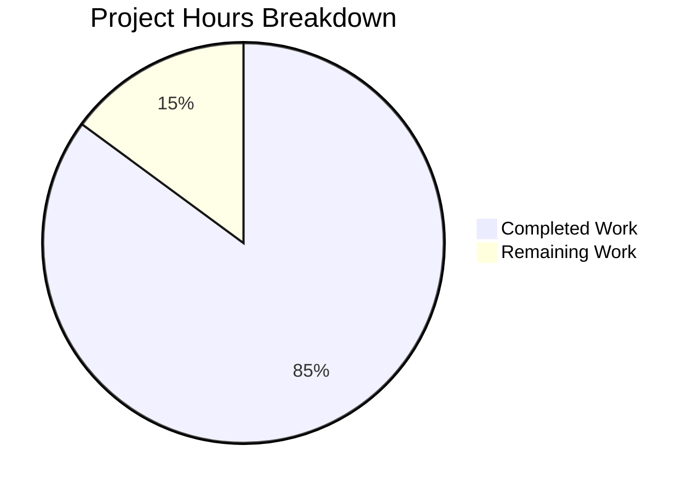
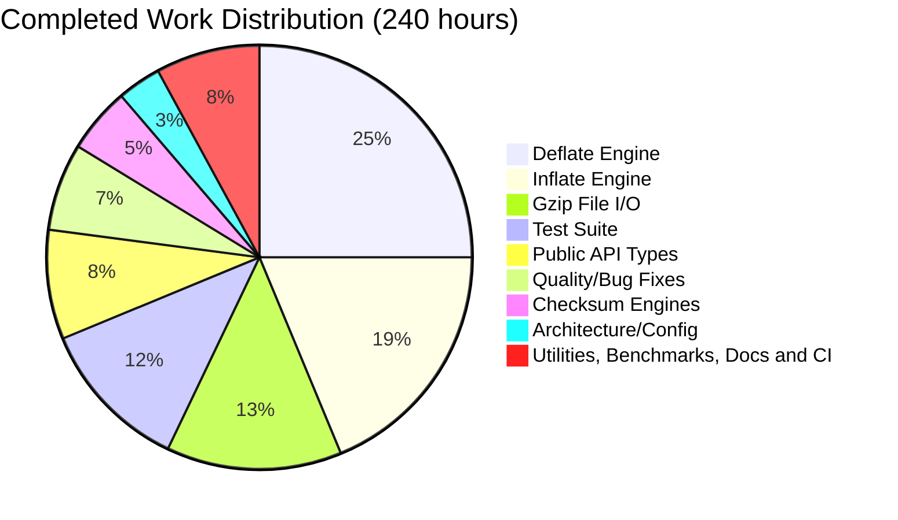

# Project Guide: zlib-rs — C-to-Rust Migration of zlib Compression Library

## 1. Executive Summary

> **How to read this document.** It has two kinds of content, and they are labelled throughout so they are
> never confused. **Historical** material — the effort estimates in Sections 3, 4 and 5, and the commit
> narrative in Section 2.1 — is an engagement snapshot preserved as planning history and deliberately *not*
> updated. **Current evidence** — Sections 1.1, 2.2, 2.3, 6, 7, 8 and 9 — is refreshed to values measured on
> this tree, each with the command that produced it. Where the two disagree, current evidence governs.

- **Project:** complete technology-stack migration of the zlib compression library from ANSI C to Rust
- **Repository:** <https://github.com/Blitzy-Sandbox/blitzy-zlib> (the `repository` field in `Cargo.toml`)
- **Historical engagement snapshot:** 240 hours completed out of 282 estimated = **85.1% complete** *(as
  recorded at the time; see Sections 3 and 4)*

The zlib-rs crate implements the complete zlib public API surface as an independent, zero-C-dependency Rust
library conforming to RFC 1950 (zlib format), RFC 1951 (DEFLATE), and RFC 1952 (gzip format). The crate
compiles cleanly in debug and release, has zero Clippy warnings under `-D warnings`, and is fully formatted.

**The C baseline is retained, not deleted.** The 15 `.c` files, 11 `.h` files, `zlib.map`, the three C test
drivers and the C build descriptors all remain in the tree, byte-for-byte untouched by the migration. They
are the cross-validation oracle and the source of the official test vectors, and they are kept out of the
published crate by `[Cargo.toml] exclude` rather than by deletion — preservation directives **D-7** and
**D-8** in `technical-specifications.md`. Section 8 quantifies this.

### 1.1 Current evidence

Every figure in this subsection was produced by the command beside it, on stable
`rustc 1.97.1` / `x86_64-unknown-linux-gnu`. `RUSTUP_TOOLCHAIN=stable` is required because
`rust-toolchain.toml` pins the repository to the MSRV 1.85.0 (Section 6.1).

| Measure | Value | Command |
|---------|-------|---------|
| Default test suite | **1039** passed, 0 failed, **0 ignored** | `RUSTUP_TOOLCHAIN=stable cargo test --locked` |
| All features | **1052** passed, 0 failed, 0 ignored | `… cargo test --locked --all-features` |
| `no_std` rows | **737** passed, 0 failed, 0 ignored (each) | `… cargo test --locked --no-default-features [--features no-std]` |
| Rust source | **40** files, **80,286** lines | `git ls-files src \| grep '\.rs$' \| xargs wc -l` |
| Integration tests | 8 files, **19,452** lines | `wc -l tests/*.rs` |
| Benchmarks | 3 files, **1,267** lines | `wc -l benches/*.rs` |
| Fuzz targets | 5 files, 8,852 lines | `wc -l fuzz/fuzz_targets/*.rs` |
| Retained C baseline | 15 `.c` + 11 `.h` = **23,107** lines, 0 modified | `cat *.c *.h \| wc -l` |
| Dependency closure | **89** root + **13** fuzz = 102 packages | `grep -c '^\[\[package\]\]' Cargo.lock fuzz/Cargo.lock` |
| Cargo features | **7** named (`std`, `gzip`, `gz-io`, `no-std`, `simd`, `inflate_strict`, `c-oracle`) plus the `default` meta-key | Section 9.2 |
| `// SAFETY:` comments | **592**, zero undocumented | `grep -rn '// SAFETY:' src \| wc -l` + Clippy (`-rc` prints per-file counts, not a total) |
| CI jobs | **12** in `ci.yml`, **4** in `audit.yml`, **1** in `fuzz.yml` | `awk '/^jobs:/{f=1;next} f&&/^[^ #]/{f=0} f&&/^  [a-z0-9_-]+:[[:space:]]*$/{n++} END{print n+0}' .github/workflows/ci.yml` |

**Provenance.** Every figure above was measured against this repository's working tree with `rustc 1.97.1 (8bab26f4f 2026-07-14)` on `x86_64-unknown-linux-gnu`, default features unless a row says otherwise. Each command in the right-hand column is exact and self-contained: running it reproduces the value in the same row. That property is the point of the column, and it is worth stating why the job-count command is shaped the way it is — the obvious shorter form `grep -cE '^  [a-z0-9-]+:'` returns 15 rather than 12, because at two-space indentation it also matches the children of the top-level `permissions:` and `concurrency:` blocks (`contents:`, `group:`, `cancel-in-progress:`). The `awk` form brackets the `jobs:` mapping specifically and therefore agrees with the `EXPECTED_JOBS` table that the `policy-integrity` job in `audit.yml` asserts on every run. Every *line count* in the table is a **dated snapshot** rather than a contract: it moves with the next test, doc comment or workflow step added, which is why the reproducing command sits beside each figure instead of behind it. The rows that must never move are the invariants — *zero failed and zero ignored* in every test row, and *0 modified* against the retained C baseline.

**Key achievements:**

- 80,286 lines of Rust across 40 `.rs` files, standing alongside — not replacing in-tree — the 23,107 lines of retained C
- Complete DEFLATE compression engine with all five block producers (stored, fast, slow, huff, rle)
- Complete DEFLATE decompression engine with a 32-mode state machine
- Adler-32 and CRC-32 checksum engines with combine operations
- Gzip file I/O with a stdio-like interface
- A C ABI boundary declaring 96 `#[unsafe(no_mangle)]` entry points — 95 emitted on Linux, since `gzopen_w` is `#[cfg(windows)]`-gated exactly as `zlib.h` gates it — each with a compile-time signature guard
- `unsafe` confined to `src/ffi/**` and one private runtime block in `src/lib.rs`; the eight core module groups measure **zero**, enforced by `#![deny(unsafe_code)]` with two scoped carve-outs
- Three Rust CI workflows in place of the six C-specific workflows that were removed (the migration's **only** deletions — Section 8.3)

**Previously-tracked open items, now resolved:**

- **`--no-default-features` test compilation.** The suite compiles and passes under both `--no-default-features` and `--no-default-features --features no-std` — **737** passed, 0 failed, 0 ignored in each.
- **`cargo-fuzz` targets.** Five targets exist under `fuzz/fuzz_targets/` (`fuzz_deflate_roundtrip`, `fuzz_inflate`, `fuzz_checksum`, `fuzz_gzip`, `fuzz_ffi_roundtrip`) with their own detached `fuzz/Cargo.toml` and `fuzz/Cargo.lock`, governed by the single root `deny.toml` (aimed at that graph with `--manifest-path fuzz/Cargo.toml --config deny.toml`) and driven by `fuzz.yml` — which already carries a **weekly** `cron: '0 3 * * 1'` schedule.
- **Byte-identity against C.** Proven by two independent mechanisms, and *not* by `flate2`: tier 1 of `tests/interop.rs` compares against deterministic vectors baked from the genuine C encoder and therefore needs **no C toolchain**, while `tests/c_oracle.rs` (opt-in, `--features c-oracle`) builds a reference library from the retained in-tree C sources and diffs live output, returning 3,750/3,750 and 50/50 byte-identical. `flate2`'s `miniz_oxide` backend is a *different* encoder, so tier 2 proves RFC wire-format interoperability only — the file says so explicitly.
- **A crate changelog.** `CHANGELOG.md` exists at the repository root.
- **Packaging verification.** `ci.yml` carries a `package-verify` job, and `cargo package --locked --list` yields 76 entries with **zero** C-baseline leakage (Section 7.3).

**Performance, stated without a target that does not exist.** No section of
`technical-specifications.md` sets a numeric throughput requirement; §0.8.3 states the opposite —
"performance is a constraint on this work, not its objective", and no optimisation may be introduced at the
cost of byte-identity. Earlier revisions of this guide cited an "≥80% of C zlib" requirement attributed to
the plan; **no such requirement exists** and it has been removed. The measured position — measured, not
attributed, by the differential harness documented in `technical-specifications.md` §0.8.3 — is compression
**113–161%** of reference C on compressible input and **82–94%** on incompressible input, `uncompress`
**101–160%**, and `inflateBack` **216–344%** on input that decodes Huffman symbols. Earlier revisions of this
guide quoted an aggregate "compression ≈ 85% / decompression 107–127%" with a per-profile inversion putting
the compressible profiles furthest from C at "58–64%"; both are retired — nothing measures in the 58–64% band
and the compressible profiles are the ones *above* parity. See Section 7.1 and
`technical-specifications.md` §0.8.3.

**Recommended next steps:**

1. Human code review and sign-off across the Rust surface — the one item no gate can supply.
2. Runtime validation on real big-endian and bare-metal *hardware*. The `cross-run` CI job now EXECUTES the suite for `s390x-unknown-linux-gnu` (big-endian), `aarch64-unknown-linux-gnu`, and 32-bit `i686-unknown-linux-gnu` under `qemu-user`, and `bare-metal-run` links the `thumbv7em-none-eabihf` staticlib into firmware and EXECUTES it on a no-OS Cortex-M4 under `qemu-system-arm`, so all of those arms are run rather than merely compiled; what remains is that every one of them is emulation rather than silicon.
3. Deflate throughput work on the **incompressible** profile, which is now the only one below C (82–94%) as well as the slowest in absolute terms — gated behind the byte-identity suite, since the heuristics that cost throughput are the heuristics that determine output bytes. An earlier revision of this list named the *compressible* profiles here; they now run at 113–161% of C and are no longer the deficit.
4. `crates.io` release governance: the name `zlib-rs` is already taken on the registry by an unrelated crate (Section 7.3), so publication requires a naming decision before anything else.

---

## 2. Validation Results Summary

### 2.1 Final Validator Accomplishments *(historical)*

> **Historical.** This records one commit from the original validation pass and is preserved as engagement
> history. It is not a description of the tree's current state; Sections 2.2 and 2.3 are.
>
> **A note on attributions.** An earlier revision pinned this work to a single named commit hash that does not
> exist in this branch's history — `git log -1 <hash>` reported "unknown revision" — so the claim was
> unverifiable. It has been removed rather than reworded, and this guide now attributes work only to what
> `git log` actually records.

A validation pass closed the last `ignore`d doc tests and added targeted unit coverage; re-verify any of it with `git log`. It converted four `ignore` doc tests into runnable ones — three in `src/inflate/back.rs` (`InflateBackInput`, `InflateBackOutput`, `inflate_back_init`) and one in `src/inflate/mod.rs` (`inflate_init`) — added 14 unit tests in `src/inflate/state.rs` covering `parse_window_bits` and `InflateState` construction, and applied a `cargo fmt` line-wrapping fix in `src/deflate/mod.rs`. That is what took the ignored-test count to zero, where it now stays.

Since that pass the tree has accumulated **83** commits on top of the migration baseline `72f8d92` — **82** of
them authored from `agent@blitzy.com`, of which **78** carry the `Blitzy Agent` name and 4 an earlier short
`agent` name, plus a single `blitzy[bot]` commit — and the verification surface has grown to **17** jobs across
three workflows: 12 in `ci.yml`, 4 in `audit.yml`, and 1 in `fuzz.yml`.

Reproduce the commit census with `git log --oneline 72f8d92..HEAD | wc -l` for the total and
`git log --format='%an <%ae>' 72f8d92..HEAD | sort | uniq -c` for the identity breakdown. This figure is quoted
against an explicit revision range rather than as a fixed property of the code, because unlike every other
number in this guide it advances by one with each commit — so a bare count with no range attached is stale the
moment it is written.

### 2.2 Gate Results *(current)*

Every command below is written as the repository's CI writes it: `--locked` where the subcommand accepts it,
and `RUSTUP_TOOLCHAIN=stable` because `rust-toolchain.toml` pins the tree to MSRV 1.85.0. Three flags do
**not** exist and must not be added — `cargo fmt --locked`, `cargo audit --locked` and
`cargo fuzz … --locked`; `cargo deny --locked` is valid.

| Gate | Status | Command and result |
|------|--------|--------------------|
| **Dependencies** | ✅ PASS | 89 packages in `Cargo.lock` (runtime closure is just `cfg-if 1.0.4` + optional `crc32fast 1.5.0`); dev-only `criterion 0.5.1`, `flate2 1.1.9`, `quickcheck 1.1.0`, `rand 0.9.4`. Plus 13 in `fuzz/Cargo.lock` |
| **Compilation** | ✅ PASS | `RUSTUP_TOOLCHAIN=stable cargo build --locked` and `--locked --release` — 0 errors, 0 warnings; `cargo bench --locked --no-run` — 4 `Executable` lines: the three Criterion harnesses plus the lib's own bench-profile test binary |
| **Linting** | ✅ PASS | `RUSTUP_TOOLCHAIN=stable cargo clippy --locked --all-targets --all-features -- -D warnings` — 0 lints. `-D warnings` promotes `missing_docs` and `undocumented_unsafe_blocks` to errors |
| **Formatting** | ✅ PASS | `RUSTUP_TOOLCHAIN=stable cargo fmt --all -- --check` — no output |
| **Tests** | ✅ PASS | **1039** passed, 0 failed, **0 ignored** (default row); **1052** with `--all-features`; **737** in each `no_std` row |
| **MSRV** | ✅ PASS | `RUSTUP_TOOLCHAIN=1.85.0 cargo build --locked` and `cargo check --locked --all-targets --all-features` — 0 errors, 0 warnings, so the floor covers every declared feature |
| **Docs** | ✅ PASS | `RUSTUP_TOOLCHAIN=stable cargo doc --locked` |
| **Supply chain** | ✅ PASS | Both `cargo deny` invocations exactly as printed in §6.6 — the root graph and the detached fuzz graph — each reporting advisories, bans, licenses and sources ok. The `--config deny.toml` and `-A` arguments are not optional: without them the root run emits two warnings and the fuzz run **fails** on `license-not-encountered` |
| **Packaging** | ✅ PASS | `cargo package --locked --list` — 76 entries, zero C-baseline leakage |
| **Byte-identity** | ✅ PASS | 50/50 smoke and **3,750/3,750** full-grid configurations byte-identical against reference C zlib 1.3.2.1-motley, via `--features c-oracle` |
| **Runtime** | ✅ PASS | Benchmarks compile and execute; integration tests exercise real round trips; the emitted `cdylib`/`staticlib` link into a C consumer and round-trip correctly |

### 2.3 Test Results Breakdown *(current)*

Reproduce the per-suite split with `RUSTUP_TOOLCHAIN=stable cargo test --locked` and read the nine
`test result:` lines; the doc-test run reports two of them, because the `compile_fail` doctest forms its own
group.

| Test suite | Tests passed | Description |
|-----------|-------------:|-------------|
| Unit tests (lib) | 867 | Inline module tests across all 40 source files |
| `tests/interop.rs` | 30 | Two-tier gate: tier 1 baked C-encoder vectors (byte-identity, no C toolchain needed), tier 2 `flate2` cross-decode (wire-format only) |
| `tests/inflate_coverage.rs` | 30 | Port of C `test/infcover.c` inflate coverage |
| `tests/checksum.rs` | 23 | Adler-32 and CRC-32 known-answer and combine tests |
| `tests/round_trip.rs` | 20 | `quickcheck` property-based round trips, each paired with a deterministic fixed-input twin |
| `tests/gzip_compat.rs` | 17 | Gzip file I/O validation (port of C `test/minigzip.c`) |
| `tests/regression.rs` | 13 | Port of C `test/example.c` regression driver |
| `tests/ffi_alloc_balance.rs` | 10 | Allocation-balance gate over the FFI engine lifecycle with caller-supplied `zalloc`/`zfree` hooks installed — asserts both the caller's heap **and** the Rust global heap return to where they started (`technical-specifications.md` §0.6.3) |
| Doc tests | 29 | 28 runnable examples + 1 `compile_fail` |
| `tests/c_oracle.rs` | 13, `--features c-oracle` only | Opt-in live C-oracle sweep; excluded from the default row so the suite needs no C toolchain |
| **Total (default row)** | **1039 passed, 0 failed, 0 ignored** | 867 unit + 143 integration + 29 doc (28 runnable + 1 `compile_fail`) |
| **Total (`--all-features`)** | **1052 passed, 0 failed, 0 ignored** | Adds the 13 `c_oracle` tests |
| **Total (each `no_std` row)** | **737 passed, 0 failed, 0 ignored** (600 unit + 110 integration + 27 doc) | `--no-default-features`, and again with `--features no-std` |

No test is `#[ignore]`d in any configuration, and none may become so.

### 2.4 Build Status (`no_std`) — resolved

**`cargo test --no-default-features` compiles and passes.** The original failure — 129 compilation errors
from test modules using `Vec`, `format!` and `String` without `alloc` imports once `std` was disabled — is
fixed: the affected modules import from `alloc` or are gated appropriately. Both
`RUSTUP_TOOLCHAIN=stable cargo test --locked --no-default-features` and the same command
`--features no-std` report **737 passed, 0 failed, 0 ignored**. `ci.yml` runs both as a dedicated blocking
`no-std-tests` job and additionally builds the crate for the bare-metal target `thumbv7em-none-eabihf` in a
`bare-metal-no-std` job.

That bare-metal build job proves the private libc-backed global allocator and abort panic handler in
`src/lib.rs` compile for a no-OS target and are crate-owned. A second job, `bare-metal-run`, then links that
staticlib into a firmware image and **executes** it on a no-OS Cortex-M4 under `qemu-system-arm` across both
std-off feature rows — which is the only way those items can be exercised at all, since `cargo test` sets
`test` and forces `panic = "unwind"` and so fails two of the three terms in that block's own `cfg`. It
confirms the allocator serves the engines, that an exhausted heap surfaces as `Z_MEM_ERROR` rather than an
abort, and that the engine recovers once memory is returned. Validation on **real silicon** remains open and
is listed as such in Section 1.1's next steps.

---

## 3. Visual Representation *(historical)*

> **Historical.** Both charts render the original 240 h / 42 h effort-estimate snapshot. They are preserved
> as planning history and are deliberately not re-estimated; current state is Section 1.1. The completed
> component slices in 3.2 sum to 240, and 240 + 42 = 282, so the arithmetic in both charts is internally
> consistent with the snapshot they depict.

### 3.1 Hours Breakdown

> **Historical snapshot — not a measurement.** Everything in Section 3 is this document's own original
> effort-estimate snapshot, retained as planning history. It is *planned*, never *measured*, and the two must
> never be blended (AAP §0.10.3). Two further cautions: the remaining-hours figure predates the work recorded
> in Sections 2, 5, 7 and 8, so it overstates what is actually outstanding; and
> `blitzy/documentation/Project Guide.md` carries a **different** snapshot on a different basis. Do not merge
> the two, average them, or cite one as corroborating the other. For current facts, use
> [Section 8.5](#85-rust-code-metrics), which is measured throughout.



**Calculation (historical):** 240 hours completed / (240 + 42) total hours = **85.1% complete** on the
original estimate basis.

> Both charts in this section plot **this document's own historical effort estimate**, on its own basis. They are planning figures, not measurements, and they must never be averaged with or silently replaced by the differently-scoped snapshot carried in the engagement material under `blitzy/documentation/`. Every *measured* claim in this guide lives in Sections 2, 6.8, 8.4, and 9.

### 3.2 Completed Hours by Component

The same caveat applies: these are estimate-basis hours, not measured effort. The per-component **line
counts** that correspond to these rows *are* measured, and live in
[Section 4.1](#41-completed-hours-calculation) and [Section 9.1](#91-source-module-breakdown).



---

## 4. Detailed Completion Analysis

### 4.1 Completed Hours Calculation

> **Mixed content, by design.** The **Hours** column is the original effort-estimate snapshot and is
> *historical*: it sums to 240 h and is retained for planning history. The **Files** and **Lines** columns are
> *current*, refreshed to values measured on this tree, so the columns describe different points in the
> timeline. The **seven** `src/` component rows sum exactly to 40 files and 80,286 lines; the Test, Benchmark,
> Architecture, Documentation, CI/CD and Fuzzing rows are outside `src/` and are excluded from that total.
> Section 8.5 is the authoritative code-metrics summary.

| Component | Files | Lines | Hours | Rationale |
|-----------|-------|------:|-------|-----------|
| Deflate Engine | 9 files (`src/deflate/`) | 11,622 | 60h | 5 block producers, state machine, hash chains, Huffman trees — most complex module |
| Inflate Engine | 6 files (`src/inflate/`) | 12,047 | 45h | 32-mode state machine, fast-path decode loop, callback API, Huffman table builder |
| Gzip File I/O | 6 files (`src/gz/`) | 11,386 | 32h | stdio-like interface: open/read/write/close/seek with the LOOK/COPY/GZIP pipeline |
| FFI Boundary | 7 files (`src/ffi/`) | 31,067 | — | `#[unsafe(no_mangle)] extern "C"` drop-in shims + `#[repr(C)]` mirrors; the sole `unsafe` module (effort folded into the Public API Types and Quality rows) |
| Public API Types | 5 files (`lib.rs`, `error.rs`, `constants.rs`, `stream.rs`, `gz_header.rs`) | 9,890 | 20h | Foundational types, error handling, streaming interface, version constants |
| Checksum Engines | 3 files (`src/checksum/`) | 2,549 | 12h | Adler-32 with combine, CRC-32 with combine/gen/op over `build.rs`-generated tables |
| Utilities | 4 files (`src/util/`) | 1,725 | 6h | `compress`/`uncompress` wrappers, `zutil.h` internals, version and compile flags |
| **Subtotal (`src/` only)** | **40 `.rs`** | **80,286** | — | The **seven** rows above, which sum exactly: 11,622 + 12,047 + 11,386 + 31,067 + 9,890 + 2,549 + 1,725. This is the figure Section 9.1's tree reproduces |
| Test Suite | 8 files (`tests/`) | 19,452 | 28h | Ports of C `test/example.c`, `infcover.c`, `minigzip.c`, plus property tests, the two-tier interop gate, the FFI allocation-balance gate, and the opt-in `c_oracle` sweep |
| Quality & Debugging | — | — | 16h | Blitzy Agent commits: formatting, Clippy compliance, `// SAFETY:` documentation, bug fixes |
| Architecture/Config | `Cargo.toml`, `build.rs`, `rust-toolchain.toml`, `deny.toml`, `clippy.toml`, `rustfmt.toml`, `.cargo/config.toml`, `.gitignore` | 4,570 | 8h | Manifest, CRC table generation, feature flags, profiles, lint/format/supply-chain policy |
| Benchmarks | 3 files (`benches/`) | 1,267 | 6h | Criterion deflate/inflate/checksum throughput, including the incompressible profile |
| Documentation | `README.md`, `CHANGELOG.md`, `CONTRIBUTING.md`, `SECURITY.md`, `doc/index.md`, `docs/index.md` | 5,197 | 6h | Crate docs, release history, contribution workflow, disclosure policy, published landing pages. This row deliberately **excludes** `doc/technical-specifications.md` and this file: a page cannot stably state its own length, so quoting one guarantees a stale number. This row and the Architecture/Config row above are the two most volatile figures in this guide — any prose or policy commit moves them — which is why `ci.yml`'s `docs` job recomputes both and fails on a mismatch rather than leaving them to be noticed |
| CI/CD | `ci.yml`, `audit.yml`, `fuzz.yml` | 7,209 | 1h | 14-job Rust CI pipeline, 4-job supply-chain audit, 1-job `cargo-fuzz` workflow. `mkdocs.yml` (93 lines) is documentation tooling rather than CI and is counted in neither row |
| Fuzzing | 5 targets (`fuzz/fuzz_targets/`) + `fuzz/{Cargo.toml,Cargo.lock}` | 9,143 | — | Detached libFuzzer workspace, carrying no policy file of its own (effort folded into the Quality row). The single root `deny.toml` governs that 13-package graph as well as the 89-package root graph, so the two invocations of one policy together cover the 102-package closure — see Section 9.2 |
| **Historical hours total** | — | — | **240h** | Spans every component; see Section 3 |

### 4.2 Remaining Hours Calculation *(historical)*

> **Historical.** This is the original effort-estimate snapshot, retained unchanged. Seven of its eleven rows
> have since been completed: `no_std` test compilation and its CI fixes, fuzz target creation, performance
> benchmarking, byte-identical compression verification, the unsafe-code audit, and crates.io publication
> *preparation* (Sections 1.1, 2.2, 2.4 and 5 give the current status of each). The hour figures are **not**
> re-estimated — treat the table as a record of what was planned, not of what is left.

The original estimate distributed the **42 remaining hours** as: no_std test compilation 3h and the matching CI steps 1h (High priority, High confidence); performance benchmarking against C zlib 8h and byte-identical compression verification 6h (High, Medium); fuzz-target creation 3h (Medium, High); unsafe-code security audit 3h, no_std integration testing 3h and production edge-case hardening 4h (Medium, Medium); documentation refinement 2h and `crates.io` publication preparation 2h (Low, High); plus a 7h enterprise buffer applying a 1.10 × 1.10 compliance-and-uncertainty factor.

Everything on that list except the human half of the security audit, real-hardware no_std validation, edge-case hardening and the publish flow itself has since landed — which is exactly why Section 5, not this table, is the list to work from.

---

## 5. Detailed Task Table for Human Developers

> The **Hours** column belongs to the historical snapshot of Section 4.2. The **Status** column is current.

| # | Task | Current status | Action steps | Hours | Status |
|---|------|----------------|--------------|-------|--------|
| 1 | `no_std` test compilation | Resolved. Test modules import from `alloc` or are gated; both `--no-default-features` and `--no-default-features --features no-std` report **737 passed, 0 failed, 0 ignored**. | Complete — no further action. | 0h | ✅ Resolved |
| 2 | CI pipeline for `no_std` tests | Resolved. `ci.yml` runs a dedicated blocking `no-std-tests` job over both configurations, plus a `bare-metal-no-std` job that builds for `thumbv7em-none-eabihf`, and a `bare-metal-run` job that links that staticlib into firmware and executes it on a no-OS Cortex-M4 under `qemu-system-arm`. It also runs a `cross-run` job that executes the suite for `aarch64`, 32-bit `i686` and big-endian `s390x` under `qemu-user`, including both std-off rows. | Complete — no further action. | 0h | ✅ Resolved |
| 3 | Performance benchmarking vs C zlib | Done, and it corrected a misconception. **There is no numeric throughput requirement anywhere in `technical-specifications.md`** — §0.8.3 states that performance is a constraint on the work, not its objective. An earlier revision of this guide attributed an "≥80% of C" requirement to the plan; that requirement was invented and has been removed. Attributed measured position: compression ≈ 85%, decompression 107–127% of C. Per profile the ordering *inverts* the intuitive reading — incompressible input is **closest** to C (~82–86%) and compressible input **furthest** (~58–64%). | Optional follow-up: profile the *compressible* paths — hash-chain traversal and `longest_match` in `deflate_slow` — and gate any change behind the byte-identity suite. | 8h | ✅ Done |
| 4 | Byte-identical compression verification | Done. `technical-specifications.md` §0.8.1 directive **D-1** requires byte-identical output for the same input × level × strategy × `windowBits` × `memLevel`. Verified by tier 1 of `tests/interop.rs` (baked C-encoder vectors, no C toolchain required) and by `tests/c_oracle.rs` under `--features c-oracle`, which compiles a reference library from the retained in-tree C sources and diffs live output: **3,750/3,750** and **50/50** byte-identical. `flate2` does **not** establish this — it is a different encoder and only proves wire-format interoperability. | Complete. Re-run `cargo test --locked --features c-oracle` after any change under `src/deflate/**`. | 6h | ✅ Done |
| 5 | `cargo-fuzz` targets | Resolved. Five targets under `fuzz/fuzz_targets/` in a detached workspace with its own `Cargo.toml` and `Cargo.lock` but **no policy file of its own** — the single root `deny.toml` governs this 13-package graph as well, aimed at it by `audit.yml`'s `cargo-deny-fuzz` job with `--manifest-path fuzz/Cargo.toml --config deny.toml`; `fuzz.yml` builds all five and runs each on a **weekly** `cron: '0 3 * * 1'`, alongside `pull_request` and `workflow_dispatch` triggers. | None. The two former follow-ups have both landed: each target now has its own `actions/cache` step keyed `fuzz-corpus-<target>-${{ github.run_id }}` with prefix-matching `restore-keys`, so corpora persist across runs and any crash input is preserved by an `actions/upload-artifact` step; and the budget is now `MAX_TOTAL_TIME` — **120 s** per target on pull requests, **600 s** on schedule or manual dispatch. | 0h | ✅ Resolved |
| 6 | Unsafe code security audit | Structurally complete; human sign-off outstanding. `unsafe` is confined to `src/ffi/**` and one private runtime block in `src/lib.rs`, and confinement is a **hard compile error** — `#![deny(unsafe_code)]` crate-wide with exactly two `#[allow(unsafe_code)]` carve-outs, plus a dedicated `unsafe-boundary` CI job. The eight core module groups measure **zero**. All **592** `// SAFETY:` comments are present and `clippy::undocumented_unsafe_blocks` is clean under `-D warnings`. Section 8.5 gives the counts and the exact counting method. | 1. Human review of each `unsafe` site and its `// SAFETY:` invariant 2. Keep the boundary job blocking 3. Continue fuzzing the FFI round trip | 3h | ⚠️ Human review |
| 7 | `no_std` integration testing on hardware | Partially open. Hosted `no_std` passes 737 tests, and the bare-metal target now both **builds** and **runs**: `bare-metal-run` executes it on an emulated no-OS Cortex-M4, exercising the private libc-backed allocator, the fallible-allocation path (`Z_MEM_ERROR` rather than an abort on an exhausted heap) and the gzip feature gate in both directions. What is still unproven is behaviour on a real device — emulation reproduces the ISA, not the silicon. | 1. Flash the `thumbv7em-none-eabihf` build to a real device 2. Exercise compress/decompress/checksum with the caller-hook allocator 3. Confirm the abort panic handler behaves as intended on silicon | 3h | ⚠️ Open |
| 8 | Production edge-case hardening | Largely covered by the suite: `tests/inflate_coverage.rs` (**30** tests, one of them gated on the `gzip` feature so 29 run under `--no-default-features`) ports C `test/infcover.c`'s malformed-stream table, `compress_bound` is verified against the C formula including the saturating-overflow path, and the flush modes and preset dictionaries are exercised by `tests/regression.rs` and `tests/round_trip.rs`. | Remaining: adversarial-input soak time via the fuzz corpus rather than new unit tests. | 4h | ✅ Largely done |
| 9 | Documentation refinement | Done for the mechanical part: **29** doc tests run in the default row (28 runnable + 1 `compile_fail`), `cargo doc --locked` exits 0, `missing_docs` is an error under `-D warnings`, and the MkDocs site builds under `--strict`. | Remaining: editorial review. | 2h | ✅ Largely done |
| 10 | `crates.io` publication preparation | Verification done; **publication blocked on a naming decision**. `cargo package --locked --list` yields **76** entries with **zero** C-baseline leakage — no `.c`, `.h`, `zlib.map`, `test/`, `contrib/`, `examples/` or legacy platform file appears. The remaining non-Rust entries are the crate's own project files (workflows, `LICENSE`, `README.md`, `CHANGELOG.md`, `CONTRIBUTING.md`, `SECURITY.md`, the policy TOMLs, `mkdocs.yml`, and the three `doc/` pages), which is intended. The blocker is that **`zlib-rs` is already published on crates.io by an unrelated project** — see Section 7.3. | 1. Decide the published name 2. `cargo publish --dry-run` 3. Confirm metadata (description, license `Zlib`, categories, keywords) | 2h | ⚠️ Blocked |
| 11 | Enterprise buffer (compliance + uncertainty) | Historical line item: a 1.10 × 1.10 multiplier on the subtotal of tasks 1–10 (35h × 1.21 ≈ 42h). | — | 7h | — |
| | **Historical total** | | | **42h** | |

---

## 6. Development Guide

### 6.1 System Prerequisites

| Requirement | Version | Purpose |
|------------|---------|---------|
| Rust toolchain | 1.85.0 (MSRV) **and** current stable | `rust-toolchain.toml` pins the repository to 1.85.0, the release in which `edition = "2024"` became available. Thirteen of the fourteen `ci.yml` jobs run on stable, so both are needed |
| Cargo | bundled with each toolchain | Build system |
| `rustup` | 1.27+ | Needed to hold both toolchains and to honour `rust-toolchain.toml` |
| Git | 2.x+ | Version control |
| OS | Linux, macOS, or Windows | CI runs native Ubuntu, Windows and macOS rows |
| C compiler | **optional** | Needed **only** for the opt-in `--features c-oracle` sweep. The default test suite deliberately requires no C toolchain |

**The toolchain pin is the single most common source of confusion.** `rust-toolchain.toml` sets
`channel = "1.85.0"`, so a bare `cargo <cmd>` inside this repository runs the **MSRV** compiler, not stable.
Prefix stable gates with `RUSTUP_TOOLCHAIN=stable` — exactly what CI does — and use
`RUSTUP_TOOLCHAIN=1.85.0` only for the MSRV job:

```sh
rustup show active-toolchain
# 1.85.0-x86_64-unknown-linux-gnu (overridden by '<repo>/rust-toolchain.toml')
```

### 6.2 Environment Setup

```sh
# 1. Install rustup and the two toolchains this repository needs.
#
#    If your distribution packages rustup, prefer that — it is verified by the
#    package manager's own signatures (e.g. `apt-get install -y rustup`,
#    `dnf install -y rustup`, `brew install rustup`). Otherwise download the
#    installer, INSPECT it, and only then execute it. Do not pipe it straight
#    into a shell: `curl … | sh` executes whatever the endpoint returns, with no
#    opportunity to see it and no integrity check beyond TLS, so a compromised
#    endpoint or a proxy that can present a trusted certificate runs arbitrary
#    code as your user.
curl --proto '=https' --tlsv1.2 -fsSL https://sh.rustup.rs -o rustup-init.sh
sha256sum rustup-init.sh                # record it; compare across two networks
less rustup-init.sh                     # read what you are about to run
sh ./rustup-init.sh -y                  # run only after the two steps above
rm -f rustup-init.sh
. "$HOME/.cargo/env"
rustup toolchain install stable 1.85.0
rustup component add clippy rustfmt --toolchain stable

# 2. Clone the repository. Substitute the URL you actually clone from; the
#    canonical one is the `repository` field in Cargo.toml.
git clone https://github.com/Blitzy-Sandbox/blitzy-zlib.git
cd blitzy-zlib

# 3. Stay on the repository's default branch. Do NOT check out a historical
#    per-engagement branch: those are migration working branches, they are not
#    maintained, and Section 8.1 records them only as history.
git rev-parse --abbrev-ref HEAD

# 4. Confirm the pin took effect (this must report 1.85.0, not stable).
rustup show active-toolchain
```

> The MSRV pin is deliberate and load-bearing: it means an accidental use of a newer language feature fails
> locally instead of only in the `msrv` CI job. Every command in the sections below shows the
> `RUSTUP_TOOLCHAIN=stable` prefix where the stable toolchain is the intended one.

> **Trust boundary in step 1.** `rustup-init.sh` is a third-party bootstrap script fetched over the
> network, and the project publishes no independent checksum for it — there is nothing to verify it
> *against*, which is precisely why the recommendation is to read it before running it or to let a
> package manager vouch for it. Everything after that step is verifiable from inside the repository:
> `rust-toolchain.toml` pins the compiler channel, both lockfiles pin every dependency, and every
> build command carries `--locked`, so no later step depends on trusting an unauthenticated download.

### 6.3 Dependency Installation

```sh
# Cargo resolves dependencies on first build. To pre-fetch them, honouring the
# committed lockfile exactly:
RUSTUP_TOOLCHAIN=stable cargo fetch --locked

# Expected: 89 packages from Cargo.lock. The RUNTIME closure is only two crates,
# and one of them is optional:
#   cfg-if 1.0.4                  always
#   crc32fast 1.5.0               only with the `simd` feature
# Dev-only: criterion 0.5.1, flate2 1.1.9 (pure-Rust miniz_oxide backend, so no
# C toolchain), quickcheck 1.1.0, rand 0.9.4.
# The detached fuzz workspace has its own 13-package fuzz/Cargo.lock.

# `--locked` is not optional here: it makes the build reproducible and fails
# loudly rather than silently rewriting Cargo.lock.
```

The shape of that closure matters more than its size:

- **The runtime closure is two crates.** `cfg-if` replaces the C `#if`/`#ifdef` preprocessor nests, and `crc32fast` is `optional`, reached only through the `simd` feature and declared `default-features = false` so it stays `no_std`-compatible. `crc32fast` itself pulls only `cfg-if`. Keeping this minimal is the *zero-C-dependency rule*: a memory-safety replacement for `libz` that dragged in a large transitive graph would trade one class of risk for another.
- **No C toolchain is required to test.** `flate2`'s **default** features select the pure-Rust `miniz_oxide` backend; its `zlib` and `zlib-ng` C backends are intentionally left disabled. Any claim that the dev-dependencies use a C backend is false.
- **Four duplicate majors coexist, and they are not defects:** `getrandom` 0.3.4/0.4.3, `r-efi` 5.3.0/6.0.0, `rand` 0.9.4/0.10.2, `rand_core` 0.9.5/0.10.1. `deny.toml` acknowledges **all four** by exact version — `rand@0.10.2`, `rand_core@0.10.1`, `getrandom@0.4.3`, `r-efi@6.0.0` — naming the *transitive* copy in each case, so a future bump surfaces as `warning[unmatched-skip]` rather than a silently widened exemption. `r-efi` needs an entry precisely *because* `[graph] targets` is deliberately empty: with no triple filter to prune it, both `r-efi` majors stay in the graph and the duplication has to be waived in writing rather than hidden behind a platform list. `skip-tree` is empty for the same reason — a subtree waiver would widen silently as the tree changes.
- **The `rand` split is the one worth internalising.** `rand 0.9.4` is the **direct** dev-dependency, pinned at or above 0.9.4 to stay clear of the patched range for **RUSTSEC-2026-0097** (a dev-dependency-only advisory). `rand 0.10.2` arrives **transitively via `quickcheck 1.1.0`**, so `cargo tree -i rand` fails with *"specification 'rand' is ambiguous"* and lists both. The declared floor therefore governs only the direct path — precisely the drift the `cargo-audit` / `cargo-deny` gate exists to catch.
- **The fuzz workspace is detached.** `fuzz/` carries its own `[workspace]` table, so root `cargo build`/`test`/`clippy`/`fmt` never touch it. It declares just `libfuzzer-sys` and `zlib-rs { path = ".." }` — the only path dependency in the project — and is the **only** place a C toolchain enters any dependency graph (`cc`, `jobserver`, `shlex`, `find-msvc-tools`). The crate proper needs none and must continue to need none.
- **Both lockfiles are committed deliberately**, because the crate ships `cdylib`/`staticlib` distributables. `cargo build --offline` succeeds on a warm index and `git status --porcelain Cargo.lock` stays empty afterwards, confirming nothing is silently rewritten. Use `--locked` and the lock cannot drift under you.

### 6.4 Build Commands

```sh
# Debug build.
RUSTUP_TOOLCHAIN=stable cargo build --locked
# Finished `dev` profile [unoptimized + debuginfo]

# Release build (opt-level 3, one codegen unit, panic = "abort" in BOTH profiles).
RUSTUP_TOOLCHAIN=stable cargo build --locked --release
# Emits target/release/libzlib_rs.{rlib,so,a}

# Compile the benchmarks without running them.
RUSTUP_TOOLCHAIN=stable cargo bench --locked --no-run
# 4 `Executable` lines: the three Criterion harnesses (checksum_bench,
# deflate_bench, inflate_bench) plus `benches src/lib.rs` — the lib's own
# implicit bench target, which exists because `[lib] bench` is not disabled.

# MSRV verification, mirroring the ci.yml `msrv` job. The `--all-features` on the
# check is what extends the floor's guarantee to the optional feature rows
# (`inflate_strict`, `c-oracle`), which a default-feature check never compiles.
RUSTUP_TOOLCHAIN=1.85.0 cargo build --locked
RUSTUP_TOOLCHAIN=1.85.0 cargo check --locked --all-targets --all-features
```

> **`target/release/libzlib_rs.{a,so,rlib}` is one shared path across every feature row** — the last
> `cargo build --release <features>` wins. Rebuild with the intended features immediately before linking a C
> consumer, or give each feature row its own `CARGO_TARGET_DIR`.

### 6.5 Running Tests

```sh
# Everything: unit + integration + doc tests.
RUSTUP_TOOLCHAIN=stable cargo test --locked
# 1039 passed, 0 failed, 0 ignored

# Adds the 13 opt-in live C-oracle tests (needs a C compiler).
RUSTUP_TOOLCHAIN=stable cargo test --locked --all-features
# 1052 passed, 0 failed, 0 ignored

# The two no_std rows.
RUSTUP_TOOLCHAIN=stable cargo test --locked --no-default-features
RUSTUP_TOOLCHAIN=stable cargo test --locked --no-default-features --features no-std
# 737 passed, 0 failed, 0 ignored in each

# Slices of the default row.
RUSTUP_TOOLCHAIN=stable cargo test --locked --lib     # 867 unit tests
RUSTUP_TOOLCHAIN=stable cargo test --locked --tests   # 867 lib + 143 integration = 1010
RUSTUP_TOOLCHAIN=stable cargo test --locked --doc     # 29 (28 runnable + 1 compile_fail)

# One suite at a time.
RUSTUP_TOOLCHAIN=stable cargo test --locked --test regression        # port of C test/example.c
RUSTUP_TOOLCHAIN=stable cargo test --locked --test checksum          # Adler-32 / CRC-32
RUSTUP_TOOLCHAIN=stable cargo test --locked --test round_trip        # quickcheck round trips
RUSTUP_TOOLCHAIN=stable cargo test --locked --test interop           # two-tier byte-identity gate
RUSTUP_TOOLCHAIN=stable cargo test --locked --test gzip_compat       # port of C test/minigzip.c
RUSTUP_TOOLCHAIN=stable cargo test --locked --test inflate_coverage  # port of C test/infcover.c
RUSTUP_TOOLCHAIN=stable cargo test --locked --features c-oracle --test c_oracle
```

**No test is ever `#[ignore]`d.** The ignored count is zero in every feature row and stays zero by policy; a
test that cannot run in a configuration is compiled out or skips with a printed notice, so a skipped case is
visible in the log rather than hidden behind an `ignored` tally.

### 6.6 Linting and Formatting

```sh
# Clippy, exactly as CI runs it. --all-features matters: it is what brings the
# c_oracle target into the lint graph. -D warnings promotes `missing_docs` and
# `clippy::undocumented_unsafe_blocks` to hard errors.
RUSTUP_TOOLCHAIN=stable cargo clippy --locked --all-targets --all-features -- -D warnings

# Formatting. NOTE: `cargo fmt` does NOT accept --locked -- it is a rustfmt
# wrapper, and passing the flag fails with `unexpected argument '--locked'`.
RUSTUP_TOOLCHAIN=stable cargo fmt --all -- --check

# Auto-format.
RUSTUP_TOOLCHAIN=stable cargo fmt --all

# Supply-chain policy, exactly as `audit.yml` runs it. `cargo deny` DOES accept
# --locked, and needs no toolchain override because it is a standalone binary.
# ONE policy, two graphs -- cargo-deny resolves one graph per run, so both lines
# name the same `deny.toml`. `--config` is explicit on both so the policy in force is
# never in doubt, and it is MANDATORY on the second: cargo-deny otherwise resolves
# config from the target manifest's workspace root, finds nothing there (the fuzz
# workspace holds no policy), and judges those 13 packages against built-in defaults.
# Each -A code covers entries that cannot match on the graph being checked, and every
# one stays at full severity on the other invocation.
cargo deny --locked --config deny.toml check \
  -A unused-wrapper -A license-exception-not-encountered
cargo deny --locked --manifest-path fuzz/Cargo.toml --config deny.toml check \
  -A license-not-encountered -A unmatched-skip -A unnecessary-skip

# RustSec advisories over both lockfiles. NOTE: `cargo audit` has no --locked
# flag -- it reads a lockfile directly, selected with --file.
cargo audit --deny warnings
cargo audit --deny warnings --file fuzz/Cargo.lock
```

`clippy.toml` and `rustfmt.toml` pin the tool configuration so behaviour does not depend on unpinned defaults (gap **D11**), and `rustfmt.toml` sets `style_edition = 2024` to match the crate's edition. Both the `lint` and `msrv` jobs additionally assert that `rustup show active-toolchain` resolved to the channel they asked for, because `rust-toolchain.toml` otherwise wins; `msrv` pins `dtolnay/rust-toolchain@1.85.0` and runs `cargo +1.85.0 build --locked --verbose` plus `cargo +1.85.0 check --locked --verbose --all-targets --all-features`, so the floor is proven for every feature the manifest declares rather than for the default set alone.

### 6.7 Running Benchmarks

```sh
# All three Criterion harnesses.
RUSTUP_TOOLCHAIN=stable cargo bench --locked

# One at a time.
RUSTUP_TOOLCHAIN=stable cargo bench --locked --bench deflate_bench
RUSTUP_TOOLCHAIN=stable cargo bench --locked --bench inflate_bench
RUSTUP_TOOLCHAIN=stable cargo bench --locked --bench checksum_bench

# The three-profile deflate comparison discussed in Section 7.1, with a short
# budget so it finishes quickly.
RUSTUP_TOOLCHAIN=stable cargo bench --locked --bench deflate_bench -- \
  'deflate_profiles' --warm-up-time 1 --measurement-time 3 --sample-size 20
```

All three targets are `criterion`-driven with `harness = false`, every case validates its own output before it is timed (one untimed round trip asserting exact length and byte-for-byte equality, which Criterion never folds into a sample), and the harness links **no** C library — so every number it prints is a Rust-only figure. Between them the three targets register **43** cases:

| Target | Groups | Cases |
|--------|--------|------:|
| `deflate_bench` | `deflate_levels/<0..9>`, `deflate_profiles/level6/{text,repetitive,incompressible}`, `deflate_incompressible_guard/{1,6,9}`, `deflate_tuning/mem_level/{1,8,9}`, `deflate_tuning/window_bits/{-15,9,15,31}`, `deflate_tuning/strategy/{default,filtered,huffman_only,rle,fixed}` | 28 |
| `inflate_bench` | `inflate_by_level/{1,6,9}`, `inflate_by_profile/level6/{text,repetitive,incompressible}`, `inflate_back_by_profile/level6/{text,repetitive,incompressible}` | 9 |
| `checksum_bench` | `adler32/<size>`, `crc32/<size>` | 6 |

Three of those groups exist because their absence had been concealing a real regression that no gate could see. `deflate_tuning` covers `memLevel`, `windowBits` and non-default strategies, none of which `compress2` can reach (it hard-codes `windowBits = 15`, `memLevel = 8` and the default strategy). `inflate_by_profile`'s `repetitive` case drives the short-distance overlapping-copy path that neither `text` nor `incompressible` reaches. `inflate_back_by_profile` drives the separate `infback.c` decoder, which no case reached at all.

`deflate_bench` keeps an explicit **incompressible-input** guard, and the reason is now simpler than it was: per Section 7.1 that profile is both the slowest workload in absolute terms *and* the only one below reference C, at 82–94%. An earlier revision of this guide had it the other way round — "incompressible **closest** to C at ≈ 82–86% and the compressible profiles **furthest** at ≈ 58–64%" — and that inversion is retired: the compressible profiles now measure 113–161% and nothing measures in the 58–64% band. The mechanism is that incompressible input pays for one *failed* match-finder search per literal with no long match to amortise it over — `longest_match`'s two-byte prefilter rejects almost every candidate before the comparison loop and `_tr_flush_block` selects stored blocks because a dynamic tree cannot pay for itself — so throughput there is set almost entirely by per-literal bookkeeping.

C-relative percentages do **not** come from this folder, which links no C library and can therefore express no ratio; they come from the out-of-tree differential harness documented in `technical-specifications.md` §0.8.3, which links one C driver against a reference `libz` and against this crate's `staticlib` in turn and interleaves the two sides. CI's `benches` job runs `cargo +stable bench --no-run` only — a compile gate, never a measurement, since a shared runner cannot produce trustworthy timings. `RUSTUP_TOOLCHAIN=stable cargo bench --locked -- --test` executes all 43 cases once each and is the cheap way to prove the set still runs.

### 6.8 Verification Steps

The repository's blocking gates, in the order CI runs them. All eight must pass.

1. **Build** — `RUSTUP_TOOLCHAIN=stable cargo build --locked` and `--locked --release`: 0 errors, 0 warnings
2. **Tests** — `RUSTUP_TOOLCHAIN=stable cargo test --locked`: **1039** passed, 0 failed, **0 ignored**
3. **`no_std`** — both `--no-default-features` rows: **737** passed each
4. **Clippy** — `RUSTUP_TOOLCHAIN=stable cargo clippy --locked --all-targets --all-features -- -D warnings`: 0 lints
5. **Formatting** — `RUSTUP_TOOLCHAIN=stable cargo fmt --all -- --check`: no output
6. **Docs** — `RUSTUP_TOOLCHAIN=stable cargo doc --locked`: exit 0
7. **MSRV** — `RUSTUP_TOOLCHAIN=1.85.0 cargo build --locked` and `cargo check --locked --all-targets --all-features`
8. **Supply chain** — both `cargo deny` invocations exactly as printed in §6.6 (root graph, then `--manifest-path fuzz/Cargo.toml`): advisories, bans, licenses, sources all ok. Copy them verbatim — dropping `--config deny.toml` or the `-A` codes changes the result

No warning may be downgraded, no lint `allow`-ed, and no test `#[ignore]`d to make a change land.

### 6.9 Example Usage

The one-call API mirrors C's: **the caller owns the destination buffer**, `compress_bound` sizes it for the
worst case, and the return value is the number of bytes actually produced. This example compiles and runs
against the crate as written.

```rust
use zlib_rs::{ReturnCode, compress2, compress_bound, uncompress};

fn main() -> Result<(), ReturnCode> {
    let data = b"Hello, zlib-rs! This is a compression test.";

    // Size the destination for the worst case, compress, then trim to what
    // was actually written.
    let mut compressed = vec![0u8; compress_bound(data.len())];
    let n = compress2(&mut compressed, data, 6)?;
    compressed.truncate(n);

    // Decompression is symmetric: the caller sizes `restored`, and the return
    // value is the produced length.
    let mut restored = vec![0u8; data.len()];
    let m = uncompress(&mut restored, &compressed)?;
    restored.truncate(m);

    assert_eq!(restored.as_slice(), data.as_slice());
    println!("round trip: {} bytes -> {} bytes -> {} bytes", data.len(), n, m);
    Ok(())
}
```

Running it prints `round trip: 43 bytes -> 49 bytes -> 43 bytes`. The compressed form being *larger* is
correct and not a bug: 43 bytes of varied English text carry almost no exploitable redundancy, so the
DEFLATE stream plus the two-byte zlib header and four-byte Adler-32 trailer exceed the input. This is why
`compress_bound` exists and why sizing the destination from it rather than from the input length matters.

Two notes for anyone adapting the example:

- `compress(dest, source)` is the same call with the level fixed to `Z_DEFAULT_COMPRESSION` (`-1`, which
  resolves to 6). It takes **two** arguments — a destination slice and a source slice — not a source and a
  level.
- For streaming, dictionaries, or `windowBits` overloading, reach the engines directly through
  `zlib_rs::deflate::{deflate, deflate_end, deflate_init2}` and the matching `zlib_rs::inflate` items, with
  the constants from `zlib_rs::constants`. C consumers should use the `ffi` module instead; it is
  deliberately not re-exported at the crate root.

### 6.10 Troubleshooting

| Symptom | Cause | Resolution |
|---------|-------|------------|
| A bare `cargo build`/`cargo test` uses 1.85.0 and a stable-only lint fires differently than in CI | `rust-toolchain.toml` pins `channel = "1.85.0"` | Expected, not a fault. Prefix stable gates with `RUSTUP_TOOLCHAIN=stable` (Section 6.1) |
| `error: unexpected argument '--locked' found` from `cargo fmt` | `cargo fmt` is a rustfmt wrapper and takes no Cargo resolution flags. The same is true of `cargo audit` and `cargo fuzz` | Drop the flag: `RUSTUP_TOOLCHAIN=stable cargo fmt --all -- --check`. `cargo deny --locked` **is** valid |
| `cargo install cargo-deny` / `cargo-audit` fails with a `rustc 1.85.0` version error | Both tools require Rust 1.88+ to *build*, above this repository's MSRV pin | Build them with a newer toolchain — `cargo +stable install cargo-deny --locked` — then run the resulting binary against this repository normally |
| Linking a C consumer picks up the wrong feature set | `target/release/libzlib_rs.{a,so,rlib}` is one shared path; the last `--release` build wins | Rebuild with the intended features immediately before linking, or set a distinct `CARGO_TARGET_DIR` per row |
| A hand-written `rustc` example fails with *"requires panic strategy `abort`"* | Both Cargo profiles set `panic = "abort"`, which cannot link into an unwinding binary | Add `-C panic=abort` to the `rustc` invocation, or drive the example through `cargo` |
| `cargo test --features c-oracle` fails to build the oracle | No C compiler on `PATH`; the oracle compiles the in-tree `*.c` baseline | Install a C compiler, or simply omit the feature — the 1039-test default row is deliberately C-free |
| Compression benchmarks look slow on incompressible input | Real and expected: incompressible data defeats the match finder, so absolute throughput is lowest there | Not a defect and not a regression. Incompressible is the **slowest absolute** profile *and simultaneously the closest to C* — see Section 7.1. Any "fix" must clear the byte-identity gate first |
| `cargo test --no-default-features` fails | Historical: test modules once missed their `alloc` imports | Resolved. Both `no_std` rows compile and pass at 737 tests each |
| `cargo fuzz build` fails | Historical: no fuzz targets existed | Resolved. Five targets live under `fuzz/fuzz_targets/` in a detached workspace with its own lockfile; `cargo fuzz` needs the **nightly** toolchain |

---

## 7. Risk Assessment

Severities below are **current**, and every "Resolved" row names the evidence that closed it rather than
asserting closure. Rows that remain open are open because they need judgement or hardware, not because a
command has not been run.

### 7.1 Technical Risks

| Risk | Current severity | Impact if it materialises | Standing control |
|------|------------------|---------------------------|------------------|
| Compression output diverges from reference C zlib | **Resolved, continuously gated** | Any consumer that hashes or diffs compressed artifacts would see a change | Two-tier gate. Tier 1 (`tests/interop.rs`) diffs against baked reference-C vectors and runs by default with no C toolchain; tier 2 (`tests/c_oracle.rs`, `--features c-oracle`) rebuilds the in-tree C baseline and sweeps it live — **3,750/3,750** and **50/50** byte-identical. The eight decision points that determine output are pinned in the technical specification |
| A change to the match finder silently alters output while still round-tripping | **Open by nature — Medium** | A different-but-valid Huffman tree or token stream breaks byte-identity without breaking decodability, so a round-trip test would not catch it | Any edit to `src/deflate/{state,slow,fast,rle,stored,trees,strategy}.rs` must clear the byte-identity gate before merge. This is why no compression "optimisation" is accepted on benchmark evidence alone |
| Compression throughput sits below C on incompressible input | **Accepted — Low** | Slower compression on high-entropy input only | **There is no numeric throughput requirement to miss.** The plan states performance is a *constraint* on the refactor, not its objective; no percentage target exists in it, and an earlier revision of this guide invented an "≥ 80% of C" bar that was never a requirement. Measured position: compression **113–161%** of C on compressible input and **82–94%** on incompressible input; decompression **101–160%** (`uncompress`) and **216–344%** (`inflateBack`, on input that decodes Huffman symbols). The earlier "compression ≈ 85% / decompression 107–127%" aggregate is retired. Permissible tuning is limited to work that provably cannot change the token stream |
| Per-stream initialisation cost at level 1 with a non-default `memLevel` | **Accepted — Low** | 70–74% of C on a 64 KiB payload; 87% at 1 MiB | Structural, not a defect: owned buffers are zero-filled when created (a safe `Vec` always is), whereas C's `ZALLOC` is a plain `malloc`. Skipping the fill would need an `unsafe` carve-out outside `src/ffi/**`, which `#![deny(unsafe_code)]` forbids, or an abort-on-OOM allocation that breaks the fallible `Z_MEM_ERROR` contract. It amortises with payload size, and the `memLevel = 9` variant reaches 149% at 1 MiB |
| `unsafe` code hides an unsound invariant | **Open — High impact, Low likelihood** | A memory-safety defect would defeat the point of the rewrite | Containment is structural, not aspirational: `#![deny(unsafe_code)]` crate-wide with exactly **two** `#[allow(unsafe_code)]` carve-outs, so a violation in a core module is a compile error. All **1,265** `unsafe { … }` blocks live in `src/ffi/**` (1,250) and `src/lib.rs` (15 — 14 in the private no-`std` runtime block, one a string fixture inside the boundary test); the eight core module groups measure **zero**. **592** `// SAFETY:` comments, enforced by `clippy::undocumented_unsafe_blocks` under `-D warnings`. Residual risk is *human review* of the boundary, not its location |
| `no_std` rows break CI | **Resolved** | Two of the test configurations would not build | `alloc` imports fixed; `--no-default-features` and `--no-default-features --features no-std` each pass **737** tests, with a dedicated blocking `no-std-tests` job |

### 7.2 Security Risks

| Risk | Current severity | Impact if it materialises | Standing control |
|------|------------------|---------------------------|------------------|
| No fuzz coverage | **Resolved** | Crashes or panics on malformed input would go undiscovered | Five `cargo-fuzz` targets (inflate, deflate round-trip, checksum, gzip, FFI round-trip) in a detached workspace, plus a weekly scheduled `fuzz.yml` run. Corpus persistence and the per-target budget have both since landed — per-target `actions/cache` steps and a `MAX_TOTAL_TIME` of 120 s on pull requests, 600 s on schedule — so nothing remains open on this row |
| Buffer overread in the inflate hot loop on crafted input | **Structurally impossible in the core — Low** | Would be a classic decoder CVE | `src/inflate/fast.rs` — the port of C's `inffast.c` — contains **zero** `unsafe`; its own module header states it "carries no `// SAFETY:` justification and needs none" (`src/inflate/fast.rs:25`). Every access is a bounds-checked slice index, so an out-of-range read is a panic, not a read past the buffer. The same holds for all six `src/inflate/*.rs` files. An earlier revision of this guide described an "`inflate_fast` unsafe inner loop"; no such loop exists |
| A panic in the FFI boundary unwinds into C | **Controlled — Low** | Undefined behaviour across the language boundary | `panic = "abort"` in **both** profiles, so there is no unwinding to escape; the boundary's eight `guard_*` helpers — `guard_int`, `guard_ulong`, `guard_ptr`, `guard_off`, `guard_long`, `guard_size`, `guard_const_ptr`, `guard_void`, each defined as a `std`/`no_std` pair in `src/ffi/types.rs` — abort deterministically on a contract violation |
| Integer overflow in checksum combine | **Low** | Wrong checksum values | Covered by **74** checksum tests — 23 integration tests in `tests/checksum.rs` plus 51 unit tests (19 in `src/checksum/adler32.rs`, 32 in `src/checksum/crc32.rs`) — including known-answer vectors, `*_combine` parity, and the negative-length contract. Reproduce with `grep -c '#\[test\]' tests/checksum.rs src/checksum/adler32.rs src/checksum/crc32.rs`; note that `crc32.rs`'s 32 are declared in two nested modules, so `cargo test --lib -- --list` reports them as `checksum::crc32::tests` (27) plus `checksum::crc32::braid::tests` (5) |
| Advisory drift in the dependency closure | **Monitored — Low** | An unpatched advisory would go unnoticed | `deny.toml` + a dedicated `audit.yml` workflow run `cargo-deny` and `cargo-audit` over the 89 + 13 = 102-package closure, with `multiple-versions = "deny"` and `multiple-versions-include-dev = true`; the four permitted duplicate-version skips (`rand@0.10.2`, `rand_core@0.10.1`, `getrandom@0.4.3`, `r-efi@6.0.0`) are enumerated in `SECURITY.md` and asserted as an exact set by `audit.yml`'s `policy-integrity` job |

### 7.3 Operational Risks

| Risk | Current severity | Impact if it materialises | Standing control |
|------|------------------|---------------------------|------------------|
| C baseline leaks into the published crate | **Resolved** | A `crates.io` package bloated with C sources it does not compile | `cargo package --locked --list` reports **76** entries with **zero** C-baseline leakage: no `*.c`, `*.h`, `*.in`, `*.map`, `*.pc`, and none of `contrib/`, `examples/`, `test/`, or the six legacy platform directories. Reproduce with `cargo package --locked --list \| grep -cE '\.(c\|h\|in\|map)$'` (expect 0). The non-Rust entries are the crate's *own* project files — 8 markdown pages, 3 workflows, `mkdocs.yml`, and the pinned tool configs |
| Not published on `crates.io` | **Blocked — Medium** | Consumers cannot `cargo add zlib-rs` | **The blocker is a name collision, not an unfinished task.** `zlib-rs` on `crates.io` is an unrelated crate at 0.6.7; this crate's 1.3.2 is not in the registry and `cargo add zlib-rs` would silently fetch the other project. Until a name is settled, depend on this repository by git or path — the README's Installation section documents both. `cargo info zlib-rs` run *inside* this repository resolves to the local package and will mislead; use `cargo info zlib-rs@0.6.7` to see the registry crate |
| No changelog or release notes | **Resolved** | Consumers could not tell what changed or what is limited | `CHANGELOG.md` exists, is packaged, and records the migration together with the five documented divergences (the `gzprintf` stub advertised through `zlibCompileFlags` bit 27, `inflate_strict` off by default, the excluded C baseline, absent cdylib symbol versioning, and the intentionally empty `GzState::Drop` that keeps `gzclose` mandatory). `Cargo.toml`'s `exclude` commentary now states this correctly too: it explicitly keeps the Rust-facing `CHANGELOG.md` **in** the package as the crate's own release history, while excluding the C baseline's separate bare `ChangeLog` |
| Documentation drifts from the code it describes | **Managed — Low** | Numbers in prose stop matching the tree | Every quantitative claim in this guide is published with the command that reproduces it, and the historical sections are labelled as snapshots rather than silently refreshed |

### 7.4 Integration Risks

| Risk | Current severity | Impact if it materialises | Standing control |
|------|------------------|---------------------------|------------------|
| Cannot be used as a `flate2` backend | **Out of scope — Low** | `flate2` users cannot select this crate | `flate2` 1.1.9 does expose a `zlib-rs` backend feature, but it selects the *unrelated* registry crate of that name, so wiring this crate in would need upstream support or a shim. Neither is in scope: the drop-in path this project targets is the **C ABI** — `cdylib`/`staticlib` linked in place of `libz`, verified statically and dynamically against a C consumer |
| `windowBits` overloading mishandled at the edges | **Low** | Auto-detection or small-window framings would fail | The overloading is resolved in exactly one place (`constants::parse_window_bits`) and the suites exercise the whole contract: zlib `15`/`9`/`8`, raw `-15`/`-9`/`-8`, gzip `31`, auto-detect `47` (and `32 + 15`), with `tests/inflate_coverage.rs` pairing `(47, 31)` decode-against-encode and `tests/c_oracle.rs` sweeping `{15, -15, 31, 9, -9}` × 3 `memLevel`s × 10 levels × 5 strategies |
| Preset-dictionary streams do not interoperate | **Low** | Dictionary-compressed data could not be exchanged with C zlib | `deflateSetDictionary`/`inflateSetDictionary` parity is covered by **2** tests in `tests/regression.rs` (`test_dict_deflate`, `test_dict_inflate` — the port of C `test/example.c`, which is itself the reference dictionary exerciser) and **6** in `tests/inflate_coverage.rs`, including the `Z_NEED_DICT` path, the preset-dictionary Adler-32 handshake, and the window-allocation-failure path. Reproduce by counting `#[test]` functions that reach `set_dictionary`, `get_dictionary` or `Z_NEED_DICT` — following intra-file helper calls, because a body-only grep under-counts: `test_dict_deflate` reaches `deflateSetDictionary` through `deflate_with_dict()`, and `cover_inflate`/`cover_fast` reach the `Z_NEED_DICT` leg through the shared `inf()` and `try_stream()` drivers. The six in `tests/inflate_coverage.rs` are `cover_support`, `cover_wrap`, `cover_inflate`, `cover_fast`, `set_dictionary_window_allocation_failure_is_a_mem_error` and `need_dict_leaves_the_running_byte_totals_behind`. A live cross-implementation dictionary sweep would strengthen this further and is the one genuinely additive item in this table |

---

## 8. Git Repository Analysis

> **This section was materially wrong in earlier revisions and has been rewritten against measured git
> history.** It previously reported the migration as a net *reduction* of 25,464 lines achieved by deleting
> 233 files — including the C sources, the C headers, `zlib.map`, the build system, and the legacy platform
> directories. **None of that happened.** The migration is purely additive apart from six obsolete CI
> workflows, and the entire C baseline is present and byte-for-byte untouched. Every figure below is
> reproducible with the command printed beside it.

### 8.1 Commit Summary

The pre-migration baseline is `72f8d92` ("chore: extend catalog tags (c, rewrite)", 2026-05-15) — the last
commit containing **zero** `.rs` files, and the direct parent of `ac22574` ("Add initial Rust module
scaffolding for the zlib-rs migration", 2026-07-07), the first commit that introduced any Rust.

```sh
# Locate the baseline yourself rather than trusting a hard-coded hash: walk
# history forward and stop at the first commit containing any .rs file.
git log --format='%H %h %ad %s' --date=short --reverse | while read -r H h d rest; do
  if [ "$(git ls-tree -r --name-only "$H" | grep -c '\.rs$')" -gt 0 ]; then
    echo "first-with-rs: $h $d $rest"
    echo "baseline:      $(git rev-parse --short "$H^") $(git log -1 --format='%ad %s' --date=short "$H^")"
    break
  fi
done

ROOT=$(git rev-parse --short 72f8d92)
TIP=9e21e9f                       # pinned on purpose — see the note under the table
git diff --shortstat "$ROOT" "$TIP"
git diff --name-status "$ROOT" "$TIP" | awk '{print $1}' | sort | uniq -c
git log --format='%an <%ae>' "$ROOT".."$TIP" | sort | uniq -c
```

**Every row below is a snapshot of the fixed range `72f8d92..9e21e9f`.** The second endpoint names a commit
hash rather than `HEAD` deliberately. A table measured against `HEAD` invalidates itself on the *next* commit
— including the very commit that corrects it — so transcribing such figures produces a row that is not merely
stale but unfixable. Pinning both endpoints makes every figure below permanently reproducible by the commands
above. To take a fresh snapshot, re-point `TIP` at a newer commit and re-run them; never transcribe a
measurement taken against a moving endpoint.

| Metric | Measured value (`72f8d92..9e21e9f`) |
|--------|----------------|
| Pre-migration baseline | `72f8d92`, 2026-05-15, **0** `.rs` files |
| First Rust commit | `ac22574`, 2026-07-07 |
| Commits in the range | **87**, of which **86** are authored by `agent@blitzy.com` (82 under the `Blitzy Agent` name, 4 under an earlier short `agent` name); the remaining one is `blitzy[bot]` |
| Files changed | **99** |
| — added | **86** |
| — deleted | **6** |
| — modified | **7** |
| Lines inserted | **133,193** |
| Lines deleted | **1,864** |
| **Net change** | **+131,329 lines** |

The migration **adds** roughly a hundred and thirty-three thousand lines and removes about eighteen hundred. The
earlier "net −25,464" figure inverted the sign of the largest quantity in the project.

> These four history-derived rows are the one family of measured figures in this document that the
> documented-metric gate in `ci.yml`'s `docs` job deliberately does **not** cover, and cannot: that gate
> derives every value it checks from the working tree, whereas these come from commit history, and CI checks
> out at the default shallow depth where `72f8d92` is not present. Pinning the range is what keeps them
> honest in the gate's absence.
>
> The A/D/M split moves whenever a path *leaves* one of those sets — a file added after the baseline and later
> removed nets out of the diff altogether — so a re-snapshot can shrink a column as well as grow it.

### 8.2 Files Created (86 additions)

This breakdown is **exhaustive**: the counts sum to exactly 86. It shares the pinned range of Section 8.1,
`72f8d92..9e21e9f`, for the same reason.

| Category | Count | Files |
|----------|-------|-------|
| Rust source (`src/`) | 40 | `lib.rs`, `error.rs`, `constants.rs`, `stream.rs`, `gz_header.rs`, and the `checksum/`, `util/`, `deflate/`, `inflate/`, `gz/`, `ffi/` module trees — enumerated in Section 9.1 |
| Integration tests (`tests/`) | 8 | `regression.rs`, `round_trip.rs`, `inflate_coverage.rs`, `gzip_compat.rs`, `checksum.rs`, `interop.rs`, `c_oracle.rs`, `ffi_alloc_balance.rs` |
| Benchmarks (`benches/`) | 3 | `deflate_bench.rs`, `inflate_bench.rs`, `checksum_bench.rs` |
| Fuzz workspace (`fuzz/`) | 18 | `Cargo.toml`, `Cargo.lock`, 5 targets under `fuzz_targets/`, and 11 seed corpora under `seeds/fuzz_inflate/`. The workspace carries **no policy file of its own** — the single root `deny.toml` governs that graph too |
| Build & manifest | 4 | `Cargo.toml`, `Cargo.lock`, `build.rs`, `rust-toolchain.toml` |
| Pinned tool policy | 4 | `deny.toml` (the single policy, governing the root graph and the detached fuzz graph alike), `clippy.toml`, `rustfmt.toml`, `.cargo/config.toml` |
| CI configuration | 2 | `.github/workflows/ci.yml` and `.github/workflows/audit.yml` — the hash-pinned MkDocs requirement set the docs job installs lives inline in `ci.yml`, not in a tracked file |
| Documentation | 4 | `README.md`, `CHANGELOG.md`, `CONTRIBUTING.md`, `SECURITY.md` |
| Engagement artifacts | 3 | `blitzy/documentation/Project Guide.md`, `blitzy-deck/executive-summary.html`, `blitzy-deck/references/blitzy-reveal-theme.css` |
| **Total** | **86** | — |

```sh
# Reproduce the classification, and the total.
# `--name-status` is tab-delimited, so `cut -f2` keeps paths that contain a space
# (`blitzy/documentation/Project Guide.md`); an awk field split truncates them.
git diff --name-status 72f8d92 9e21e9f | grep '^A' | cut -f2 | sort
git diff --name-status 72f8d92 9e21e9f | grep -c '^A'             # 86
```

Two files that a reader might expect here are **absent by fact, not omission**: `LICENSE` and
`catalog-info.yaml` both predate the migration and appear in neither the added nor the modified set —
`LICENSE` is the upstream zlib licence, retained verbatim.

### 8.3 Files Deleted (6 deletions — and nothing else)

**The complete deletion set is six obsolete C-only CI workflows.** Nothing else was removed anywhere in the
repository:

```text
.github/workflows/c-std.yml
.github/workflows/cmake.yml
.github/workflows/configure.yml
.github/workflows/contribs.yml
.github/workflows/msys-cygwin.yml
.github/workflows/others.yml
```

They were dropped because they build and test the C library through `make`, `cmake`, `configure`, MSYS/Cygwin
and the `contrib/` trees — none of which participate in the Rust crate's build. Three Rust workflows replace
them: the two added here (`ci.yml`, `audit.yml`) plus `fuzz.yml`, which is *modified* rather than added —
it predates the migration and was retargeted from a C fuzzing service to `cargo-fuzz`/libFuzzer, which is
why the "CI workflows" row above counts **2** and not 3.

**The C baseline is retained, not deleted.** This is a deliberate, plan-mandated decision, not an oversight:
the C sources are the cross-validation oracle for byte-identity and the source of the official test vectors,
so deleting them would destroy the only mechanism by which byte-identity can be independently proven
(directive **D-7**; the same-repository requirement is **D-8**). They are instead kept in-tree and excluded
from the *published crate* through the `exclude` list in `Cargo.toml` — retained for verification, absent
from the package.

| Retained artifact | Present | Modified |
|-------------------|---------|----------|
| Root C sources (`adler32.c` … `zutil.c`) | **15** | **0** |
| Root C headers (`crc32.h` … `zutil.h`) | **11** | **0** |
| Root C lines total | **23,107** | — |
| `zlib.map` symbol-version script | yes | **0** |
| C test directory (`test/`) | **9** files — the **3** official C drivers (`example.c`, `infcover.c`, `minigzip.c`) plus `CMakeLists.txt` and five `*.cmake.in` harness templates | **0** |
| C build & integration descriptors | `CMakeLists.txt`, `Makefile`, `Makefile.in`, `configure`, `zconf.h.in`, `zlib.pc.in`, `zlib.pc.cmakein`, `zlibConfig.cmake.in`, `BUILD.bazel`, `MODULE.bazel`, `make_vms.com`, `treebuild.xml`, `.cmake-format.yaml`, `zlib.3`, `ChangeLog` — all present | **0** |
| Out-of-scope trees | `contrib/` 155, `examples/` 13, `win32/` 8, `msdos/` 5, `os400/` 5, `amiga/` 2, `watcom/` 2, `qnx/` 1 — all present | **0** |

```sh
# Proof that not one C-baseline file was touched (expect: 0).
git diff --name-only 72f8d92 HEAD -- '*.c' '*.h' zlib.map 'test/*.c' | wc -l

# Proof that they are still tracked at the repository root (expect: 15 and 11).
git ls-files -- '*.c' | grep -vc /
git ls-files -- '*.h' | grep -vc /

# Proof that none of them reaches the published crate (expect: 0).
cargo package --locked --list | grep -cE '\.(c|h|in|map|pc)$|^(contrib|examples|test|amiga|msdos|os400|qnx|watcom|win32)/'
```

### 8.4 Files Modified (7 modifications)

`.github/workflows/fuzz.yml` (retargeted from a C fuzzing service to `cargo-fuzz`/libFuzzer), `.gitignore`
(made Rust-aware), `mkdocs.yml`, and the four documentation landing pages `doc/index.md`,
`doc/project-guide.md`, `doc/technical-specifications.md`, `docs/index.md`.

### 8.5 Rust Code Metrics

| Metric | Value | Reproduce with |
|--------|-------|----------------|
| Rust files | **52** = 40 `src/` + 8 `tests/` + 3 `benches/` + 1 `build.rs`. The command yields **51**; `build.rs` is the 52nd and lives at the repository root, outside all three directories | `git ls-files src tests benches \| grep -c '\.rs$'` (plus `build.rs`) |
| Source lines (`src/`) | **80,286** | `git ls-files src \| grep '\.rs$' \| xargs wc -l \| tail -1` |
| Test lines (`tests/`) | **19,452** (8 files) | same form over `tests` |
| Benchmark lines (`benches/`) | **1,267** (3 files) | same form over `benches` |
| Build script (`build.rs`) | **2,397** | `wc -l build.rs` |
| Fuzz target lines | **8,852** (5 targets) | same form over `fuzz/fuzz_targets` |
| `unsafe { … }` blocks | **1,265** — `src/ffi/**` 1,250 (`inflate` 474, `deflate` 335, `gz` 134, `types` 132, `util` 130, `alloc` 41, `mod` 4) and `src/lib.rs` 15. **Zero** in `deflate/`, `inflate/`, `checksum/`, `gz/`, `util/`, `error.rs`, `constants.rs`, `gz_header.rs` | `find src -name '*.rs' \| while read f; do sed 's://.*::' "$f" \| grep -cE 'unsafe \{'; done` |
| `unsafe fn` declarations | **72** | `sed 's://.*::' \| grep -cE 'unsafe fn'` over `src/**` |
| `extern "C"` sites | **258** | same form for `extern "C"` |
| `// SAFETY:` comments | **592**, with zero undocumented unsafe blocks | `grep -rn '// SAFETY:' src \| wc -l`, enforced by `clippy::undocumented_unsafe_blocks` under `-D warnings` |
| Unit tests | **867** | `cargo test --locked --lib` |
| Integration tests | **143** default (+13 `c_oracle` under `--features c-oracle`) | `cargo test --locked --tests` reports **1010** = 867 lib + 143 |
| Doc tests | **29** (28 runnable + 1 `compile_fail`) | `cargo test --locked --doc` |
| Ignored tests | **0** | any of the above |

> **`unsafe` names two different metrics across this project's documents — do not carry a number between
> them.** The row above counts `unsafe { … }` *blocks*, which is what the command beside it measures.
> `technical-specifications.md` §0.6.2 instead counts comment-stripped `\bunsafe\b` **construct lines** —
> a wider net that also catches `unsafe extern`, `unsafe fn` and `unsafe impl` — and therefore reports
> **1,662** for `src/ffi/**` against the 1,250 here. Both are correct for their own definition. Match a
> document's own command before changing one of its numbers. A third variant exists and is also not
> interchangeable: a scan that drops only *whole-line* comments reports **51** construct lines for
> `src/lib.rs` where the comment-stripped scan reports **49**, the two-line gap being the string-literal
> fixtures `"// unsafe\n"` and `"//! unsafe\n"` that the boundary test feeds its own classifier.
> `SECURITY.md` publishes the looser form beside its table; the specification's unsafe-boundary section
> publishes the stripped one beside its own, and each figure matches the command printed next to it.

Every figure in this table is a snapshot; the commands beside them are the authority. Earlier revisions
carried a succession of stale values — `707` / `267` / `250`, then `757` / `742`, then `756` unsafe figures,
`382` then `387` then `388` then `513` SAFETY comments, `658` / `124` / `26`, then `704` / `128`, then
`860` / `873` / `634`, then `959` / `972` / `696` and `799` / `131` / `930` test counts, and `58,677` then
`84,552` then `72,082` source lines — each of which the tree has since moved past. The most recent
generation to be superseded is the one this very revision replaced: `1,118` blocks (`1,103` in `src/ffi/**`)
and `513` SAFETY comments, retired when the boundary grew during the security-finding remediation recorded
in Section 8.5. A figure in this guide is only as good as the command printed beside it.

---

## 9. Module Architecture

### 9.1 Source Module Breakdown

Line counts below are current and every subtotal sums exactly to its children; the `src/` total sums exactly
to the seven groups. Regenerate the whole block with:

```sh
git ls-files src | grep '\.rs$' | xargs wc -l | tail -1          # 80286 total
for d in deflate inflate checksum gz util ffi; do
  printf '%-10s %s\n' "$d" "$(git ls-files "src/$d" | grep '\.rs$' | xargs wc -l | tail -1)"
done
```

Note the trap: `git ls-files 'src/**/*.rs'` returns **35**, not 40, because git's `**` requires at least one
intervening path component and so silently drops the five files directly under `src/`. Use
`git ls-files src | grep '\.rs$'`.

```text
src/                                  (40 files, 80,286 lines)
├── lib.rs           (4,285 lines) — Crate root, curated re-exports, version constants,
│                                     #![deny(unsafe_code)] plus the two carve-outs, and the
│                                     private no_std libc allocator + abort panic handler
├── error.rs           (448 lines) — ReturnCode / ZlibError, the nine C error values
├── constants.rs       (761 lines) — FlushMode, Strategy, DataType, Method, WrapMode,
│                                     and the single parse_window_bits overloading site
├── stream.rs        (2,911 lines) — ZStream, Allocator / AllocHook / AllocBuffer / ForeignBuffer
├── gz_header.rs     (1,485 lines) — GzHeader, the 13-field gzip metadata mirror
├── deflate/                          (9 files, 11,622 lines)
│   ├── mod.rs       (3,430 lines) — Public deflate API and driver; zlib + gzip framing;
│                                     the engine-owning half of compress.c (compress, compress2)
│   ├── state.rs     (4,281 lines) — DeflateState, DeflateStatus ladder, update_hash / insert_string
│   ├── trees.rs     (1,743 lines) — Huffman construction and block-type selection
│   ├── rle.rs         (578 lines) — Distance-1 run matching (Z_RLE)
│   ├── strategy.rs    (475 lines) — CONFIGURATION_TABLE, CompressFunc tag enum
│   ├── slow.rs        (334 lines) — Lazy matching with the TOO_FAR filter (levels 4-9)
│   ├── stored.rs      (313 lines) — Level 0 pass-through
│   ├── fast.rs         (272 lines) — Greedy matching (levels 1-3)
│   └── huff.rs        (196 lines) — Huffman-only, no LZ77 (Z_HUFFMAN_ONLY)
├── inflate/                          (6 files, 12,047 lines)
│   ├── mod.rs        (4,527 lines) — Public inflate API, the 32-mode state machine;
│                                     the engine-owning half of uncompr.c (uncompress, uncompress2)
│   ├── back.rs      (3,038 lines) — Callback-driven inflateBack decoder
│   ├── state.rs      (1,710 lines) — InflateState, InflateMode, TableSource offsets
│   ├── tables.rs    (1,229 lines) — inflate_table builder, ENOUGH bounds
│   ├── fast.rs       (1,209 lines) — Bulk decode hot loop; zero unsafe
│   └── fixed.rs       (334 lines) — Pre-built LENFIX / DISTFIX tables
├── checksum/                         (3 files, 2,549 lines)
│   ├── crc32.rs     (1,877 lines) — CRC-32, braid tables, combine / gen / op
│   ├── adler32.rs     (658 lines) — Adler-32 with combine
│   └── mod.rs           (14 lines) — Re-export surface
├── gz/                               (6 files, 11,386 lines)
│   ├── write.rs     (3,367 lines) — gz_write, gz_fwrite, gz_putc, gz_flush, gz_setparams
│   ├── open.rs      (2,859 lines) — gz_open, gz_buffer, gz_seek, gz_tell, gz_error
│   ├── state.rs     (1,857 lines) — GzState, GzMode, How; the intentionally empty Drop
│   ├── read.rs      (1,581 lines) — gz_read, gz_fread, gz_gets, gz_getc, gz_ungetc
│   ├── close.rs       (673 lines) — gz_close dispatch to gz_close_r / gz_close_w
│   └── mod.rs       (1,049 lines) — Façade and re-export surface
├── util/                             (4 files, 1,725 lines)
│   ├── version.rs     (597 lines) — zlibVersion, zlibCompileFlags, zError
│   ├── compress.rs    (577 lines) — compress_bound plus the compress.c driver loop,
│                                     engine-agnostic behind the OneCallDeflate port trait
│   ├── uncompress.rs  (216 lines) — the uncompr.c driver loop, engine-agnostic behind
│                                     the OneCallInflate port trait
│   └── mod.rs          (335 lines) — Shared internals and OS_CODE selection
└── ffi/                              (7 files, 31,067 lines) — the SOLE unsafe module
    ├── inflate.rs   (8,855 lines) — extern "C" inflate* / inflateBack* entry points (22)
    ├── types.rs     (5,698 lines) — #[repr(C)] mirrors, HandleKind, the guard_* helpers
    ├── gz.rs        (5,080 lines) — extern "C" gz* entry points (34)
    ├── deflate.rs   (5,070 lines) — extern "C" deflate* entry points (17)
    ├── alloc.rs     (2,446 lines) — CForeignBuffer / try_alloc_foreign zalloc-zfree bridge
    ├── mod.rs        (2,060 lines) — Wiring, the 96 fn-pointer ABI-drift coercions, inventory tests
    └── util.rs      (1,858 lines) — extern "C" one-call, checksum, version entry points (25)
```

Two structural notes worth carrying forward:

- **The seven-layer graph is acyclic, and a test enforces it.** Every `use crate::…` in the shipped
  library points at a strictly lower layer — no upward edges, no same-layer edges — so
  `stream`/`gz_header` and `deflate`/`inflate` stay strict peers. `the_module_graph_has_no_upward_edges`
  in `src/lib.rs` re-derives the whole edge set from the source text of every file under `src/` and fails
  on any reference that does not, with three enumerated `#[cfg(test)]`-only exemptions on record. Two
  design decisions keep it one-way: `stream` owns the engine state as an opaque `Box<dyn EngineState>`
  and names neither engine type, and the one-call façades are split into layer-3 C driver logic behind
  the `OneCallDeflate`/`OneCallInflate` port traits plus layer-6 engine-owning entry points — mirroring
  how `compress.c` and `uncompr.c` *include* `zlib.h` and drive the engine.
- **`src/deflate/strategy.rs` is deliberately data-only**, depending on nothing but
  `crate::constants::Strategy`, so it compiles *before* the block producers — all of which return the
  `BlockState` it defines.
- **`build.rs` (2,397 lines) generates `${OUT_DIR}/crc32_tables.rs`** from a pure-`std`, zero-`unsafe`,
  zero-build-dependency reimplementation of `crc32.c`'s `make_crc_table`, `multmodp`, `x2nmodp`, `byte_swap`
  and `braid`. That single step replaces 9,446 checked-in lines of generated C tables with a verifiable
  algorithm, and it is why the crate has no `[build-dependencies]` at all.

### 9.2 Feature Flags

Seven named features replace the C build's preprocessor configuration, including one test-only feature
(`c-oracle`). The `[features]` table holds eight keys in total, the eighth being the `default` meta-key that
merely selects four of the seven. Reproduce with
`python3 -c "import tomllib;print(tomllib.load(open('Cargo.toml','rb'))['features'])"`.

| Feature | Default | Expands to | Purpose and C provenance |
|---------|---------|-----------|--------------------------|
| `std` | **yes** | `["crc32fast?/std"]` | The stdio/OS layer. Also forwards `std` to `crc32fast` when `simd` is on |
| `gzip` | **yes** | `[]` | RFC 1952 framing inside deflate/inflate — C's `#ifdef GZIP` |
| `gz-io` | **yes** | `["std", "gzip"]` | The `gz*` file API, which needs `std::fs`/`std::io` — C's `#ifndef NO_GZCOMPRESS` |
| `simd` | **yes** | `["dep:crc32fast"]` | SIMD-accelerated CRC-32. No C analogue; a new capability |
| `no-std` | no | `[]` | Bare-metal mode: compression, decompression and checksums only — C's `Z_SOLO` |
| `inflate_strict` | no | `[]` | C's `INFLATE_STRICT` length checks. **Off by default on purpose**: enabling it changes which streams are accepted, so it would diverge from a default-built reference zlib |
| `c-oracle` | no | `[]` | Opt-in only. Builds the retained C baseline and sweeps it live in `tests/c_oracle.rs`, adding 13 tests. Requires a C compiler, which is exactly why it is **not** default — the 1039-test default row must stay C-free |

`default = ["std", "gzip", "gz-io", "simd"]`. Two earlier omissions are corrected here: `inflate_strict` and
`c-oracle` were both missing from this table, which listed five features rather than seven.

**Documented divergences to preserve.** Five deviations from a literal C port exist. Each is deliberate, each is signalled rather than hidden, and each must be **kept** — a well-meaning attempt to close any of them would require a nightly compiler, break byte-identity, or bloat the published crate. They are recorded here (rather than under a heading of their own) because this document's section numbering is a frozen citation target; the full analysis is in [`technical-specifications.md`](technical-specifications.md) §0.8.2.

1. **`gzprintf` / `gzvprintf` ship as ABI-compatible stubs** returning `Z_STREAM_ERROR`, because consuming a C `va_list` requires the nightly-only `c_variadic` feature and would break both the stable build and the MSRV contract. This is advertised through `zlibCompileFlags` **bit 27** — exactly how a C zlib built without a secure `vsnprintf` behaves — so a caller can detect it programmatically. There is no `c-variadic` cargo feature. The symbols must not be removed (that breaks linkage) and must not be made to look functional; the idiomatic Rust `gzprintf` does format fully.
2. **`inflate_strict` defaults off**, because enabling it changes which streams are accepted. Acceptance parity outranks stricter validation.
3. **The retained C baseline is excluded from the published crate** via the manifest's `exclude` list; verification is gap **D12** (Section 8.3).
4. **Exported symbols carry no `@ZLIB_1.x` version tags by default.** The symbol *set* is exactly right — 95 emitted, 54/54 globals, 0/10 locals — and applying `zlib.map` is opt-in through `ZLIB_RS_VERSION_SCRIPT` (gap **D8**), ranked Low because a drop-in links successfully without it.
5. **A gzip handle's `Drop` is intentionally empty of finishing logic**, so `gzclose` / `gzclose_w` remain mandatory. A destructor cannot surface a deferred compression or I/O error, and silently discarding a write failure during unwinding would be strictly worse than matching C's explicit-close contract. Do not "improve" it into an auto-finishing destructor.
There is no sixth. In particular, a gzip destination that accepts nothing is **retried in place**, exactly as C retries it: C's two `gz_comp` write loops have a single success arm each — `state->x.next += writ` and `strm->next_in += writ` (`gzwrite.c` L76-L90, L112-L124) — so a `write(2)` returning `0` for a non-empty request advances no cursor and the enclosing `while` re-issues the identical request. Both loops in `src/gz/write.rs` reproduce that shape rather than special-casing it, so `gzwrite`'s count and `gzerror`'s code are C's. An earlier revision reported it as a *retryable* `Z_ERRNO` and listed it as a sixth divergence; that was a behavioural change no C caller can observe in reference zlib and has been reverted. The retry is bounded for the same reason C's is — POSIX permits a `0` return only for a zero-length request, and neither loop ever issues one.

All five are divergences a **C caller can observe**. A separate class exists and is deliberately not folded into that list: internal departures that are **unobservable to a conforming caller**, because each is strictly stricter or strictly safer than C while leaving the return-code set, the struct layout, and the emitted bytes untouched — kind-tagged opaque state turning C's undefined cross-engine `End` into a defined `Z_STREAM_ERROR`, bounds-checked indexing, fallible allocation with no global fallback, and an **accepted** `inflateBackInit_` zero-filling the caller's window where C's `state->window = window;` (`infback.c` L59) writes nothing. The last of those is required by Rust's validity rules rather than chosen — a `&[u8]` over abstract-uninitialized bytes is undefined behaviour even unread (CWE-457, CWE-908; SEC-FFI-01) — and it stays in this class because it is the last act of an accepting init, so every refusing path and `inflateBackEnd` leave the buffer byte-for-byte unchanged, `inflateBack` uses the window purely as its output buffer, and no new failure mode is introduced. **The class is named for the caller, not for the ABI, and the weaker phrase “invisible at the C ABI” is an overclaim that must not be reintroduced.** Measured against a reference C zlib built from this repository’s own retained sources and linked into the same probe, `inflateBackEnd` on a `deflateInit` handle returns `Z_STREAM_ERROR` here and `Z_OK` there, and `gzprintf(file, NULL)` returns `Z_STREAM_ERROR` here where the reference build raises `SIGSEGV`. Those differences are real and a caller genuinely can see them — but only a caller that has already left the contract `zlib.h` states, and in each case a defined refusal replaces undefined behaviour, which narrows what a program can do rather than changing anything `zlib.h` promises. A caller that hands each handle to the engine that created it, and a format string where a format string is documented, cannot distinguish this library from C on any item in the class. Promoting any of them into the observable list would be a breaking change to the drop-in contract. `CONTRIBUTING.md` carries the full reasoning and the measured table.
