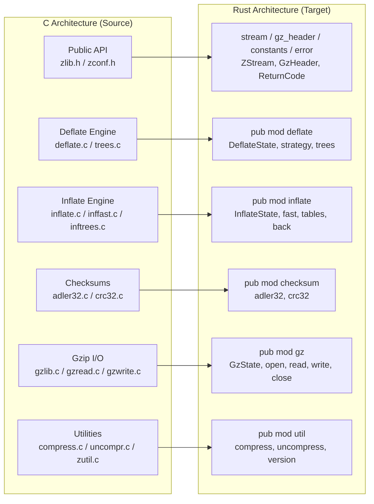
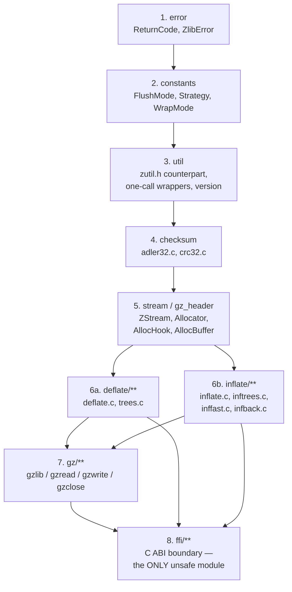

# Technical Specification

## 0. Agent Action Plan

This document is the authoritative technical specification for `zlib-rs`, the memory-safe Rust
reimplementation of the zlib C compression library that lives in this repository alongside the
retained C baseline. It supersedes an earlier section-numbering baseline, which is now retired; the
complete mapping from that baseline's heading names and numbers to the ones used here is tabulated in
[§0.10.3](#0103-document-conventions), so a citation written against the old scheme can still be resolved.

## How to read this document

**The section numbering is fixed and load-bearing.** Source files across the repository cite sections
of this plan by number — a citation that points at the wrong section is worse than no citation. Twenty-three
distinct anchors are cited from the tree today — twenty-one once `§0.4.1.8` and `§0.4.1.12` are folded into
their `§0.4.1` parent — and every one of them resolves to a real heading below.
The complete census, together with the anchors that are cited approximately and the notes that
disambiguate them, is in [§0.7.1](#071-user-specified-rules) and
[§0.10.3](#0103-document-conventions).

**Every number here is either measured or planned, and the two are never blended.** A *measured* figure
was produced by a command executed against this working tree; a *planned* figure describes work that has
not yet been performed. Where an earlier recorded baseline of this plan carried a different value, both
appear and the earlier one is explicitly labelled as a historical datum rather than silently replaced.

**Measurement basis.** Unless a figure says otherwise, it was produced on `x86_64-unknown-linux-gnu`
with the repository-pinned `rustc 1.85.0` and with current stable `rustc 1.97.1`, using:

```bash
cargo build --locked --release
cargo test  --locked
cargo test  --locked --no-default-features
cargo test  --locked --all-features
cargo fmt   --all -- --check
cargo clippy --locked --all-targets --all-features -- -D warnings
RUSTDOCFLAGS='-D warnings' cargo doc --locked --no-deps --all-features
mkdocs build --strict --site-dir "$(mktemp -d)/site"
```

All eight commands exit `0` at the time of writing. The `mkdocs` line passes `--site-dir` deliberately:
MkDocs otherwise defaults `site_dir` to `<repo>/site`, so a bare `mkdocs build --strict` writes 60
generated files into the working tree. Directing it outside the checkout is exactly what CI does
(`--site-dir "$RUNNER_TEMP/site"`), and it keeps `git status --porcelain` clean — which several CI steps
assert on, and which would otherwise fail for an unrelated reason. `/site/` is also in `.gitignore` as a
backstop for a hand-run bare build; the flag is still the primary fix, because it leaves the checkout
untouched rather than merely unstaged. Counts of source lines, tests, and citations move
whenever code is added; each is therefore reported with enough detail that a reader can re-derive it
rather than trust it.

**Citation convention.** C sources are cited by **line number** — the `*.c` and `*.h` files are retained
read-only and their line numbering is frozen, so a line citation into them stays valid indefinitely.
Rust items are cited by **module path and item name**, because Rust line numbers have already shifted
materially during hardening and will shift again. Where a Rust line number appears it is a convenience,
not a contract.

---

## 0.1 Intent Clarification

### 0.1.1 Core Refactoring Objective

The refactoring objective is a production-ready, memory-safe Rust reimplementation of the zlib C
compression library — replacing every instance of manual C memory management with Rust ownership and
borrowing semantics — while preserving three properties absolutely: full DEFLATE format compatibility,
exact C API equivalence, and behavioral fidelity to the reference implementation.

The migration baseline is the zlib source tree present in this repository, which identifies itself as
version `1.3.2.1-motley` with `ZLIB_VERNUM 0x1321` (`ZLIB_VER_MAJOR 1`, `ZLIB_VER_MINOR 3`,
`ZLIB_VER_REVISION 2`, `ZLIB_VER_SUBREVISION 1`) [`zlib.h` L44-L49]. That baseline comprises **23,107
lines of C across 26 root translation units and headers**, exposing **119** `ZEXTERN` public entry points
[`grep -c ZEXTERN zlib.h`].

**Refactoring type.** The work is classified across three concurrent dimensions:

- **Tech stack migration (primary).** The entire library moves from C to Rust. This is not a partial port
  or a wrapper — every C translation unit has a named Rust owner ([§0.2.1](#021-exhaustively-in-scope)).
- **Modularity restructuring (secondary).** Fifteen flat C translation units become a seven-layer,
  forty-file Rust module tree with a strictly one-way, acyclic dependency ordering that an in-crate test
  enforces against the source text ([§0.3.1](#031-refactored-structure-planning)).
- **Design pattern application (tertiary).** Raw function-pointer dispatch, interior pointers,
  macro-based bit manipulation, and manual allocate/free pairs are each replaced by a specific idiomatic
  Rust construct, enumerated in [§0.3.2](#032-design-pattern-applications).

This is explicitly **not** a performance refactor. Performance is a *constraint* to be respected, not the
goal ([§0.8.3](#083-performance-expectations)).

**Target repository.** The refactor executes **in the same repository**. This is not a new-repository
migration, and the Rust crate is not a standalone tree with the C sources removed. The C sources are
deliberately **retained in-tree** as the cross-validation oracle and the source of the official test
vectors, while being excluded from the *published* crate through the manifest's `exclude` list
(`Cargo.toml`, `[package] exclude`). Deleting them would destroy the only mechanism by which byte-identity
can be independently proven.

**Technical objectives.** Each user-stated in-scope item and constraint maps to a concrete objective:

| ID | Source requirement | Technical objective |
|----|--------------------|---------------------|
| TO-1 | "Full rewrite of all zlib C source into idiomatic Rust" | Every one of the 15 C translation units and 11 headers has a named Rust owner module; no C source remains a runtime dependency |
| TO-2 | "DEFLATE compression and decompression" | Complete RFC 1951 encoder (stored / fast / slow / rle / huff block producers plus dynamic Huffman construction) and decoder (mode-loop, fast path, table builder, fixed tables, callback-driven `inflateBack`) |
| TO-3 | "zlib and gzip stream format support" | RFC 1950 CMF/FLG/FCHECK header, preset-dictionary Adler-32, big-endian Adler trailer; RFC 1952 fixed/extra/name/comment/header-CRC phases, little-endian CRC-32 and ISIZE; the overloaded `windowBits` contract (raw `-8..-15`, zlib `8..15`, gzip `+16`, auto-detect `+32`) resolved in one place |
| TO-4 | "C-compatible FFI interface for drop-in replacement" | Field-exact `#[repr(C)]` mirrors of the 14-field `z_stream` and 13-field `gz_header`; the `gzFile_s` field prefix required by C's `gzgetc` *macro*; all five versioned init entry points; `cdylib` + `staticlib` artifacts linkable statically and dynamically |
| TO-5 | "Compression level configuration" | Levels `-1` and `0..=9` with `-1` resolving to 6; the ten-row per-level tuning table ported verbatim; `deflateParams` re-dispatch and `deflateTune` override |
| TO-6 | "Full test suite including compatibility tests against reference zlib output" | Rust ports of all three C test drivers, checksum known-answer vectors, property-based round-trips, a two-tier byte-identity/interop gate, a live C-oracle sweep, and libFuzzer harnesses |
| TO-7 | Constraint: "output must be binary-compatible with zlib-produced streams" | Bidirectional wire-format interoperability for every level × strategy × `windowBits` × `memLevel` combination, **and** byte-identical compressed emission across the conformance grid |
| TO-8 | Constraint: "FFI layer must match the zlib C API signature exactly" | Cover all 54 `global:` symbols declared in `zlib.map` with zero leakage of the 10 named `local:` symbols; signature drift must fail the build |
| TO-9 | Constraint: "zero unsafe blocks in core compression logic" | Architectural layering in which `unsafe` is confined to the FFI boundary and a private no-`std` runtime block, and is absent from every compression and decompression module |
| TO-10 | Constraint: "must pass the official zlib test vectors" | `test/example.c`, `test/infcover.c`, and `test/minigzip.c` serve as behavioral oracles whose assertions are ported into the Rust integration suite |

**Implicit requirements surfaced.** Four stated constraints entail six further commitments:

- **Byte-identity is achievable only through exact heuristic parity.** Compressed output is a function of
  match-finder decisions. Preserving it requires reproducing the hash function *and its shift derivation*,
  the chain-insertion write order, the lazy-match acceptance thresholds, the `TOO_FAR` filter, the
  chain-length **quartering** heuristic (`chain_length >>= 2` — a two-bit shift, so the budget is divided by
  four, not halved), the stored/static/dynamic block-type selection formulas, and the Huffman
  tie-break comparison — each to the exact operator. All eight decision points are enumerated with
  citations in [§0.6.4](#064-bit-exact-wire-format).
- **ABI parity demands more than matching signatures.** Struct *field order* and padding, allocator-hook
  *semantics* (caller buffers used only when both hooks are present; a null allocator propagating as an
  allocation failure rather than silently falling back), exact numeric error codes, and even internal
  status-ladder values that leak through APIs such as `deflatePending` must all match.
- **Ownership semantics forces two specific pointer-to-index transformations.** The doubled sliding window
  with its hash-head and previous-link arrays must become owned, index-addressed buffers; and inflate's
  self-referential interior table pointer must become an offset plus a discriminant, otherwise a deep copy
  for `inflateCopy` cannot be made correct.
- **Drop-in status includes the C-side integration surface.** A consumer replaces `libz` through
  pkg-config, CMake, and header compatibility — not through symbols alone. The C build descriptors
  therefore remain relevant even though no C code is compiled into the crate.
- **gzip support means the entire `gz*` family.** That includes `gzprintf`/`gzvprintf`, whose C `va_list`
  rendering has no stable-Rust equivalent. The resolution is an ABI-compatible error-returning stub
  *advertised through the compile-flags word*, which is exactly how a C zlib built without a secure
  `vsnprintf` behaves ([§0.8.2](#082-documented-divergences-to-preserve)).
- **A destructor cannot report deferred I/O errors.** Pure RAII would silently swallow a failure to write
  a gzip member's final block and trailer. The gzip state's `Drop` is therefore intentionally empty of
  finishing logic, and `gzclose`/`gzclose_w` remain mandatory — a deliberate, documented divergence from
  idiomatic Rust cleanup.

**Ambiguities identified and resolved.**

| # | Ambiguity | Resolution | Justification |
|---|-----------|-----------|---------------|
| A1 | "Full rewrite" reads as greenfield, yet the repository already contains a substantially complete Rust crate | Treated as **state reconciliation**, not contradiction. Existing modules take mode **UPDATE**; only verified-absent artifacts take **CREATE**; the C tree takes **REFERENCE** | A transformation mode describes the action performed against the working tree *as it exists*. Marking existing files CREATE would overwrite validated, test-covered code |
| A2 | "Binary-compatible with zlib-produced streams" could mean merely mutually decodable, or strictly byte-identical | **Bifurcated**: (a) mandatory bidirectional interoperability for every configuration; (b) mandatory byte-identical emission across the conformance grid | The stronger reading is the defining acceptance criterion of the migration and is empirically achievable — measured across 3,750 configurations ([§0.6.4](#064-bit-exact-wire-format)) |
| A3 | Should the C sources be deleted once ported? | **Retained** in-tree as the oracle; **excluded** from the published crate | Deleting them removes the only independent cross-validation oracle and the official test vectors, directly undermining TO-7 and TO-10 |
| A4 | No Rust edition or MSRV is specified | Adopt the crate's declared **edition 2024** and **MSRV 1.85.0** | Both are empirically validated ([§0.3.3](#033-research-conducted)). 1.85.0 is precisely the release in which edition 2024 became available, so the declaration is the tightest self-consistent pairing |

The C-to-Rust correspondence at the coarsest level:



### 0.1.2 Technical Interpretation

The transformation strategy is: **decompose a flat, macro-driven, pointer-arithmetic C library into a
strictly layered Rust crate whose core is provably free of `unsafe`, and re-expose that core through a
single thin boundary module that reproduces the C ABI byte-for-byte.** Every transformation is an
instance of one of five rules, applied consistently across all forty modules.

**Current architecture → target architecture.**

| Dimension | Current (C) | Target (Rust) |
|-----------|-------------|---------------|
| Structure | 15 flat translation units, coupled through `#include "zutil.h"` and `deflate.h` / `inflate.h` | 7 layers, 40 files; the module graph mirrors the C `#include` layering with no extra top-level modules (`src/lib.rs`, module-graph documentation) and is strictly one-way and acyclic, enforced by an in-crate scan of the source text ([§0.3.1](#031-refactored-structure-planning)) |
| Memory | 22 explicit `ZALLOC` / `ZFREE` call sites (`deflate.c` 11, `inflate.c` 9, `infback.c` 2) | Owned buffers behind one allocator abstraction; no free path exists to forget ([§0.6.3](#063-memory-ownership-model)) |
| Dispatch | `compress_func` raw function-pointer table [`deflate.c` L70] | A tag enum resolved by exhaustive `match` (`deflate::strategy::CompressFunc`), preserving selection behavior without `unsafe` |
| State | `int`-valued mode/status fields plus interior pointers into an arena | `#[repr]`-tagged enums with C-exact discriminants, plus offsets and a source discriminant instead of interior pointers |
| Configuration | 13 preprocessor macros (`Z_SOLO`, `GZIP`, `INFLATE_STRICT`, `FASTEST`, `LIT_MEM`, `GUNZIP`, `BUILDFIXED`, `DYNAMIC_CRC_TABLE`, …) | Cargo features plus `cfg!` predicates, with several C macros eliminated outright ([§0.5.3](#053-feature-flags)) |
| Tables | Pre-generated CRC tables checked into `crc32.h` (9,446 lines) | Generated at build time by a dependency-free build script (`build.rs`) |
| Error handling | Sentinel `int` returns and `ERR_RETURN` macros | A return-code enum mirroring the C values (`error::ReturnCode`), plus `Result` and `?` internally |
| Unsafety | Pervasive and unbounded | Confined to `src/ffi/**` plus a private runtime block in `src/lib.rs`; absent from all compression logic ([§0.6.2](#062-unsafe-code-boundary)) |

**Transformation rules.** These five rules generate the file-level plan in
[§0.4.1](#041-file-by-file-transformation-plan):

- **Rule T1 — One C translation unit maps to one Rust module or module directory,** and each Rust module
  declares its C provenance in its own documentation header. For example, `src/deflate/strategy.rs` states
  that it is the safe-Rust translation of the `block_state` enumeration (`deflate.c` L63-L68), the
  `compress_func` typedef (`deflate.c` L70), and the `config` struct plus `configuration_table`
  (`deflate.c` L88-L124).
- **Rule T2 — Every C macro becomes a named Rust item, never a textual substitution.** `UPDATE_HASH` and
  `INSERT_STRING` become inherent methods on the deflate state; the `NEEDBITS` / `DROPBITS` / `BITS` /
  `PULLBYTE` family becomes inline primitives on a borrowed-I/O type; `ZALLOC` / `ZFREE` becomes a
  fallible owned-buffer constructor; `Assert` / `Tracev` become `debug_assert!` or no-ops. The complete
  mapping is B3 in [§0.4.2](#042-cross-file-dependencies).
- **Rule T3 — Pointer arithmetic becomes index arithmetic, and interior pointers become offsets plus a
  discriminant.** Inflate's `state->next` / `lencode` / `distcode` arena pointers become
  `inflate::state::TableSource { Fixed, Dynamic }` plus integer offsets. This is what makes deep copying
  sound and is the precondition for correct `deflateCopy` / `inflateCopy`.
- **Rule T4 — Numeric values that are observable through the ABI are preserved exactly,** including values
  a naive port would consider internal: the deflate status ladder (`Init = 42`, `Gzip = 57`, `Extra = 69`,
  `Name = 73`, `Comment = 91`, `Hcrc = 103`, `Busy = 113`, `Finish = 666`), the inflate mode sentinel
  (`Head = 16180`), `ENOUGH` (`852 + 592 = 1444`), and `TOO_FAR` (`4096`).
- **Rule T5 — `unsafe` may cross the boundary in one direction only.** The FFI module may call into the
  safe core; the safe core may never require `unsafe` to function. Verified by direct measurement: a
  comment-excluded scan for the `unsafe` token across `src/deflate`, `src/inflate`, `src/checksum`,
  `src/util`, `src/gz`, `src/error.rs`, `src/constants.rs`, and `src/gz_header.rs` returns **empty**.

**Behavioral baseline established by measurement.** So that "no regression" has a concrete meaning, the
current state was measured before planning any change:

| Gate | Command | Observed |
|------|---------|----------|
| Release build | `cargo build --locked --release` | exit 0 |
| Default test suite | `cargo test --locked` | **1015 passed / 0 failed / 0 ignored** (854 unit, 132 integration, 29 doctests) |
| no-`std` test suite | `cargo test --locked --no-default-features` | **713 passed / 0 failed / 0 ignored** (587 unit, 99 integration, 27 doctests) |
| All-features test suite | `cargo test --locked --all-features` | **1028 passed / 0 failed / 0 ignored** (adds the 13 live C-oracle tests) |
| Formatting | `cargo fmt --all -- --check` | exit 0 |
| Lints | `cargo clippy --locked --all-targets --all-features -- -D warnings` | exit 0 |
| Docs | `RUSTDOCFLAGS='-D warnings' cargo doc --locked --no-deps --all-features` | exit 0, 0 warnings |
| Published docs | `mkdocs build --strict --site-dir "$(mktemp -d)/site"` | exit 0, 0 strict diagnostics (see the note below) |
| Packaged crate | `cargo package --locked --list` | **75** files; the unpacked archive re-runs its own suite at 1015 |

On the published-docs row, "0 strict diagnostics" means no `WARNING` and no `ERROR` from MkDocs, its
plugins, or this project's content. The Material theme separately prints one advisory banner from its own
maintainers about the forthcoming MkDocs 2.0; that is a vendor notice rather than a build diagnostic,
`--strict` does not fail on it, and nothing in this repository can suppress it.

Release artifacts, measured from a clean `cargo build --locked --release` under default features with
`rustc 1.97.1 (8bab26f4f 2026-07-14)` on `x86_64-unknown-linux-gnu`: `libzlib_rs.rlib` 2,930,500 B,
`libzlib_rs.so` 667,552 B, `libzlib_rs.a` 22,464,508 B. These byte counts are **provenance-bound** — they
shift with the toolchain, the feature row, and any change to the crate's own source or documentation
metadata, so a figure quoted without its toolchain and feature set says very little: read them as a
dated snapshot of one build, observed **2026-08-04**, rather than a reproducible invariant or a size
budget — no gate asserts them. The `.rlib` is the least durable of the three, because an rlib embeds
absolute build paths and so changes size when the checkout directory or `CARGO_TARGET_DIR` changes
without any source change; reproduce them for your own build with
`stat -c '%s' target/release/libzlib_rs.{rlib,so,a}`. Linking a C program
against the static archive yields
`ver=1.3.2.1-motley crc=cbf43926 adler=091e01de compress=0 uncompress=0 bound=22`, and against the shared
object yields a byte-exact 50,000-byte round trip with correct `1f 8b` gzip framing at `windowBits = 31`.

The absolute test counts above move with every test added; the **invariant** that matters and that must
never move is *zero failed and zero ignored* in every configuration.

**Layer graph of the target architecture.** The dependency ordering below is the invariant the
transformation must preserve; it is declared in the crate root and mirrors the C include layering. See
[§0.3.1](#031-refactored-structure-planning) for the module declaration contract that realizes it.

---

## 0.2 Scope Boundaries

Scope is derived from three independent inputs: the user's in-scope and out-of-scope bullets, the
repository's actual contents as walked in every relevant branch, and the set of artifacts verified absent
by direct filesystem inspection. No `.blitzyignore` file exists anywhere in the repository, so no
path-pattern exclusions apply and the entire tree was available for inspection.

### 0.2.1 Exhaustively In Scope

#### 0.2.1.1 Migration source — C translation units (REFERENCE mode)

These twenty-six files constitute the authoritative migration source and the behavioral oracle. They are
**read, never modified** (preservation directive D-7,
[§0.8.1](#081-preservation-and-byte-identity-directives)). Each has a named Rust owner, satisfying TO-1.
Line counts are measured with `wc -l`; the total is **23,107**.

| C source | Lines | Responsibility | Rust owner |
|----------|-------|----------------|------------|
| `adler32.c` | 164 | Adler-32 rolling checksum and `adler32_combine` | `src/checksum/adler32.rs` |
| `crc32.c` | 983 | CRC-32 braid implementation and GF(2) arithmetic | `src/checksum/crc32.rs` |
| `crc32.h` | 9,446 | Pre-generated CRC lookup tables | `build.rs` → `${OUT_DIR}/crc32_tables.rs` |
| `compress.c` | 99 | `compress` / `compress2` / `compressBound` | `src/util/compress.rs` |
| `uncompr.c` | 101 | `uncompress` / `uncompress2` | `src/util/uncompress.rs` |
| `deflate.c` | 2,185 | Deflate driver and the entire `deflate*` API | `src/deflate/{mod,state,strategy,fast,slow,stored,rle}.rs` |
| `deflate.h` | 383 | `deflate_state`, `UPDATE_HASH`, `INSERT_STRING` macros | `src/deflate/state.rs` |
| `trees.c` | 1,119 | Huffman tree construction and bit emission | `src/deflate/trees.rs` + `src/deflate/huff.rs` |
| `trees.h` | 128 | Static tree tables | `src/deflate/trees.rs` |
| `inflate.c` | 1,413 | Inflate mode loop and the entire `inflate*` API | `src/inflate/mod.rs` + `src/inflate/state.rs` |
| `inflate.h` | 126 | `inflate_state`, `inflate_mode` enumeration | `src/inflate/state.rs` |
| `inffast.c` | 321 | `inflate_fast` hot loop | `src/inflate/fast.rs` |
| `inffast.h` | 11 | `inflate_fast` prototype | `src/inflate/fast.rs` |
| `inftrees.c` | 424 | `inflate_table` builder | `src/inflate/tables.rs` |
| `inftrees.h` | 64 | `code` struct, `ENOUGH` constants | `src/inflate/tables.rs` |
| `inffixed.h` | 94 | Fixed Huffman tables | `src/inflate/fixed.rs` |
| `infback.c` | 579 | Callback-driven `inflateBack` decoder | `src/inflate/back.rs` |
| `gzlib.c` | 609 | `gzopen` / `gzbuffer` / `gzseek` / `gzerror` | `src/gz/open.rs` + `src/gz/state.rs` |
| `gzread.c` | 668 | `gzread` / `gzgets` / `gzgetc` / `gzungetc` | `src/gz/read.rs` |
| `gzwrite.c` | 700 | `gzwrite` / `gzputs` / `gzflush` / `gzsetparams` | `src/gz/write.rs` |
| `gzclose.c` | 23 | `gzclose` dispatch | `src/gz/close.rs` |
| `gzguts.h` | 216 | `gz_state`, `GZBUFSIZE = 8192` | `src/gz/state.rs` |
| `zutil.c` | 312 | `zError`, `zcalloc` / `zcfree` | `src/util/mod.rs` + `src/util/version.rs` |
| `zutil.h` | 331 | Shared internal interface | `src/util/mod.rs` |
| `zlib.h` | 2,057 | Public API/ABI contract, 119 `ZEXTERN` declarations | `src/{constants,stream,gz_header,error}.rs` + `src/ffi/types.rs` |
| `zconf.h` | 551 | Scalar type aliases and configuration macros | `src/ffi/types.rs` |

The three official C test drivers are likewise REFERENCE-mode oracles: `test/example.c` (15,709 B),
`test/infcover.c` (24,738 B), `test/minigzip.c` (15,486 B). Their assertions — not their code — are what
gets ported ([§0.6.7](#067-official-test-vector-conformance)). The symbol-version script `zlib.map` is
REFERENCE-mode and semantically authoritative for the exported/hidden partition
([§0.6.2](#062-unsafe-code-boundary)).

#### 0.2.1.2 Source transformations — Rust modules (UPDATE mode)

All **40** modules under `src/` are in scope, totaling **78,386** lines
(`find src -name '*.rs' -exec cat {} + | wc -l`, as of the measurement basis at the head of this
document). Every one is UPDATE mode: verify against the C oracle, harden, and close any parity or
documentation gap.

| Layer | Measured lines | Modules (snapshot) |
|-------|----------------|--------------------|
| Crate root and public types | 9,714 | `lib.rs` 4,191 · `stream.rs` 2,831 · `gz_header.rs` 1,485 · `constants.rs` 759 · `error.rs` 448 |
| `src/checksum/**.rs` | 2,542 | `crc32.rs` 1,870 · `adler32.rs` 658 · `mod.rs` 14 |
| `src/util/**.rs` | 1,725 | `version.rs` 597 · `compress.rs` 577 · `mod.rs` 335 · `uncompress.rs` 216 |
| `src/deflate/**.rs` | 11,384 | `state.rs` 4,068 · `mod.rs` 3,429 · `trees.rs` 1,745 · `rle.rs` 578 · `strategy.rs` 475 · `slow.rs` 315 · `stored.rs` 313 · `fast.rs` 265 · `huff.rs` 196 |
| `src/inflate/**.rs` | 10,932 | `mod.rs` 4,524 · `back.rs` 2,037 · `state.rs` 1,710 · `tables.rs` 1,229 · `fast.rs` 1,098 · `fixed.rs` 334 |
| `src/gz/**.rs` | 11,220 | `write.rs` 3,375 · `open.rs` 2,859 · `state.rs` 1,848 · `read.rs` 1,580 · `mod.rs` 879 · `close.rs` 679 |
| `src/ffi/**.rs` | 30,869 | `inflate.rs` 8,856 · `types.rs` 5,639 · `gz.rs` 5,027 · `deflate.rs` 5,020 · `alloc.rs` 2,409 · `mod.rs` 2,060 · `util.rs` 1,858 |
| **Total** | **78,386** | the seven rows above sum exactly, across all 40 modules |

Earlier recorded baselines of this plan reported 32,354 lines across the same 40 modules, then 58,677,
then 58,836, then 72,082; all four are **historical data** from before the hardening work described in
[§0.10.1](#0101-authoritative-d1d12-register) and none is the current state. A single table now carries the
per-layer breakdown, replacing the two divergent snapshots an earlier revision printed back to back.

No module contains a placeholder: a scan for `todo!()`, `unimplemented!()`, `TODO`, `FIXME`, and `XXX`
across all `*.rs` files returns zero matches.

#### 0.2.1.3 Test, benchmark, and fuzz updates (UPDATE mode)

- `tests/**.rs` — seven drivers, **18,388** lines: `interop.rs` 6,287 · `inflate_coverage.rs` 3,639 ·
  `c_oracle.rs` 3,548 · `gzip_compat.rs` 2,089 · `round_trip.rs` 1,116 · `regression.rs` 955 ·
  `checksum.rs` 754
- `benches/**.rs` — three Criterion targets, **806** lines: `deflate_bench.rs` 391 ·
  `inflate_bench.rs` 229 · `checksum_bench.rs` 186. The target *names* are `deflate_bench`,
  `inflate_bench`, and `checksum_bench`, all declared `harness = false`
- `fuzz/fuzz_targets/**.rs` — five libFuzzer targets, **8,537** lines: `fuzz_ffi_roundtrip.rs` 3,561 ·
  `fuzz_inflate.rs` 1,838 · `fuzz_gzip.rs` 1,551 · `fuzz_deflate_roundtrip.rs` 1,044 ·
  `fuzz_checksum.rs` 543
- `fuzz/Cargo.toml` (186 lines) and `fuzz/Cargo.lock` — the detached fuzz workspace manifest and its
  13-package lock
- The detached fuzz workspace carries **no policy file of its own**. It is governed by
  the single root `deny.toml`, aimed at its manifest with `cargo deny --locked
  --manifest-path fuzz/Cargo.toml --config deny.toml check -A
  license-not-encountered -A unmatched-skip -A unnecessary-skip`. Naming `--config`
  there is load-bearing precisely *because* `fuzz/` holds no policy: `cargo-deny`
  resolves configuration from the target manifest's workspace root, finds nothing,
  and silently falls back to built-in defaults — a fallback that looks exactly like a
  pass. **One** reviewed policy over both graphs is what makes the 102-package claim
  below true for all 102 rather than for 89 of them, and it is what keeps a boundary
  from being written twice and drifting. `policy-integrity` in
  `.github/workflows/audit.yml` fails if that file goes missing, drops a governed
  table, weakens a load-bearing key, or is joined by a **second** policy file
  anywhere in the tree

#### 0.2.1.4 Configuration, build, and packaging updates

- `Cargo.toml` — package metadata, feature matrix, `crate-type`, profiles, `exclude` list
- `Cargo.lock` — 89 pinned packages; tracked deliberately because the crate ships `cdylib`/`staticlib`
  distributables
- `build.rs` — CRC table generation plus the opt-in `cdylib` version-script wiring; pure `std`, no
  build-dependencies
- `rust-toolchain.toml` · `deny.toml` · `clippy.toml` · `rustfmt.toml` · `.cargo/config.toml`.
  `deny.toml` is the **only** `cargo-deny` policy and governs the detached fuzz workspace as well;
  see [§0.2.1.3](#0213-test-benchmark-and-fuzz-updates-update-mode) for how it is aimed at that graph
- `.gitignore` — already Rust-aware, ignoring `/target` and `/fuzz/{target,corpus,artifacts,coverage}`
- `catalog-info.yaml` — Backstage component descriptor, already retargeted to Rust
- `.github/workflows/ci.yml` (12 jobs) · `.github/workflows/audit.yml` (4 jobs) ·
  `.github/workflows/fuzz.yml` (1 job)

Per-file line counts for everything named above are stated **once**, in the
[§0.3.1](#031-refactored-structure-planning) tree layout, and are deliberately not repeated here. A figure
maintained in two places drifts in one of them, and this document previously carried three such divergent
copies of the same workflow line counts.

The C-side integration descriptors remain in scope as REFERENCE, with selective UPDATE only where
drop-in guidance is documented: `CMakeLists.txt`, `Makefile`, `Makefile.in`, `configure`, `zlib.pc.in`,
`zlib.pc.cmakein`, `zconf.h.in`, `zlibConfig.cmake.in`, `BUILD.bazel`, `MODULE.bazel`, `make_vms.com`,
`treebuild.xml`, `.cmake-format.yaml`, `test/CMakeLists.txt`, and the five `test/*.cmake.in` harness
templates.

#### 0.2.1.5 Documentation updates

- `README.md` — Rust-focused, describing the crate as a memory-safe idiomatic Rust rewrite of
  zlib 1.3.2.1 with byte-identical DEFLATE output and a C-compatible FFI drop-in layer
- `mkdocs.yml` — `docs_dir: doc`, `site_name: blitzy-zlib`, `site_description`, a three-entry `nav`,
  plugins `techdocs-core` + `mermaid2`. Only a handful of its lines are configuration; the remainder is the
  rationale header recording why `doc/` is the canonical documentation root, why `docs/` is not, and how the
  `mermaid2` plugin's config-time log must **not** be read as evidence that diagrams render (§0.6.7)
- [`index.md`](index.md) — the published documentation landing page
- [`project-guide.md`](project-guide.md) — the engagement guide, whose own internal §1–§9 numbering is a
  frozen citation target and is deliberately *not* renumbered to this plan's scheme
- This document, `doc/technical-specifications.md`
- `CHANGELOG.md`, `SECURITY.md`, and `CONTRIBUTING.md` — the contributor-facing trio at the repository
  root, carrying the release history, the disclosure policy, and the quality-gate and MSRV workflow
  respectively

As in §0.2.1.4, line counts for these files live only in the
[§0.3.1](#031-refactored-structure-planning) tree layout.

The RFC and algorithm references under `doc/` — `rfc1950.txt`, `rfc1951.txt`, `rfc1952.txt`,
`algorithm.txt`, `txtvsbin.txt`, `crc-doc.1.0.pdf` — are REFERENCE-only normative inputs and are never
edited.

**Documentation-drift findings.** Two are tracked:

- **E1 — an orphaned second landing page.** `mkdocs.yml` publishes from `doc/`, so `docs/index.md` is
  outside the build root. It is retained as a short redirect stub that points readers at the published
  page rather than as a divergent duplicate.
- **E2 — competing section-numbering baselines.** Rust sources cite this plan by section number. Three
  mutually inconsistent numbering baselines existed in the tree at one point: the numbering implied by the
  Rust sources; the numbering in the previously checked-in version of *this* document; and a third
  baseline in the engagement status document. This document's numbering is chosen so that **every anchor
  cited from the tree resolves to a semantically correct heading**; the reconciliation is recorded in
  [§0.7.1](#071-user-specified-rules) and [§0.10.3](#0103-document-conventions).

#### 0.2.1.6 Import corrections

Every file that references a module path, a re-exported name, or a feature gate is in scope for import
correction:

- `src/**.rs` — internal `use crate::…` paths must reflect the layer ordering of
  [§0.3.1](#031-refactored-structure-planning)
- `tests/**.rs` — integration tests import only through the public surface, for example
  `use zlib_rs::constants::{DEF_MEM_LEVEL, Z_DEFLATED, Z_FINISH, Z_NO_FLUSH};` and
  `use zlib_rs::deflate::{deflate, deflate_end, deflate_init2};`
- `benches/**.rs` and `fuzz/fuzz_targets/**.rs` — same public-surface constraint

#### 0.2.1.7 Production-readiness artifacts (D1–D12)

Twelve artifacts were recorded as verified-absent when this plan was first written. Eleven are now
present and one is partially present; the register with each artifact's current measured
status is [§0.10.1](#0101-authoritative-d1d12-register). They are listed there rather than duplicated
here so that exactly one place in this document owns their status.

#### 0.2.1.8 Rule-mandated files

`review_rules` reports that **no user rules were provided** for this engagement. **Zero files are forced
into scope by a rule.** Scope is driven entirely by the requirement-derived and gap-derived inventories
above. See [§0.7.1](#071-user-specified-rules).

### 0.2.2 Explicitly Out of Scope

**User-stated exclusions, preserved verbatim:**

- "bzip2, lzma, or other compression formats"
- "New compression algorithms"
- "GUI or tooling beyond the library itself"

**Derived exclusions.** Each is a direct consequence of the user's exclusions or of the
state-reconciliation decision A1:

- **`contrib/**` in its entirety** — nineteen subdirectories of third-party bindings and ports (`ada`,
  `blast`, `crc32vx`, `delphi`, `dotzlib`, `gcc_gvmat64`, `infback9`, `iostream`, `iostream2`,
  `iostream3`, `minizip`, `nuget`, `pascal`, `puff`, `testzlib`, `vstudio`, `zlib1-dll`, and their test
  trees). These are not part of the library.
- **Legacy platform build trees** — `amiga/`, `msdos/`, `os400/`, `qnx/`, `watcom/`, `win32/`.
- **`examples/**`** — `enough.c`, `fitblk.c`, `gun.c`, `gzappend.c`, `gzjoin.c`, `gzlog.c` / `.h`,
  `gznorm.c`, `zpipe.c`, `zran.c` / `.h`, `zlib_how.html`, `README.examples`. These are C sample programs;
  no Rust equivalents are required, and producing them would constitute "tooling beyond the library
  itself."
- **The C translation units as modification targets.** They are retained verbatim as the cross-validation
  oracle and excluded from the published crate through the manifest `exclude` list
  ([§0.5.3](#053-feature-flags)).
- **`blitzy-deck/**`** — presentation assets, not product tooling.
- **No CLI binary, no `[[bin]]` target, no GUI.** The crate remains a library emitting `lib`, `cdylib`,
  and `staticlib` only.
- **Non-DEFLATE codecs.** No bzip2, lzma, zstd, or brotli support, and no novel algorithms. `flate2` and
  `miniz_oxide` remain **dev-only** oracles and never become runtime dependencies; the runtime closure
  stays `cfg-if` plus optional `crc32fast`.
- **Behavior changes.** This is a structural and tech-stack refactor. Observable behavior must not change
  except where a divergence is explicitly documented
  ([§0.8.2](#082-documented-divergences-to-preserve)).
- **Design system work.** The Design System Alignment Protocol is **not triggered**: no component library
  or design system is named anywhere in the requirements, there are zero attachments and zero Figma
  frames, and the deliverable is a headless compression library whose only interfaces are a Rust API and a
  C ABI. There is no UI surface, no markup, no styling, and no design tokens. Consequently no "Design
  System Compliance" sub-section is produced and the component, token, and gap tables are inapplicable
  ([§0.3.4](#034-user-interface-design), [§0.9.1](#091-provided-attachments)).

---


## 0.3 Target Design

### 0.3.1 Refactored Structure Planning

The target is a **single Cargo package** named `zlib-rs` emitting three artifacts —
`crate-type = ["lib", "cdylib", "staticlib"]` — where the `cdylib`/`staticlib` pair replaces CMake's
`zlib SHARED` and `zlibstatic STATIC` targets. Internally the package is a seven-tier module tree whose
dependency ordering mirrors the C `#include` layering. The crate root states that intent explicitly: the
module graph "mirrors the C `#include` layering exactly (AAP §0.3.1) with no extra top-level modules."



Every arrow reads *is used by*: `A --> B` means `B` names `A`, so the arrowhead sits on the dependent and
the tail on its dependency. Every edge therefore runs down the tier order, and there is no edge of any
other kind: the graph has no upward reference and no same-tier reference, so it is acyclic.

The seven tiers are: `error` with `constants`; `util`; `checksum`; `stream` with `gz_header`; the
`deflate` and `inflate` engines (peers, neither depending on the other); `gz`; and `ffi`. The crate root
describes the same graph from a different angle — it "mirrors the six functional layers of the C baseline
as modules, adds a public-API-types layer, and isolates the C ABI behind `ffi`." The two framings are
complementary rather than contradictory: they differ only in whether the public-API types (`error`,
`constants`, `stream`, `gz_header`) are counted as one tier or distributed across the tiers that introduce
them.

**The graph is acyclic, and a test enforces it.** Measured from the source text with comments and string
literals blanked, `#[cfg(test)]` items removed, and brace-grouped `use` lists expanded, the shipped
cross-module reference sets are:

| Module | References |
|--------|------------|
| `error`, `constants`, `checksum`, `gz_header` | *(nothing else in the crate)* |
| `util` | `constants`, `error` |
| `stream` | `constants`, `error` |
| `deflate` | `checksum`, `constants`, `error`, `gz_header`, `stream`, `util` |
| `inflate` | `checksum`, `constants`, `error`, `gz_header`, `stream`, `util` |
| `gz` | `constants`, `deflate`, `error`, `inflate`, `stream` |
| `ffi` | `checksum`, `constants`, `deflate`, `error`, `gz`, `gz_header`, `inflate`, `stream`, `util` |

Every entry points at a strictly lower tier. `stream` and `gz_header` do not name each other, `deflate` and
`inflate` do not name each other, and no module names anything above it — so the graph contains no cycle of
any length, not merely no two-cycle.

Nothing in the compiler enforces this. A Rust crate is one compilation unit, so an upward `use` compiles
perfectly and the layering would erode silently, which is precisely how the ordering degrades in practice.
The invariant is therefore mechanical: the `the_module_graph_has_no_upward_edges` test in `src/lib.rs`
re-derives the entire edge set from the source text of every file under `src/` and fails on any reference
that does not point downward, naming the file, the line, the tier and both layer numbers. Four guards keep
it from passing vacuously — every file must classify into one of the ten declared modules, the shipped
graph must show more than forty inter-module edges, the two tiers must be distinct texts, and every
test-only exemption must actually be exercised.

The check is two-tiered, because the shipped library and the `#[cfg(test)]` configuration are different
compilation units with different obligations:

- **Shipped code** — every file with its `#[cfg(test)]` items removed — must be *strictly* one-way: no
  upward edge and no same-tier edge. This is the library that is built, linked and published, and this
  tier is what lets each layer be read, reviewed and reasoned about without the layers above it.
- **`#[cfg(test)]` code** may hold exceptions, but only the three enumerated in
  `TEST_ONLY_CROSS_LAYER_EXCEPTIONS`, each carrying its rationale: `stream` drives the counting
  `alloc_func`/`free_func` hook that lives in `crate::ffi::alloc::test_hook`, because building a real C
  hook pair needs raw-pointer `unsafe` and that is permitted only under `src/ffi/**`
  ([§0.6.2](#062-unsafe-code-boundary)); and the two engines decode each other's output, because an
  in-crate round trip is the only way to assert emitted bytes without `std` or a third-party codec, so the
  engine unit tests run in every feature configuration. Because it is an allow-list rather than a blanket
  exemption, a *new* test-only inversion fails the test until it is justified there, and a stale entry
  fails it too.

Two design decisions make the shipped graph one-way, and both mirror the C baseline rather than working
around it:

- **The engine state is opaque to `stream`.** `ZStream` owns it as `Box<dyn EngineState>` and names neither
  `DeflateState` nor `InflateState`; the typed views live one tier *up*, as
  `crate::deflate::state::DeflateStream` and `crate::inflate::state::InflateStream`, which downcast on the
  concrete engine type. This is pattern **C5** in [§0.3.2](#032-design-pattern-applications): `ZStream`
  replaces "C's caller-managed `z_streamp` plus its opaque `state` pointer with a single value whose
  lifetime the compiler tracks", and it keeps the layer-5 handle exactly as incurious about the engines as
  C's opaque forward declaration `struct internal_state FAR *state` [`zlib.h`]. Ownership still makes the
  free path unforgettable ([§0.6.3](#063-memory-ownership-model)), and `take_inflate_state` refuses a
  stream holding a compression engine and leaves it untouched, exactly as C's `inflateStateCheck` does
  [`inflate.c` L88-L97]. The `EngineState` trait spells out `as_any` / `as_any_mut` / `into_any` by hand
  rather than relying on trait upcasting, because upcasting stabilised in Rust 1.86 and the crate's MSRV is
  1.85.0 ([§0.5.1](#051-key-packages)).
- **The one-call façades are split the way the C `#include` graph splits them.** `compress.c` and
  `uncompr.c` *include* `zlib.h` and *drive* the engines, so in the include order they sit above the engine
  rather than beside `zutil.h`. Accordingly the bit-exact `compressBound` formula and the complete C driver
  loops — the chunked `u32::MAX` windowing, the `Z_NO_FLUSH`/`Z_FINISH` schedule, the unconditional length
  write-back before teardown, and the `uncompr.c` L78-L81 return-code folding — stay in `src/util/` behind
  the `OneCallDeflate` / `OneCallInflate` port traits, while the engine-owning adapters and the public
  `compress`, `compress2`, `uncompress` and `uncompress2` entry points live in `src/deflate/mod.rs` and
  `src/inflate/mod.rs`, from where the crate root re-exports them under their exact `zlib.h` names.
  `zutil.h`'s `OS_CODE` and `PRESET_DICT` remain in `src/util/mod.rs` [`src/deflate/mod.rs` L104, L110],
  and `src/deflate/mod.rs` reading them is an ordinary downward edge.

One consequence is worth stating plainly, because it is easy to over-read: acyclicity here is an
architectural property, not a build requirement. A Rust crate is a single compilation unit, so intra-crate
module paths are resolved together and impose no ordering constraint — unlike C, where the `#include` graph
must be acyclic to compile at all. The value of the invariant is reviewability and extractability, not
compilability. Nor does `unsafe` containment depend on the graph shape: it is enforced by
`#![deny(unsafe_code)]` with exactly two scoped carve-outs plus a dedicated CI job
([§0.6.2](#062-unsafe-code-boundary)), which hold regardless of which module names which.

**Module declaration contract.** Eight modules are declared unconditionally — `checksum`, `constants`,
`deflate`, `error`, `gz_header`, `inflate`, `stream`, `util`. The gzip file-I/O layer is feature-gated
behind `gz-io` because it "fundamentally requires the standard library (`std::fs`/`std::io`)", so a bare
no-`std` build omits it entirely. The FFI module is declared **unconditionally by design** "so the emitted
`cdylib`/`staticlib` always presents the full zlib C symbol table for linkage. Any part of `ffi` that
needs `std` is gated internally" — concretely, the 34 `gz*` entry points keep their exported items in
every configuration while their *bodies* are what the `std` gating switches.

**Curated crate-root re-exports.** The idiomatic surface mirrors `zlib.h` while the FFI symbols are
*deliberately excluded* so that `ffi` stands alone as the C ABI surface. Seven `pub use` statements make up
that surface:

```rust
pub use error::{ReturnCode, ZlibError};
pub use constants::{
    DataType, FlushMode, Method, Strategy, WrapMode,
    Z_BEST_COMPRESSION, Z_BEST_SPEED, Z_DEFAULT_COMPRESSION, Z_NO_COMPRESSION,
};
pub use stream::{Allocator, DefaultAllocator, ZStream};
pub use gz_header::GzHeader;
pub use deflate::{compress, compress2};
pub use inflate::{uncompress, uncompress2};
pub use util::{compress_bound, compressBound};
pub use util::{z_error, zError, zlib_compile_flags, zlib_version, zlibCompileFlags, zlibVersion};
pub use checksum::{adler32, adler32_combine, crc32, crc32_combine};
```

A `prelude` module also exists and deliberately excludes the free functions and every FFI name, so that
glob-importing it cannot pull raw-pointer entry points into scope; it re-exports only
`constants::{DataType, FlushMode, Method, Strategy, WrapMode}`, `error::{ReturnCode, ZlibError}`,
`gz_header::GzHeader`, and `stream::{Allocator, DefaultAllocator, ZStream}`.

**Version identity.** Constants mirroring the C macros are defined at the crate root and ported from
`zlib.h` L44-L49: `ZLIB_VERSION = "1.3.2.1-motley"`, `ZLIB_VERNUM = 0x1321` (nibbles `0xMNRS`),
`ZLIB_VER_MAJOR = 1`, `ZLIB_VER_MINOR = 3`, `ZLIB_VER_REVISION = 2`, `ZLIB_VER_SUBREVISION = 1`. Note the
deliberate split: the **Cargo package version is `1.3.2`**, because SemVer forbids the four-component
motley string, while the C API shim still reports the full upstream identity from `src/util/version.rs`.

**Measured artifact geometry.** `cargo build --locked --release` emits `libzlib_rs.rlib` at 2,930,500 B,
`libzlib_rs.so` at 667,552 B, and `libzlib_rs.a` at 22,464,508 B — measured from a clean release build under
default features with `rustc 1.97.1 (8bab26f4f 2026-07-14)` on `x86_64-unknown-linux-gnu`, observed
**2026-08-04**. Read them as a dated, environment-specific snapshot rather than an invariant: no gate asserts
them, they move with the compiler, the feature row and the profile, and the `.rlib` in particular embeds
absolute build paths, so its size changes when the checkout directory or `CARGO_TARGET_DIR` changes without
any source change. Because all three share the single `target/release/` output path, the last feature row
built is the one on disk (§0.6.2). Reproduce exact bytes locally with
`stat -c '%s' target/release/libzlib_rs.{rlib,so,a}` rather than relying on a transcribed count.

**Build-time table generation contract.** `build.rs` (2,425 lines) reimplements `crc32.c`'s
`make_crc_table`, `multmodp`, `x2nmodp`, `byte_swap`, and `braid` in "Pure `std` only — no external
crates, no build-dependencies, and zero `unsafe`", emitting `${OUT_DIR}/crc32_tables.rs`. The emitted
contract consumed by `src/checksum/crc32.rs` is stable:

| Item | Type |
|------|------|
| `CRC_BRAID_N` | `usize = 5` |
| `CRC_BRAID_W` | `usize = 8` |
| `CRC_TABLE` | `[u32; 256]` |
| `X2N_TABLE` | `[u32; 32]` |
| `CRC_BIG_TABLE` | `[u64; 256]` |
| `CRC_BRAID_TABLE` | `[[u32; 256]; 8]` |
| `CRC_BRAID_BIG_TABLE` | `[[u64; 256]; 8]` |

There is no host or target detection in `build.rs` at all: **both** endian forms of every table are always
emitted, and the *consumer* — `src/checksum/crc32.rs` — picks an arm with `cfg!(target_endian = "little")`,
which is a **compile-time** constant read from the target triple, not a run-time test. `build.rs` documents
the purity that follows: "no environment, no filesystem, no randomness, and no dependence on the host or
target configuration … Two calls therefore always produce byte-identical output, which is what makes the
generated artifact reproducible" (`build.rs` L579-L583). Because `cfg!` is an *expression* macro rather than
an attribute, both arms of the `if` are still parsed, type-checked, and kept alive — so neither table set is
dead code — while only the selected arm survives into codegen. The distinction and its consequences are
developed in [§0.6.6](#066-numeric-constant-correctness). This single build step eliminates **9,446**
checked-in lines of generated C tables. `build.rs` additionally carries the opt-in `cdylib` version-script
wiring described in [§0.6.2](#062-unsafe-code-boundary).

**Complete target file and folder layout**, annotated with C provenance and measured line counts. Every
Rust entry exists and is UPDATE mode; the retained C baseline is REFERENCE only.

Every numeric column below is a **dated snapshot**, not a contract — with three columns that mean different
things, which is exactly the trap a bulk regeneration falls into. `Cargo.lock` and `fuzz/Cargo.lock` are
counted in **pinned packages**; `${OUT_DIR}/crc32_tables.rs` names the **C lines eliminated**; every other
number is `wc -l` of the file. Regenerate the line-count column with
`git ls-files | grep -E '\.(rs|toml|yml|md)$' | xargs wc -l`, the two package counts with
`grep -c '^name = ' Cargo.lock fuzz/Cargo.lock`, and the file counts with the drift check printed after the
tree.

```text
zlib-rs (same repository, additive to the retained C baseline)

.  (repository root)
├── Cargo.toml                      431 lines — package / features / crate-type / profiles / exclude
├── Cargo.lock                      89 pinned packages (tracked: ships cdylib + staticlib)
├── build.rs                       2425  <- crc32.c make_crc_table/multmodp/x2nmodp/byte_swap/braid
│                                        + opt-in cdylib version-script wiring
├── rust-toolchain.toml             291  pins channel 1.85.0 + rustfmt + clippy, profile minimal
├── deny.toml                       955  the ONE cargo-deny policy — governs BOTH graphs
│                                        (89 root packages and the 13 fuzz-only ones)
├── clippy.toml                     172  pinned lint configuration
├── rustfmt.toml                    192  pinned format configuration
├── CHANGELOG.md                    667  Rust crate release history
├── SECURITY.md                     773  vulnerability disclosure policy
├── CONTRIBUTING.md                1707  contribution workflow, the seven blocking gates, MSRV policy
├── README.md                      1238  measured evidence, drop-in transcript, quick-start guide
├── LICENSE                          22  upstream zlib licence, retained verbatim
├── mkdocs.yml                      176  docs_dir: doc — three-entry nav + canonical-root rationale
│                                        + the mermaid rendering reconciliation (§0.6.7)
├── catalog-info.yaml                32  Backstage component descriptor
├── .gitignore                       66  /target, /fuzz/{target,corpus,artifacts,coverage}, /site
├── .cargo/
│   └── config.toml                 320  target rustflags / link args
├── .github/workflows/
│   ├── ci.yml                     3330  12 jobs (see §0.10.1)
│   ├── audit.yml                  1687  4 jobs — policy-integrity, cargo-audit, cargo-deny, deny-fuzz
│   └── fuzz.yml                    866  1 job — cargo-fuzz (pull_request + weekly cron + dispatch)
│                                         (the hash-pinned MkDocs closure — 46 packages, 47 digests —
│                                          lives INLINE in ci.yml's docs job, not in a tracked file)
├── src/
│   ├── lib.rs                     4191  <- zlib.h  (crate root, API curator, #![deny(unsafe_code)],
│   │                                       private no_std libc allocator + abort panic handler)
│   ├── error.rs                    448  <- zlib.h Z_* codes + zutil.c z_errmsg
│   ├── constants.rs                759  <- zlib.h + zconf.h #define surface
│   ├── stream.rs                  2831  <- z_stream [zlib.h L90-L110]
│   ├── gz_header.rs               1485  <- gz_header (13 fields)
│   ├── checksum/
│   │   ├── mod.rs                   14  re-export surface
│   │   ├── adler32.rs              658  <- adler32.c (164)
│   │   └── crc32.rs               1870  <- crc32.c (983) + generated tables
│   ├── util/
│   │   ├── mod.rs                  335  <- zutil.h (331)
│   │   ├── compress.rs             577  <- compress.c (99)
│   │   ├── uncompress.rs           216  <- uncompr.c (101)
│   │   └── version.rs              597  <- zutil.c (312)
│   ├── deflate/
│   │   ├── mod.rs                 3429  <- deflate.c driver (2185)
│   │   ├── state.rs               4068  <- deflate.h deflate_state (383)
│   │   ├── strategy.rs             475  <- deflate.c L63-L68, L70, L88-L124
│   │   ├── fast.rs                 265  <- deflate.c deflate_fast
│   │   ├── slow.rs                 315  <- deflate.c deflate_slow (L1956)
│   │   ├── stored.rs               313  <- deflate.c deflate_stored
│   │   ├── rle.rs                  578  <- deflate.c deflate_rle
│   │   ├── huff.rs                 196  <- deflate.c deflate_huff
│   │   └── trees.rs               1745  <- trees.c (1119) + trees.h (128)
│   ├── inflate/
│   │   ├── mod.rs                 4524  <- inflate.c (1413)
│   │   ├── state.rs               1710  <- inflate.h (126)
│   │   ├── fast.rs                1098  <- inffast.c (321) + inffast.h
│   │   ├── tables.rs              1229  <- inftrees.c (424) + inftrees.h (64)
│   │   ├── fixed.rs                334  <- inffixed.h (94)
│   │   └── back.rs                2037  <- infback.c (579)
│   ├── gz/                              [feature = "gz-io" => std + gzip]
│   │   ├── mod.rs                  879  <- gzguts.h facade
│   │   ├── state.rs               1848  <- gzguts.h gz_state (216)
│   │   ├── open.rs                2859  <- gzlib.c (609)
│   │   ├── read.rs                1580  <- gzread.c (668)
│   │   ├── write.rs               3375  <- gzwrite.c (700)
│   │   └── close.rs                679  <- gzclose.c (23)
│   └── ffi/                             [the SOLE unsafe module]
│       ├── mod.rs                 2060  wiring + cfg(test) ABI-drift guard (96 coercions:
│                                        94 unsafe extern "C" fn + 2 safe — see §0.6.2)
│       ├── types.rs               5639  <- zlib.h + zconf.h ABI mirrors
│       ├── deflate.rs             5020  <- deflate.c public API (17 entry points)
│       ├── inflate.rs             8856  <- inflate.c + infback.c public API (22)
│       ├── gz.rs                  5027  <- gz*.c public API (34)
│       ├── util.rs                1858  <- compress.c / uncompr.c / zutil.c / adler32.c / crc32.c (25)
│       └── alloc.rs               2409  <- zutil.c zcalloc / zcfree bridge
├── tests/
│   ├── regression.rs               955  <- test/example.c (fixed vectors)
│   ├── round_trip.rs              1116  <- test/example.c (quickcheck randomized half)
│   ├── inflate_coverage.rs        3639  <- test/infcover.c
│   ├── gzip_compat.rs             2089  <- test/minigzip.c
│   ├── checksum.rs                 754  <- adler32.c + crc32.c known-answer vectors
│   ├── interop.rs                 6287  two-tier byte-identity + wire-format gate
│   └── c_oracle.rs                3548  live C-oracle sweep [required-features = ["c-oracle"]]
├── benches/
│   ├── deflate_bench.rs            391  compress2 across all ten levels + incompressible profile
│   ├── inflate_bench.rs            229  uncompress throughput
│   └── checksum_bench.rs           186  Adler-32 / CRC-32 throughput
├── fuzz/                                [DETACHED workspace, never in the root build graph]
│                                        carries NO cargo-deny policy of its own: the
│                                        root `deny.toml` above governs this graph too,
│                                        aimed at it with `--manifest-path
│                                        fuzz/Cargo.toml --config deny.toml`
│   ├── Cargo.toml                  186
│   ├── Cargo.lock                   13 pinned packages
│   ├── seeds/fuzz_inflate/          11 committed seed corpora
│   └── fuzz_targets/
│       ├── fuzz_checksum.rs        543
│       ├── fuzz_deflate_roundtrip.rs  1044
│       ├── fuzz_ffi_roundtrip.rs  3561
│       ├── fuzz_gzip.rs           1551
│       └── fuzz_inflate.rs        1838
├── doc/                                 [the published docs_dir]
│   ├── index.md                    145  published landing page
│   ├── project-guide.md            918  frozen internal §1-§9 numbering
│   ├── technical-specifications.md      this document
│   └── rfc1950.txt, rfc1951.txt, rfc1952.txt, algorithm.txt, txtvsbin.txt, crc-doc.1.0.pdf
│                                        REFERENCE ONLY — never edited (D-7)
├── docs/                                [NOT the docs_dir — outside the MkDocs build root]
│   └── index.md                     37  redirect stub — see E1 in §0.2.1.5
├── ${OUT_DIR}/crc32_tables.rs      GENERATED by build.rs <- crc32.h (9446 lines eliminated)
└── (retained C baseline, REFERENCE only, excluded from the published crate)
    ├── *.c, *.h, zlib.map, zconf.h.in
    ├── test/{example.c, infcover.c, minigzip.c, CMakeLists.txt, *.cmake.in}
    ├── CMakeLists.txt, Makefile.in, Makefile, configure, zlib.pc.in, zlib.pc.cmakein,
    │   zlibConfig.cmake.in, BUILD.bazel, MODULE.bazel, make_vms.com, treebuild.xml,
    │   .cmake-format.yaml
    └── ChangeLog, FAQ, INDEX, README, README-cmake.md, zlib.3, zlib.3.pdf
                                         upstream C-era prose, superseded for Rust
                                         consumers by README.md and this doc/ tree
```

**What this tree does and does not enumerate.** Every Rust-side file the crate builds, tests, benchmarks,
fuzzes, configures, or publishes is listed above by name with a measured line count. The retained C baseline
is *summarised* rather than enumerated — the 26 `*.c`/`*.h` translation units and headers are itemised
individually in [§0.4.1.12](#04112-retained-c-baseline-reference-only-never-modified) instead, and the
directories the engagement places out of scope (`contrib/`, `examples/`, `amiga/`, `msdos/`, `os400/`,
`qnx/`, `watcom/`, `win32/`, plus `blitzy/` and `blitzy-deck/`) are omitted entirely per
[§0.2.2](#022-explicitly-out-of-scope). To check the Rust-side half for drift:

```sh
for d in src tests benches fuzz/fuzz_targets; do
  printf '%4d  %s\n' "$(git ls-files "$d" | grep -c '\.rs$')" "$d"
done
#   40  src
#    7  tests
#    3  benches
#    5  fuzz/fuzz_targets
```

Those four numbers are the count of `├──`/`└──` `*.rs` leaves under the matching nodes above, so a file added
without a tree entry shows up as an inequality. Note that `git ls-files 'src/**/*.rs'` returns **35**, not
40: git's `**` requires at least one intervening path component, so that spelling silently drops the five
`src/*.rs` roots. The `grep -c '\.rs$'` form above avoids the trap.

### 0.3.2 Design Pattern Applications

Eleven patterns carry the transformation. Each is evidenced in the tree and each exists specifically to
remove a C construct that would otherwise force `unsafe` or manual memory management.

**C1 — Strategy pattern without function pointers.** C selects a block producer through a `compress_func`
raw function-pointer table [`deflate.c` L70]. The Rust port replaces it with a
`deflate::strategy::CompressFunc` **tag enum** carried in each row of `CONFIGURATION_TABLE`, which the
driver resolves through an exhaustive `match`. The module states the rationale directly: porting the
pointer table verbatim "would require `unsafe` and would forfeit the compiler's exhaustiveness checking …
This keeps the whole compression core free of `unsafe` (AAP §0.3.2, §0.6.2) while preserving the exact
selection behaviour of the original." `Config` and `CONFIGURATION_TABLE: [Config; 10]` port `deflate.c`
L88-L124 verbatim, and the heuristic fields `good_length` / `max_lazy` / `nice_length` / `max_chain` are
reproduced exactly because "altering any value would make the compressed output diverge from reference
zlib (AAP §0.6.4)."

**C2 — Explicit state machines with C-exact discriminants.** `inflate::state::InflateMode` has **32**
variants beginning at the C sentinel `Head = 16180`. `deflate::state::DeflateStatus` reproduces C's status
ladder value-for-value: `Init = 42`, `Gzip = 57`, `Extra = 69`, `Name = 73`, `Comment = 91`, `Hcrc = 103`,
`Busy = 113`, `Finish = 666` — and is `#[repr(u16)]` precisely because `Finish = 666` does not fit in a
`u8`. The gzip layer follows the same discipline: `gz::state::GzMode` is `#[repr(i32)]` with `None = 0`,
`Append = 1`, `Read = 7247`, `Write = 31153`, and `How` is `#[repr(u8)]` with `Look = 0`, `Copy = 1`,
`Gzip = 2`. Preserving the numeric discriminants keeps `deflatePending`, `deflateSetHeader`,
`inflateSync`, and every state-dependent error path observationally identical
([§0.6.1](#061-state-machine-translation)).

**C3 — Offset-based table references instead of self-referential pointers.** C's `state->next`,
`lencode`, and `distcode` are interior pointers into `state->codes[]`. The port introduces
`inflate::state::TableSource { Fixed, #[default] Dynamic }` plus integer offsets. `Dynamic` is the default
because a freshly reset state points `lencode`/`distcode` at the start of its own `codes[]` arena,
"exactly as C's `inflateResetKeep` does (`lencode = distcode = next = codes`)". This is the pattern that
makes a plain deep `Clone` correct for `inflateCopy`; a `memcpy` of C's struct would leave dangling
interior pointers.

**C4 — Allocator-hook abstraction (RAII over caller-supplied memory).** `stream::Allocator` with
`fn hook(&self) -> AllocHook`; `stream::DefaultAllocator`; `stream::AllocHook` carrying the C hook
signatures
`pub type ZallocFn = unsafe extern "C" fn(*mut c_void, c_uint, c_uint) -> *mut c_void` and
`pub type ZfreeFn = unsafe extern "C" fn(*mut c_void, *mut c_void)`; `stream::ForeignBuffer<T>`; and
`stream::AllocBuffer<T: Copy + Default + ZeroValid>` — an **enum** — with `try_zeroed(count, hook)` and
`try_zeroed_items`. Together these unify global-allocator memory and caller-hook memory behind **one
owning type**. The default allocator carries `AllocHook::none`, preserving the historical
global-allocator path. The **has-hook clause** is the semantic that must not drift: caller buffers are
used only when **both** `zalloc` and `zfree` are active, and a null `zalloc` propagates as an allocation
failure rather than silently falling back — matching C's `ZALLOC` contract.

**C5 — Generic owning handle.** `stream::ZStream<A: Allocator = DefaultAllocator>` is the central owning
handle. Every compression and decompression call borrows `&mut ZStream`, replacing C's caller-managed
`z_streamp` plus its opaque `state` pointer with a single value whose lifetime the compiler tracks.

**C6 — RAII teardown, with one deliberate exception.** Owned buffers make most C teardown unnecessary;
`src/inflate/state.rs` records that an explicit `Drop` impl is not needed because ownership already
performs C's `ZFREE(state->window)`. The single deliberate exception is `impl Drop for GzState`,
**intentionally empty of finishing logic** because a destructor cannot surface deferred compression or I/O
errors. `gzclose` / `gzclose_w` therefore remain mandatory
([§0.8.2](#082-documented-divergences-to-preserve)).

**C7 — Facade FFI shim with a compile-time ABI-drift guard.** `src/ffi/mod.rs` is wiring only and contains
no compression logic. A `cfg(test)` guard coerces function *items* to exact `unsafe extern "C"`
fn-pointer *types*, so any signature drift becomes a compile error rather than a runtime surprise:

```rust
let _deflate: unsafe extern "C" fn(z_streamp, c_int) -> c_int = crate::ffi::deflate::deflate;
let _compress_bound: unsafe extern "C" fn(uLong) -> uLong = crate::ffi::util::compressBound;
```

The module documents that these coercions "do **not** change symbol emission". **96** such coercions are
present — one for every exported symbol, so coverage is exhaustive rather than representative — and three
inventory tests assert that exhaustiveness in both directions rather than merely reporting it. The 96 split
94 / 2 by the safety of the target's declared signature:

```sh
grep -cE '^\s*let _[a-z0-9_]+: unsafe extern "C" fn' src/ffi/mod.rs   # 94
grep -nE  '^\s*let _[a-z0-9_]+: extern "C" fn'        src/ffi/mod.rs   # 349 _gzprintf, 350 _gzvprintf
grep -cE '^\s*let _[a-z0-9_]+: (unsafe )?extern "C" fn' src/ffi/mod.rs # 96
```

The two safe-`extern "C"` coercions are `gzprintf` and `gzvprintf`. Their shims take no action on their
arguments — each returns `Z_STREAM_ERROR` immediately, the documented no-secure-`vsnprintf` behaviour
advertised through `zlibCompileFlags` bit 27 ([§0.8.2](#082-documented-divergences-to-preserve)) — so they
dereference nothing and are declared `pub extern "C"` rather than `pub unsafe extern "C"`. Coercing them to
an `unsafe` fn-pointer type would compile (safe fn pointers coerce to unsafe ones) but would record a
signature the crate does not actually expose, so the guard names the exact declared type instead.

**C8 — Tagged opaque-state ownership.** `ffi::types::HandleKind` (a `#[repr(transparent)]` `u64`
discriminant distinguishing deflate, inflate, and inflateBack) together with `HandleHeader` makes it
impossible for a cross-engine `End` call to reconstruct a `Box` with the wrong layout. This removes an
entire class of C undefined behavior by construction rather than by convention.

**C9 — Build-time table generation.** Described in [§0.3.1](#031-refactored-structure-planning). The
pattern matters architecturally because it converts a 9,446-line generated header into a verifiable
algorithm, and because it keeps the generation step dependency-free and `unsafe`-free. CI additionally
hashes the generated file to prove the generation is reproducible.

**C10 — Newtype and typed-enum constant surface.** `src/constants.rs` reifies the integer `#define`
surface as `FlushMode` (7 values, `0..=6`), `Strategy` (5 values, `0..=4`), `DataType` (`Binary` 0 /
`Text` 1 / `Unknown` 2 with an `ASCII` alias), `Method` (`Deflated` 8), and `WrapMode` (`Zlib` / `Raw` /
`Gzip` / `Auto`). `TryFromConstantError` retains the offending `i32` and implements `core::error::Error`.
The overloaded `windowBits` contract is centralized in a single `parse_window_bits` so raw, zlib, gzip,
and auto-detect framings cannot drift apart. The module carries the constraint that these constants must
never be altered — directive D-2 in [§0.8.1](#081-preservation-and-byte-identity-directives).

**C11 — Dual-naming facade.** Every zlib-style camelCase entry point is re-exported alongside an idiomatic
snake_case twin — `compressBound` / `compress_bound`, `zlibVersion` / `zlib_version`, `zError` /
`z_error`, `zlibCompileFlags` / `zlib_compile_flags` — so API equivalence and Rust idiom coexist without
either being compromised.

**Layering rule that keeps `unsafe` out of the core.** `unsafe` is permitted **only** in `src/ffi/**` and
in the private no-`std` runtime-support block of `src/lib.rs`. It is forbidden in every compression and
decompression module. This is enforced at compile time by `#![deny(unsafe_code)]` at the crate root with
exactly two `#[allow(unsafe_code)]` carve-outs; measured compliance and the enforcement mechanism are in
[§0.6.2](#062-unsafe-code-boundary).

### 0.3.3 Research Conducted

External web research into refactoring best practices, language conventions, and migration strategies was
**attempted and is unavailable in this environment**. That is recorded here rather than presented as
findings that were never retrieved.

`web_search` was invoked four times with distinct phrasings — covering C-to-Rust migration practice,
safe-FFI boundary design, Rust edition 2024 guidance, and byte-identical DEFLATE reimplementation — and
**every call returned an empty result set**. Direct page retrieval is unusable as a fallback because it
accepts only URLs previously returned by a search, failing with `url_not_in_prior_context`, and no search
ever returned a URL.

**Substituted evidence.** Every fact that would otherwise have required an external lookup was
established by direct measurement instead:

| Question a web lookup would have answered | Measured substitute |
|-------------------------------------------|---------------------|
| Is edition 2024 stable and safe to target? | `rustc --edition 2024` compiles successfully on the installed **stable** toolchain 1.97.1 (`8bab26f4f`, 2026-07-14, LLVM 22.1.6) |
| Is the declared MSRV realistic? | `rustc 1.85.0` (`4d91de4e4`, 2025-02-17) is the repository-pinned toolchain; `cargo build --locked` and `cargo check --locked --all-targets` both exit 0 under it |
| Is the MSRV/edition pairing self-consistent? | 1.85.0 is precisely the release in which edition 2024 became available, making it the tightest possible MSRV for an edition-2024 crate |
| Do the C-to-Rust translation choices actually preserve output? | 50/50 and 3,750/3,750 byte-identical results against a locally compiled reference C zlib ([§0.6.4](#064-bit-exact-wire-format)) |
| Is the FFI boundary genuinely ABI-correct? | A C program linked statically and dynamically against the emitted artifacts round-trips 50,000 bytes byte-exactly and emits correct `1f 8b` gzip framing |
| Is the exported symbol surface correct? | The declared `#[unsafe(no_mangle)]` entry points minus one `#[cfg(windows)]`-gated function equal the 95 emitted `T` symbols; 54/54 `zlib.map` globals present, 0/10 named locals leaked ([§0.6.2](#062-unsafe-code-boundary)) |

The normative format references needed for correctness are, in any case, **already in the repository** and
were used directly: `doc/rfc1950.txt`, `doc/rfc1951.txt`, `doc/rfc1952.txt`, `doc/algorithm.txt`, and
`doc/txtvsbin.txt`. For a bit-exactness obligation these are strictly better sources than any secondary
web material, because the C implementation in the same tree is the tie-breaker for every ambiguity the
RFCs leave open. Where an external canonical copy helps a reader, the IETF datatracker pages for
[RFC 1950](https://datatracker.ietf.org/doc/html/rfc1950),
[RFC 1951](https://datatracker.ietf.org/doc/html/rfc1951), and
[RFC 1952](https://datatracker.ietf.org/doc/html/rfc1952) are authoritative.

An earlier recorded baseline of this document carried a table of four "external research findings"
attributed to web searches — crate download counts, third-party version numbers, and a stabilization date.
Those searches returned nothing, so those findings had no source. The table has been **deleted**; nothing
in this document rests on an unverified external assertion.

### 0.3.4 User Interface Design

**Not applicable.** `zlib-rs` is a headless compression library with exactly two interfaces: the idiomatic
Rust API re-exported from the crate root, and the C ABI exposed by `src/ffi/**`. There is no GUI, TUI, web
surface, markup, styling, or design token anywhere in scope, and "GUI or tooling beyond the library
itself" is an explicit out-of-scope item ([§0.2.2](#022-explicitly-out-of-scope)). No UI design,
wireframe, component inventory, or design-system alignment work is produced, and the Design System
Alignment Protocol is not triggered ([§0.9.1](#091-provided-attachments)).

The nearest analogue to interface design here is **API ergonomics**, which is addressed by two decisions
already recorded: the dual-naming facade of C11, which lets a C-familiar caller use `compressBound` while
a Rust-native caller uses `compress_bound`; and the curated crate-root re-export set plus a `prelude` that
deliberately excludes free functions and FFI names, so that glob-importing the prelude cannot pull
raw-pointer entry points into scope.

---


## 0.4 Transformation Mapping

### 0.4.1 File-by-File Transformation Plan

Every target file below is mapped to its source file. The three modes are **UPDATE** (modify an existing
file), **CREATE** (produce a new file), and **REFERENCE** (read as the pattern or oracle, never modified).
Modes reflect the working tree as it actually exists — see ambiguity resolution A1 in
[§0.1.1](#011-core-refactoring-objective). At the time of this measurement no target remains CREATE:
every artifact the plan called for is present in the tree
([§0.10.1](#0101-authoritative-d1d12-register)).

#### 0.4.1.1 Public API and types layer

| Target file | Mode | Source file | Key changes |
|-------------|------|-------------|-------------|
| `src/lib.rs` | UPDATE | `zlib.h` | Maintain `#![deny(unsafe_code)]` crate-wide with exactly two `#[allow(unsafe_code)]` carve-outs (`mod no_std_support`, `pub mod ffi`); keep the curated re-export set and `prelude` free of FFI names |
| `src/error.rs` | UPDATE | `zlib.h` `Z_*` codes, `zutil.c` `z_errmsg` | Verify the `ReturnCode` discriminants against all nine C values (`Z_OK 0`, `Z_STREAM_END 1`, `Z_NEED_DICT 2`, `Z_ERRNO -1`, `Z_STREAM_ERROR -2`, `Z_DATA_ERROR -3`, `Z_MEM_ERROR -4`, `Z_BUF_ERROR -5`, `Z_VERSION_ERROR -6`) |
| `src/constants.rs` | UPDATE | `zlib.h` + `zconf.h` `#define`s | Verify every flush, level, strategy, data-type, and method value plus `parse_window_bits` overloading; carry directive D-2 |
| `src/stream.rs` | UPDATE | `z_stream` [`zlib.h` L90-L110] | Confirm `Allocator` / `AllocHook` / `AllocBuffer` / `ForeignBuffer` has-hook semantics |
| `src/gz_header.rs` | UPDATE | `gz_header` (13 fields) | Verify field-for-field coverage and `extra_max` / `name_max` / `comm_max` bound semantics |

#### 0.4.1.2 Checksum layer

| Target file | Mode | Source file | Key changes |
|-------------|------|-------------|-------------|
| `src/checksum/mod.rs` | UPDATE | `adler32.c` + `crc32.c` | Re-export surface only |
| `src/checksum/adler32.rs` | UPDATE | `adler32.c` (164) | Confirm `BASE 65521`, `NMAX 5552`, the always-inlined `do16` unrolling, empty-slice seed normalization, and negative-length `adler32_combine` returning `0xffff_ffff` |
| `src/checksum/crc32.rs` | UPDATE | `crc32.c` (983) | Confirm reflected polynomial `0xEDB88320`, `crc32fast` delegation under `simd` (seeding and finalizing its hasher from the incoming CRC), the scalar reflected-table fallback, `multmodp` / `x2nmodp` GF(2) arithmetic, and `get_crc_table` returning `&'static [u32; 256]` |
| `${OUT_DIR}/crc32_tables.rs` | GENERATED by `build.rs` | `crc32.h` (9,446) | Emitted contract per [§0.3.1](#031-refactored-structure-planning) |

#### 0.4.1.3 Deflate engine

| Target file | Mode | Source file | Key changes |
|-------------|------|-------------|-------------|
| `src/deflate/mod.rs` | UPDATE | `deflate.c` driver (2,185) | Confirm RFC 1950 CMF/FLG/FCHECK, preset-dictionary Adler-32, and big-endian Adler trailer; RFC 1952 fixed/extra/name/comment/header-CRC phase walk plus little-endian CRC-32 and ISIZE |
| `src/deflate/state.rs` | UPDATE | `deflate.h` `deflate_state` (383) | Confirm `DeflateStatus` 42/57/69/73/91/103/113/666, `ct_data` union modelling with explicit accessors, the borrowed-I/O view, the doubled sliding window, and `Clone` deep-copy for `deflateCopy` |
| `src/deflate/strategy.rs` | UPDATE | `deflate.c` L63-L68, L70, L88-L124 | Confirm `CONFIGURATION_TABLE: [Config; 10]` is verbatim and `FASTEST_TABLE: [Config; 2]` ports `configuration_table[2]` |
| `src/deflate/fast.rs` | UPDATE | `deflate.c` `deflate_fast` | Verify hash-insertion order and emit sequence |
| `src/deflate/slow.rs` | UPDATE | `deflate.c` `deflate_slow` [L1956] | Verify lazy-match acceptance, the `TOO_FAR` filter, and `prev_length` bookkeeping including the `prev_length -= 2` pre-decrement |
| `src/deflate/stored.rs` | UPDATE | `deflate.c` `deflate_stored` | Verify stored-block sizing and copy-through |
| `src/deflate/rle.rs` | UPDATE | `deflate.c` `deflate_rle` | Verify distance-1 run matching |
| `src/deflate/huff.rs` | UPDATE | `deflate.c` `deflate_huff` | Verify the literal-only path |
| `src/deflate/trees.rs` | UPDATE | `trees.c` (1,119) + `trees.h` (128) | Verify `build_tree`, `pqdownheap`, `gen_bitlen`, `gen_codes`, `scan_tree`, `send_tree`, `build_bl_tree`, `compress_block`, and stored-versus-static-versus-dynamic block selection |

#### 0.4.1.4 Inflate engine

| Target file | Mode | Source file | Key changes |
|-------------|------|-------------|-------------|
| `src/inflate/mod.rs` | UPDATE | `inflate.c` (1,413) | Confirm the 32-mode loop, the `GUNZIP`-absent bounds test, the non-`BUILDFIXED` `fixedtables` port, and allocation timing ([§0.6.5](#065-allocation-sites-and-failure-timing)) |
| `src/inflate/state.rs` | UPDATE | `inflate.h` (126) | Confirm `InflateMode` `Head = 16180` with 32 variants, `TableSource` offsets, and ownership replacing `ZFREE(state->window)` and `ZFREE(strm, state)` |
| `src/inflate/fast.rs` | UPDATE | `inffast.c` (321) + `inffast.h` | Confirm hot-loop parity including `INFLATE_ALLOW_INVALID_DISTANCE_TOOFAR_ARRR` handling |
| `src/inflate/tables.rs` | UPDATE | `inftrees.c` (424) + `inftrees.h` (64) | Confirm `ENOUGH_LENS = 852`, `ENOUGH_DISTS = 592`, `ENOUGH = 1444`, and the over-subscribed and incomplete-set error paths |
| `src/inflate/fixed.rs` | UPDATE | `inffixed.h` (94) | Confirm the `LENFIX` and `DISTFIX` tables |
| `src/inflate/back.rs` | UPDATE | `infback.c` (579) | Confirm the `in_func` / `out_func` callback contract |

#### 0.4.1.5 Gzip file-I/O layer (feature-gated on `gz-io`)

| Target file | Mode | Source file | Key changes |
|-------------|------|-------------|-------------|
| `src/gz/mod.rs` | UPDATE | `gzguts.h` | Facade and re-export surface |
| `src/gz/state.rs` | UPDATE | `gzguts.h` (216) | Confirm `GZBUFSIZE = 8192`, `GzMode` `None = 0` / `Append = 1` / `Read = 7247` / `Write = 31153`, `How` `Look` / `Copy` / `Gzip`, the 27 `pub(crate)` fields replacing C pointers and descriptors, index-based cursors, and the intentionally empty `Drop` with mandatory `gzclose` |
| `src/gz/open.rs` | UPDATE | `gzlib.c` (609) | Confirm `gzopen` / `gzdopen` / `gzbuffer` / `gzseek` / `gzerror` semantics |
| `src/gz/read.rs` | UPDATE | `gzread.c` (668) | Confirm `gzread` / `gzfread` / `gzgets` / `gzgetc` / `gzungetc` semantics |
| `src/gz/write.rs` | UPDATE | `gzwrite.c` (700) | Confirm `gzwrite` / `gzfwrite` / `gzputs` / `gzputc` / `gzflush` / `gzsetparams` semantics |
| `src/gz/close.rs` | UPDATE | `gzclose.c` (23) | Confirm `gzclose` dispatch to `gzclose_r` / `gzclose_w` |

#### 0.4.1.6 One-call wrappers and shared internals

| Target file | Mode | Source file | Key changes |
|-------------|------|-------------|-------------|
| `src/util/mod.rs` | UPDATE | `zutil.h` (331) | Confirm `STORED_BLOCK 0` / `STATIC_TREES 1` / `DYN_TREES 2`, `MIN_MATCH 3` / `MAX_MATCH 258`, `PRESET_DICT 0x20`, and compile-time `OS_CODE` selection (10 Windows, 19 non-Windows Apple, 3 otherwise) ported from the `zutil.h` L98-L189 cascade |
| `src/util/compress.rs` | UPDATE | `compress.c` (99) | Confirm the `compress_bound` formula and `u32::MAX` windowing that mirrors C's `uInt` limits |
| `src/util/uncompress.rs` | UPDATE | `uncompr.c` (101) | Confirm `uncompress` / `uncompress2` `sourceLen` write-back |
| `src/util/version.rs` | UPDATE | `zutil.c` (312) | Confirm `zlibVersion` returns `"1.3.2.1-motley"`, `zError` mapping, `zlibCompileFlags` bit 8 mirroring `debug_assertions`, and bit 27 advertising the gzprintf-returns-error variant |

#### 0.4.1.7 FFI boundary (the sole `unsafe` module)

| Target file | Mode | Source file | Key changes |
|-------------|------|-------------|-------------|
| `src/ffi/mod.rs` | UPDATE | `zlib.h` ABI | Maintain the `cfg(test)` ABI-drift guard — **96** fn-pointer coercions, one per exported symbol — and the three inventory tests that assert that coverage is exhaustive in both directions against the 96 exports and the 54 `zlib.map` globals |
| `src/ffi/types.rs` | UPDATE | `zlib.h` + `zconf.h` | Confirm the 14-field `z_stream` (112 B on LP64), the 13-field `gz_header` (80 B), the `gzFile_s` `{ have, next, pos }` prefix (24 B) required by C's `gzgetc` **macro**, `HandleKind` / `HandleHeader` tagging, and the eight `guard_*` panic guards — `guard_int`, `guard_ulong`, `guard_ptr<T>`, `guard_off`, `guard_long`, `guard_size`, `guard_const_ptr<T>`, `guard_void` — **defined here**, all eight as a `std` / `no_std` pair, at L2061+L2071, L2081+L2091, L2101+L2111, L2121+L2131, L2144+L2154, L2167+L2177, L2190+L2200, L2218+L2225 |
| `src/ffi/deflate.rs` | UPDATE | `deflate.c` public API | Confirm `deflateInit_` / `deflateInit2_` version-and-size validation and the 17 exported entry points |
| `src/ffi/inflate.rs` | UPDATE | `inflate.c` + `infback.c` public API | Confirm `inflateInit_` / `inflateInit2_` / `inflateBackInit_` validation and the 22 exported entry points |
| `src/ffi/gz.rs` | UPDATE | `gz*.c` public API | Confirm the 34 exported entry points, the `#[cfg(windows)]` gating of `gzopen_w`, and the zero-C-dependency rule |
| `src/ffi/util.rs` | UPDATE | `compress.c`, `uncompr.c`, `zutil.c`, `adler32.c`, `crc32.c` | Confirm the 25 exported entry points including the motley `_z` size_t-suffixed variants |
| `src/ffi/alloc.rs` | UPDATE | `zutil.c` `zcalloc` / `zcfree` | Confirm the has-hook allocator clause, and that `CForeignBuffer` / `try_alloc_foreign` remain the sole implementor of the safe `crate::stream::ForeignBuffer` interface, so that **all** allocator-hook `unsafe` stays in this one file |

**Where the `guard_*` panic guards live, and who calls them.** An earlier revision of this table attributed
the guards to `src/ffi/alloc.rs`, and counted four of them where there are eight. The attribution was wrong
in both directions: `alloc.rs` neither defines nor
calls them. They are **defined in `src/ffi/types.rs`** and **called from the four entry-point shim
modules**, which is exactly what a panic guard is for — it wraps the body of an `extern "C"` function so a
Rust panic can never unwind into a C caller. Both halves are reproducible:

```sh
# Definitions — sixteen lines: eight guards, one std/no_std pair each, all in ffi/types.rs.
grep -rnE '^\s*pub\(crate\) fn guard_(int|ulong|ptr|off|long|size|const_ptr|void)\b' src/
#   src/ffi/types.rs:2061 / :2071   guard_int
#   src/ffi/types.rs:2081 / :2091   guard_ulong
#   src/ffi/types.rs:2101 / :2111   guard_ptr<T>
#   src/ffi/types.rs:2121 / :2131   guard_off
#   src/ffi/types.rs:2144 / :2154   guard_long
#   src/ffi/types.rs:2167 / :2177   guard_size
#   src/ffi/types.rs:2190 / :2200   guard_const_ptr<T>
#   src/ffi/types.rs:2218 / :2225   guard_void

# Call sites — 82 across the four shim modules, and zero in alloc.rs.
for f in src/ffi/deflate.rs src/ffi/inflate.rs src/ffi/gz.rs src/ffi/util.rs src/ffi/alloc.rs; do
  printf '%4d  %s\n' "$(sed 's://.*::' "$f" | grep -cE 'guard_(int|ulong|ptr|off|long|size|const_ptr|void)\s*\(')" "$f"
done
#     15  src/ffi/deflate.rs
#     21  src/ffi/inflate.rs
#     38  src/ffi/gz.rs
#      8  src/ffi/util.rs
#      0  src/ffi/alloc.rs
```

The `sed 's://.*::'` filter is the same trailing-comment-stripping convention used for the `unsafe` census
in [§0.6.2](#062-unsafe-code-boundary); without it the counts pick up prose mentions in the module
documentation. `SECURITY.md` cites `src/ffi/types.rs` for these guards and is correct as written.

#### 0.4.1.8 Verification layer

| Target file | Mode | Source file | Key changes |
|-------------|------|-------------|-------------|
| `tests/interop.rs` | UPDATE | `test/example.c` + reference C encoder | Maintain the two-tier gate: **336** full-hex vectors (`BI_VECTORS` 225 + `BI_VECTORS_GZIP` 75 + `BI_EXTREMES` 24 + `BI_EXTREMES_GZIP` 12) plus 4,125 grid rows held as `(length, CRC-32)` digests — **4,461** baked assertions in total ([§0.6.7](#067-official-test-vector-conformance)) |
| `tests/regression.rs` | UPDATE | `test/example.c` (15,709 B) | Retain as the fixed-vector official-test-vector driver |
| `tests/round_trip.rs` | UPDATE | `test/example.c` | Retain as the `quickcheck` randomized half of the same conformance story |
| `tests/inflate_coverage.rs` | UPDATE | `test/infcover.c` (24,738 B) | Retain and extend malformed-stream branch coverage |
| `tests/gzip_compat.rs` | UPDATE | `test/minigzip.c` (15,486 B) | Retain `gz*` client parity |
| `tests/checksum.rs` | UPDATE | `adler32.c` + `crc32.c` | Retain known-answer vectors and `*_combine` parity |
| `tests/c_oracle.rs` | UPDATE | `tests/interop.rs` (pattern) + `test/example.c` | The **opt-in, feature-gated** harness that builds reference C zlib and diffs live output, making the 3,750-combination sweep reproducible in-repository. Must stay additive to tier 1 and must never become a mandatory build-dependency |
| `benches/checksum_bench.rs` | UPDATE | — | Retain the Criterion harness across buffer sizes |
| `benches/deflate_bench.rs` | UPDATE | — | Retain all ten levels and the incompressible-input guard bracketed at levels 1, 6 and 9, which guards the **absolute** worst-case workload (slowest per input byte) rather than the widest C-relative gap — see [§0.8.3](#083-performance-expectations) |
| `benches/inflate_bench.rs` | UPDATE | — | Retain pre-compress-then-measure throughput over decompressed bytes |
| `fuzz/fuzz_targets/**.rs` | UPDATE | — | Retain all five targets with their per-target cached corpora |

#### 0.4.1.9 Build, packaging, and policy

| Target file | Mode | Source file | Key changes |
|-------------|------|-------------|-------------|
| `Cargo.toml` | UPDATE | `Cargo.toml` | Retain edition 2024 and `rust-version = "1.85.0"`; keep the `exclude` list verified by the `package-verify` CI job |
| `Cargo.lock` | UPDATE | — | Keep committed; refresh only under advisory pressure |
| `fuzz/Cargo.lock` | UPDATE | — | Keep committed for the detached fuzz workspace |
| `build.rs` | UPDATE | `crc32.c` `make_crc_table` | Keep the pure-`std` table generation and the opt-in `cargo:rustc-cdylib-link-arg` version-script wiring |
| `rust-toolchain.toml` | UPDATE | `Cargo.toml` `rust-version` | Keep the toolchain pinned so local builds match CI |
| `deny.toml` | UPDATE | `Cargo.lock`, `fuzz/Cargo.lock` | The SINGLE `cargo-deny` licenses / advisories / bans / sources policy over the whole 102-package closure — the 89-package root graph AND the 13-package detached fuzz graph. One file rather than one per graph: a second policy would be a second rulebook, so every boundary would be stated twice and the two statements could drift, leaving a reviewer auditing one graph while reading rules that do not govern the other. One file can govern both because the fuzz graph's two legitimate needs are SCOPED rather than waived — `cc` carries `wrappers = ["libfuzzer-sys"]` so it is admitted only as that crate's build dependency, and NCSA is granted through a crate-scoped `[[licenses.exceptions]]` entry rather than added to the global allow list — which keeps `cc`, `jobserver`, `shlex`, `find-msvc-tools` and an NCSA `libfuzzer-sys` out of the library closure by every other route. Aimed at the fuzz graph with `--manifest-path fuzz/Cargo.toml --config deny.toml -A license-not-encountered -A unmatched-skip -A unnecessary-skip`; those three cover five entries describing root-graph-only crates, and each stays at full severity on the root invocation. `policy-integrity` in `.github/workflows/audit.yml` fails if the policy goes missing, drops a governed table, weakens a load-bearing key, or is joined by a SECOND policy file anywhere in the tree |
| `clippy.toml`, `rustfmt.toml` | UPDATE | — | Keep lint and format configuration pinned |
| `.cargo/config.toml` | UPDATE | — | Provide the home for target-specific rustflags and link arguments. Delivered as an **inert placeholder**: five empty `[target.<triple>]` tables and no settings at all — see the D7 row in [§0.10.1](#0101-authoritative-d1d12-register). No rustflags or link arguments are actually in force today; adding any is a deliberate future change, and per-target link wiring for the `cdylib` version script lives in `build.rs` instead |

#### 0.4.1.10 Continuous integration

| Target file | Mode | Source file | Key changes |
|-------------|------|-------------|-------------|
| `.github/workflows/ci.yml` | UPDATE | `.github/workflows/ci.yml` | Keep the 12 jobs green, including the cross-OS `build-test` matrix, `cross-targets`, `bare-metal-no-std`, `c-abi-linkage`, `unsafe-boundary`, `build-script-tests`, and `package-verify` |
| `.github/workflows/audit.yml` | UPDATE | — | Keep the four supply-chain jobs and the daily schedule |
| `.github/workflows/fuzz.yml` | UPDATE | — | Keep the weekly schedule, the pull-request/scheduled budget split, and per-target corpus caching |

#### 0.4.1.11 Documentation

| Target file | Mode | Source file | Key changes |
|-------------|------|-------------|-------------|
| `README.md` | UPDATE | `README.md` | Keep measured evidence current: symbol reconciliation, byte-identity sweeps, MSRV validated on both 1.85.0 and current stable |
| `CHANGELOG.md` | UPDATE | `ChangeLog` (C file, as format precedent) | Rust crate release history |
| `SECURITY.md` | UPDATE | — | Vulnerability disclosure policy |
| `CONTRIBUTING.md` | UPDATE | — | Contribution workflow, the blocking quality gates, the MSRV policy, and the byte-identity risk surface. Its line count is published once, in §0.2.1.5 and the D6 row of §0.10.1 — not restated here, because a count duplicated into a plan table is a drift surface with no reader benefit |
| `mkdocs.yml` | UPDATE | `mkdocs.yml` | `docs_dir: doc` with a three-entry `nav`; the `nav` is frozen and this document is its third entry |
| [`index.md`](index.md) | UPDATE | — | The single canonical landing page |
| [`project-guide.md`](project-guide.md) | UPDATE | — | Keep its own internal §1–§9 numbering (a frozen citation target) while reconciling any AAP-section reference to this document's scheme |
| `doc/technical-specifications.md` | UPDATE | — | **This document.** Superseded with the current numbering; false and stale content corrected rather than renumbered |
| `src/**.rs` (files carrying `AAP §` citations) | UPDATE | this document | Keep every `AAP §` anchor resolving to a real heading here |

#### 0.4.1.12 Retained C baseline (REFERENCE only, never modified)

| Target file | Mode | Notes |
|-------------|------|-------|
| `adler32.c`, `compress.c`, `crc32.c`, `crc32.h`, `deflate.c`, `deflate.h`, `gzclose.c`, `gzguts.h`, `gzlib.c`, `gzread.c`, `gzwrite.c`, `infback.c`, `inffast.c`, `inffast.h`, `inffixed.h`, `inflate.c`, `inflate.h`, `inftrees.c`, `inftrees.h`, `trees.c`, `trees.h`, `uncompr.c`, `zconf.h`, `zlib.h`, `zutil.c`, `zutil.h` | REFERENCE | Cross-validation oracle; excluded from the published crate via the manifest `exclude` list. All 26 are measured **present** in the tree |
| `zlib.map` | REFERENCE | Authoritative public symbol surface: 54 `global:` names, 10 named `local:` names plus the `_*` wildcard, 16 version nodes from `ZLIB_1.2.0` to `ZLIB_1.3.2` |
| `test/example.c`, `test/infcover.c`, `test/minigzip.c` | REFERENCE | Official test-vector oracles |
| `doc/rfc1950.txt`, `doc/rfc1951.txt`, `doc/rfc1952.txt`, `doc/algorithm.txt`, `doc/txtvsbin.txt`, `doc/crc-doc.1.0.pdf` | REFERENCE | Normative format specifications — never edited (D-7) |
| `CMakeLists.txt`, `Makefile`, `Makefile.in`, `configure`, `zlib.pc.in`, `zlib.pc.cmakein`, `zconf.h.in`, `zlibConfig.cmake.in`, `BUILD.bazel`, `MODULE.bazel`, `treebuild.xml`, `.cmake-format.yaml`, `zlib.3` | REFERENCE | C build and integration surface retained for drop-in consumers. All are measured **present**; none was deleted |

**No file in this mapping references a Figma URL**, because no Figma attachments exist
([§0.9.1](#091-provided-attachments)).

### 0.4.2 Cross-File Dependencies

**B1 — The `#include "zutil.h"` idiom maps onto the `crate::util` module.** Every C translation unit
begins by including the shared internal header, which carries both declarations and the shared internal
constants. The Rust counterpart is the `util` module, described by its own header as "the idiomatic-Rust
counterpart to the C header `zutil.h`" and as "the canonical home for the small set of shared internal
constants that `zutil.h` owned" — the block-type tags, the LZ77 match-length bounds, `PRESET_DICT`, and
`OS_CODE` [`src/util/mod.rs`]:

- FROM: `#include "zutil.h"`
- TO: an import of the specific `crate::util` (and, for the error ladder, `crate::error`) items the module
  actually uses

The mapping is one *module*, not one literal import line. `src/util/mod.rs` quotes
`use crate::{error::ZlibError, util::*};` as shorthand for the correspondence, but that glob form appears
nowhere in the crate as code: measured over `src/`, the only three `use crate::…::*;` globs are inside
`src/ffi/**`, and every core module imports targeted items instead — `use crate::util::OS_CODE;`
[`src/deflate/mod.rs` L110] and `crate::util::PRESET_DICT` [L104] on the `util` side, and
`use crate::error::{ReturnCode, ZlibError};` or `use crate::error::ReturnCode;` at 16 non-`ffi` sites on
the `error` side. Targeted imports are what let the crate assert *which* module owns a shared constant: an
in-crate test scans `src/deflate/mod.rs` with comments and strings blanked and requires it to contain
`use crate::util::OS_CODE;` verbatim, so that "the gzip header emission path must import the one canonical
OS_CODE from crate::util instead of declaring its own" [`src/lib.rs`].

**B2 — Layer imports run strictly downward, with no exceptions in the shipped library.** The ordering is
`error` / `constants` → `util` → `checksum` → `stream` / `gz_header` → `{deflate, inflate}` → `gz` → `ffi`,
and every module references only modules *below* its own tier — never above it and never beside it, so
`stream`/`gz_header` and `deflate`/`inflate` stay strict peers and the graph is acyclic. §0.3.1 gives the
measured reference sets, the two design decisions that keep the graph one-way (an opaque
`Box<dyn EngineState>` in `stream`, and one-call façades split into layer-3 driver logic plus layer-6
engine-owning entry points), and the `the_module_graph_has_no_upward_edges` test that enforces it against
the source text together with its three enumerated `#[cfg(test)]`-only exemptions. Because a Rust crate is
a single compilation unit, the invariant buys reviewability and extractability rather than compilability —
no module needs to "compile first" in the C sense. Ordering discipline is applied for the same reason
wherever it buys clarity: `src/deflate/strategy.rs`
is kept data-only with a single dependency on `crate::constants::Strategy`, even though the block producers
it feeds all return `BlockState`, a type `strategy.rs` itself defines.

**B3 — C macro to Rust item mapping.** Every configuration-independent macro becomes a named item:

| C macro | Rust item |
|---------|-----------|
| `UPDATE_HASH(s,h,c)` [`deflate.c` L141] | `DeflateState::update_hash(&mut self, c: u8)` |
| `INSERT_STRING(s,str,match_head)` [`deflate.c` L160-L163, portable form] | `DeflateState::insert_string(&mut self, str_idx) -> u16` |
| `NEEDBITS` / `DROPBITS` / `BITS` / `PULLBYTE` / `BYTEBITS` / `INITBITS` / `HAVE` / `LEFT` | Inline primitives on the private generic `InflateIo<'a>` holding borrowed slices, cursors, and the `u32` hold/bits accumulator; input exhaustion becomes `Option<()>` instead of pointer manipulation plus `goto inf_leave` |
| `ZALLOC(strm,items,size)` / `ZFREE(strm,addr)` | `AllocBuffer::try_zeroed(count, hook) -> Option<Self>`; no free path exists |
| `Assert` / `Tracev` / `Tracevv` | `debug_assert!` or a no-op |
| `ERR_RETURN(strm,err)` | `Err(ZlibError)` propagated with `?` |

The import-statement consequence:

- FROM: `#include "deflate.h"` → opaque access to `deflate_state` fields plus the `UPDATE_HASH` and
  `INSERT_STRING` text macros
- TO: `use crate::deflate::state::{DeflateState, IoContext, MIN_LOOKAHEAD, MIN_MATCH, NIL, TOO_FAR};`

**B4 — Feature-gate mapping from C preprocessor configuration.** The C macro inventory was measured by
scanning every `*.c` and `*.h` file and counting `#if` / `#ifdef` / `#ifndef` occurrences per macro. Each
macro has an explicit disposition:

| C macro | Sites | Disposition |
|---------|-------|-------------|
| `Z_SOLO` | 13 | → `no-std` Cargo feature |
| `GZIP` | 9 | → `gzip` Cargo feature |
| `NO_GZCOMPRESS` | 3 | → absence of the `gz-io` feature |
| `INFLATE_STRICT` | 4 | → `inflate_strict` feature, **default OFF** to preserve byte-exactness |
| `DYNAMIC_CRC_TABLE` + `MAKECRCH` | 8 + 4 | **Eliminated** — superseded by `build.rs` static generation; not referenced anywhere in Rust |
| `FASTEST` | 12 | → `FASTEST_TABLE` porting `configuration_table[2]`, plus a `zlibCompileFlags` bit |
| `LIT_MEM` | 8 | → a layout behaviorally identical to the non-`LIT_MEM` C layout, which avoids the associated hazard entirely |
| `GUNZIP` | 8 | → the inflate bounds test matches a C build **without** `GUNZIP`, with the gzip path enabled separately |
| `BUILDFIXED` | 4 | → the **non**-`BUILDFIXED` branch is the one ported: `inftrees.c` L350-L352 resolves to `#include "inffixed.h"`, and `inflate_fixed` (`inftrees.c` L364-L372) installs those static tables. In this baseline the selector lives in `inftrees.c`, not `inflate.c`. The Rust counterpart is `fixedtables` in `src/inflate/mod.rs`, which records `TableSource::Fixed` so that `LENFIX`/`DISTFIX` in `src/inflate/fixed.rs` resolve without copying |
| `ZLIB_DEBUG` | 17 | → mirrored onto `debug_assertions` in `zlibCompileFlags` bit 8 |
| `INFLATE_ALLOW_INVALID_DISTANCE_TOOFAR_ARRR` | 3 | → handled in `src/inflate/fast.rs` and `src/inflate/mod.rs` |
| `WIDECHAR` | 4 | → `#[cfg(windows)]` on `gzopen_w` |
| `PKZIP_BUG_WORKAROUND`, `Z_PREFIX_SET`, `SYS16BIT`, `STDC`, `NO_GZIP` | 3, 3, 3, 6, 3 | **Deliberately not referenced** — legacy C-compiler and 16-bit-platform accommodations with no Rust analogue |

**B5 — `zlibCompileFlags` is itself a cross-file contract.** Bit 8 tracks `debug_assertions`; bit 27 is
**set** to advertise the documented no-secure-`vsnprintf` variant in which `gzprintf` / `gzvprintf` return
an error. This makes the `gzprintf` stub concession
([§0.8.2](#082-documented-divergences-to-preserve)) discoverable through the ABI rather than only through
documentation, which is exactly how a C zlib built without a secure `vsnprintf` behaves.

**B6 — Configuration and documentation reference updates.** Four groups of non-source files must stay
consistent with the transformation: `Cargo.toml` (the `exclude` list, verified by the `package-verify`
job); `mkdocs.yml` (`docs_dir` and the three-entry `nav`); `README.md`, the two other `doc/` pages, and the
engagement status document (measured numbers and section anchors); and `.github/workflows/**.yml`
(platform matrix, audit jobs, fuzz budget).

### 0.4.3 Wildcard Patterns

Wildcards are used sparingly and **only as trailing patterns**. Every file with a distinct transformation
is named individually in [§0.4.1](#041-file-by-file-transformation-plan). The complete set of patterns
used in this plan:

- `src/checksum/**.rs`, `src/util/**.rs`, `src/deflate/**.rs`, `src/inflate/**.rs`, `src/gz/**.rs`,
  `src/ffi/**.rs`
- `tests/**.rs`, `benches/**.rs`, `fuzz/fuzz_targets/**.rs`
- `.github/workflows/**.yml`, `doc/**.md`

No leading wildcards appear anywhere — never `**/state.rs`, always `src/inflate/**.rs` or the explicit
path. Where a directory contains files with genuinely different transformations, as in `src/deflate/`, the
tables enumerate each file rather than collapsing them into a pattern.

### 0.4.4 One-Phase Execution

The refactor executes in **one phase**. There is no staging, no sequencing into multiple phases, and no
partial delivery: all UPDATE, CREATE, and REFERENCE files listed in
[§0.4.1](#041-file-by-file-transformation-plan) are handled together.

The exit condition for that single phase is measurable and non-negotiable: the crate compiles on both the
declared MSRV 1.85.0 and current stable; `cargo test --locked`,
`cargo test --locked --no-default-features`, and
`cargo test --locked --all-features` each report **zero failed and zero ignored**;
`cargo fmt --all -- --check` returns 0; `cargo clippy --locked --all-targets --all-features -- -D warnings`
returns 0; `RUSTDOCFLAGS='-D warnings' cargo doc --locked --no-deps --all-features` and
`mkdocs build --strict` return 0; all three artifacts emit with the symbol surface reconciled in
[§0.6.2](#062-unsafe-code-boundary); and byte-identity holds across the conformance grid of
[§0.6.4](#064-bit-exact-wire-format). Every one of those gates is observed passing at the time of writing
([§0.1.2](#012-technical-interpretation)).

---


## 0.5 Dependency Inventory

### 0.5.1 Key Packages

Every version below is **concrete and verified**. Each was read from the manifest declaration,
cross-checked against the committed lockfile, and confirmed resolvable by `cargo metadata`. No entry is
`latest`, `*`, or a placeholder.

**Runtime dependencies — the entire runtime closure is two crates.**

| Registry | Package | Version requirement | Resolved | Optional | Purpose |
|----------|---------|---------------------|----------|----------|---------|
| crates.io | `cfg-if` | `"1.0.4"` | 1.0.4 | no | Ergonomic multi-branch conditional compilation, replacing the C `#if`/`#ifdef` preprocessor nests. Pure Rust; adds no C dependency |
| crates.io | `crc32fast` | `"1.5.0"`, `default-features = false` | 1.5.0 | **yes** (`simd`) | SIMD-accelerated CRC-32 backing the `checksum::crc32` hot path. `optional` so it is pulled in only by the `simd` feature; `default-features = false` keeps it no-`std`-compatible when the crate's own `std` feature is disabled |

`crc32fast` itself pulls only `cfg-if`, so the transitive runtime closure adds nothing further. This
minimal closure is a deliberate design goal, expressed in-tree as the **zero-C-dependency rule**
(`src/ffi/gz.rs`).

**Development-only dependencies.**

| Registry | Package | Version requirement | Resolved | Purpose |
|----------|---------|---------------------|----------|---------|
| crates.io | `criterion` | `"0.5.1"` | 0.5.1 | Statistical benchmarking harness driving `benches/*.rs` |
| crates.io | `flate2` | `"1.1.9"` | 1.1.9 | Reference DEFLATE implementation for interop and round-trip cross-checks. Its **default** features select the pure-Rust `miniz_oxide` backend, so the test suite requires **no C toolchain**; the `zlib` and `zlib-ng` C backends are intentionally left disabled |
| crates.io | `quickcheck` | `"1.1.0"` | 1.1.0 | Property-based round-trip testing |
| crates.io | `rand` | `"0.9.4"` | 0.9.4 | Randomized test-data generation. Pinned at or above 0.9.4 to stay above the patched range for RustSec advisory RUSTSEC-2026-0097, a dev-dependency-only advisory |

**Fuzz workspace dependencies.** `fuzz/` is a **detached workspace** with its own `[workspace]` table, so
root-level `cargo build`, `test`, `clippy`, and `fmt` never touch it. Its manifest (186 lines) declares
exactly two dependencies — `libfuzzer-sys = "0.4"` and `[dependencies.zlib-rs] path = ".."`, the only path
dependency anywhere in the project — sets `[profile.release] debug = 1, overflow-checks = true`, and
declares five `[[bin]]` targets with `test = false, doc = false`.

| Registry | Package | Resolved | Purpose |
|----------|---------|----------|---------|
| crates.io | `libfuzzer-sys` | 0.4.13 | libFuzzer bindings and the `fuzz_target!` macro |
| crates.io | `arbitrary` | 1.4.2 | Structured input generation for fuzz targets |
| path `..` | `zlib-rs` | 1.3.2 | The crate under test |

**Aggregate supply-chain surface.** The root `Cargo.lock` pins **89** packages; `fuzz/Cargo.lock` pins
**13** (`arbitrary` 1.4.2, `cc` 1.2.66, `cfg-if` 1.0.4, `crc32fast` 1.5.0, `find-msvc-tools` 0.1.9,
`getrandom` 0.4.3, `jobserver` 0.1.35, `libc` 0.2.186, `libfuzzer-sys` 0.4.13, `r-efi` 6.0.0, `shlex`
2.0.1, `zlib-rs` 1.3.2, `zlib-rs-fuzz` 0.0.0). The total governed surface is therefore **102 packages**,
all sourced from `registry+https://github.com/rust-lang/crates.io-index` except the single `path = ".."`
self-reference. "Governed" is literal, and it takes two invocations of ONE reviewed policy to be literal:
`deny.toml` covers the 89, and the same `deny.toml` covers the 13 when `cargo-deny` is pointed at
`fuzz/Cargo.toml` with `--config deny.toml`, because `fuzz/Cargo.toml` declares its own `[workspace]`
table and a root-invoked `cargo deny` therefore never resolves that half of the closure. Naming
`--config` on that second invocation is mandatory rather than tidy: `fuzz/` holds no policy of its own,
so a discovery miss falls back silently to built-in defaults.

Notable transitive pins in the root lock: `miniz_oxide` 0.8.9, `adler2` 2.0.1, and `simd-adler32` 0.3.9
(the `flate2` pure-Rust backend chain), `libc` 0.2.186, and `rand_chacha` 0.9.0.

**Finding: four legitimate duplicate majors coexist in `Cargo.lock`.** These are not defects; they are what
a real dependency graph looks like, and a supply-chain policy must be written against them rather than
against an idealized single-version assumption. Three of the four survive `cargo-deny`'s target restriction
and are exempted by name; see "Two scopes" below.

| Crate | Versions present | How each arrives |
|-------|------------------|------------------|
| `rand` | 0.9.4 and 0.10.2 | 0.9.4 is the **direct** dev-dependency; 0.10.2 arrives **transitively via `quickcheck` 1.1.0** |
| `rand_core` | 0.9.5 and 0.10.1 | follows the two `rand` majors |
| `getrandom` | 0.3.4 and 0.4.3 | follows the two `rand_core` majors |
| `r-efi` | 5.3.0 and 6.0.0 | follows the two `getrandom` majors |

`cargo tree -i rand` fails with `specification 'rand' is ambiguous`, listing both — direct proof that both
are in the graph. The consequence is that the RUSTSEC-2026-0097 mitigation is expressed **only** against
the direct 0.9.4 requirement; the transitive 0.10.2 is not governed by any declared floor. This is exactly
the class of drift a `cargo-deny` / `cargo-audit` gate exists to catch, and it is why the one policy file
must be authored against **both** the graphs it governs rather than against either one alone — standard S6,
[§0.7.2](#072-plan-adopted-engineering-standards).

**One scope, and it is why `deny.toml` carries four `skip` entries rather than three.** All four pairs above
are present in `Cargo.lock`, which is target-agnostic, and `[graph] targets` is **empty** — in `cargo-deny`
that means *no target filter*, so every package in the graph is evaluated on every platform with nothing
pruned. `r-efi` is therefore in view and is correctly reported as a fourth duplicate major, so it must be
waived by name like the other three. `[bans]` accordingly sets `multiple-versions = "deny"` with
`multiple-versions-include-dev = true` (the second key is load-bearing: without it every duplication here is
invisible, because all of them are dev-only) and exempts exactly `rand@0.10.2`, `rand_core@0.10.1`,
`getrandom@0.4.3`, and `r-efi@6.0.0` by exact version, with `skip-tree = []`,
because a subtree waiver would widen silently as the tree changes.

The empty list replaced a nine-triple one, and that was a coverage fix rather than a refinement. Measured
with `cargo deny list` over the root graph: `targets = []` governs 89 of 89 packages, the five supported
triples govern 70 of 89, and the nine triples governed 86 of 89. The three that no triple could retain —
`crunchy 0.2.4` and both `r-efi` versions — are gated on custom cfgs rather than target properties
(`cfg(target_arch = "spirv")` via `half`, `cfg(all(target_os = "uefi", getrandom_backend = "efi_rng"))` via
`getrandom`), and a `[graph].targets` entry accepts only `triple` and `features`, so under any non-empty
list they were structurally unreviewable. An explicit `r-efi` waiver is what closing that hole costs, and it
is the cheaper side of the trade: a package nobody evaluates is not a package nobody ships.

Measured with the exact invocation CI runs,
`cargo deny --locked --config deny.toml -L info check bans -A unused-wrapper -A license-exception-not-encountered`
-> `bans ok: 0 errors, 0 warnings, 5 notes` (four `note[skipped]` lines, one per acknowledged skip, plus one
`note[unused-wrapper]` for the `cc` ban's `libfuzzer-sys` wrapper scope, which no root-graph crate matches).
The detached fuzz graph is judged by the SAME policy, and because every one of the four skips describes a
root-graph duplication that this graph does not reproduce, that invocation waives exactly the two skip shape
codes:
`cargo deny --locked --manifest-path fuzz/Cargo.toml --config deny.toml -L info check bans -A unmatched-skip -A unnecessary-skip`
-> `bans ok: 0 errors, 0 warnings, 7 notes`. The seven are the mirror image of the five, and reading them is
the clearest illustration of what one policy over two graphs looks like: `note[allowed-by-wrapper]` records
`cc 1.2.66` admitted through `libfuzzer-sys 0.4.13` — the entry that is *unused* on the root graph is the one
doing work here; two `note[skipped]` lines cover `getrandom@0.4.3` and `r-efi@6.0.0`, which this graph does
carry; two `note[unmatched-skip]` lines cover `rand@0.10.2` and `rand_core@0.10.1`, absent here entirely; and
two `note[unnecessary-skip]` lines cover `getrandom` and `r-efi` again, present but in one version each, so
no duplicate exists for the waiver to resolve. Every one is a shape artifact of an entry written for the
other graph, which is exactly why those two codes — and only those two — are downgraded on this invocation
while staying at full severity on the root one. Each root entry names the *transitive* copy, so a future bump
surfaces as `warning[unmatched-skip]` rather than as a silently broadened exemption, and `policy-integrity` in
`.github/workflows/audit.yml` asserts the skip list as an exact set of four — so a fifth waiver cannot land
unreviewed.

**Reproducibility, measured.** `cargo build --offline` and `cargo metadata --offline --locked` both succeed
once the registry index is warm, and `git status --porcelain Cargo.lock` remains empty afterwards,
confirming the lock is not silently rewritten. `.gitignore` documents the reason the lock is tracked at
all: the crate emits `cdylib` and `staticlib` distributables and the migration pins exact resolved versions
for reproducible offline builds.

**Note on the C build track.** `MODULE.bazel` declares `platforms` 0.0.10, `rules_cc` 0.0.16, and
`rules_license` 1.0.0. These belong to the retained C baseline's Bazel build and are unrelated to Cargo;
they enter no Rust dependency graph.

### 0.5.2 Dependency Updates

**No runtime dependency additions, removals, or version bumps are required.** The runtime closure stays
exactly `cfg-if` plus optional `crc32fast`. That minimality is the point: a memory-safety replacement for
`libz` that dragged in a large transitive graph would trade one class of risk for another.

**Tooling.** These are CI-installed tools and policy files, not manifest dependencies:

- `cargo-deny` driven by ONE reviewed policy over both graphs — `deny.toml`, covering the 89-package root
  graph and the 13 packages of the detached fuzz workspace — and `cargo-audit`, all wired into
  `.github/workflows/audit.yml` — four jobs (`policy-integrity`, `cargo-audit`, `cargo-deny`,
  `cargo-deny-fuzz`) on push, pull request, manual dispatch, and a daily schedule. Two invocations are
  required, not one, because `cargo-deny` resolves one graph per run:
  `cargo deny --locked --config deny.toml check -A unused-wrapper -A license-exception-not-encountered`
  reaches the root graph and `cargo deny --locked --manifest-path fuzz/Cargo.toml --config deny.toml check
  -A license-not-encountered -A unmatched-skip -A unnecessary-skip` reaches the other 13,
  so only the pair together governs the 102-package closure. Five "unused configuration" suppressions are
  the whole cost of one policy spanning two graphs — two on the root invocation (the `cc` wrapper scope and
  the `NCSA` exception it retains as latent defence in depth) and three on the fuzz invocation (the
  root-only `Unicode-3.0` allowance and the four duplicate-major skips) — each downgraded only where the
  entry it covers cannot match, and both invocations report `0 errors, 0 warnings`. They also specifically
  bound the transitive `rand 0.10.2`.
- `cargo-fuzz` remains nightly-only and CI-installed. It is not, and must not become, a manifest
  dependency. CI installs it with `--version 0.13.2 --locked` on the date-pinned
  `nightly-2026-08-01` toolchain and asserts the resolved version, so the weekly campaign
  cannot change its tool or its compiler without a commit.

**Explicitly rejected additions.**

- No `cc`, `bindgen`, or `pkg-config` build-dependency in the crate proper. `build.rs` is "Pure `std` only
  — no external crates, no build-dependencies, and zero `unsafe`", and that property is load-bearing.
- No promotion of `flate2` or `miniz_oxide` from dev to runtime. They are independent decode oracles only.
- No `zstd`, `bzip2`, or `lzma` crates — out of scope by explicit exclusion.

**Caveat governing the C-oracle harness.** `tests/c_oracle.rs` is **feature-gated** behind `c-oracle` and
introduces **no** mandatory build-dependency. Were it otherwise, the crate's "no C toolchain required"
test-suite property — the entire reason tier 1 of `tests/interop.rs` uses baked vectors — would be lost.
Note that the fuzz lockfile already pulls a C-compiler driver chain (`cc` 1.2.66, `jobserver` 0.1.35,
`shlex` 2.0.1, `find-msvc-tools` 0.1.9), making the fuzz workspace the only place a C toolchain enters any
dependency graph. The crate proper needs none, and must continue to need none.

**Import refactoring rules.** These apply to every file matching the listed patterns:

- Files requiring import review: `src/**.rs` (internal layer imports), `tests/**.rs` (public-API-only
  imports), `benches/**.rs`, `fuzz/fuzz_targets/**.rs`.
- C `#include "zutil.h"` maps onto the `crate::util` module, imported by naming the specific items a module
  uses rather than by a glob (B1, [§0.4.2](#042-cross-file-dependencies)).
- Cross-layer access must go through the declared module path, never a re-declared private item. The crate
  root's curated re-exports are the only sanctioned surface for external consumers, for example
  `use zlib_rs::{ReturnCode, Strategy, ZStream, compress2, uncompress, compress_bound};`, while streaming
  callers reach the engines through `zlib_rs::deflate::{…}`, `zlib_rs::inflate::{…}`, and
  `zlib_rs::constants::{…}` — exactly the pattern the interop suite uses.
- FFI names are deliberately **not** re-exported at the crate root; anything needing them must import from
  `zlib_rs::ffi`.
- `#[cfg(feature = "gzip")]` must gate every gzip-only import in tests, as the interop suite already does
  for its `GzDecoder`/`GzEncoder` imports, so that `--no-default-features` still compiles.
- No `use` of `flate2`, `quickcheck`, `rand`, or `criterion` may appear anywhere under `src/**` — they are
  dev-only by contract.

**External reference updates.** Build and packaging: `Cargo.toml`, `Cargo.lock`, `fuzz/Cargo.lock`,
`build.rs`, `rust-toolchain.toml`, `deny.toml`, `clippy.toml`, `rustfmt.toml`,
`.cargo/config.toml`. CI:
the three workflows. Documentation: `README.md`, `mkdocs.yml`, the three `doc/` Markdown pages,
`catalog-info.yaml`, `CHANGELOG.md`, `SECURITY.md`, and `CONTRIBUTING.md`. C-side
integration descriptors retained for drop-in consumers and reviewed only for accuracy: `zlib.pc.in`,
`zlib.pc.cmakein`, `CMakeLists.txt`, `zlibConfig.cmake.in`, `BUILD.bazel`, `MODULE.bazel`.

### 0.5.3 Feature Flags

Cargo features replace the C build's preprocessor configuration. Each has an explicit C provenance, so a
consumer who knows how their C zlib was configured can reproduce it exactly. The manifest declares
**seven** named features plus the `default` set; all seven are measured present.

| Feature | Default | Expansion | C provenance |
|---------|---------|-----------|--------------|
| `std` | yes | `["crc32fast?/std"]` | Presence of the C stdio and OS layer |
| `gzip` | yes | `[]` | `#ifdef GZIP` (9 sites) |
| `gz-io` | yes | `["std", "gzip"]` | `#ifndef NO_GZCOMPRESS` (3 sites); requires `std::fs` / `std::io` |
| `simd` | yes | `["dep:crc32fast"]` | No C analogue — a new capability |
| `no-std` | no | `[]` | `Z_SOLO` (13 sites) |
| `inflate_strict` | no | `[]` | `INFLATE_STRICT` (4 sites); default **OFF** to preserve byte-exactness |
| `c-oracle` | no | `[]` | No C analogue — gates the opt-in live C-oracle sweep, `[[test]] name = "c_oracle"` with `required-features = ["c-oracle"]` |

The declared default set is `default = ["std", "gzip", "gz-io", "simd"]`.

**Measured feature-matrix outcomes.** Default → 1015 tests pass; `--no-default-features` → 713;
`--all-features` → 1028 (the delta is the 13 `c_oracle` tests, which complete in about 21 s). Every
configuration reports **zero failed and zero ignored**. The CI `build-test` matrix exercises seven rows
(default, `--all-features`, `std`+`gzip`+`gz-io`, `std`+`simd`, `--no-default-features`
library-build-only, plus a native Windows x86_64 row and a native macOS aarch64 row), alongside a dedicated
blocking `no-std-tests` job that runs `--no-default-features` and `--no-default-features --features no-std`
in both debug and release.

**Profile requirement that interacts with the feature set.** Both `[profile.release]` and `[profile.dev]`
set `panic = "abort"`. This is **required**, not stylistic:

- A stable-toolchain no-`std` `cdylib`/`staticlib` cannot link an unwinding runtime — stable `rustc`
  rejects unwinding panics with "unwinding panics are not supported without std".
- There is no `#![panic_abort]` attribute, and `eh_personality` is nightly-only.
- Cargo cannot scope the panic strategy per-feature or per-crate-type, so the choice is global.

It does **not** weaken the FFI contract. The invariant *"a Rust panic must never unwind across the C ABI"*
is upheld directly by aborting, and the `catch_unwind` guards in `src/ffi/**` remain (gated on
`feature = "std"`) as defence in depth. Cargo forces `unwind` for the test and bench harness, so those
guard tests still run and pass. `cfg(panic = …)` has been stable since Rust 1.60, which is what lets the
`no_std` runtime block key off it.

`[profile.release]` additionally sets `opt-level = 3` and `codegen-units = 1`. It carries **no `lto` key**
— link-time optimization is not enabled in the committed manifest, and any statement to the contrary
elsewhere in the repository is stale.

**The published-crate `exclude` list** is measured at **39** entries:

`*.c`, `*.h`, `*.in`, `*.map`, `*.pc.in`, `*.cmakein`, `contrib/**`, `examples/**`, `test/**`,
`amiga/**`, `msdos/**`, `os400/**`, `qnx/**`, `watcom/**`, `win32/**`, `CMakeLists.txt`, `Makefile`,
`Makefile.in`, `configure`, `make_vms.com`, `treebuild.xml`, `BUILD.bazel`, `MODULE.bazel`,
`.cmake-format.yaml`, `ChangeLog`, `FAQ`, `INDEX`, `README`, `README-cmake.md`, `zlib.3`, `zlib.3.pdf`,
`doc/algorithm.txt`, `doc/crc-doc.1.0.pdf`, `doc/rfc1950.txt`, `doc/rfc1951.txt`, `doc/rfc1952.txt`,
`doc/txtvsbin.txt`, `blitzy/**`, `blitzy-deck/**`.

The semantics matter and are stated in the manifest itself: `exclude` only affects `cargo package` and
`cargo publish`; it never affects `cargo build`, `cargo test`, or `cargo bench` in the workspace. That is
precisely why the C oracle remains usable in-repository while the published crate stays free of C sources.
The list is verified by the `package-verify` CI job, which runs `cargo package --locked --list` against a
forbidden-pattern contract, then packages, then runs the packaged crate's own test suite, then asserts both
lockfiles are unchanged.

---


## 0.6 Special Analysis

Seven analyses below address the aspects of this migration that a file-level plan alone cannot capture.
Each is grounded in specific C source locations and their Rust counterparts, because for a bit-exactness
obligation "equivalent" is not a judgement call — it is a line-by-line correspondence that either holds or
does not.

### 0.6.1 State Machine Translation

C encodes both engines as integer-valued mode fields driven by `switch` statements with fall-through. Rust
encodes them as enums with explicitly assigned discriminants, and the discriminants matter because they
leak through the ABI.

**Inflate.** `inflate::state::InflateMode` has **32** variants beginning at the C sentinel `Head = 16180`,
reproducing the start value of the C `inflate_mode` enum. In declaration order they are `Head`, `Flags`,
`Time`, `Os`, `ExLen`, `Extra`, `Name`, `Comment`, `Hcrc`, `DictId`, `Dict`, `Type`, `TypeDo`, `Stored`,
`CopyUnderscore`, `Copy`, `Table`, `LenLens`, `CodeLens`, `LenUnderscore`, `Len`, `LenExt`, `Dist`,
`DistExt`, `Match`, `Lit`, `Check`, `Length`, `Done`, `Bad`, `Mem`, `Sync` — walking gzip magic, flags,
time, OS, extra, name, comment, and header-CRC phases, then `FDICT`, dynamic table construction via
`inflate_table`, `inflate_fast` selection when the input/output contract is met, and the `Z_BLOCK` /
`Z_TREES` / `Z_FINISH` terminations. (`CopyUnderscore` and `LenUnderscore` are the Rust spellings of C's
`COPY_` and `LEN_`, which exist because a trailing underscore is not idiomatic in a Rust variant name; the
discriminant values are unaffected.)

**Deflate.** `deflate::state::DeflateStatus` reproduces C's status ladder value-for-value: `Init = 42`,
`Gzip = 57`, `Extra = 69`, `Name = 73`, `Comment = 91`, `Hcrc = 103`, `Busy = 113`, `Finish = 666`. It is
`#[repr(u16)]` precisely because `Finish = 666` does not fit in a `u8`. These are not arbitrary —
`deflatePending`, `deflateSetHeader`, and several error paths are state-dependent, so a caller that
inspects behavior at a given point must observe the same behavior.

An earlier recorded baseline of this document claimed these enums used zero-based discriminants "since
memory safety is guaranteed by the type system". That was **wrong** and is corrected here: rule T4 and
pattern C2 require ABI-observable numeric values to be preserved exactly, including values a naive port
would treat as internal.

**Gzip layer.** `gz::state::GzMode` is `#[repr(i32)]` with `None = 0`, `Append = 1`, `Read = 7247`,
`Write = 31153`, and `How` is `#[repr(u8)]` with `Look = 0`, `Copy = 1`, `Gzip = 2`.

**The macro-to-primitive translation that makes the inflate loop safe.** C's bit-accumulator macros
(`NEEDBITS`, `DROPBITS`, `BITS`, `PULLBYTE`, `BYTEBITS`, `INITBITS`, `HAVE`, `LEFT`) manipulate local
variables through textual substitution and depend on `goto inf_leave` for exhaustion handling. The Rust
port introduces a private generic `InflateIo<'a>` holding borrowed slices, cursors, and the `u32` hold/bits
accumulator, exposing each macro as an inline method. Input exhaustion becomes `Option<()>` rather than
pointer manipulation plus a jump. The mode loop then reads as a `match` over `InflateMode` with no
fall-through ambiguity, and the borrow checker guarantees the cursors never outrun the slices — the exact
failure mode that produces CVEs in C decoders.

**Deflate dispatch.** C's `compress_func` function-pointer table [`deflate.c` L70] is replaced by the
`CompressFunc` tag enum, resolved through an exhaustive `match`. The module explains why: porting the
pointer table verbatim "would require `unsafe` and would forfeit the compiler's exhaustiveness checking",
while the tag enum "keeps the whole compression core free of `unsafe` (AAP §0.3.2, §0.6.2) while
preserving the exact selection behaviour of the original."

### 0.6.2 Unsafe Code Boundary

**The rule.** `unsafe` is permitted **only** in `src/ffi/**` and in the private no-`std` runtime-support
block of `src/lib.rs`. It is forbidden in every compression and decompression module. This is the mechanism
by which "zero unsafe blocks in core compression logic" and "FFI layer must match the zlib C API signature
exactly" are satisfied simultaneously rather than traded off.

**Measured compliance.** The scan below excludes comment lines and trailing line comments, so it counts
only lines where the `unsafe` token appears in code:

| Location | Unsafe-construct lines | Nature |
|----------|------------------------|--------|
| `src/ffi/inflate.rs` | 538 | `extern "C"` entry points and pointer validation |
| `src/ffi/deflate.rs` | 373 | `extern "C"` entry points and pointer validation |
| `src/ffi/gz.rs` | 212 | gzip file API, C strings, descriptors, the raw-descriptor owners |
| `src/ffi/types.rs` | 188 | ABI mirrors, hook aliases, handle tagging, raw header descriptors |
| `src/ffi/util.rs` | 184 | one-call wrappers, checksums, version, compile flags |
| `src/ffi/mod.rs` | 113 | wiring plus the ABI-drift guard |
| `src/ffi/alloc.rs` | 54 | `zcalloc` / `zcfree` bridge |
| **`src/ffi/**` total** | **1,662** | the designated boundary |
| `src/lib.rs` | 51 | private libc-backed global allocator over `malloc` / `calloc` / `realloc` / `free` / `posix_memalign`, plus an abort panic handler and the `rust_eh_personality` shim, active only in true non-test no-`std` panic-abort builds |
| `src/stream.rs` | 2 | **type aliases only** — `grep -c "unsafe {" src/stream.rs` returns **0**; there is no executable unsafe block |
| Core module groups (`src/deflate`, `src/inflate`, `src/checksum`, `src/gz`, `src/util`, `src/error.rs`, `src/constants.rs`, `src/gz_header.rs`) | **0** | the word appears there only in documentation prose |

Two results deserve emphasis. First, the two occurrences in `src/stream.rs` are purely declarative —
`pub type ZallocFn = unsafe extern "C" fn(*mut c_void, c_uint, c_uint) -> *mut c_void` and
`pub type ZfreeFn = unsafe extern "C" fn(*mut c_void, *mut c_void)`. The module merely *names* the C ABI
hook types it must interoperate with. Second, a comment-excluded `\bunsafe\b` token scan across all eight
core module groups returns **empty** — not "small", not "under two percent", but zero.

An earlier recorded baseline of this document stated that the fast inflate inner loop "requires unsafe" and
that "less than 2%" of the code was unsafe, "concentrated in `src/inflate/fast.rs`". Both statements were
**false** and are corrected here: `src/inflate/fast.rs` contains no `unsafe` at all, and neither does any
other core module. The correct response to a perceived need for `unsafe` in a core module is to
**restructure**, exactly as `src/deflate/strategy.rs` did when it replaced C's `compress_func` pointer table
with a tag enum.

**Documentation discipline.** There are **592** `// SAFETY:` comments in `src/`
(`grep -rn '// SAFETY:' src | wc -l`), required by `#![warn(clippy::undocumented_unsafe_blocks)]` at the
crate root together with `#![warn(missing_docs)]`. Both lints are declared at `warn`, and CI's
`-D warnings` gate promotes them to hard errors; `undocumented_unsafe_blocks` is relaxed to `allow` under
`cfg(test)` so that it governs the shipped `cdylib`/`staticlib`/`rlib` rather than test scaffolding.

**Enforcement is a compile error, not a lint.** The crate root carries:

```rust
#![cfg_attr(all(not(feature = "std"), not(test), panic = "abort"), no_std)]
#![warn(missing_docs)]
#![warn(clippy::undocumented_unsafe_blocks)]
#![cfg_attr(test, allow(clippy::undocumented_unsafe_blocks))]
#![deny(unsafe_code)]
```

with **exactly two** `#[allow(unsafe_code)]` carve-outs: one on the private `mod no_std_support` (the
libc-backed global allocator, the abort panic handler, and the `eh_personality` shim), and one on
`pub mod ffi` (the C ABI drop-in surface). `deny` is used rather than `forbid` deliberately: `forbid` cannot
be relaxed by an inner `allow`, which would make the two legitimate carve-outs impossible to express.
Seven modules additionally re-assert `#![deny(unsafe_code)]` at module scope — `src/stream.rs`,
`src/deflate/slow.rs`, `src/deflate/stored.rs`, `src/deflate/trees.rs`, `src/gz/open.rs`,
`src/gz/write.rs`, and `src/gz/close.rs` — so the containment survives even a mistaken edit to the crate
root. Enumerate them with `grep -rlE '^\s*#!\[deny\(unsafe_code\)\]' src`, which returns those seven plus
`src/lib.rs` itself. A dedicated CI job, `unsafe-boundary`, runs the boundary-scanner tests
(`executable_unsafe_is_confined_to_the_designated_boundary`,
`unsafe_code_denial_has_exactly_two_scoped_carve_outs`, `boundary_scanner_classifies_tokens_correctly`) and
separately greps the source to assert that `#![deny(unsafe_code)]` is present and `#![forbid(unsafe_code)]`
is absent.

An earlier recorded baseline of this plan described `#![deny(unsafe_code)]` as a *planned* escalation from
lint-assisted containment. It is now **current**, and the two carve-outs are the enforced invariant. This
is the single most consequential state change since that baseline was written.

**Compile-time ABI-drift detection.** `src/ffi/mod.rs` contains a `cfg(test)` guard that coerces function
*items* to exact `extern "C"` fn-pointer *types*, so any signature change becomes a compile error rather
than a link-time or runtime surprise. **96** such coercions are present — 94 to `unsafe extern "C" fn`
types and 2 to safe `extern "C" fn` types, the latter being the `gzprintf` / `gzvprintf` stubs, which
dereference nothing and are therefore declared safe ([§0.3.2](#032-design-pattern-applications) C7). The
module documents that these coercions "do **not** change symbol emission".

Coverage is **exhaustive, not representative**: 96 coercions against 96 distinct exported names is a
one-to-one correspondence, and it is a strict superset of the 54 `zlib.map` `global:` symbols. Three
inventory tests re-derive the authoritative sets at test time and assert equality rather than reporting a
shortfall, so an unguarded export cannot merely lower a coverage number — it fails the suite:

| Test in `src/ffi/mod.rs` | Asserts |
|--------------------------|---------|
| `every_zlib_map_global_symbol_has_a_compile_time_signature_guard` (L1167) | `zlib.map` declares exactly 54 `global:` symbols, and the set of them lacking a guard is **empty** |
| `every_exported_c_symbol_has_a_compile_time_signature_guard` (L1198) | exactly 98 `#[unsafe(no_mangle)]` attribute sites resolve to exactly 96 distinct names; every name has a guard **and** every guard names a live export — equality in both directions |
| `no_zlib_map_local_symbol_is_exported_or_guarded` (L1245) | none of the 10 `zlib.map` `local:` symbols is exported, and none appears in a guard |

The 98-sites-to-96-names gap is the two `#[cfg]`-gated pairs, `gzdopen` and `inflateGetHeader`, whose
variants are mutually exclusive. Reproduce the coercion split and the export inventory with:

```sh
grep -cE '^\s*let _[a-z0-9_]+: unsafe extern "C" fn'    src/ffi/mod.rs   # 94
grep -cE '^\s*let _[a-z0-9_]+: extern "C" fn'           src/ffi/mod.rs   #  2
grep -cE '^\s*let _[a-z0-9_]+: (unsafe )?extern "C" fn' src/ffi/mod.rs   # 96
grep -chE '^#\[unsafe\(no_mangle\)\]' src/ffi/deflate.rs src/ffi/gz.rs \
                                      src/ffi/inflate.rs src/ffi/util.rs # 17 34 22 25 -> 98
```

Neither of these tests is `#[ignore]`d. Both `zlib.map`-reading tests print a skip notice and return when
`zlib.map` is absent, which happens only inside an unpacked `.crate`, where the whole C baseline is excluded
by `[Cargo.toml:exclude]`; a companion test asserts that this skip condition is that narrow, and another
asserts that a `zlib.map` which exists but cannot be read still fails hard.

**Exported symbol surface — airtight reconciliation.** This is the most direct proof that exact C API
signature parity is satisfied:

| Quantity | Value | How measured |
|----------|-------|--------------|
| `#[unsafe(no_mangle)]` attribute occurrences in `src/ffi/**` | 98 | `src/ffi/deflate.rs` 17, `src/ffi/gz.rs` 34, `src/ffi/inflate.rs` 22, `src/ffi/util.rs` 25 |
| Distinct C entry points those occurrences declare | **96** | 17 + 33 + 21 + 25. `gzdopen` and `inflateGetHeader` each have two bodies selected by mutually exclusive `cfg` — `#[cfg(unix)]` / `#[cfg(not(unix))]` and `#[cfg(feature = "gzip")]` / `#[cfg(not(feature = "gzip"))]` — so two occurrences do not add two names |
| Platform-gated away on Linux | 1 | `gzopen_w`, `#[cfg(windows)]`-gated, matching C's own `#if defined(_WIN32) && !defined(Z_SOLO)` gate in `zlib.h` L2041-L2042 |
| **Emitted `T` symbols** | **95** | `nm -D --defined-only target/release/libzlib_rs.so \| awk '$2=="T"'` |
| Emitted but undeclared | **0** | set difference of the two lists above is empty |
| `zlib.map` `global:` coverage | **54 / 54** | every declared global is present |
| `zlib.map` `local:` leakage | **0 / 10** | `deflate_copyright`, `inflate_copyright`, `inflate_fast`, `inflate_fixed`, `inflate_table`, `zcalloc`, `zcfree`, `z_errmsg`, `gz_error`, `gz_intmax` all correctly hidden |

**96 distinct declared entry points − 1 platform-gated = 95 emitted.** Separately, `src/lib.rs` declares
exactly one further `#[unsafe(no_mangle)]` item, `rust_eh_personality`, which is defined once and
**deliberately never dynamically exported**; the `c-abi-linkage` CI job asserts both halves of that
property on four feature rows (std-off, std-off + `no-std`, std-off + `simd`, and a std control).

**Attribute form.** The attribute in use is `#[unsafe(no_mangle)]`, which is what edition 2024 requires.
Any text writing `#[no_mangle] extern "C"` is stale for this crate.

**Symbol versioning is wired and opt-in.** `zlib.map` is semantically authoritative — 16 version nodes
inheriting from `ZLIB_1.2.0` through `ZLIB_1.3.2`, including the motley-specific size_t exports
`compressBound_z`, `deflateBound_z`, `compress_z`, `compress2_z`, `uncompress_z`, `uncompress2_z`. An
earlier baseline recorded that no Rust build step consumed it, so exported symbols carried no `@ZLIB_1.x`
tags. That gap is now closed as an **opt-in**: `build.rs` recognizes the `ZLIB_RS_VERSION_SCRIPT`
environment variable and, when set, derives a version script and emits
`cargo:rustc-cdylib-link-arg` arguments (a `-B` shim directory plus `-fuse-ld=bfd`). The link arguments are
`cdylib`-scoped rather than unscoped, so tests, benches, and the `rlib` are untouched. Measured on both
1.85.0 and current stable, `x86_64-unknown-linux-gnu`:

| Configuration | `T` symbols | Symbols tagged `@@ZLIB_x.y.z` | `ZLIB_*` version definitions |
|---------------|-------------|-------------------------------|------------------------------|
| Default (opt-in off) | 95 | 0 | 0 |
| `ZLIB_RS_VERSION_SCRIPT=1` | 95 | **54** | **16** |

Sample tagged symbols: `adler32_combine@@ZLIB_1.2.2`, `adler32_combine64@@ZLIB_1.2.3.3`,
`adler32_z@@ZLIB_1.2.9`, `compressBound@@ZLIB_1.2.0`, `compressBound_z@@ZLIB_1.3.2`,
`compress2_z@@ZLIB_1.3.2`. The script is *derived* rather than used verbatim, and `build.rs` documents
three reasons why: substituting `zlib.map` wholesale would export **96** symbols because
`rust_eh_personality` survives the `local: _*` wildcard; a `local:` section must not precede its `global:`
section; and `local: *;` must not be used at all. The opt-in remains off by default because a drop-in
replacement links successfully without version tags, and because the change carries linker-portability risk
that is best exercised through the cross-platform matrix
([§0.10.1](#0101-authoritative-d1d12-register), gaps D3 and D8).

### 0.6.3 Memory Ownership Model

The central requirement — replace all manual memory management with Rust ownership semantics — has a
precisely bounded surface: **exactly 22** `ZALLOC` / `ZFREE` call sites exist in the C sources, distributed
`deflate.c` 11, `inflate.c` 9, `infback.c` 2, and **zero** in `gzlib.c`, `gzread.c`, `gzwrite.c`,
`gzclose.c`, `inftrees.c`, `trees.c`, and `zutil.c` (which use the OS allocator or caller-supplied buffers).

| C allocation surface | Sites | Rust ownership counterpart |
|----------------------|-------|----------------------------|
| `deflate_state`, the **doubled** sliding window, the `prev` chain array, the `head` hash array, and the pending/symbol buffer | `deflate.c` 11 | `DeflateState` **owns** all of them as `AllocBuffer` fields; `Clone` deep-copies them so `deflateCopy` is safe by construction; **no free path exists to forget** |
| `inflate_state` and the history window | `inflate.c` 9 | Ownership in `InflateState`; an explicit `Drop` impl is unnecessary because ownership already performs C's `ZFREE(state->window)` and C's `ZFREE(strm, state)` at `inflateEnd` |
| The `inflateBack` window | `infback.c` 2 | Ownership in `src/inflate/back.rs` |

**The enabling transformation.** C keeps **interior pointers** — `state->next`, `lencode`, `distcode` —
pointing into `state->codes[]`. A struct copy therefore leaves them dangling, which is why C's
`inflateCopy` must fix them up by hand. Rust replaces them with
`inflate::state::TableSource { Fixed, #[default] Dynamic }` plus integer offsets. `Fixed` means the active
table is one of the module-static fixed tables (`inflate::fixed::LENFIX` / `DISTFIX`); `Dynamic` means the
active table lives in `InflateState::codes` starting at the matching offset. `Dynamic` is the default
because a freshly reset state points `lencode`/`distcode` at the start of its own arena, "exactly as C's
`inflateResetKeep` does (`lencode = distcode = next = codes`)". **This is what makes a plain deep `Clone`
correct for `inflateCopy`** — the single most important ownership decision in the decoder.

**Allocator-hook abstraction.** Caller-supplied allocation is not discarded; it is unified with global
allocation behind one owning type. `stream::AllocHook` carries the C `ZallocFn` / `ZfreeFn` pointers;
`stream::AllocBuffer<T: Copy + Default + ZeroValid>` — an enum — with `try_zeroed(count, hook)` and
`try_zeroed_items` is the single construction path; `stream::ForeignBuffer<T>` describes a buffer that
lives in caller memory; and `stream::DefaultAllocator` carries `AllocHook::none`, preserving the historical
global-allocator path. The **has-hook clause** is the semantic that must not drift: caller buffers are used
only when **both** `zalloc` and `zfree` are active, and a null `zalloc` propagates as an allocation failure
rather than silently falling back — matching C's `ZALLOC` contract.

An earlier recorded baseline of this document described the ownership model as
`Option<Box<DeflateState>>` with `Vec<u8>` buffers. That is **superseded**: plain `Vec` cannot honour a
caller-supplied allocator hook, and honouring the hook is an ABI requirement rather than a nicety.

**The one deliberate non-RAII exception.** `impl Drop for GzState` is intentionally **empty of finishing
logic**, because a destructor cannot surface deferred compression or I/O errors. `gzclose` / `gzclose_w`
therefore remain mandatory to emit the final block and trailer. This is a documented divergence from
idiomatic Rust cleanup, not an oversight; the alternative — silently discarding a write failure during
unwinding — would be strictly worse than matching C behavior
([§0.8.2](#082-documented-divergences-to-preserve)).

**What the gzip layer replaces.** `GzState` is `Box`'d, deliberately **not** `#[repr(C)]`, and holds 27
`pub(crate)` fields that replace C pointers, raw descriptors, and manual teardown with owned values. C's
moving pointers become indexes plus explicit availability counts. Raw pointers, raw descriptors, C strings,
null validation, and reconstruction of owned state from FFI pointers are all confined to `src/ffi/gz.rs`.

---


### 0.6.4 Bit-Exact Wire Format

Byte-identical compressed output is a property of the **match finder's decisions**, not of the format
encoder. Eight decision points determine it, and every one has been located in C and matched in Rust.

**(a) Hash function — line-for-line equivalent.**

- C: `#define UPDATE_HASH(s,h,c) (h = (((h) << s->hash_shift) ^ (c)) & s->hash_mask)` [`deflate.c` L141]
- Rust: `self.ins_h = ((self.ins_h << self.hash_shift) ^ (c as usize)) & self.hash_mask;`
  (`DeflateState::update_hash`)

**(b) `hash_shift` derivation — algebraically identical, idiomatically expressed.** C requires
`hash_shift * MIN_MATCH >= hash_bits` so that after `MIN_MATCH` steps the oldest byte no longer
participates in the key [`deflate.h` L151-L156], and computes
`s->hash_shift = ((s->hash_bits + MIN_MATCH-1) / MIN_MATCH);` [`deflate.c` L456] — integer ceiling
division. Rust writes `let hash_shift = hash_bits.div_ceil(MIN_MATCH as u32);`
(`DeflateState::new_in`), which is the idiomatic spelling of C's `(a + b - 1) / b` and produces the same
value for every input.

**\(c\) Chain insertion order — the single most byte-identity-critical operation.**

- C (non-`FASTEST`) `INSERT_STRING` [`deflate.c` L160-L163]:
  `UPDATE_HASH(s, s->ins_h, s->window[(str)+(MIN_MATCH-1)]), match_head = s->prev[(str) & s->w_mask] = s->head[s->ins_h], s->head[s->ins_h] = (Pos)(str)`.
  A second `FASTEST` definition exists at `deflate.c` L155 and is not the one ported.
- Rust `DeflateState::insert_string`:

```rust
self.update_hash(self.window[str_idx + MIN_MATCH - 1]);
let match_head = self.head[self.ins_h];
self.prev[str_idx & self.w_mask] = match_head;
self.head[self.ins_h] = str_idx as u16;
```

C's chained assignment `match_head = prev[...] = head[...]` is unrolled into separate statements with
**identical ordering and identical values**: `head[]` is updated only *after* `prev[]` is written,
preserving the exact chain topology. Any reordering here changes which candidate `longest_match` finds
first and therefore changes the emitted token stream. The macro has **three** call sites in the portable
build — `deflate.c` L1880, L1911, and L1980 — all of which the port reproduces.

**(d) `longest_match` heuristics — all four thresholds and both early exits preserved.** The portable
`longest_match` begins at `deflate.c` L1389, inside `#ifndef FASTEST`; a second, different `FASTEST`
variant occupies L1537-L1588 and is deliberately *not* the one ported. The preserved decisions are:
`chain_length = s->max_chain_length` [L1390]; `nice_match = s->nice_match` [L1395]; chain-length
**quartering** when `s->prev_length >= s->good_match` — the guard is `deflate.c` L1423 and the reduction
itself is `chain_length >>= 2;` at L1424, a two-bit shift that divides the remaining chain budget by **four**
and not by two, reproduced operator-for-operator at [`src/deflate/state.rs` L2349]; the lookahead clamp
`if ((uInt)nice_match > s->lookahead) nice_match = (int)s->lookahead;` [L1429]; the early break
`if (len >= nice_match) break;` [L1517]; and the candidate prefilter. For the prefilter the port
reproduces the **portable** `#else /* UNALIGNED_OK */` branch at `deflate.c` L1482-L1485 —

```c
        if (match[best_len]     != scan_end  ||
            match[best_len - 1] != scan_end1 ||
            *match              != *scan     ||
            *++match            != scan[1])      continue;
```

— and not the `UNALIGNED_OK` two-short comparison at L1450-L1451 nor the `FASTEST` two-byte test inside
the L1537-L1588 variant. `scan_end` and `scan_end1` are maintained across the chain walk by the same
function. All four tuning fields originate in `configuration_table` and are assigned at `deflate.c`
L689-L692 (init) and L809-L812 (`deflateParams` re-dispatch), and are overridable via `deflateTune` at
L825-L828. The Rust `CONFIGURATION_TABLE: [Config; 10]` ports `deflate.c` L88-L124 verbatim, and the module
states outright that "altering any value would make the compressed output diverge from reference zlib."

**(e) Lazy matching — every decision reproduced.** C's `deflate_slow` begins at `deflate.c` L1956. Its
filter, guarded by `#if TOO_FAR <= 32767` at L1998, discards a match that is exactly `MIN_MATCH` long and
reaches farther than `TOO_FAR`, where `#define TOO_FAR 4096` sits in the L88-L91 block at L89; the reset
`s->match_length = MIN_MATCH-1;` is at L2007. Rust mirrors it exactly with
`|| (s.match_length == MIN_MATCH && s.strstart - s.match_start > TOO_FAR))` followed by
`s.match_length = MIN_MATCH - 1;` in `deflate::slow`, backed by `deflate::state::TOO_FAR = 4096`. The emit
decision `if (s->prev_length >= MIN_MATCH && s->match_length <= s->prev_length)` [`deflate.c` L2013]
appears as `if s.prev_length >= MIN_MATCH && s.match_length <= s.prev_length {`. The module header
enumerates the fidelity requirements it honors: the `- 1` on the emitted distance, the
`prev_length - MIN_MATCH` length code, `max_insert = strstart + lookahead - MIN_MATCH`, and preserving C's
`do { if (++strstart <= max_insert) INSERT_STRING(...); } while (--prev_length != 0);` structure "precisely
(with the `prev_length -= 2` pre-decrement)".

**(f) Block-type selection — identical formulas and identical tie-break.** C at `trees.c` L1027-L1058
computes `opt_lenb = (s->opt_len + 3 + 7) >> 3;` and `static_lenb = (s->static_len + 3 + 7) >> 3;`, then
`if (static_lenb <= opt_lenb || s->strategy == Z_FIXED) opt_lenb = static_lenb;`, else
`opt_lenb = static_lenb = stored_len + 5;`, then chooses stored when
`stored_len + 4 <= opt_lenb && buf != (char*)0`, static when `static_lenb == opt_lenb`, and dynamic
otherwise. Rust reproduces all of it in `deflate::trees::_tr_flush_block`, including the `Z_FIXED` branch,
the forced-stored branch, `if stored_len + 4 <= opt_lenb && buf.is_some()`, and
`} else if static_lenb == opt_lenb {` — with `wrapping_add` standing in for C's `ulg` wrap semantics.

**(g) Huffman tie-break — the exact `<=` that decides ambiguous trees.**

- C: `#define smaller(tree, n, m, depth) (tree[n].Freq < tree[m].Freq || (tree[n].Freq == tree[m].Freq && depth[n] <= depth[m]))`
  [`trees.c` L499-L501]
- Rust: `fn_ < fm || (fn_ == fm && s.depth[n] <= s.depth[m])` (`deflate::trees::pqdownheap` helper)

The `<=` — not `<` — is what makes heap ordering deterministic for equal frequencies. Changing it would
silently produce a *different but still valid* Huffman tree and break byte-identity without breaking
decodability, which is exactly the kind of defect that is invisible to a round-trip test.

The full ported tree-construction set, with C provenance: `gen_codes` [`trees.c` L203]; `pqdownheap`
[L509]; `gen_bitlen` [L540]; `build_tree` [L627]; `scan_tree` [L712]; `send_tree` [L753]; `build_bl_tree`
[L800]; `compress_block` [L900]; `_tr_flush_block` [L997]. Each has a same-named counterpart in
`src/deflate/trees.rs`, and `HEAP_SIZE = 573 = 2 * L_CODES + 1` is preserved exactly.

**Per-level tuning table — verbatim by instruction.** `CONFIGURATION_TABLE` ports `deflate.c` L88-L124
row for row; `configuration_table[10]` begins at `deflate.c` L112 and the `FASTEST` two-row variant at
L107. The ten rows are, as `{ good_length, max_lazy, nice_length, max_chain, func }`:

| Level | good_length | max_lazy | nice_length | max_chain | Producer |
|-------|-------------|----------|-------------|-----------|----------|
| 0 | 0 | 0 | 0 | 0 | `deflate_stored` |
| 1 | 4 | 4 | 8 | 4 | `deflate_fast` |
| 2 | 4 | 5 | 16 | 8 | `deflate_fast` |
| 3 | 4 | 6 | 32 | 32 | `deflate_fast` |
| 4 | 4 | 4 | 16 | 16 | `deflate_slow` |
| 5 | 8 | 16 | 32 | 32 | `deflate_slow` |
| 6 | 8 | 16 | 128 | 128 | `deflate_slow` |
| 7 | 8 | 32 | 128 | 256 | `deflate_slow` |
| 8 | 32 | 128 | 258 | 1024 | `deflate_slow` |
| 9 | 32 | 258 | 258 | 4096 | `deflate_slow` |

`FASTEST_TABLE: [Config; 2]` ports `configuration_table[2]` for the `FASTEST` configuration. This table is
governed by directive D-3 ([§0.8.1](#081-preservation-and-byte-identity-directives)): altering any value
diverges the output.

**The `windowBits` overloading contract** that all of the above depends on is centralized in one place: raw
`-8..-15`, zlib `8..15`, gzip `+16`, auto-detect `+32`, resolved by `constants::parse_window_bits`, with the
special 8-bit-window rule applied during deflate state construction. An earlier recorded baseline of this
document expressed the same contract as decimal ranges "24–31" and "40–47"; the canonical form above is the
one to use, because it is how the C header documents the parameter and how the Rust parser is written.

**(h) Empirical closure.** This surface is not merely reasoned about — it is **measured**. A reference C
zlib was built from the repository's own `*.c` sources with `gcc` and
`-D_LARGEFILE64_SOURCE=1 -DHAVE_UNISTD_H` into `libz_ref.a` (about 132 KB, 0 errors), then compared against
the Rust `staticlib`:

| Sweep | Grid | Result |
|-------|------|--------|
| 1 | one 200,000-byte mixed-entropy corpus × 10 levels (0–9) × 5 strategies (0–4) = **50** combinations, comparing return code, output length, and CRC-32 of the compressed output | **50 / 50 byte-identical** |
| 2 | 5 corpus shapes (constant, pseudo-random/incompressible, natural-language text, byte ramp, mixed run+random) × 5 `windowBits` (15 zlib, −15 raw, 31 gzip, 9, −9) × 3 `memLevel`s (1, 8, 9) × 10 levels × 5 strategies = **3,750** combinations, `deflateBound` sizing included | **3,750 / 3,750 byte-identical** — `diff` of the full output is empty |

**Provenance, stated precisely, because both sweeps are reproducible in-repository rather than merely
recorded.** Both are implemented in `tests/c_oracle.rs`, and `cargo test --locked --all-features` — which
enables the `c-oracle` feature and therefore builds a reference C zlib and diffs live output — exits `0` with
all 13 of that harness's tests passing ([§0.6.7](#067-official-test-vector-conformance)). Sweep 2 is
`c_oracle_full_grid_matches_reference_zlib`, whose grid is exactly the same 3,750 combinations and which
reports `full grid 3750/3750 byte-identical`. Sweep 1 is
`c_oracle_smoke_sweep_matches_reference_zlib`, which hard-asserts the sweep's shape as one corpus × 10 levels
× 5 strategies = **50** configurations, refuses to pass on a silently empty sweep, and reports
`smoke sweep 50/50 byte-identical`; it additionally pins the `Z_DEFAULT_COMPRESSION` sentinel by comparing
`zlib-rs` at level −1 against the reference's own level-6 records. Sweep 1's level-by-strategy dimensions are
in any case subsumed by sweep 2's grid, so the two gates corroborate each other rather than merely repeat.
The `libz_ref.a` build recipe quoted above is the one documented in `tests/interop.rs` for regenerating the
tier-1 vectors; the harness builds its own equivalent archive from the same 15 in-tree translation units and
11 headers, and reports the result it linked against.

### 0.6.5 Allocation Sites and Failure Timing

Allocation-count and failure-timing parity is treated as a **first-class requirement**, not an
implementation detail. `src/inflate/mod.rs` explicitly documents matching "C's allocation count and failure
timing." This matters because a C program observes `Z_MEM_ERROR` at *specific points* in a stream's
lifetime: some allocations happen at `inflateInit2_`, others are deferred until the window is first needed.
A port that allocated everything up front would return `Z_MEM_ERROR` **earlier** than C under memory
pressure, and a port that deferred more would return it **later**. Either shift is an observable behavior
change even though no compressed byte differs.

The same discipline applies on the encoder side. `DeflateState::new_in` resolves a default level of `-1` to
6, validates method, level, `memLevel`, and `windowBits`, applies the special 8-bit-window rule, derives all
capacities, allocates through `AllocHook`, and returns **typed errors** instead of C's null conventions. The
allocation order and count within that constructor are part of the contract.

Three further consequences follow:

- **`inflateEnd` and `deflateEnd` remain meaningful entry points** even though ownership would make them
  unnecessary in pure Rust. `src/inflate/state.rs` records that ownership already performs C's
  `ZFREE(strm, state)`, but the exported `inflateEnd` must still exist, must still validate its argument,
  and must still return the same code for the same input.
- **`inflateCopy` / `deflateCopy` must allocate the same way the original did.** Because the copy is a deep
  `Clone` over `AllocBuffer` fields, and because those buffers may be caller-hook-backed, the clone path
  must route through the same `AllocHook` — otherwise a caller that supplied a custom arena would find the
  copy living in the global heap.
- **The decoder's steady-state footprint is itself a parity target.** The inflate state plus its history
  window occupy the same order of memory as the C original for a given `windowBits`, and the bounds tests
  in `src/inflate/**` assert that footprint rather than merely asserting that decoding succeeds. This is the
  section that the "inflate memory-bounds parity" citations in `src/inflate/mod.rs` and
  `src/inflate/state.rs` are about, and it is paired with standard S5
  ([§0.7.2](#072-plan-adopted-engineering-standards)) because a footprint change is a silent behavior
  change.

### 0.6.6 Numeric-Constant Correctness

Certain constants are load-bearing in ways that are easy to under-appreciate. Each below was verified
against the C source and, where observable, verified live through the C ABI. Directive D-2
([§0.8.1](#081-preservation-and-byte-identity-directives)) forbids altering any of them.

> **Legacy-anchor reconciliation.** An earlier recorded baseline of this document gave a wrong value for
> `ENOUGH` — too small, and presented as a per-table count rather than the total arena bound — under a
> heading then numbered `0.7.5`. Source comments written against that error cited it as "§0.5.1", an anchor
> that pointed at the file-by-file transformation plan rather than at any numeric register, so the pointer
> was wrong even against that baseline. Both defects are fixed here: the correct values are recorded
> immediately below, and **this section, §0.6.6, is the canonical home of the numeric register.** A reader
> who arrives holding a citation to `§0.5.1`, or to a `0.7.x` heading, for a constant should read it as
> pointing here.

**`ENOUGH` — the decoder table arena bound.** C declares `#define ENOUGH_LENS 852`,
`#define ENOUGH_DISTS 592`, and `#define ENOUGH (ENOUGH_LENS+ENOUGH_DISTS)` at `inftrees.h` L49, L50, and
L51 respectively. Rust declares `pub const ENOUGH_LENS: usize = 852`,
`pub const ENOUGH_DISTS: usize = 592`, and `pub const ENOUGH: usize = ENOUGH_LENS + ENOUGH_DISTS` in
`inflate::tables`, giving **1,444**. `ENOUGH` is the **total** arena bound, not a per-table count: it sizes
`codes[]`, so understating it causes table overflow on adversarial input and overstating it wastes memory on
every stream.

**`compressBound` — the real formula lives in the size_t variant.** C's `uLong` entry point is a narrowing
wrapper; the arithmetic is in `compressBound_z`:

```c
bound = sourceLen + (sourceLen >> 12) + (sourceLen >> 14) + (sourceLen >> 25) + 13;
return bound < sourceLen ? (z_size_t)-1 : bound;
```

Rust reproduces the arithmetic term-for-term with a `checked_add` chain saturating to `usize::MAX`,
replacing C's post-hoc overflow test with overflow-safety by construction (`util::compress`):

```rust
source_len
    .checked_add(source_len >> 12)
    .and_then(|b| b.checked_add(source_len >> 14))
    .and_then(|b| b.checked_add(source_len >> 25))
    .and_then(|b| b.checked_add(13))
    .unwrap_or(usize::MAX)
```

Verified live through the C ABI: `compressBound(9) = 22`.

**Checksum constants.** Adler-32 uses `BASE 65521` and `NMAX 5552` with an always-inlined `do16` unrolling
helper, empty-slice seed normalization matching reference zlib, and `adler32_combine` taking `i64` lengths
and returning `0xffff_ffff` for negative input. CRC-32 uses the reflected polynomial `0xEDB88320`, with
`build.rs`-generated `CRC_BRAID_N = 5` and `CRC_BRAID_W = 8` tables and **compile-time** endian selection via
`cfg!(target_endian = "little")` at `src/checksum/crc32.rs:745`. Verified live:
`crc32("123456789") = 0xcbf43926`, `adler32("123456789") = 0x091e01de`.

**Endian selection is a compile-time decision, and it is a documented divergence from C.** This is worth
stating precisely because the two possible misreadings point in opposite directions.

- It is **not** a run-time probe. Reference zlib deliberately tests endianness at execution time —
  `endian = 1;` then `if (*(unsigned char *)&endian) {` at `crc32.c` L661-L662 — and says why in the comment
  immediately above it (L657-L660): an ARM core can change endianness at execution time, so a compile-time
  answer could be wrong for the mode the process is actually running in. C then notes that a compiler which
  knows the endianness can "optimize out the check and the unused branch" (L659-L660), which is exactly the
  code this port emits directly.
- It is **not** conditional compilation that discards one implementation either. `cfg!` is an *expression*
  macro, not the `#[cfg]` attribute, so both `braid_le` and `braid_be` — and both generated table sets — are
  compiled and type-checked on every target. Only the branch chosen by the target triple reaches codegen.

The divergence cannot change a checksum, and that is asserted rather than assumed. Each variant is a
self-consistent algorithm over the same bytes — one loading words little-endian against the reflected
tables, the other big-endian against the byte-swapped companions — so both return the same CRC for the same
input. The unit test `both_endian_braids_match_byte_wise` (`src/checksum/crc32.rs:842`) drives `braid_le`
**and** `braid_be` against the byte-wise reference on whatever target runs the suite, which is also what
exercises `CRC_BIG_TABLE` and `CRC_BRAID_BIG_TABLE` on a little-endian host where the selected path never
reaches them. Should a target ever need a genuine run-time probe, the change is local to that one `cfg!`:
both branches already exist and are already tested.

Reproduce the whole picture:

```sh
# build.rs never inspects the target: its only three mentions of endianness are prose.
grep -n 'target_endian' build.rs
#   build.rs:72   //! *consumption* time by `crc32.rs` with `cfg!(target_endian)`. ...
#   build.rs:404  /// big-endian set at consumption time with `cfg!(target_endian)` ...
#   build.rs:581  /// emitted and the consumer selects between them with `cfg!(target_endian)`

# Exactly one executable selection site in the consumer (the other two hits are doc comments).
grep -nE '^\s+c = if cfg!\(target_endian' src/checksum/crc32.rs
#   745:            c = if cfg!(target_endian = "little") {

# The test that exercises the arm this host does not take.
grep -n 'fn both_endian_braids_match_byte_wise' src/checksum/crc32.rs
#   842:        fn both_endian_braids_match_byte_wise() {
```

**Shared internals.** `STORED_BLOCK 0`, `STATIC_TREES 1`, `DYN_TREES 2`, `MIN_MATCH 3`, `MAX_MATCH 258`,
`PRESET_DICT 0x20`, `GZBUFSIZE 8192`, `TOO_FAR 4096`, `HEAP_SIZE 573`, and compile-time `OS_CODE` selection
— **10** on Windows, **19** on non-Windows Apple, **3** otherwise — ported from the `zutil.h` L98-L189
cascade.

**State discriminants.** `DeflateStatus` 42 / 57 / 69 / 73 / 91 / 103 / 113 / 666; `InflateMode` starting at
`Head = 16180` with 32 variants; `GzMode` 0 / 1 / 7247 / 31153; `How` 0 / 1 / 2.

**Return, flush, level, strategy, and type codes.** `Z_OK 0`, `Z_STREAM_END 1`, `Z_NEED_DICT 2`,
`Z_ERRNO -1`, `Z_STREAM_ERROR -2`, `Z_DATA_ERROR -3`, `Z_MEM_ERROR -4`, `Z_BUF_ERROR -5`,
`Z_VERSION_ERROR -6`. Flush codes `0..6`. Levels `-1` and `0..=9`, with `-1` resolving to 6. Strategies
`0..4`. Data types `0..2`. `Z_DEFLATED 8`.

**ABI struct geometry.** `src/ffi/types.rs` carries `const _: () = { … }` assertions that fix the layout at
compile time on LP64 non-Windows targets: `z_stream` is 14 fields at offsets
0/8/16/24/32/40/48/56/64/72/80/88/96/104 totalling **112** bytes; `gz_header` is 13 fields at offsets
0/8/16/20/24/32/36/40/48/56/64/68/72 totalling **80** bytes; and `gzFile_s` is `{ have, next, pos }` at
offsets 0/8/16 totalling **24** bytes — described in the source as "the live prefix the C `gzgetc(g)` macro
dereferences, so its exact shape matters for drop-in macro consumers." Targets whose `uLong` width differs
are excluded from the *exact* offset checks, but the ABI-portable ordering and size tests still run
everywhere.

**Version identity.** `zlibVersion()` returns `"1.3.2.1-motley"` and `ZLIB_VERNUM` is `0x1321`, verified
live through the static drop-in. The Cargo package version is `1.3.2` because SemVer forbids the
four-component motley string, while the C API shim reports the full upstream identity.

**Residual risk — the strongest argument for cross-platform coverage.** Braid-table selection is a
`cfg!(target_endian)` decision and `OS_CODE` is a compile-time platform choice. Both are now at least
*compiled* off the host: the CI `build-script-tests` job type-checks the crate for
`s390x-unknown-linux-gnu` specifically to exercise the big-endian table selection, the `cross-targets` job
type-checks *and* Clippy-lints four triples — `aarch64`, `i686`, `s390x`, and `x86_64-pc-windows-msvc`, the
last cross-checked from Linux because neither `check` nor `clippy` links — and the `build-test` matrix
natively runs a Windows x86_64 row
(the only place `OS_CODE = 10` and `gzopen_w` are compiled at all — and that row does not merely compile
`gzopen_w`: a dedicated Windows-only step runs `ffi::gz::tests::wide_path_open_round_trip` by name, which
opens a UTF-16 path through the wide entry point, writes, closes, reopens, reads the payload back, and
asserts the round trip and the cleared `gzerror` state) and a native macOS aarch64 row (where
`OS_CODE = 19` applies). What remains unproven is *runtime* behavior on a big-endian machine and on
bare-metal hardware: the s390x and `thumbv7em-none-eabihf` rows are compile-verified, not
runtime-verified, and this document does not claim otherwise — standard S8,
[§0.7.2](#072-plan-adopted-engineering-standards).

### 0.6.7 Official Test-Vector Conformance

The official zlib test vectors are not distributed as data files — they are embedded in three C driver
programs shipped with the library. Each driver has a named Rust port whose documentation header states its
provenance.

| C driver | Size | Rust port | Lines | What carries over |
|----------|------|-----------|-------|-------------------|
| `test/example.c` | 15,709 B | `tests/regression.rs` | 955 | The fixed-vector official driver — "a faithful Rust port of `test/example.c`, the reference zlib exerciser shipped with the C library", which "operationalizes the 'official zlib test vectors'" |
| `test/example.c` | — | `tests/round_trip.rs` | 1,116 | The *randomized* half of the same conformance story via `quickcheck` |
| `test/infcover.c` | 24,738 B | `tests/inflate_coverage.rs` | 3,639 | The exhaustive malformed-stream decoder coverage table |
| `test/minigzip.c` | 15,486 B | `tests/gzip_compat.rs` | 2,089 | The library-exercising behavior of the C reference gzip client |
| `adler32.c` + `crc32.c` | — | `tests/checksum.rs` | 754 | Known-answer vectors plus `*_combine` parity |
| Reference C encoder | — | `tests/interop.rs` | 6,287 | The two-tier gate below |
| Reference C encoder, live | — | `tests/c_oracle.rs` | 3,548 | The opt-in live sweep |

**The two-tier interop design, and the tension that must be preserved.** `tests/interop.rs` is deliberately
bifurcated:

- **Tier 1 — strict byte-identity, always-on release gate.** Compares against deterministic oracle vectors
  baked from the genuine C encoder (via `deflateInit2` plus `deflate(Z_FINISH)`), spanning every compression
  level `-1..=9`, all five strategies, and the zlib / raw / gzip / small-window framings. Because the
  reference bytes are precomputed constants, "this gate runs **by default in CI with no C toolchain**." Its
  structure is **336** full-hex vectors — `BI_VECTORS` at 225 rows and `BI_VECTORS_GZIP` at 75 rows, both at
  `memLevel = 8`, plus `BI_EXTREMES` at 24 rows and `BI_EXTREMES_GZIP` at 12 rows covering the `memLevel` 1 / 9
  corners the `memLevel = 8` family never reaches — plus a grid held as `(length, CRC-32)`
  digests rather than full hex so the file stays reviewable: `BI_GRID` at 3,300 rows and `BI_GRID_GZIP` at
  825 rows, **4,125** grid rows in total, over five 16 KiB corpus shapes × levels `-1..=9` × 5 strategies ×
  `windowBits` 15 / −15 / 9 / −9 / 31 × `memLevel` 1 / 8 / 9. Six tables, **4,461** baked assertions in
  total, every count reproducible by parsing the table literals in `tests/interop.rs`. The framing constants are named
  `WBITS_ZLIB 15`, `WBITS_RAW −15`, `WBITS_ZLIB_SMALL 9`, `WBITS_RAW_SMALL −9`, `WBITS_GZIP 31`, and
  `WBITS_AUTO 47`. The file documents its own regeneration procedure —
  `gcc -O2 -D_LARGEFILE64_SOURCE=1 -DHAVE_UNISTD_H -c …` then `ar rcs libz_ref.a *.o` — so the baked vectors
  are auditable rather than magic.
- **Tier 2 — decode-compatibility** against `flate2`'s default `miniz_oxide` backend, in both directions,
  across every framing, level, and strategy. The file states explicitly that because `miniz_oxide` is a
  *different* encoder with different match-finding heuristics, these tests prove RFC wire-format
  conformance but are **not** treated as satisfying byte-identity; "that property is proven exclusively by
  tier 1." An earlier recorded baseline of this document said dev-dependencies "may use `flate2` with a C
  backend"; they do not, and must not — the C backends are deliberately disabled so that
  `cargo test` needs no C compiler.

All assertions are black-box over the public `zlib_rs` API and `tests/interop.rs` contains **zero**
`unsafe`.

**The live C-oracle harness.** `tests/c_oracle.rs` is declared as `[[test]] name = "c_oracle"` with
`required-features = ["c-oracle"]`, so it is compiled and run only under `--features c-oracle` or
`--all-features`. It is described in-tree as "the **live** form of the same sweep … opt-in
(`--features c-oracle`) precisely so that `cargo test` needs no C compiler, and it is strictly **additive**
to this module — never a replacement." Its grid is **exactly 3,750** combinations: `LEVELS: [i32; 10]` =
`0..9`, `MEM_LEVELS: [i32; 3]` = `1, 8, 9`, `STRATEGIES: [i32; 5]` = `0..4`, `window_bits_grid()` =
`[15, -15, 31 (when gzip), 9, -9]`, and five corpora of `GRID_CORPUS_BYTES = 16 * 1024` each, giving
5 × 5 × 3 × 10 × 5. Two deliberate omissions are documented rather than silent:
`Z_DEFAULT_COMPRESSION (-1)` is excluded from `LEVELS` and covered instead by the smoke sweep's sentinel
pass, and `windowBits = 8` is absent because it is silently promoted to 9. Thirteen tests run in about 21 s,
including `c_oracle_full_grid_matches_reference_zlib` and
`c_oracle_smoke_sweep_matches_reference_zlib`.

Two design constraints on this harness are permanent: it must stay **feature-gated additive**, never a
replacement for tier 1, and it must never introduce a mandatory build-dependency — otherwise the crate's
"no C toolchain required" test-suite property, which is the entire reason tier 1 uses baked vectors, would
be lost.

**Measured conformance status.**

| Configuration | Total | Unit | Integration | Doctests | Failed | Ignored |
|---------------|-------|------|-------------|----------|--------|---------|
| default | **1015** | 854 | 132 (checksum 23, gzip_compat 17, inflate_coverage 30, interop 30, regression 13, round_trip 19) | 29 | 0 | 0 |
| `--no-default-features` | **713** | 587 | 99 (checksum 23, gzip_compat 0, inflate_coverage 29, interop 19, regression 11, round_trip 17) | 27 | 0 | 0 |
| `--all-features` | **1028** | 854 | 145 (the above plus c_oracle 13) | 29 | 0 | 0 |

Five `cargo-fuzz` targets are declared. A campaign replicating `fuzz.yml`'s exact invocation — writable
corpus first, read-only `fuzz/seeds/**` second, on the workflow's pinned `nightly-2026-08-01` with
`cargo-fuzz` 0.13.2 at the pull-request budget of 120 s per target — was **executed against this revision**
and completed **1,674,289 executions with 0 crashes and 0 crash artifacts** (`fuzz_inflate` 912,404 ·
`fuzz_gzip` 318,608 · `fuzz_deflate_roundtrip` 226,262 · `fuzz_ffi_roundtrip` 134,558 · `fuzz_checksum`
82,457). That figure is a *single-campaign* total at a stated budget, not a cumulative lifetime count, and
it moves with the budget and the corpus; an earlier recorded baseline's "roughly 1.13 M accumulated
executions" is a **historical datum** that no single command reproduces. What is durable rather than
snapshot is the mechanism:
`.github/workflows/fuzz.yml` keeps a per-target cached corpus so coverage accumulates across runs instead of
restarting each week.

**Canonical vectors, verified live through a C-linked drop-in in this revision.** A C program compiled with
`gcc -O2 -I.` against the in-tree `zlib.h` and linked to the emitted artifacts reports, statically against
`libzlib_rs.a`:

```text
ver=1.3.2.1-motley crc=cbf43926 adler=091e01de compress=0 uncompress=0 bound=22 payload_ok=1 vernum=0x1321
```

That single line confirms `zlibVersion()` = `"1.3.2.1-motley"`, `ZLIB_VERNUM` = `0x1321`,
`crc32("123456789")` = `0xcbf43926`, `adler32("123456789")` = `0x091e01de`, `compressBound(9)` = `22`, and
both `compress` and `uncompress` returning `Z_OK` (`0`) with exact payload recovery. Dynamically against
`libzlib_rs.so`, a 50,000-byte deflate at `windowBits = 31` followed by an `inflateInit2(31)` round trip
reports `magic=1f 8b`, `inflate_rc=1` (`Z_STREAM_END`), `ulen=50000` and byte-exact recovery — correct gzip
framing and a lossless round trip through the C ABI. `nm -D --defined-only … | awk '$2=="T"'` on the same
shared object reports **95** symbols.

The absolute totals above are a snapshot; the durable claim is the last two columns.

---


## 0.7 Rules

### 0.7.1 User-Specified Rules

**No user rules were provided for this project.** The rules facility was queried during input analysis and
again during rules verification; both retrievals returned exactly `No user rules provided.` — the document
is one line long. There is consequently no rule text to page through, no per-rule paragraph to write, and
— most importantly for anyone acting on this plan — **no file is forced into scope by a rule** that the
requirements alone would not have placed there. Every file listed in [§0.2.1](#021-exhaustively-in-scope)
and [§0.4.1](#041-file-by-file-transformation-plan) is there because the objective, the In Scope list, or
the Constraints put it there, or because it is a production-readiness artifact tracked in
[§0.10.1](#0101-authoritative-d1d12-register).

Because none exist, **enterprise-standard best practice applies in place of rules**, and the standards
enumerated in [§0.7.2](#072-plan-adopted-engineering-standards) are the concrete form that best practice
takes for this migration. Those standards are **plan-adopted** — this plan's own engineering commitments,
clearly labelled as such — and must never be cited or treated as user-specified rules. Should rules ever be
added, their full text lives in the rules facility and should be read there rather than from any summary.

#### Anchor census and disambiguation

Rust and test sources cite this plan by section number, so the set of cited anchors is an acceptance
criterion: an anchor that resolves nowhere is a broken cross-reference in shipped source. A census is only
useful if a reader can rerun it and get the same answer, so the algorithm comes first and the numbers
second.

**Census algorithm.** A *citation* is one occurrence of the regular expression `§0(\.[0-9]+)+` — the section
sign followed by `0` and one or more dot-separated components, so `§0.6.5` and the two four-component
sub-anchors `§0.4.1.8` and `§0.4.1.12` all match. Occurrences are counted, not lines: several source lines
carry two anchors. The population is every **git-tracked** file in exactly these scopes:

| Scope | Paths |
|-------|-------|
| `CODE` | `src/**.rs`, `tests/**.rs`, `benches/**.rs`, `fuzz/fuzz_targets/**.rs`, `build.rs` |
| `MANIFEST` | `Cargo.toml`, `fuzz/Cargo.toml` |
| `DOCS` | `README.md`, `CHANGELOG.md`, `CONTRIBUTING.md`, `SECURITY.md`, `doc/index.md`, `doc/project-guide.md`, `docs/index.md` |

Two scopes are excluded **deliberately**, and naming them is part of the algorithm rather than an oversight:

- **This document itself.** It carries several hundred `§0.x` cross-references of its own — measure them with
  `grep -ohE '§0(\.[0-9]+)+' doc/technical-specifications.md | wc -l`. No figure is quoted here on purpose:
  it changes with every edit to this page, *including the edit that publishes the census*, so quoting one
  would guarantee a stale number. Excluding self-references is what makes the totals below stable, and it is
  why the population is defined as *citing artifacts other than this page*.
- **`blitzy-deck/**`.** Out of scope per [§0.2.2](#022-explicitly-out-of-scope) as presentation assets. Its
  two files carry 8 citations: `§0.7.3` five times, which resolves to **no heading in this document and is
  the tree's only dangling anchor**, and `§0.8` three times, which resolves to the parent section heading.
  Because the directory is out of scope, neither is a defect this plan repairs; both are recorded so that a
  reader who greps the whole tree and finds `§0.7.3` knows it was seen and classified.

Everything else in the tree — `contrib/`, `examples/`, the legacy platform directories, `test/`, the `doc/`
RFC text files, and any untracked build output under `target/`, `site/`, or `fuzz/target/` — is outside the
population because it contains no Rust that cites this plan.

**Reproduce it.** This is the whole census as runnable shell; every number below it comes from this script
and no other source:

```sh
aap_population() {
  git ls-files src tests benches fuzz/fuzz_targets | grep '\.rs$'
  git ls-files build.rs Cargo.toml fuzz/Cargo.toml README.md CHANGELOG.md \
               CONTRIBUTING.md SECURITY.md doc/index.md doc/project-guide.md docs/index.md
}
cites() { grep -ohE '§0(\.[0-9]+)+' "$@"; }

# `cites` is a shell function, so it must be given the file list as arguments;
# `... | xargs cites` would try to exec a binary named `cites` and find none.
echo "population scanned      : $(aap_population | wc -l)"                                   # 65
echo "files containing a cite : $(aap_population | xargs grep -lE '§0(\.[0-9]+)+' | wc -l)"   # 43
echo "total citations         : $(cites $(aap_population) | wc -l)"                           # 561
echo "distinct as written     : $(cites $(aap_population) | sort -u | wc -l)"                 # 23
echo "distinct normalised     : $(cites $(aap_population) | cut -d. -f1-3 | sort -u | wc -l)" # 21
```

Note that `grep -c` would answer a *different* question — matching lines, not matches — and undercounts
`src/stream.rs` as 64 rather than 80. Per-file totals therefore use `cites "$f" | wc -l`.

**Measured population.** 65 tracked files scanned; **43** contain at least one citation; **561** citations
total; **23** distinct citation strings as written, which normalise to **21** distinct top-level anchors once
`§0.4.1.8` and `§0.4.1.12` are folded into their `§0.4.1` parent. Both figures are correct answers to
different questions, and the earlier flat claim of "19 anchors" was the normalised count as it then
stood, stated without saying so.

| Scope | Files with a citation | Citations |
|-------|----------------------:|----------:|
| `CODE` | 37 | 543 |
| `MANIFEST` | 1 | 2 |
| `DOCS` | 5 | 16 |
| **Total** | **43** | **561** |

**Every cited anchor resolves.** All 23 strings, in document order, with citation counts and the heading
each reaches — so the acceptance set can be verified rather than trusted:

| Anchor | Cites | Resolves to |
|--------|------:|-------------|
| `§0.2.2` | 1 | ### 0.2.2 Explicitly Out of Scope |
| `§0.3.1` | 49 | ### 0.3.1 Refactored Structure Planning |
| `§0.3.2` | 16 | ### 0.3.2 Design Pattern Applications |
| `§0.4.1` | 2 | ### 0.4.1 File-by-File Transformation Plan |
| `§0.4.1.8` | 1 | #### 0.4.1.8 Verification layer |
| `§0.4.1.12` | 2 | #### 0.4.1.12 Retained C baseline (REFERENCE only, never modified) |
| `§0.4.2` | 31 | ### 0.4.2 Cross-File Dependencies |
| `§0.5.1` | 2 | ### 0.5.1 Key Packages |
| `§0.5.2` | 11 | ### 0.5.2 Dependency Updates |
| `§0.5.3` | 3 | ### 0.5.3 Feature Flags |
| `§0.6.1` | 4 | ### 0.6.1 State Machine Translation |
| `§0.6.2` | 49 | ### 0.6.2 Unsafe Code Boundary |
| `§0.6.3` | 79 | ### 0.6.3 Memory Ownership Model |
| `§0.6.4` | 43 | ### 0.6.4 Bit-Exact Wire Format |
| `§0.6.5` | 133 | ### 0.6.5 Allocation Sites and Failure Timing |
| `§0.6.6` | 10 | ### 0.6.6 Numeric-Constant Correctness |
| `§0.6.7` | 7 | ### 0.6.7 Official Test-Vector Conformance |
| `§0.7.2` | 32 | ### 0.7.2 Plan-Adopted Engineering Standards |
| `§0.8.1` | 52 | ### 0.8.1 Preservation and Byte-Identity Directives |
| `§0.8.2` | 23 | ### 0.8.2 Documented Divergences to Preserve |
| `§0.8.3` | 5 | ### 0.8.3 Performance Expectations |
| `§0.10.1` | 5 | ### 0.10.1 Authoritative D1–D12 Register |
| `§0.10.3` | 1 | ### 0.10.3 Document Conventions |

The heaviest-citing files are `src/stream.rs` (80), `src/lib.rs` (41), `src/deflate/state.rs` (41),
`tests/c_oracle.rs` (38), and `src/inflate/mod.rs` (36).

**Citations from outside `src/` and `tests/`: 9 files, 40 citations, 13 distinct anchors.** An earlier
revision of this section said "three anchors", which was wrong by a factor of four; the itemised table
replaces the summary so the claim is checkable:

| File | Cites | Anchors cited |
|------|------:|---------------|
| `build.rs` | 17 | `§0.3.1` `§0.4.1.12` `§0.5.2` `§0.6.2` `§0.8.2` `§0.10.1` |
| `doc/project-guide.md` | 7 | `§0.6.2` `§0.8.1` `§0.8.2` `§0.8.3` `§0.10.3` |
| `README.md` | 3 | `§0.5.2` `§0.7.2` `§0.8.2` |
| `CONTRIBUTING.md` | 3 | `§0.6.2` `§0.6.7` `§0.8.1` |
| `fuzz/fuzz_targets/fuzz_ffi_roundtrip.rs` | 3 | `§0.6.5` `§0.8.1` |
| `Cargo.toml` | 2 | `§0.3.1` `§0.4.1` |
| `fuzz/fuzz_targets/fuzz_gzip.rs` | 2 | `§0.7.2` `§0.8.1` |
| `CHANGELOG.md` | 2 | `§0.8.2` |
| `SECURITY.md` | 1 | `§0.6.7` |
| **Total** | **40** | **13 distinct** |

`doc/index.md`, `docs/index.md`, all three `benches/*.rs`, `fuzz/Cargo.toml`, and the other three fuzz
targets cite no anchor at all, which is why 9 rather than 18 files appear above. Reproduce with
the `aap_population` and `cites` helpers defined in the census script above, still in scope in the same
shell:

```sh
aap_population | grep -vE '^(src|tests)/' | while read -r f; do
  printf '%4d  %s\n' "$(cites "$f" | wc -l)" "$f"
done | sort -rn
```

The same `while read`/`cites` form gives the heaviest-citing-file table; `grep -c` must not be substituted
for it, for the reason given above.

**Reconciliation against the AAP-frozen acceptance set.** The plan froze **17** anchors on the grounds that
the numbering had to keep every in-tree citation valid: `§0.2.2`, `§0.3.1`, `§0.3.2`, `§0.4.1`, `§0.5.1`,
`§0.5.2`, `§0.6.1`, `§0.6.2`, `§0.6.3`, `§0.6.4`, `§0.6.5`, `§0.6.6`, `§0.6.7`, `§0.7.1`, `§0.7.2`, `§0.8.1`,
`§0.8.3`. Set arithmetic against the 23 measured strings closes exactly:

| Class | Count | Anchors |
|-------|------:|---------|
| **Kept** — frozen and still cited, resolving to a real heading | 16 | `§0.2.2` `§0.3.1` `§0.3.2` `§0.4.1` `§0.5.1` `§0.5.2` `§0.6.1` `§0.6.2` `§0.6.3` `§0.6.4` `§0.6.5` `§0.6.6` `§0.6.7` `§0.7.2` `§0.8.1` `§0.8.3` |
| **Redirected** — frozen, no longer cited anywhere; the heading still exists, but its former semantics moved | 1 | `§0.7.1` (see the redirect table below) |
| **Added** — cited today, absent from the frozen 17; all resolve | 7 | `§0.4.1.8` `§0.4.1.12` `§0.4.2` `§0.5.3` `§0.8.2` `§0.10.1` `§0.10.3` |

16 + 1 = 17 frozen, and 16 + 7 = 23 measured. Both identities hold, which is the check that the acceptance
set is fully accounted for rather than approximately matched.

An earlier recorded baseline of this document worked from a smaller census of 111 citations across 23 files.
The growth to 561 across 43 is not drift: it is the fuzz targets, `tests/c_oracle.rs`, and the expanded
module documentation entering the tree, each carrying its own provenance citations.

**§0.7.1 itself is no longer cited.** At one point ten source sites pointed at this section, and those ten
decomposed into three distinct semantics, none of which a "no user rules" section can carry. The
redirects are recorded here permanently, because a reader may hold an older copy of a source file or an
older checkout:

| Historical citing sites | What the prose asserted | Correct destination |
|-------------------------|-------------------------|---------------------|
| `src/constants.rs` | "must never be altered" | [§0.8.1](#081-preservation-and-byte-identity-directives) directive **D-2** |
| `src/inflate/back.rs`, `src/inflate/fast.rs`, `src/inflate/mod.rs`, `src/util/compress.rs` (two sites), `src/util/uncompress.rs` — each pairing the anchor with §0.6.4 | byte-identical output versus reference zlib | [§0.8.1](#081-preservation-and-byte-identity-directives) directive **D-1** plus standard **S3** |
| `src/inflate/mod.rs` (two sites), `src/inflate/state.rs` | inflate memory-bounds parity | [§0.6.5](#065-allocation-sites-and-failure-timing) plus standard **S5** |

Those citations have since been retargeted in the tree; the table above is retained as a reconciliation
record rather than as a live redirect. Two further approximate anchors are recorded rather than silently
tolerated: sources citing **§0.7.2** for the unsafe-plus-byte-identity rules resolve to standards **S2** and
**S3**, and a source citing **§0.6.6** for `ENOUGH = 1444` is exactly right — that is the numeric register's
canonical home, and the legacy `§0.5.1` pointer for the same fact is reconciled in
[§0.6.6](#066-numeric-constant-correctness).

#### A note on the `R1` / `R3` markers formerly found in the source tree

Comments referencing "user rule R1" or "user rule R3" once appeared in `src/lib.rs` and `tests/interop.rs`.
They were artifacts of a prior engagement on this repository: `R1` meant byte-identical output versus
reference zlib, and `R3` meant the unsafe-containment-plus-`// SAFETY:`-documentation discipline. There was
never an `R2`, and never an `R4` or beyond.

A scan for `user rule R<n>` across the tracked tree returns **exactly one match, and it is the sentence
above** — this paragraph quotes the two markers precisely in order to record that they were removed.
Excluding this document, the scan returns **no matches**: `src/lib.rs` and `tests/interop.rs` are both
clean, which is the claim that actually matters. Stating it as a bare "tree-wide, no matches" would be
self-refuting, since documenting a removed marker requires naming it.

Two further occurrences of the bare tokens `R1` and `R3` exist under `contrib/crc32vx/crc32_vx.c` and in
`doc/crc-doc.1.0.pdf`, but those are CRC reduction constants in retained reference material — unrelated to
rule markers, and both paths are out of scope. Both underlying requirements are independently mandated by
the user's own Constraints ("output must be binary-compatible with zlib-produced streams" and "zero unsafe
blocks in core compression logic") and are honored through directive D-1 and standards S2 and S3. This plan
does **not** reconstruct, restate, or invent the missing rule text, and introduces no such marker as a
live citation anywhere.

### 0.7.2 Plan-Adopted Engineering Standards

The following ten standards govern this work in the absence of user-specified rules. They are **this plan's
own commitments** — never user rules — and each names the specific files, components, or decisions through
which it is honored.

**S1 — Evidence over assertion.** Every claim in this document about the existing system carries a path or
locator, and every behavioral claim is backed by a command that was actually run. Concretely: the test
totals, the 3,750-combination byte-identity sweep, the 96-declared / 95-emitted symbol reconciliation, the
unsafe-line table, and the artifact sizes are all measured values, not estimates. The bar applies to
execution too: *a change is not "done" because it compiles, it is done when the relevant gate has been
observed to pass.* Where an earlier baseline of this document carried a figure that measurement contradicts,
the measured value is published and the earlier one is labelled a historical datum — never averaged, never
quietly dropped.

**S2 — Unsafe containment by construction, not by convention.** `unsafe` is confined to `src/ffi/**`
(1,662 construct lines) and the private no-`std` runtime block of `src/lib.rs` (51 lines file-wide under
the canonical scan, of which the runtime block itself holds 22 and the boundary tests that police it hold
the remaining 29). The eight core module
groups measure **zero**. Enforcement is a hard compile error: `#![deny(unsafe_code)]` at the crate root with
exactly two `#[allow(unsafe_code)]` carve-outs, seven modules re-asserting the denial at module
scope, a dedicated `unsafe-boundary` CI job, and `-D warnings` promoting
`#![warn(clippy::undocumented_unsafe_blocks)]` and `#![warn(missing_docs)]` to errors. All 592
`// SAFETY:` comments remain mandatory. Details in [§0.6.2](#062-unsafe-code-boundary).

**S3 — Bit-exactness is a release gate, not an aspiration.** The tier-1 baked-oracle vectors in
`tests/interop.rs` run by default with no C toolchain and must stay that way. The 3,750-combination sweep
against a locally built `libz_ref.a` is reproduced in-repository as the feature-gated `tests/c_oracle.rs`,
additive to tier 1 rather than replacing it. Any change touching `src/deflate/state.rs`,
`src/deflate/slow.rs`, `src/deflate/fast.rs`, `src/deflate/rle.rs`, `src/deflate/stored.rs`,
`src/deflate/trees.rs`, or `src/deflate/strategy.rs` is a byte-identity risk and must be gated accordingly.
Details in [§0.6.4](#064-bit-exact-wire-format) and
[§0.6.7](#067-official-test-vector-conformance).

**S4 — The ABI is a compile-time-guarded contract.** The `cfg(test)` fn-pointer coercion guard in
`src/ffi/mod.rs` holds **96** coercions — one per exported symbol, 94 to `unsafe extern "C" fn` types and 2
to safe ones — and three inventory tests assert that this coverage is exhaustive in both directions against
both the 96-name export surface and the 54-symbol `zlib.map` `global:` set, rather than reporting a coverage
fraction ([§0.6.2](#062-unsafe-code-boundary)). `#[repr(C)]` field order in `src/ffi/types.rs`
must continue to match `zlib.h` exactly, including the `gzFile_s` `{ have, next, pos }` prefix that C's
`gzgetc` *macro* dereferences directly; the layout is frozen by compile-time `offset_of!` assertions
([§0.6.6](#066-numeric-constant-correctness)).

**S5 — No silent behavior change.** Structural improvement is the objective; behavioral change is a defect.
This includes the non-obvious cases: allocation count and failure timing
([§0.6.5](#065-allocation-sites-and-failure-timing)), error-code numeric values, state discriminants
observable through state-dependent entry points, decoder memory footprint, and the empty `GzState::Drop`
that keeps `gzclose` mandatory. Where a divergence is unavoidable it is documented in
[§0.8.2](#082-documented-divergences-to-preserve) and advertised through `zlibCompileFlags`, never left
implicit.

**S6 — Supply-chain hygiene with concrete pinned versions.** No dependency is specified as `latest` or with
a placeholder version anywhere in this plan; the 102-package closure is pinned by two committed lockfiles.
`deny.toml` and the four-job `audit.yml` workflow must be authored against the **actual** graph — including
the finding that four crates appear as two coexisting majors, and that the RUSTSEC-2026-0097 advisory
attaches to the `rand 0.9.x` line reached as a direct dev-dependency while `rand 0.10.2` arrives
transitively via `quickcheck`. *A policy written against a single assumed `rand` version would be wrong on
contact.* Details in [§0.5.1](#051-key-packages).

**S7 — Reproducible toolchain.** The measured environment is `rustc 1.85.0` (the repository-pinned
toolchain) and `rustc 1.97.1` (current stable), with `cargo`, `clippy`, and `rustfmt` matching each, plus
`gcc` for the C oracle. `rust-version = "1.85.0"` and `edition = "2024"` are declared in `Cargo.toml`, and
`rust-toolchain.toml` pins channel `1.85.0` with the `rustfmt` and `clippy` components so contributors and
CI resolve identically. MSRV is verified, not assumed. This standard is also what forbids relying on
nightly-only features: it is the reason `gzprintf` ships as an ABI-compatible stub rather than depending on
the nightly `c_variadic` feature ([§0.8.2](#082-documented-divergences-to-preserve)), and the reason
`panic = "abort"` is mandatory rather than stylistic ([§0.5.3](#053-feature-flags)). The corresponding
artifact is gap **D4**, not D11 — see [§0.10.2](#0102-corrections-to-later-cross-references).

**S8 — Platform claims require platform coverage.** The CI matrix now spans native `ubuntu-latest`,
`windows-latest` x86_64, and `macos-latest` aarch64 rows, plus cross type-checks and cross-Clippy for four
triples — `aarch64`, `i686`, big-endian `s390x`, and `x86_64-pc-windows-msvc` — plus a
`thumbv7em-none-eabihf` bare-metal build in both no-`std` configurations. That is
what makes the portability statements in the documentation truthful. It is equally important to state the
boundary: the cross and bare-metal rows are **compile-verified, not runtime-verified**, so big-endian CRC
braid execution and real embedded execution remain unproven — gaps **D3** (residual) and **D10**, the latter
being the correct identifier rather than the "D6" an earlier baseline used.

**S9 — Documentation must be internally consistent.** *A citation that points at the wrong section is worse
than no citation.* This document publishes one numbering scheme
(§0.1, §0.2, §0.3, §0.4, §0.5, §0.6.1–§0.6.7, §0.7.1, §0.7.2, §0.8.1–§0.8.3, §0.9.1, §0.9.2,
§0.10.1–§0.10.3), and every anchor cited from the tree resolves within it. The engagement guide's own
internal §1–§9 numbering is a separate, frozen citation target and is deliberately left alone; where this
document refers to it, it cites those internal numbers rather than AAP anchors.

**S10 — Quality gates stay green and blocking.** `cargo fmt --all -- --check`,
`cargo clippy --locked --all-targets --all-features -- -D warnings`, `cargo build --locked`,
`cargo test --locked`, `cargo test --locked --no-default-features`,
`cargo test --locked --all-features`, `RUSTDOCFLAGS='-D warnings' cargo doc --locked --no-deps
--all-features`, and `mkdocs build --strict` — with `--site-dir` pointed outside the checkout — all exit 0
today and must continue to. The last two are a blocking CI job rather than a local convention: the `docs`
job denies rustdoc warnings and builds the published site with `--strict` in a version-pinned Python
environment. No warning is downgraded, no lint is `allow`-ed to make a change land, and no
test is `#[ignore]`d — the ignored-test count is **zero** in every configuration and stays zero, and a
`lint`-job scan rejects any real `#[ignore]` or `#[cfg_attr(…, ignore)]` attribute so that stays true.

---


## 0.8 Special Instructions and Constraints

### 0.8.1 Preservation and Byte-Identity Directives

Four Constraints were supplied. All four are preservation directives — none asks for new behavior — and
they are reproduced here exactly as given so that nobody has to infer them from a paraphrase.

- **User Constraint 1:** "Output must be binary-compatible with zlib-produced streams"
- **User Constraint 2:** "FFI layer must match the zlib C API signature exactly"
- **User Constraint 3:** "Zero unsafe blocks in core compression logic"
- **User Constraint 4:** "Must pass the official zlib test vectors"

The Out of Scope list is likewise reproduced exactly:

- **User Out of Scope 1:** "bzip2, lzma, or other compression formats"
- **User Out of Scope 2:** "New compression algorithms"
- **User Out of Scope 3:** "GUI or tooling beyond the library itself"

From these, the following non-negotiable directives govern execution. Note the namespace: these
**hyphenated** `D-n` identifiers are preservation directives and are deliberately distinct from the
unhyphenated `Dn` gap identifiers of [§0.10.1](#0101-authoritative-d1d12-register) — the hyphen is the
disambiguator ([§0.10.3](#0103-document-conventions)).

**D-1 — Compressed output must remain byte-for-byte identical to reference zlib.** Constraint 1 is
deliberately read in its strong form (resolution A2, [§0.1.1](#011-core-refactoring-objective)): binary
compatibility means not merely that reference zlib can *decode* the output, but that the output *is* the
same bytes. This is the strictest reading, it is the reading the in-tree tests already implement, and it is
the only reading under which a drop-in replacement is genuinely transparent to a caller that hashes or diffs
compressed artifacts. The eight decision points that determine it — hash function, `hash_shift` derivation,
chain insertion order, the four `longest_match` thresholds with the portable prefilter and the
`nice_match` break, the lazy-match `TOO_FAR` filter, block-type selection, the Huffman `<=` tie-break, and
the per-level tuning table — are enumerated with C and Rust citations in
[§0.6.4](#064-bit-exact-wire-format) and must not be "improved."

**D-2 — Constants must never be altered.** `src/constants.rs` states the rule directly: the numeric values
are part of the ABI and the wire format, and changing one changes observable behavior even when the code
around it is correct. The full register is [§0.6.6](#066-numeric-constant-correctness) and covers flush
codes `0..6`, the nine return codes `Z_OK 0` through `Z_VERSION_ERROR −6`, levels `−1` and `0..=9`,
strategies `0..4`, data types `0..2`, `Z_DEFLATED 8`, `MIN_MATCH 3`, `MAX_MATCH 258`, `PRESET_DICT 0x20`,
`TOO_FAR 4096`, `HEAP_SIZE 573`, `ENOUGH 1444`, Adler `BASE 65521` / `NMAX 5552`, the CRC polynomial
`0xEDB88320`, `GZBUFSIZE 8192`, the `OS_CODE` cascade 10 / 19 / 3, and the state discriminants
(`DeflateStatus` 42 / 57 / 69 / 73 / 91 / 103 / 113 / 666; `InflateMode` from `Head = 16180`; `GzMode`
0 / 1 / 7247 / 31153).

**D-3 — The per-level tuning table is verbatim, by instruction.** `src/deflate/strategy.rs` records that
"altering any value would make the compressed output diverge from reference zlib." The ten `Config` rows
port `deflate.c` L88-L124 exactly, `FASTEST_TABLE` ports `configuration_table[2]`, and the `deflateTune`
override path [`deflate.c` L825-L828] must continue to accept caller-supplied replacements without changing
the defaults.

**D-4 — Public interfaces are preserved in full.** All 54 `zlib.map` `global:` symbols remain exported; the
10 named `local:` symbols remain hidden; the `#[repr(C)]` layouts of `z_stream` (14 fields) and `gz_header`
(13 fields) match `zlib.h` L90-L110 and its `gz_header_s` declaration field-for-field; the `gzFile_s`
`{ have, next, pos }` prefix is preserved because C's `gzgetc` is a **macro** that dereferences it; all five
versioned init entry points (`deflateInit_`, `deflateInit2_`, `inflateInit_`, `inflateInit2_`,
`inflateBackInit_`) exist because that is what the `zlib.h` macros expand to; and `zlibVersion()` continues
to report `"1.3.2.1-motley"` with `ZLIB_VERNUM 0x1321`. The reconciliation that proves it is in
[§0.6.2](#062-unsafe-code-boundary).

**D-5 — Test coverage is preserved and only ever increased.** The measured totals are 1015 by default, 713
under `--no-default-features`, and 1028 under `--all-features`, with **zero failed and zero ignored** in
every configuration. No test may be removed, weakened, or `#[ignore]`d to accommodate a change. The four
official-driver ports (`tests/regression.rs`, `tests/round_trip.rs`, `tests/inflate_coverage.rs`,
`tests/gzip_compat.rs`) are the operationalization of Constraint 4 and are load-bearing.

**D-6 — The `unsafe` boundary is architectural.** Constraint 3 is satisfied by construction, not by
counting: `src/ffi/**` is the designated boundary, the eight core module groups measure zero, and
`#![deny(unsafe_code)]` makes a violation a compile error. Any change that would introduce `unsafe` into
`src/deflate/**`, `src/inflate/**`, `src/checksum/**`, `src/gz/**`, `src/util/**`, `src/error.rs`,
`src/constants.rs`, or `src/gz_header.rs` is out of bounds — the correct response is to restructure, as
`src/deflate/strategy.rs` did when it replaced C's `compress_func` pointer table with a tag enum.

**D-7 — The C sources stay in the tree, unmodified.** `*.c`, `*.h`, `test/*.c`, `zlib.map`, and the six
REFERENCE files under `doc/` (`rfc1950.txt`, `rfc1951.txt`, `rfc1952.txt`, `algorithm.txt`, `txtvsbin.txt`,
`crc-doc.1.0.pdf`) are the oracle and the specification. They are read, cited, and compiled for
cross-validation; they are never edited. The only reason they appear in the transformation mapping is as
REFERENCE rows ([§0.4.1](#041-file-by-file-transformation-plan)). All of them are measured **present**: no
C source, header, build descriptor, or platform directory was deleted by this migration.

**D-8 — Migration target is the same repository.** No new repository is created and the Rust crate is not a
standalone tree. It lives alongside the C baseline, sharing the root `Cargo.toml`, and the C sources are
excluded from the *published* crate via the manifest `exclude` list. An earlier recorded baseline of this
document described the target as a "new Rust crate repository (standalone, no C dependency)"; that was
**wrong** on both counts and is corrected here.

**Evidence that D-1 currently holds.** Two independent sweeps against a locally built reference C zlib
returned **50 / 50** and **3,750 / 3,750** byte-identical results, the latter spanning 5 corpus shapes ×
5 `windowBits` × 3 `memLevel`s × 10 levels × 5 strategies with `deflateBound` sizing included, and with an
empty `diff` across the full output. The same 3,750-combination grid is reproducible in-repository through
`tests/c_oracle.rs`, whose 13 tests pass in about 21 s.

### 0.8.2 Documented Divergences to Preserve

Five divergences from a literal C port exist. Each is deliberate, each is documented, and each must be
**kept** rather than "fixed" — a well-meaning attempt to close any of them would either require a nightly
compiler, break byte-identity, or bloat the published crate.

**Divergence 1 — `gzprintf` / `gzvprintf` ship as ABI-compatible stubs.** C's variadic formatting API cannot
be implemented on stable Rust because consuming a C `va_list` requires the nightly-only `c_variadic`
feature; there is therefore no `c-variadic` Cargo feature and there must not be one (standard S7). Both
symbols are exported with the correct signatures and return `Z_STREAM_ERROR`. Critically, this is not
silent: it is advertised through `zlibCompileFlags` **bit 27** — the reserved bit C leaves for
implementation-specific signalling — so a caller can detect the limitation programmatically rather than
discovering it at runtime, which is exactly how a C zlib built without a secure `vsnprintf` behaves. The
in-tree evidence is a documented bit table row reading "`gzprintf()` returns an error (always set in this
build)", the `flags |= 1 << 27` assignment in `src/util/version.rs`, and a test asserting
`(flags >> 27) & 1 == 1`. The symbols must **not** be removed (that would break linkage) and must **not** be
made to appear functional.

**Divergence 2 — `inflate_strict` defaults to OFF.** The strict-length-check behavior is available as an
opt-in feature but is off by default, because enabling it changes which streams are accepted and would
therefore alter observable behavior relative to a default-built reference zlib. Byte-exactness and
acceptance parity take precedence over stricter validation.

**Divergence 3 — the retained C baseline is excluded from the published crate.** The C sources are
indispensable in-repository (oracle, specification, REFERENCE rows) and would be dead weight in a
`crates.io` package. The 39-entry manifest `exclude` list resolves this
([§0.5.3](#053-feature-flags)); verification of the list belongs to gap **D12** and is performed by the
`package-verify` CI job, which lists the packaged files against a forbidden-pattern contract, packages the
crate, runs the packaged crate's own test suite, and asserts both lockfiles are unchanged.

**Divergence 4 — cdylib symbol versioning is opt-in rather than default.** `zlib.map` is semantically
authoritative — 16 version nodes inheriting from `ZLIB_1.2.0` through `ZLIB_1.3.2`, including the
motley-specific size_t exports `compressBound_z`, `deflateBound_z`, `compress_z`, `compress2_z`,
`uncompress_z`, `uncompress2_z`. The symbol *set* is exactly right in every configuration: 96 distinct
declared entry points, one `#[cfg(windows)]`-gated, 95 emitted, 54/54 global coverage, 0/10 named-local
leakage. What differs from a distribution `libz` by default is only the `@ZLIB_1.x` version *tags*, and
`build.rs` now wires them behind the `ZLIB_RS_VERSION_SCRIPT` opt-in: enabled, the shared object carries 54
tagged symbols and 16 `ZLIB_*` version definitions while still exporting exactly 95 `T` symbols. The opt-in
stays off by default because a drop-in replacement links successfully without it and because the change
carries linker-portability risk best exercised through the platform matrix — gap **D8**, ranked Low
([§0.10.1](#0101-authoritative-d1d12-register)). Measurements are in
[§0.6.2](#062-unsafe-code-boundary).

**Divergence 5 — `impl Drop for GzState` is intentionally empty of finishing logic.** `gzclose` /
`gzclose_w` therefore remain **mandatory**. A destructor cannot surface a deferred compression or I/O error,
and silently swallowing a write failure during unwinding would be worse than matching C's explicit-close
contract. This must not be "improved" into an auto-finishing destructor.

**There is no divergence 6 — a zero-byte write acceptance is retried in place, exactly as C retries it.** C's
two `gz_comp` write loops have a single success arm each — `strm->next_in += writ` in the transparent branch
(`gzwrite.c` L76-L90) and `state->x.next += writ` in the drain loop (`gzwrite.c` L112-L124) — so a `write(2)`
returning `0` for a non-empty request advances no cursor and the enclosing `while` re-issues the identical
request. `drain_pending` and `write_direct` in `src/gz/write.rs` reproduce that single-arm shape rather than
special-casing `Ok(0)`, which is what keeps `gzwrite`'s reported count and `gzerror`'s reported code identical
to C's. The retry is bounded for the same reason C's is: POSIX permits `write(2)` to return `0` only for a
zero-length request, and neither loop ever issues one — `avail_in` in the transparent branch and
`out_pending` in the drain loop bound every request below by one byte. A destination that genuinely cannot
accept a byte reports `EAGAIN`/`EWOULDBLOCK` instead, which *is* surfaced as a retryable `Z_ERRNO` with
`GzState::again` set and the cursor and buffered input preserved. An earlier revision of this port reported
zero acceptance as a retryable `Z_ERRNO` and recorded it here as a sixth divergence; that was a behavioural
change no C caller can observe in reference zlib, it was outside the five this section sanctions, and it has
been reverted. Four unit tests pin the restored shape — two asserting that a refusal moves the cursor by
exactly zero, and two that a refusal mid-loop is invisible to the caller.

**The boundary of this list.** Divergences 1–5 are exactly those a **C caller can observe**. The port also departs from C internally in ways that are **invisible at the C ABI**, and those are deliberately kept out of this register because each is strictly stricter or strictly safer than C while leaving the return-code set, the `#[repr(C)]` layouts, and the emitted bytes untouched: `HandleKind` / `HandleHeader` turn C's undefined cross-engine `End` call into a defined `Z_STREAM_ERROR`; indexing is bounds-checked, so a path that would corrupt memory in C aborts instead; and allocation is fallible with no global fallback, which states C's `ZALLOC` contract precisely. Moving any item from that class into this one is a breaking change to the drop-in contract and must be recorded as one.

### 0.8.3 Performance Expectations

**Performance is a constraint on this work, not its objective.** The stated requirements are memory safety,
format compatibility, and API equivalence; no throughput target was specified. Accordingly, this is
explicitly **not** a performance refactor, and no optimization may be introduced at the cost of
[§0.8.1](#081-preservation-and-byte-identity-directives).

**Recorded position relative to the C baseline — labelled recorded, not measured, deliberately.** The two
ratios below come from the engagement's recorded performance baseline and were **not re-derived in this
revision.** Two facts make that honesty necessary rather than pedantic: the in-repository Criterion targets
measure the Rust side only, so a Rust-versus-C ratio requires a comparator harness the crate deliberately
does not carry; and CI runs `cargo bench --no-run`, which compiles the harness without ever collecting
statistics. They are reported because they are the only figures on record — and they are labelled as
recorded for precisely the reason standard [S1](#072-plan-adopted-engineering-standards) exists.

| Workload | Rust vs. C throughput (recorded baseline, not re-derived here) |
|----------|----------------------|
| Compression | ≈ 85% |
| Decompression | 107% – 127% |

To re-derive them, run `cargo bench --locked` against this crate and against a C zlib built from the retained
baseline and compare like workloads; until that is done, treat the aggregate ratios as indicative rather than
current.

Decompression is at or above parity. Compression sits modestly below — but *where* it sits below is the
opposite of the intuitive reading, and the distinction between **absolute throughput** and **throughput
relative to C** is what makes it so. An earlier revision of this document, and of
`benches/deflate_bench.rs`, localised the compression shortfall to "the incompressible-input path where the
match finder does the most fruitless work". A per-profile comparison against a reference C build inverted it:

| Deflate input profile (level 6) | Absolute Rust throughput — **measured here** | Recorded ratio vs. C |
|-----------------------|--------------------------|----------------------|
| `incompressible` (high-entropy) | **≈ 35 MiB/s** (1.774 ms/case) — **slowest by ≈ 4.7×–5.5×** | ≈ **82–86%** — the *closest* to C |
| `text` | ≈ 166 MiB/s (377 µs/case) | ≈ **58–64%** — the *furthest* from C |
| `repetitive` | ≈ 194 MiB/s (322 µs/case) | ≈ **58–64%** — the *furthest* from C |

The absolute column is reproducible in-repository and was re-derived for this revision — it needs no C
comparator, because it is a Rust-only measurement:

```sh
RUSTUP_TOOLCHAIN=stable cargo bench --locked --bench deflate_bench -- deflate_profiles \
    --warm-up-time 1 --measurement-time 3 --sample-size 20
```

Absolute figures are host-dependent; the *ordering* is the claim, and `benches/deflate_bench.rs` records the
same ordering independently in the per-case measurement-policy comment on `bench_profiles`, where `text` and
`repetitive` "compress in well under a millisecond, while `incompressible` sits at ~1.8 ms". The ratio column
is recorded, not re-derived, for the reason given above: the harness links no C library.

The mechanism behind the old claim was backwards. On incompressible input the match finder fails *fast*
rather than working hard: `longest_match`'s candidate prefilter rejects almost every candidate before the
comparison loop is entered, and `_tr_flush_block` then selects stored blocks because a dynamic tree cannot
pay for itself — so both implementations do similar and rather little work per byte. It is on compressible
input, where hash chains are genuinely walked, lazy matching is evaluated, and Huffman trees are built and
emitted, that the gap opens. Absolute throughput moves the opposite way for a separate reason: a long match
lets the encoder advance many bytes per match-finder call, so compressible input amortises the search, while
incompressible input pays for one failed search per literal. The incompressible profile is therefore the
slowest workload in absolute bytes per second *and* the one closest to parity; calling it "the worst case" is
true only of the former reading and false of the latter, which is why this document names which axis it means
every time. Per-profile decompression measured **104–125%**, which *overlaps* the quoted 107–127% aggregate on
107–125% without containing it: the per-profile floor sits three points below the aggregate's and the ceiling
two points below, so the aggregate does not bracket the spread and the spread does not bracket the aggregate.
What survives contact with measurement is the load-bearing half of the claim — decompression is at or above
parity in every profile, since even the slowest profile clears 100% — while the aggregate's exact end points
are not reproduced, which is precisely why it keeps its provisional label. Every percentage in the ratio
column and the decompression range is recorded rather than re-derived here, and carries the same provisional
label as the aggregate table above.

An earlier recorded baseline of this document also asserted that output "must be within 80% of C zlib" and
that decompression "must match or exceed C zlib due to Rust's bounds-checking elision"; both were targets
stated as if they were requirements, and neither is how this work is governed. No throughput target was ever
specified for this migration.

`benches/deflate_bench.rs` carries the same correction in its module header, on `bench_profiles`, and on
`bench_incompressible_guard`, and `README.md` carries it too, so the harness, the front page, and this
section agree. Every C-relative figure in this section — aggregate and per-profile alike — is attributed to
a recorded measurement rather than re-derived in this revision, and is labelled as such. That labelling *is*
the honest position, and it is what standard [S1](#072-plan-adopted-engineering-standards) requires.

**The hard rule on optimization.** Any candidate compression speed-up must be validated against the
byte-identity gate before it is considered viable. The heuristics that cost throughput — the chain-length
quartering at `good_match` (`chain_length >>= 2`), the `nice_match` early break, and the `TOO_FAR`
lazy-match filter — are precisely the heuristics that determine output bytes. **A faster match finder that
emits different tokens is a regression, not an improvement, no matter what the benchmark says.** Permissible
optimization is therefore
limited to work that provably cannot change the token stream: bounds-check elision, memory-access patterns,
inlining, and buffer-copy strategy.

**Benchmark harness.** The Criterion targets are named `deflate_bench`, `inflate_bench`, and
`checksum_bench` — all declared `harness = false` — backed by `benches/deflate_bench.rs` (391 lines),
`benches/inflate_bench.rs` (229), and `benches/checksum_bench.rs` (186), **806** lines in total against
`criterion 0.5.1`. `deflate_bench` includes an explicit incompressible-input guard, bracketed at levels 1, 6 and 9, so that the slowest
absolute Rust workload is measured rather than assumed, and so any future tuning has a regression guard —
bearing in mind that this profile is the *closest* to C by ratio, not the C-relative worst case, and that the
harness links no C library and therefore cannot produce a ratio at all. CI runs
`cargo bench --no-run` in a dedicated `benches` job, which keeps the harness compiling without spending
wall-clock time on statistics.

**Remaining hardening inventory.** The following items complete production readiness. Severity and relative
weight are given for prioritization only — this document contains no schedule, and all work executes in the
single phase defined in [§0.4.4](#044-one-phase-execution).

| Item | Severity | Weight | Status |
|------|----------|--------|--------|
| Human code review and sign-off across the `src/` surface | High | 16 | **Outstanding** — cannot be automated away |
| Security and supply-chain audit (**D1** `deny.toml`, **D2** `audit.yml`) | High | 8 | **Artifacts in place**; the residual is keeping the policy authored against the measured graph, including the coexisting `rand` 0.9.4 / 0.10.2 majors |
| Cross-platform CI coverage (**D3**) | Medium | 6 | **Largely satisfied** — native Windows and macOS rows plus four cross type-check-and-Clippy triples: `aarch64` / `i686` / big-endian `s390x` / `x86_64-pc-windows-msvc`. Residual: *runtime* execution on a big-endian machine |
| Broader byte-identity conformance matrix | Medium | 4 | **Empirically satisfied** by the 3,750-combination sweep; **D9** makes it reproducible in-repository as `tests/c_oracle.rs` |
| Real-hardware `no_std` validation (**D10**) | Medium | 5 | **Partially satisfied** — a `thumbv7em-none-eabihf` build gate exists and asserts the freestanding runtime block is compiled in. Residual: execution on real hardware. 713 passing hosted tests do not prove an embedded target |
| Scheduled / CI-integrated fuzzing | Medium | 3 | **Satisfied** — weekly cron, a pull-request/scheduled budget split, and per-target corpus caching. Residual: duration tuning |
| `crates.io` release governance (**D5**, **D12**) | Medium | 3 | **Partially satisfied** — `CHANGELOG.md` exists and the `package-verify` job enforces the `exclude` contract and packages the crate. Residual: an actual publish flow |
| Incompressible-input deflate performance tuning | Low | 6 | **Outstanding** — gated behind the byte-identity rule above. The item keeps its AAP name, which identifies the slowest *absolute* profile; the C-relative headroom, however, sits on the **compressible** profiles (≈ 58% – 64%), while incompressible input is both the closest to C (≈ 82% – 86%) and the slowest in absolute terms — so `deflate_incompressible_guard` is the regression guard rather than the objective |
| Default-on cdylib symbol versioning (**D8**) | Low | 2 | **Wired as an opt-in**; enabling it by default is deliberately deferred behind broader linker coverage |

---


## 0.9 Attachments

### 0.9.1 Provided Attachments

**No attachments were provided for this project.** The attachment facility was queried during input analysis
and returned exactly `No attachments found for this project.` There are therefore zero PDFs, zero images,
zero supplementary Markdown files, and zero Figma frames to catalog.

| Attachment category | Count | Consequence for this plan |
|---------------------|-------|---------------------------|
| PDF documents | 0 | No external specification supplements the requirements |
| Images / screenshots | 0 | No visual reference material |
| Markdown files | 0 | No supplied guideline or convention document |
| Figma frames / URLs | 0 | No design source; the Figma design-analysis workflow is not applicable and no sub-section for it exists |

**Downstream consequences, stated explicitly so nobody goes looking for material that does not exist:**

- **No file in the [§0.4.1](#041-file-by-file-transformation-plan) transformation mapping references a
  Figma URL.** The requirement to identify and highlight such files is satisfied by the finding that there
  are none.
- **The Design System Alignment Protocol is not triggered.** It applies when a component library or design
  system is named; none is, and none could apply — `zlib-rs` is a headless compression library with no UI
  surface, no component tree, no design tokens, and no rendered output. There is consequently no "Design
  System Compliance" sub-section, no component mapping table, no token mapping table, and no gaps inventory.
- **No user-interface design work applies.** [§0.3.4](#034-user-interface-design) records this in full: the
  nearest analogue to UI in this project is public API ergonomics, which is governed by the ABI-parity
  requirements of [§0.6.2](#062-unsafe-code-boundary) rather than by any design system.

### 0.9.2 Authoritative Inputs Actually Used

Because no attachments were supplied, every input to this plan is either the stated requirements themselves
or an artifact already present in the repository. The complete list is given here so that the provenance of
every claim in §0.1 through §0.8 is traceable.

**Primary requirement source.** The objective statement, the six In Scope bullets, the three Out of Scope
bullets, and the four Constraints. Reproduced verbatim where quoted — see
[§0.1.1](#011-core-refactoring-objective) (TO-1 through TO-10) and
[§0.8.1](#081-preservation-and-byte-identity-directives) (Constraints 1–4 and Out of Scope 1–3).

**C specification and oracle sources**, read directly and cited throughout:

| File | Role in this plan |
|------|-------------------|
| `zlib.h` | The API contract — 119 `ZEXTERN` entry points, the 14-field `z_stream_s` [L90-L110], the 13-field `gz_header_s`, `ZLIB_VERSION "1.3.2.1-motley"` and `ZLIB_VERNUM 0x1321` [L44-L49], the init macros, the `_WIN32` gate on `gzopen_w` [L2041-L2042] |
| `zconf.h` | Type widths, `MAX_WBITS`, `MAX_MEM_LEVEL`, configuration macros |
| `zlib.map` | The authoritative public symbol surface — 16 version nodes, 54 `global:` names, 10 named `local:` names plus the `_*` wildcard |
| `deflate.c`, `deflate.h` | Match-finder heuristics, `INSERT_STRING`, `UPDATE_HASH`, both `longest_match` variants, `deflate_slow`, `configuration_table`, 11 of the 22 `ZALLOC`/`ZFREE` sites |
| `trees.c`, `trees.h` | Huffman construction, the `smaller` tie-break, `_tr_flush_block` block-type selection, static tables |
| `inflate.c`, `inflate.h`, `inftrees.c`, `inftrees.h`, `inffast.c`, `inffast.h`, `inffixed.h`, `infback.c` | Decoder state machine, `ENOUGH` bounds, fixed tables, the callback decoder, 11 of the 22 allocation sites |
| `adler32.c`, `crc32.c`, `crc32.h` | Checksum constants, braid arithmetic, and combine semantics |
| `compress.c`, `uncompr.c`, `zutil.c`, `zutil.h` | One-call wrappers, the `compressBound_z` arithmetic, `OS_CODE` selection |
| `gzlib.c`, `gzread.c`, `gzwrite.c`, `gzclose.c`, `gzguts.h` | The gzip file API |
| `test/example.c`, `test/infcover.c`, `test/minigzip.c` | The official test vectors, ported to the drivers named in [§0.6.7](#067-official-test-vector-conformance) |

**Rust migration artifacts**, inventoried and cited: the 40 files under `src/` totalling 78,386 lines; the
7 integration drivers (18,388 lines); the 3 benches (806 lines); the 5 fuzz targets (8,537 lines);
`Cargo.toml`, `Cargo.lock`, `fuzz/Cargo.toml`, `fuzz/Cargo.lock`, and `build.rs`. The per-file breakdown
behind the `src/` figure is in [§0.3.1](#031-refactored-structure-planning), which is the single
authoritative place for it; this list quotes the totals only.

**Build, CI, and documentation artifacts:** `.github/workflows/ci.yml` (12 jobs),
`.github/workflows/audit.yml` (4 jobs), `.github/workflows/fuzz.yml` (1 job), `rust-toolchain.toml`,
`deny.toml`, `clippy.toml`, `rustfmt.toml`, `.cargo/config.toml`, `mkdocs.yml`, `README.md`,
`CHANGELOG.md`, `SECURITY.md`, `catalog-info.yaml`, and the C-side descriptors `CMakeLists.txt`,
`Makefile.in`, `configure`, `BUILD.bazel`, `MODULE.bazel`, `zlib.pc.in`.

**In-repository reference documentation:** the two sibling pages [`index.md`](index.md) and
[`project-guide.md`](project-guide.md), plus the format specifications `doc/rfc1950.txt` (zlib),
`doc/rfc1951.txt` (DEFLATE), and `doc/rfc1952.txt` (gzip) — noted because they mean the normative
wire-format sources are already in-tree and required no external retrieval.

**Measured evidence**, produced by direct execution rather than read from a file: the installed toolchain
versions; the test totals for all three feature configurations with their unit / integration / doctest
breakdowns; the exit-0 status of all eight quality gates; the release artifact sizes; the exported-symbol
reconciliation from `nm` and `readelf`; the unsafe-construct and `// SAFETY:` counts; the lockfile package
counts and duplicate-major findings; the live C-ABI drop-in vector checks; and the two byte-identity sweeps
(50/50 and 3,750/3,750) against a locally built `libz_ref.a`.

**External research — attempted and unavailable.** Web search was attempted four times with distinct
phrasings covering C-to-Rust migration practice, safe-FFI boundary patterns, and current stable Rust release
facts; all four returned empty result sets, and direct page retrieval was unusable because it rejects URLs
not previously returned by a search. [§0.3.3](#033-research-conducted) documents this in full and records
the six measured local substitutes adopted in place of citable external sources. No claim anywhere in this
plan rests on an uncited or unverified external assertion.

---

## 0.10 Gap Identifier Reconciliation

### 0.10.1 Authoritative D1–D12 Register

Standard S9 ([§0.7.2](#072-plan-adopted-engineering-standards)) requires this document to be internally
consistent, on the grounds that a citation pointing at the wrong target is worse than no citation. Applying
that standard to this document itself surfaced mislabelled gap identifiers in later sub-sections; the
register below is **authoritative**, and where any other sub-section cites a `Dn` number, this table governs.

The **Measured status** column reports what direct filesystem and workflow inspection finds *today*. The
**As first recorded** column preserves the state at the time the gap was opened, because a reader comparing
against an older copy of this document needs to know that the change is real rather than a
mis-transcription. Ten of the twelve are closed outright, one (D10) is partial, and one (D7) is closed only
in the narrow sense that the file now exists — it is an inert placeholder that configures nothing, which the
row below states explicitly rather than letting "CLOSED" imply working wiring.

Line counts in the **Measured status today** column were taken with `wc -l` on 2026-08-04. They are
inventory detail, not contracts — what the row asserts is that the artifact *exists and does its job*, so
re-measure a count rather than treating a transcribed one as authoritative.

| ID | Artifact | As first recorded | Measured status today | Severity |
|----|----------|-------------------|-----------------------|----------|
| D1 | `deny.toml` — `cargo-deny` policy (licenses / advisories / bans / sources) over the 102-package closure | absent | **CLOSED** — present as ONE reviewed policy, `deny.toml`, governing the whole closure: the 89 root packages via `--config deny.toml`, and the 13 fuzz-only packages via `--manifest-path fuzz/Cargo.toml --config deny.toml`. Singular by design — D1 asks for *a* policy over the closure, and a second file would be a second rulebook that could drift | High |
| D2 | A supply-chain workflow running `cargo-audit` / `cargo-deny` | absent; no CI job ran either | **CLOSED** — `.github/workflows/audit.yml`, 1,687 lines, 4 jobs (`policy-integrity`, `cargo-audit`, `cargo-deny`, `cargo-deny-fuzz`), daily schedule plus push / pull-request / manual dispatch | High |
| D3 | Cross-platform CI matrix rows — the matrix varied **features only**, with `runs-on: ubuntu-latest` everywhere | absent | **CLOSED, with a residual** — `build-test` carries native `windows-latest` x86_64 and `macos-latest` aarch64 rows; `cross-targets` type-checks and Clippy-lints `aarch64` / `i686` / big-endian `s390x` / `x86_64-pc-windows-msvc`, the last being the cross Windows lane rather than a duplicate of the native one; `build-script-tests` type-checks the big-endian braid selection. Residual: those cross rows are compile-verified, not runtime-verified | Medium |
| D4 | `rust-toolchain.toml` — pin the toolchain so contributor builds do not float | absent | **CLOSED** — present, 291 lines, `channel = "1.85.0"` with `rustfmt` and `clippy`, `profile = "minimal"` | Medium |
| D5 | `CHANGELOG.md` — the Rust crate had no release history of its own | absent | **CLOSED** — present, 667 lines | Medium |
| D6 | `SECURITY.md` and `CONTRIBUTING.md` | both absent | **CLOSED** — `SECURITY.md` present (773 lines); `CONTRIBUTING.md` present (1,707 lines), covering the contribution workflow, the blocking quality gates, the MSRV policy, and the seven byte-identity-risk files | Medium |
| D7 | `.cargo/config.toml` — no home for target rustflags or link arguments | absent | **CLOSED** — present, 320 lines | Low |
| D8 | cdylib symbol-version wiring — `zlib.map` authoritative but consumed by no Rust build step | absent | **CLOSED as an opt-in** — `build.rs` emits `cargo:rustc-cdylib-link-arg` under `ZLIB_RS_VERSION_SCRIPT`; measured 54 tagged symbols and 16 version definitions when enabled, 0 tags when not, 95 `T` symbols either way | Low |
| D9 | Automated C-oracle conformance harness — the 3,750-combination sweep was not reproducible in-repository | absent; no `[[test]]`, no `c-oracle` feature | **CLOSED** — `tests/c_oracle.rs` (3,548 lines) plus the `c-oracle` feature and `[[test]] name = "c_oracle"` with `required-features`; 13 tests, exact 3,750-combination grid, no mandatory build-dependency | Medium |
| D10 | `no_std` embedded-target validation — no bare-metal target in CI | absent | **PARTIAL** — a `bare-metal-no-std` job verifies `thumbv7em-none-eabihf` reports `target_os = "none"` and 32-bit pointers, builds both no-`std` configurations, and asserts the freestanding runtime block is present in the archive. Residual: execution on real hardware | Medium |
| D11 | `clippy.toml` / `rustfmt.toml` — tool behavior depended on unpinned defaults | absent | **CLOSED** — `clippy.toml` 172 lines, `rustfmt.toml` 192 lines | Low |
| D12 | Release / publish governance — no `cargo package` verification, `exclude` unverified by any job | absent | **CLOSED for verification** — a `package-verify` job lists packaged files against a forbidden-pattern contract, packages the crate, runs the packaged crate's test suite, and asserts both lockfiles unchanged. Residual: an actual publish flow | Medium |

**Two nuances that prevent over-claiming.**

- **Scheduled fuzzing was never wholly absent.** `.github/workflows/fuzz.yml` has carried a weekly
  `cron: '0 3 * * 1'` trigger throughout, builds all targets, and runs each under
  `-max_len=65536 -rss_limit_mb=2048` with a budget that splits by event
  (`120` s per target on a pull request, `600` s otherwise). It now also caches a **per-target** corpus —
  five cache entries under `fuzz/corpus/<target>/`, saved by an always-run post-job step, with a total cache
  miss treated as a supported path. The residual is duration tuning, not the absence of a schedule.
- **`.gitignore` was already Rust-aware** — it ignores `/target` and
  `/fuzz/{target,corpus,artifacts,coverage}` — and is therefore not, and never was, a gap.

**The twelve CI jobs**, for reference, since several gap statuses above depend on them:
`build-test` (7 matrix rows across three operating systems, each asserting its own `rustc -vV` host triple,
`runner.arch`, and a per-row test-count floor with zero failed and zero ignored), `no-std-tests` (four
invocations, each reading the single job-scoped `STD_OFF_FLOOR`),
`lint` (`cargo fmt --all -- --check`, `cargo clippy --locked --all-targets --all-features -- -D warnings`,
and an anchored scan rejecting any real `#[ignore]` attribute),
`docs` (`RUSTDOCFLAGS: -D warnings` over `cargo doc --locked --no-deps --all-features`, plus
`mkdocs build --strict` in a version-pinned Python 3.12 environment),
`msrv` (pinned 1.85.0 build and `check --all-targets`), `benches` (`cargo bench --locked --no-run`),
`build-script-tests`, `unsafe-boundary`, `c-abi-linkage` (4 feature rows),
`cross-targets` (4 targets, each both `check`ed and Clippy-linted with `--all-targets --all-features`),
`bare-metal-no-std`, and `package-verify` (17 must-ship patterns, then the unpacked archive runs its own
suite). Every dependency-resolving command in the workflow passes `--locked`, every job carries a
`timeout-minutes`, the workflow declares `permissions: contents: read` and a `concurrency` group with
`cancel-in-progress`, and all 26 external action references in this workflow — 41 across all three
workflows — are pinned to full commit SHAs with `persist-credentials: false` on every checkout.

### 0.10.2 Corrections to Later Cross-References

Three citations in [§0.7.2](#072-plan-adopted-engineering-standards) and
[§0.8.3](#083-performance-expectations) named the wrong identifier in an earlier recorded baseline of this
document. They are corrected in the text above and are listed here so the correction itself is auditable:

| Location | As previously written | Correct identifier | Note |
|----------|-----------------------|--------------------|------|
| Standard **S7** | "`rust-toolchain.toml` (D11)" | **D4** | D11 is `clippy.toml` / `rustfmt.toml`. The *substance* of S7 — pin the toolchain so CI and contributors resolve identically — is unchanged; only the identifier was wrong |
| Standard **S8** | "real-hardware `no_std` validation (D6)" | **D10** | D6 is `SECURITY.md` / `CONTRIBUTING.md`. The substance — hosted tests do not prove an embedded target — is unchanged |
| [§0.8.3](#083-performance-expectations) hardening inventory | "Real-hardware `no_std` validation (D6)" | **D10** | Same substitution |

Additionally, an earlier baseline attributed `exclude`-list verification to "release-governance work (D5)".
That verification belongs to **D12**; **D5** is the `CHANGELOG.md` artifact. Both are in scope and both
appear in the [§0.8.3](#083-performance-expectations) inventory row for release governance, so no work is
lost by the mislabel — but D12 is the owner of the `exclude` check, and
[§0.8.2](#082-documented-divergences-to-preserve) now says so.

Every other `Dn` citation in this document is correct as written: **D1** and **D2** in S6, **D3** in S8,
**D8** in [§0.6.2](#062-unsafe-code-boundary) and
[§0.8.2](#082-documented-divergences-to-preserve), and **D9** in
[§0.6.7](#067-official-test-vector-conformance) and S3.

### 0.10.3 Document Conventions

Five conventions govern how this specification should be read.

**Section numbering is fixed and load-bearing.** The ten primary sub-sections and their children are
numbered so that all in-tree `AAP §0.x.y` source citations resolve to a semantically correct heading —
§0.2.2 Out of Scope, §0.3.1 module layering, §0.3.2 applied patterns, §0.4.1 the file-by-file plan, §0.5.1
key packages, §0.5.2 dependency updates and the zero-C-dependency rule, §0.5.3 feature flags, §0.6.1
through §0.6.7 as titled, §0.7.1 and §0.7.2 as titled, §0.8.1 byte-identity, §0.8.2 divergences, §0.8.3
performance, and §0.10.1 the gap register. Two anchors resolve only approximately, and both are recorded
rather than silently tolerated: sources citing §0.7.1 for "constants must never be altered" resolve to
§0.8.1 directive D-2, and sources citing §0.7.2 for the unsafe-plus-byte-identity rules resolve to standards
S2 and S3. The full census and the per-site redirects are in
[§0.7.1](#071-user-specified-rules).

**Legacy heading mapping.** This document supersedes a numbering baseline whose top-level headings were
`0.2 Source Analysis`, `0.3 Scope Boundaries`, `0.4 Target Design`, `0.5 Transformation Mapping`,
`0.6 Dependency Inventory`, `0.7 Special Analysis`, `0.8 Refactoring Rules`, and `0.9 References`, with a
sub-section named `Web Search Research Conducted`. Those names are retired. A reader holding a citation
against them should apply this mapping:

| Superseded heading | Destination in this document |
|--------------------|------------------------------|
| `0.2 Source Analysis` | The C inventory moved to [§0.2.1](#021-exhaustively-in-scope); per-file transformation detail to [§0.4.1](#041-file-by-file-transformation-plan); data-structure analysis to [§0.6.1](#061-state-machine-translation) and [§0.6.3](#063-memory-ownership-model) |
| `0.3 Scope Boundaries` | [§0.2](#02-scope-boundaries), same child titles |
| `0.4 Target Design` | [§0.3](#03-target-design). Note the deliberate swap: design patterns became §0.3.2 and research became §0.3.3 |
| `0.4.2 Web Search Research Conducted` | [§0.3.3 Research Conducted](#033-research-conducted), rewritten honestly — the fabricated findings table was deleted |
| `0.5 Transformation Mapping` | [§0.4](#04-transformation-mapping), a clean −0.1 shift with child titles unchanged |
| `0.6 Dependency Inventory` | [§0.5](#05-dependency-inventory), a clean −0.1 shift with child titles unchanged |
| `0.7 Special Analysis` | [§0.6](#06-special-analysis). Bit-manipulation, Huffman-table, and compression-level material folded into §0.6.4, with the `ENOUGH` constants rehomed to §0.6.6; §0.6.5, §0.6.6, and §0.6.7 are new |
| `0.8 Refactoring Rules` | [§0.7 Rules](#07-rules) for the rules position, and [§0.8](#08-special-instructions-and-constraints) for the preservation substance |
| `0.9 References` | [§0.9.2](#092-authoritative-inputs-actually-used) for the input inventory and [§0.9.1](#091-provided-attachments) for attachments |
| *(new)* | [§0.10](#010-gap-identifier-reconciliation) |

**Identifier namespaces are kept rigorously distinct.**

| Namespace | Meaning |
|-----------|---------|
| `D1`–`D12` | Production-readiness artifacts, tracked in [§0.10.1](#0101-authoritative-d1d12-register) |
| `D-1`–`D-8` (**hyphenated** — the hyphen *is* the disambiguator) | Preservation directives, in [§0.8.1](#081-preservation-and-byte-identity-directives) |
| `E1` / `E2` | Documentation-drift findings — the orphaned second landing page and the competing numbering baselines ([§0.2.1](#021-exhaustively-in-scope)) |
| `TO-1`–`TO-10` | Technical objectives traced from the requirements ([§0.1.1](#011-core-refactoring-objective)) |
| `T1`–`T5` | Transformation rules ([§0.1.2](#012-technical-interpretation)) |
| `C1`–`C11` | Design patterns applied ([§0.3.2](#032-design-pattern-applications)) |
| `B1`–`B6` | Cross-file dependency groups ([§0.4.2](#042-cross-file-dependencies)) |
| `S1`–`S10` | Plan-adopted engineering standards ([§0.7.2](#072-plan-adopted-engineering-standards)) — never user rules |
| `A1`–`A4` | Resolved ambiguities ([§0.1.1](#011-core-refactoring-objective)) |

**Measured versus planned, and how sources are cited.** Every numeric claim in this document is one or the
other, never a blend. Measured values came from commands executed against this repository — the module and
line counts, the C baseline inventory, the test totals with zero failed and zero ignored, the
unsafe-construct and `// SAFETY:` counts, the declared-versus-emitted symbol reconciliation, the `zlib.map`
coverage, the allocation-site count, the lockfile package counts, the artifact sizes, and byte-identity at
50/50 and 3,750/3,750 against a locally built `libz_ref.a`. Planned values are the remaining hardening items
of [§0.8.3](#083-performance-expectations). Where research was unavailable,
[§0.3.3](#033-research-conducted) records the six measured local substitutes adopted instead. Finally, C
sources are cited by frozen line number while Rust items are cited by module path and item name, because C
line numbering is stable and Rust line numbering is not — a convention chosen so that the citations in this
document keep working as the Rust tree grows.

**Diagrams are `mermaid` fenced blocks: the sources are valid, and a local `mkdocs build` publishes them as
source text rather than as drawn diagrams.** Those are two separate facts and the distinction is the whole
point of this note, so they are stated separately rather than compressed into one claim.

*The sources are valid.* The two flowcharts in this document — the C-to-Rust correspondence in
[§0.1.1](#011-core-refactoring-objective) and the layer graph in
[§0.3.1](#031-refactored-structure-planning) — are written as `mermaid` fences, the same form the sibling
pages in this folder use. Each source was rendered with `mermaid-cli` 11.16.0, which produced a
`flowchart-v2` SVG with exit 0 and no syntax diagnostic: twelve nodes and six edges for the correspondence
diagram, and nine nodes and **eleven** edges for the layer graph — **every one of them a solid `-->`
arrow running down the tier order, and not one dashed, thick or undirected edge among them**. That is the
arrow census in [§0.3.1](#031-refactored-structure-planning) restated, and the *absence* of any other edge
kind is the whole content of that section's closing sentence: "there is no edge of any other kind: the
graph has no upward reference and no same-tier reference, so it is acyclic." An earlier revision of this
note claimed fifteen edges, eleven solid plus four dashed "for the upward references" — a description that
was wrong twice over, because the fence contains no dashed arrow and because a graph carrying four upward
references would not be the acyclic one §0.3.1 describes. Re-derive both numbers from the fence rather
than from this paragraph: `grep -c -- '-->'` over the `graph TD` body yields eleven, and
`grep -cE -- '-\.->|==>|---'` yields zero. (The correspondence diagram's two `subgraph` containers are
rendered as clusters, not as nodes, which is why its node count is twelve rather than fourteen.)

*The published page does not draw them.* This was verified in a real browser against a `--strict` build, not
assumed. Every one of the four `mermaid` fences in this folder — the two here and the two `pie` charts in
[`project-guide.md`](project-guide.md) — is published as `<div class="language-text highlight">` wrapping a
Pygments `table.highlighttable`, with a line-number gutter and a single unclassed `<code>` text node
containing the fence body verbatim, HTML-escaped. Measured at runtime on both pages:
`document.querySelectorAll('.mermaid').length` is `0`, `pre.mermaid` is `0`, `typeof window.mermaid` is
`"undefined"`, no `<script>` src matches `mermaid`, `article svg` is `0`, and **no network request matches
`mermaid` or `unpkg`**. On one page `/mermaid/i.test(document.documentElement.outerHTML)` is `false` — the
fully loaded post-JavaScript DOM does not contain the string once.

*Reconciling the build log, which is the part that misleads.* A `mkdocs build` prints
`MERMAID2 - Using javascript library (10.4.0): https://unpkg.com/mermaid@10.4.0/dist/mermaid.esm.min.mjs`,
and it prints it unconditionally at **configuration** time. It is natural to read that line as evidence that
rendering is active. It is not: the published page never requests that URL. The absence is not a connectivity
failure either — the same page loads Google Fonts and six `fonts.gstatic.com` files over the same connection
with HTTP 200, and fetching the logged URL directly from the build host also returns HTTP 200. The runtime is
simply never asked for.

*Mechanism.* No `pymdownx.superfences` custom fence routes a `mermaid` fence to the plugin, and the
`techdocs-core` preset declares none, so the fence is lexed as plain text and **no `<pre>` on the page
carries a class at all**. The Material theme binds its own diagram renderer to the selector `pre.mermaid`
and its ordinary code-block enhancer to `pre:not(.mermaid) > code`; with zero classed `<pre>` elements the
first selector matches nothing, the second claims every fence, and the theme's lazy CDN fetch is therefore
never triggered. Two independent signals confirm the fetch is genuinely unreachable rather than merely slow:
the theme's only mermaid constant names `mermaid@11` as a UMD bundle while the plugin's log names
`mermaid@10.4.0` as an ESM module — different version *and* different module format — and a screencast
scrolling both fences into view in both directions shows the counters frozen across six checkpoints, which
rules out lazy or `IntersectionObserver`-driven rendering.

This behaviour is a property of the site configuration, not of the diagram sources; it applies to every page
in this folder identically; and it predates this revision — the superseded version of this page rendered the
same way. It is recorded rather than worked around, because the fenced form is the portable one that GitHub
and Backstage TechDocs render natively, and declaring the custom fence would mean overriding the
`techdocs-core` extension set to gain nothing on the published site.
